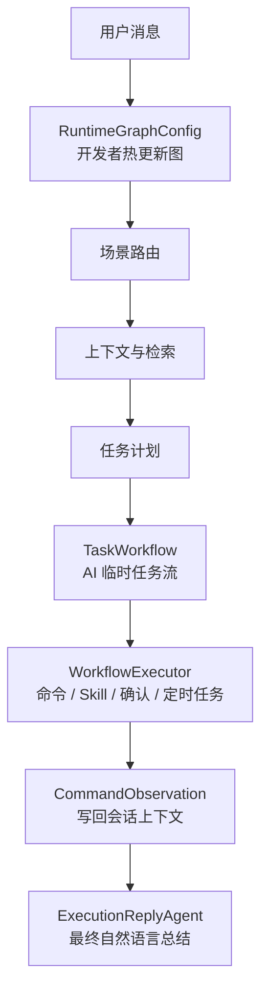
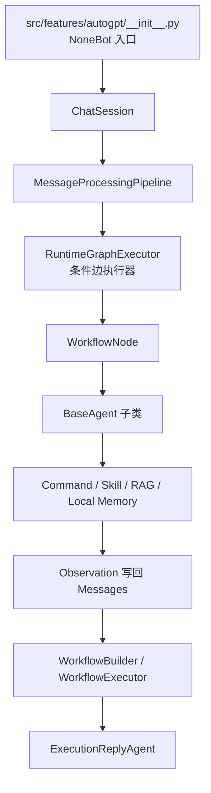

# AutoGPT Runtime 开发指南

`core.agent.runtime` 是 AutoGPT 的真实运行时层。`src/features/autogpt/__init__.py` 现在只负责 NoneBot 消息入口、会话接线和结果发送；重逻辑统一放在这里。

## 模块边界

- `pipeline.py`
  - 组织一次消息处理链路，并读取热更新后的运行时图。
- `coordination/`
  - 工作流节点和状态对象。
- `harness/`
  - 策略、上下文、可观测性装配层。
- `knowledge.py`
  - 本地聊天、文件空间、本地 RAG 和 Skill 目录。
- `workflow.py`
  - 显式工作流构建、审批语义和执行器。
- `orchestration_config.py`
  - 运行时图编排配置、热更新、默认图和图校验。
- `node_registry.py`
  - 编排画布可见节点目录。
- `schema.py`
  - AutoGPT Runtime 的结构化数据协议。

## 双层工作流

AutoGPT Runtime 里现在固定区分两层工作流，后续开发不要再混用名称。

| 层级 | 对象 | 控制权 | 作用 |
| --- | --- | --- | --- |
| 运行时编排图 | `RuntimeGraphConfig` | 开发者和管理端 | 决定一轮消息进入系统后依次经过哪些 Runtime 节点，以及分支条件和模型角色 |
| AI 任务执行流 | `TaskWorkflow` | AI 在系统约束内生成 | 决定本轮用户目标要执行哪些 command、skill、confirm、respond 或 schedule 步骤 |

运行时编排图是系统控制面，AI 不能修改。AI 只能在运行时图约束下生成 `TaskWorkflow`，再由执行器校验、执行、记录 observation，最后交给回复 Agent 汇总给用户。



## 调用链



## 默认编排图

系统默认编排链路就是外部最初的 AutoGPT 主流程，现在由 `default_graph_config()` 显式生成，而不是藏在一串硬编码 `if/else` 里。

节点目录由 `node_registry.py` 定义，运行时编排由 `orchestration_config.py` 加载和热更新。

每个节点要区分三种概念：

- `node_type`
  - 画布上的运行时节点类型。
- `agent_name`
  - 节点内部最终要实例化的 Agent 类型。
- `agent_config`
  - 传给 Agent 的运行配置。

默认图是一张受限 DAG，会按内置条件选择下一跳：

- `has_auto_tasks`
  - 上游已经产生直接回复、确定性命令或待确认任务时，直接进入持久化节点。
- `needs_local_knowledge`
  - 当前用户消息需要聊天记录或文件空间上下文时，进入本地 RAG。
- `direct_vision_reply`
  - 简单图片问答不需要命令或检索时，直接走视觉回复。
- `needs_external_rag`
  - Planner 明确需要外部知识库时，进入外部 RAG。
- `always`
  - 作为同源节点的兜底边，必须放在更具体条件之后。

热更新配置写入 `resources/agent/agent_orchestration_runtime.json`，实际目录由 `utils.config.agent_resources_dir` 决定。配置非法时运行时会回退默认图，并在快照中记录 warning。

## 模型角色

`RuntimeGraphConfig.model_profiles` 支持开发者给不同职责绑定模型：

- `supervisor_model`
  - 路由、任务流设计、风险监督和最终回复。
- `worker_model`
  - 抽取、检索摘要、低成本中间整理。
- `vision_model`
  - 图片和文件理解。
- `summary_model`
  - 长上下文压缩。

节点可以在 `node.config` 中写 `model` 或 `llm_name` 直接指定模型，也可以写 `model_profile` 指向上面的角色。没有显式配置时，运行时按节点定义和 LLM 任务类型自动选择角色，再回退到全局默认 LLM 配置。

## 执行后最终回复

AI 代替用户执行命令后，不能只把命令原始输出丢给用户。标准链路是：

1. `WorkflowExecutor` 执行 `TaskWorkflow` 步骤。
2. 每个命令返回 `CommandObservation`。
3. `ChatSession.record_observations()` 把紧凑结果写回会话上下文。
4. `ExecutionReplyAgent` 基于 workflow、observation 和短原始输出生成最终自然语言回复。

这让行为更接近 Claude Code / Codex 的“执行工具后总结结果”体验，同时保留命令输出作为可审计 observation。

## 如何增加一个新节点

1. 在 `coordination/nodes.py` 或新的节点模块里新增 `WorkflowNode` 子类。
2. 在 `node_registry.py` 注册对应 `RuntimeNodeDefinition`。
3. 如果节点内部会调用 Agent，优先通过 `BaseAgent.create(agent_name, config=...)` 实例化。
4. 如果节点需要写入管理端草稿配置，把字段同步到管理端 schema。
5. 补 `tests/autogpt/test_orchestration_config.py` 和相关行为测试。

## 如何让节点调用 Agent

推荐模式：

```python
agent = BaseAgent.create(
    "extract_agent",
    config={"some_flag": True},
    messages=pipeline.messages,
)
result = await agent.execute(pipeline.messages)
```

不要把 `RuntimeContext`、`WorkflowNode` 或 `Retriever` 直接命名成 Agent。

## 热更新规则

- 草稿保存到 `config/`。
- 运行时通过 `mtime` 检测自动重载。
- 图无效时退回默认编排图，并记录 warning。
- 管理端看到的是 `WorkflowGraph` 和 `RuntimeNodeDefinition`，不是随意拼出来的匿名步骤。

## Prompt-first 规则

在这里做 Agent Runtime 开发时，先问自己：

- 是不是 Prompt 不够清晰？
- 是不是 observation 回填不够好？
- 是不是 command / skill 描述太弱？
- 是不是上下文召回策略需要改？

如果答案是“是”，先改 Prompt、目录描述、上下文契约；不要急着把问题硬编码成分支。

## 测试入口

- `tests/autogpt/test_harness.py`
- `tests/autogpt/test_knowledge.py`
- `tests/autogpt/test_orchestration_config.py`
- `tests/autogpt/test_workflow.py`
- `tests/autogpt/test_session.py`
