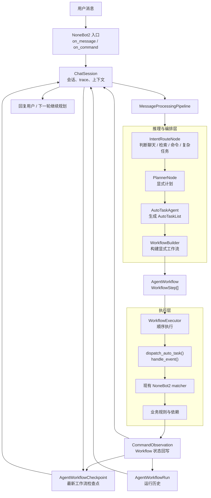
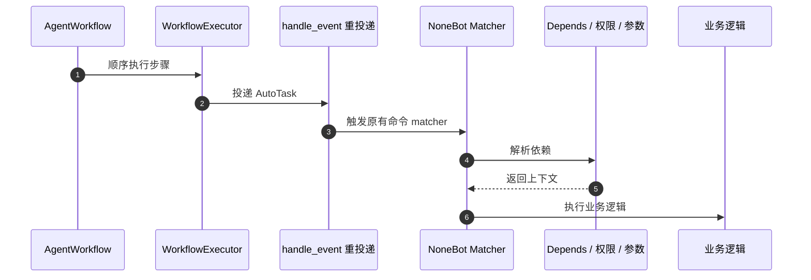

# Agent 工作流编排架构

> 核验日期：2026-05-03

本文档用于说明 ClassRobot 如何把 OpenClaw 风格的 Agent 能力落到当前 `NoneBot2 + 命令体系 + AutoGPT` 之上。

它关注的重点不是“怎么写一个会聊天的 Bot”，而是：

- 如何让用户一句自然语言进入系统后，被转换成可审计、可执行、可恢复的工作流
- 如何在不破坏现有 NoneBot2 命令体系的前提下增强 Agent 编排能力
- 如何让后续开发保持鲁棒性、可扩展性和稳定性

## 设计结论

当前项目最适合采用下面这条主链路：

```text
用户消息
  -> NoneBot2 接入
  -> 意图路由
  -> 显式计划
  -> 显式工作流
  -> 命令顺序执行
  -> 观察记录回写
  -> 下一轮继续规划
```

这条链路借鉴了 OpenClaw 的核心思想，但不会直接复制它的完整实现。

对当前项目来说，更重要的是先把“动态 AI 规划”收敛到“显式工作流对象”，再逐步增强长期记忆、审批点、恢复和持久化执行。

## 为什么不是直接让 AI 调数据库

在 ClassRobot 里，班级、教师、学生、通知、任务、请假等能力已经通过 NoneBot2 命令和依赖注入形成了稳定边界。

如果让 AI 直接绕过命令层写数据库，会立刻带来下面这些风险：

- 权限校验分散，难以统一
- 参数校验重复，容易不一致
- 业务规则被 Prompt 偷偷替代
- 出错后难以追踪到底是 Planner 错、工具错还是业务错

所以这里采用的原则是：

- AI 负责理解、路由、规划、组织步骤
- 现有命令负责真正执行稳定业务能力
- NoneBot2 的 matcher、depends、事件分发继续作为执行边界

## 与 OpenClaw 风格能力的映射

| OpenClaw 风格概念 | ClassRobot 当前映射 |
| --- | --- |
| Agent workspace / role context | `Prompt("autogpt")` + 当前用户可见 `Helpers` + 会话历史 |
| Tool catalog | `CommandToolCatalog` |
| Runtime planning loop | `IntentRouteNode -> PlannerNode -> AutoTaskAgent` |
| Explicit workflow | `AgentWorkflow` + `WorkflowStep` |
| Deterministic executor | `WorkflowExecutor` |
| Observation / trace | `CommandObservation` + `trace_id` + 会话回写 |
| Session state | `ChatSession` |
| Existing capability reuse | `handle_event()` 重新投递项目命令 |

这张表很重要，因为它说明当前项目不是“没有 Agent 能力”，而是已经形成了可继续工程化增强的基础骨架。

## 目标架构图



## 当前已落地的工作流层

本轮改造后，`src/plugins/autogpt` 已新增下面这些结构：

### 1. 显式工作流模型

- `AgentWorkflow`
- `WorkflowStep`
- `WorkflowExecutionResult`
- `AgentTurnResult`

这些对象的意义是：

- 让一次自然语言请求不再只落成“回复 + task 列表”
- 让系统可以明确知道“现在准备执行什么工作流”
- 让执行前、执行中、执行后都能落下结构化状态

### 2. 工作流构建器

`WorkflowBuilder` 会根据：

- `IntentRoute`
- `AgentPlan`
- `AutoTaskList`
- `CommandToolCatalog`

构建出一个 `AgentWorkflow`。

这一步的价值在于把“LLM 的临时输出”转换成“系统内部可被检查的对象”。

在此基础上，当前又补了一层 `playbook` 匹配：

- 对高频多步任务优先命中稳定模板
- 为步骤补充统一标题和说明
- 让后续审批、测试和持久化不必完全围绕“临时命令序列”展开

### 3. 工作流执行器

`WorkflowExecutor` 负责：

- 按顺序执行 `WorkflowStep`
- 遇到失败立即停止
- 记录每一步的状态
- 产出统一的 `CommandObservation`

这一步是系统稳定性的关键，因为真正执行时已经不是随意拼字符串，而是按显式步骤推进。

### 4. 待确认工作流恢复

`ChatSession` 现在还能维护 `pending_workflow`：

- 如果某个工作流已经有明确步骤，但还需要用户确认
- 则会先挂起在会话里
- 用户回复“确认 / 继续执行”时，直接恢复该工作流
- 用户回复“取消”时，直接标记为 `cancelled`

这样做的价值是把“确认”从一句自然语言，升级成真正可恢复的运行状态。

### 5. 工作流检查点持久化

当前又补了一层“最新工作流检查点”持久化：

- ORM 模型：`AgentWorkflowCheckpoint`
- 存储层：`WorkflowCheckpointStore`
- 恢复入口：`ChatSession.restore_pending_workflow()`

它的职责非常聚焦：

- 持久化每个用户最近一次工作流状态
- 在进程重启后恢复 `needs_confirm` 状态的工作流
- 在确认、取消、完成、失败后同步更新最近状态

这一层目前还不是完整的 workflow run history，也不是事件流引擎。
它更像一个稳定的“恢复点”，优先解决“待确认任务重启即丢”的问题。

为了避免数据库迁移未完成时直接打断主流程，存储层还做了降级处理：

- 检查点表不存在或数据库异常时，只记录 warning
- AutoGPT 仍然保留当前进程内的会话与待确认能力
- 等迁移完成后即可自动恢复持久化能力

### 6. 审批语义与运行历史

这一轮又补了两层更适合工程化继续演进的结构：

- 审批元数据：`WorkflowApproval`
- 历史运行表：`AgentWorkflowRun`

审批元数据会明确记录：

- 是否真的需要审批
- 为什么需要审批
- 是高风险确认，还是缺少信息
- 当前状态是 `pending / approved / rejected`

这样系统以后就不只是知道“这条工作流需要确认”，而是知道：

- 为什么要确认
- 用户是否已经确认
- 这次执行是不是从一条待确认工作流恢复出来的

历史运行表则负责按 `trace_id` 保存每次工作流运行：

- 初始规划 run
- 待确认 run
- 用户确认后恢复出来的新 run
- 取消后的最终状态

当前实现里：

- `AgentWorkflowCheckpoint` 负责“恢复点”
- `AgentWorkflowRun` 负责“历史轨迹”

这两层职责分开后，后续补审批流、定时任务、回滚分析会更顺手。

### 7. 事件时间线

除了“恢复点”和“历史轨迹”，现在还补了一层更细的事件时间线：

- `AgentWorkflow.events`
- `workflow_created`
- `approval_requested`
- `approval_approved`
- `approval_rejected`
- `workflow_resumed`
- `workflow_started`
- `step_started`
- `step_completed`
- `step_failed`
- `workflow_completed`
- `workflow_failed`
- `workflow_cancelled`

这层数据的价值是把一次 Agent 工作流拆成可读的离散阶段。它不替代最终状态，也不替代 run history，而是给审计、调试和后续可观测性留出更细的抓手。

## NoneBot2 融合方式

这套设计是围绕 NoneBot2 的强项来落地的，而不是绕开它。

### 1. 接入层复用 matcher

- 自然语言入口仍然由 `on_message(..., rule=to_me())` 承担
- 显式命令仍由现有 `on_command` / `on_alconna` 承担

这样做的好处是平台消息入口不需要重写。

### 2. 执行层复用 `handle_event()`

AI 生成的工作流步骤最终仍会被重新投递到 NoneBot2 事件系统：



这意味着：

- NoneBot2 的参数解析继续生效
- 权限依赖继续生效
- 业务命令不用为了 AI 再写一遍

### 3. 会话层继续复用插件上下文

`ChatSession` 现在不仅记录聊天历史，还记录：

- `last_trace_id`
- `last_turn_result`
- `last_workflow`

这为后续补长期记忆、任务恢复、审批流留下了稳定挂点。

## 为什么这套设计更鲁棒

### 1. 失败边界更清楚

以前更像：

- 用户消息
- Planner / AutoTask 一把生成
- 直接批量投递

现在变成：

- 路由失败
- 计划失败
- 工作流构建失败
- 第 N 步执行失败

这些阶段都能独立定位。

### 2. 扩展点更清楚

后续如果要扩展，不需要再改整个入口，只要按层挂载：

- 新意图类型：扩展 Router / Planner
- 新项目命令：补 `__helpers__` + 原有 matcher
- 新通用能力：补 `skills/` 与 `utils/skills/`
- 新执行器能力：扩展 `WorkflowExecutor`
- 新高频多步场景：补 `playbooks.py`

### 3. 对用户更稳定

用户看到的是：

- 少量有价值的等待提示
- 明确的确认问题
- 已知命令范围内的执行结果

而不是一堆内部推理过程。

## 后续演进路线

### Phase 1：显式工作流

当前已经落地：

- `IntentRoute`
- `AgentPlan`
- `AgentWorkflow`
- `WorkflowExecutor`
- `CommandObservation`

### Phase 2：工作流模板与 Playbook

下一步建议新增：

- 高价值场景工作流模板
- 命令序列约束
- 风险更高的审批点

例如：

- “创建班级 -> 设置加入方式 -> 创建通知”
- “查询任务 -> 导出任务 -> 发送提醒”

### Phase 3：从检查点走向完整运行态

当前已经落地：

- 最近工作流检查点持久化
- 待确认工作流的跨重启恢复
- 审批元数据
- 基于 `trace_id` 的工作流运行历史
- 工作流事件时间线

下一步建议继续补：

- 更细粒度的审批节点
- 定时任务 / 长任务状态
- 与 `nonebot_plugin_apscheduler` 的联动

### Phase 4：长期记忆与压缩

建议把会话状态继续拆成：

- 短期对话上下文
- 长期摘要
- 用户偏好
- 工作流恢复点

## 对开发过程的建议

为了保证后续开发稳定，不建议“一次性重写成全新框架”，而建议始终按下面顺序切片：

1. 先定义结构化对象
2. 再补执行器
3. 再补持久化与恢复
4. 最后再增强 Planner 和 Tool Loop

每个切片都要满足：

- 能单独测试
- 能单独回滚
- 不破坏现有 NoneBot2 命令能力

## 关联文档

- [AutoGPT 智能能力改进方案](../guides/agent-module.md)
- [消息处理流程](../guides/message-processing-flow.md)
- [当前系统架构设计](./current-system-architecture-design.md)
- [软件工程流程方案](./software-engineering-process.md)
