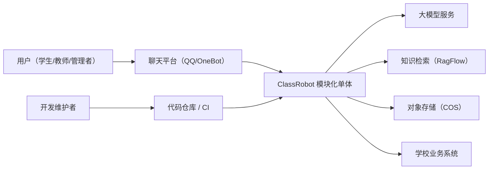
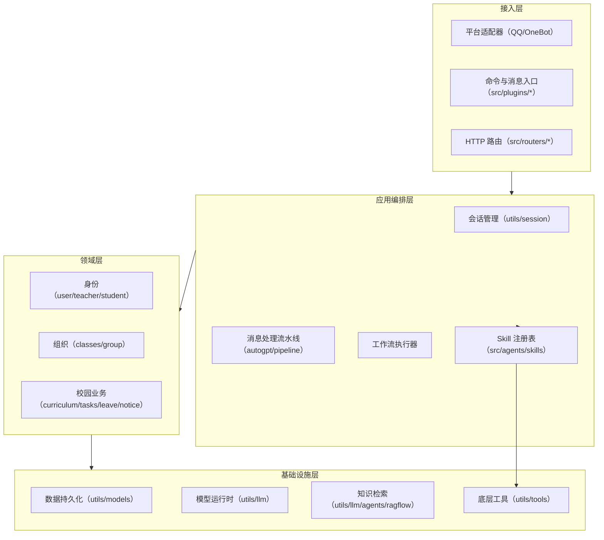
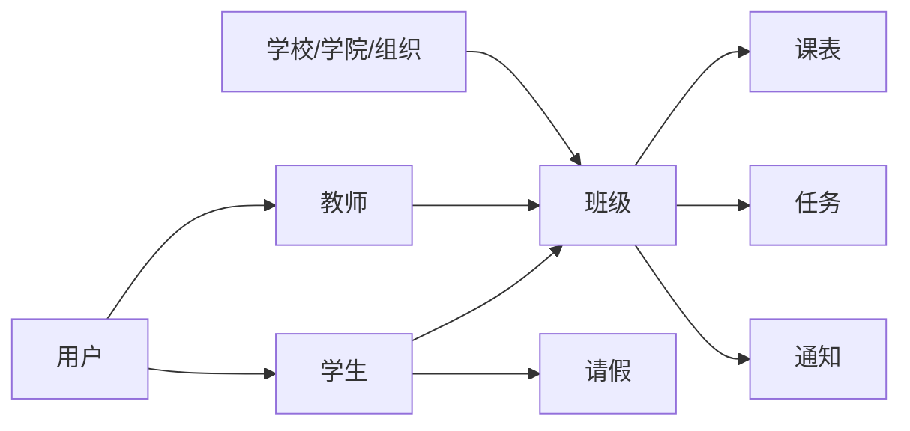
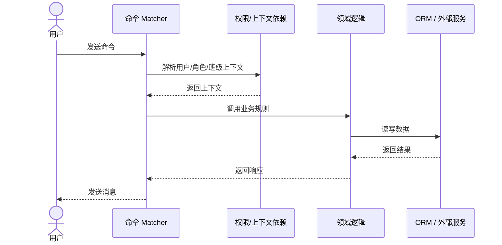
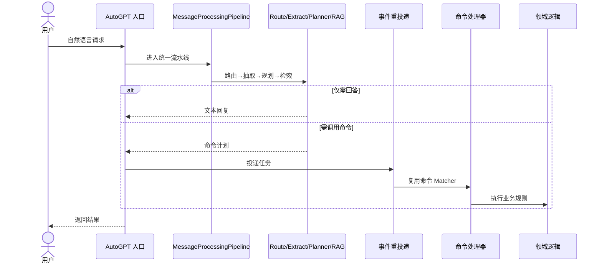

# 架构视图总览

> 核验日期：2026-05-05

本文档用多视图方式描述 ClassRobot 的当前架构，包括系统边界、模块分层、领域关系和运行时流程。

如果你只需要先理解“系统整体长什么样”，读这一篇就够了；如果你需要继续落代码，再按文末配套阅读进入更细的专题。

## 架构定位

当前项目是一个**模块化单体**：

| 层次 | 职责 | 主要目录 |
|------|------|---------|
| 接入层 | 接收平台消息、命令、HTTP 请求 | `src/plugins/` `src/others/` `src/routers/` |
| 应用编排层 | 会话管理、Agent 调度、工作流执行 | `src/plugins/autogpt/` `utils/session/` |
| 领域层 | 班级、用户、任务、请假等业务规则 | `src/managers/` 及业务插件 |
| 能力层（Skill） | 可复用能力边界与运行时入口 | `src/agents/skills/` |
| 基础设施层 | 数据库、模型、检索、存储、工具 | `utils/models/` `utils/llm/` `utils/tools/` |

## 视图 1：系统上下文

## 视图 2：内部分层

## 视图 3：领域协作

## 视图 4：显式命令流程

## 视图 5：AI 编排流程

核心原则：**AI 负责理解和编排，不直接写数据库；写操作仍由业务命令完成。**

## 关键边界

| 边界 | 规则 |
|------|------|
| 接入层 ↔ 编排层 | 接入层只做平台适配，不做 AI 决策 |
| 编排层 ↔ 领域层 | Agent 规划动作，领域层执行规则 |
| Agent ↔ Skill | Agent 选择能力，Skill 执行能力 |
| Skill ↔ 基础设施 | Skill 暴露接口，基础设施封装 SDK |

## 已落地 vs 规划中

**已落地：** NoneBot 接入、用户/班级/任务/请假/课表命令、Agent 编排链路、Skill 注册与运行时、RAG 检索、文档转图/OCR/生图、工作流检查点与运行历史

**规划中：** 独立 Planner、Redis 持久化记忆、MCP Client/Server、飞书 Webhook、评测与成本追踪

## 配套阅读

- [Agent 工作流编排架构](./agent-workflow-orchestration.md) — 工作流设计细节
- [命令与 Agent 一体化架构设计](./command-agent-unified-architecture.md) — 命令系统与 Agent 执行收敛方案
- [统一 AI 平台架构总纲](./unified-ai-platform-handbook.md) — 概念术语与分层模型
- [迁移路线图](./migration-roadmap.md) — 阶段化演进计划
- [软件工程流程](./software-engineering-process.md) — 开发流程与质量门禁
