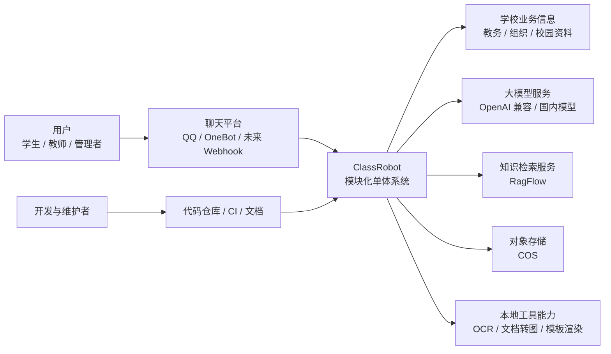
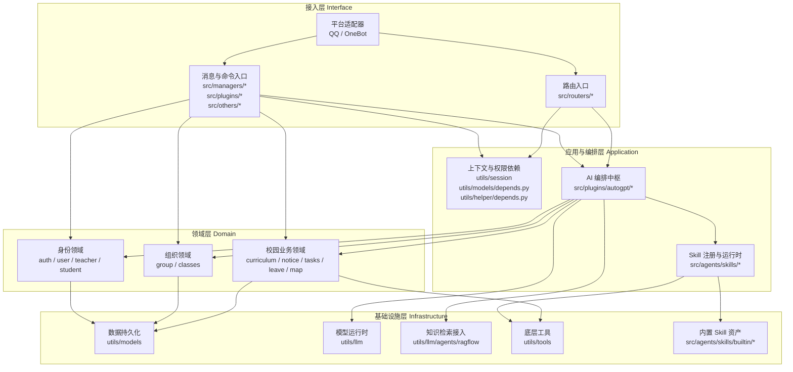
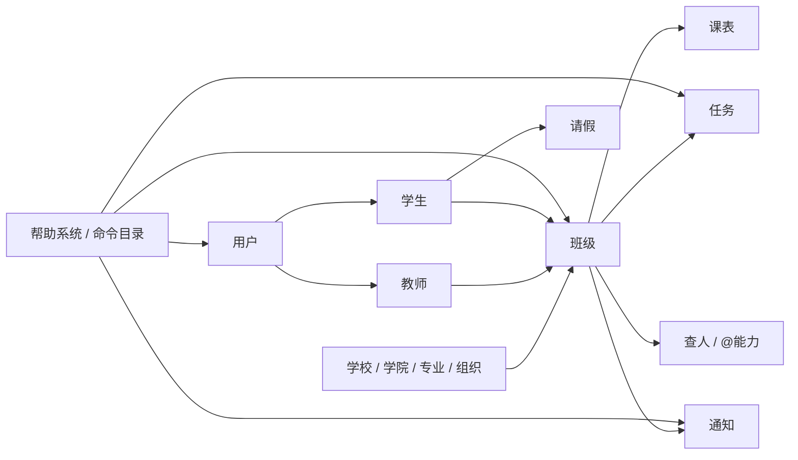
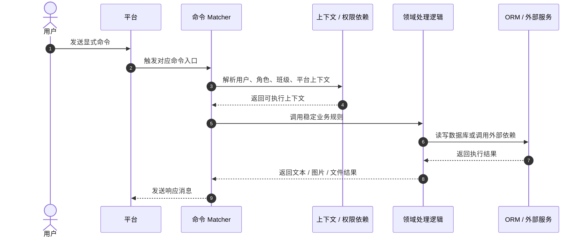
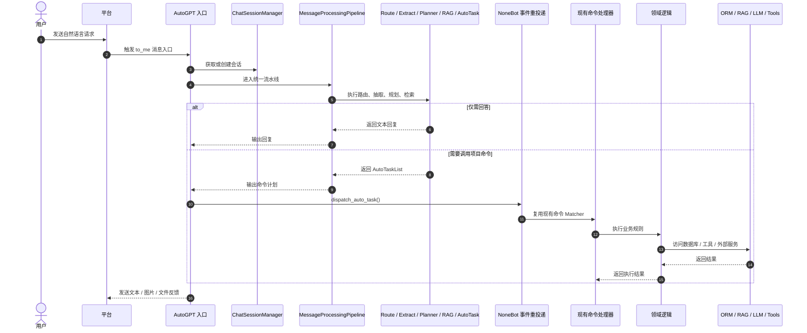

# 架构视图总览

> 核验日期：2026-05-02

本文档使用软件工程里更常见的“多视图”方式描述 ClassRobot，而不是把所有信息塞进一张大图里。

这样做的目的有三个：

- 让第一次接手项目的人能快速理解系统边界
- 让后续重构时有一份稳定的结构参照
- 让“命令系统、AI 编排、Skill、基础设施”之间的职责边界更清楚

## 架构定位

当前项目最适合被理解为一个“模块化单体”：

- 外部入口统一由 `NoneBot` 承接
- 显式命令和自然语言 AI 共享同一套业务能力
- `src/managers/` 与业务插件承载领域规则
- `src/plugins/autogpt/` 承载 AI 编排主链路
- `src/agents/skills/` 承载可复用能力边界，`utils/skills/` 保留兼容出口
- `utils/models/`、`utils/llm/`、`utils/tools/` 承载基础设施接入

这意味着项目不是“纯脚本堆叠”，也不是“现在就要拆微服务”，而是应该继续沿着“分层明确、职责内聚、扩展稳定”的方向演进。

## 视图 1：系统上下文图

这张图回答的问题是：ClassRobot 处在什么环境里，对外依赖什么，对谁提供能力。

从系统边界上看，ClassRobot 既是“聊天机器人系统”，也是“校园业务能力 + AI 编排能力”的统一承载体。

## 视图 2：分层模块图

这张图回答的问题是：系统内部按什么层次组织，主要模块分别放在哪里。

### 分层解释

| 层次 | 主要职责 | 当前主要目录 |
| --- | --- | --- |
| 接入层 | 接收平台消息、命令、文件和事件 | `src/managers/`、`src/plugins/`、`src/others/`、`src/routers/` |
| 应用与编排层 | 维护会话、组织流程、调度 Agent 与 Skill | `src/plugins/autogpt/`、`src/agents/skills/`、`utils/session/` |
| 领域层 | 承载班级、组织、用户、任务等业务规则 | `src/managers/`、`src/plugins/tasks/`、`src/plugins/leave/`、`src/plugins/curriculum/` 等 |
| 基础设施层 | 收敛数据库、模型、检索、存储和工具依赖 | `utils/models/`、`utils/llm/`、`utils/tools/` |

## 视图 3：领域协作图

这张图回答的问题是：核心业务对象之间是什么关系，哪些功能围绕哪些领域展开。

这不是数据库 ER 图，而是业务能力协作图。它更适合帮助开发者判断：

- 新功能应该属于哪个领域
- 这个功能应该挂在 `manager` 里还是挂在某个业务插件里
- 一个 AI 命令最终应该落到哪个稳定业务模块执行

## 视图 4：显式命令运行时流程

这张图回答的问题是：当用户直接输入“添加班级”“查询课表”这类命令时，系统如何流转。

这个流程体现了当前项目最重要的一条工程约束：

- 命令入口负责交互和参数接收
- 领域模块负责业务规则
- 数据访问和第三方依赖不应散落在各个入口里重复实现

## 视图 5：自然语言 AI 编排流程

这张图回答的问题是：当用户不是输入显式命令，而是直接说“帮我加一下班级”“查一下这个制度”时，系统如何复用现有能力。

这张图体现了当前 AI 设计最关键的工程思路：

- AI 不应直接越过业务层写数据库
- AI 的主要职责是“理解、规划、选择能力、复用命令”
- 真正的写操作仍由现有命令和领域规则完成

## 设计约束

如果后续要继续演进项目，建议始终遵守下面这些依赖约束：

1. 接入层只负责消息进入和结果回发，不在入口里堆复杂业务。
2. 应用与编排层负责流程组织，不直接承载领域规则。
3. 领域层负责业务一致性和写操作边界，不把权限校验寄托给 Prompt。
4. Skill 负责可复用能力，不负责复杂业务决策。
5. 基础设施层负责封装第三方 SDK，不让上层到处直接操作底层依赖。

## 面向后续重构的建议

从软件工程角度看，后续最值得继续强化的是这几件事：

- 把“命令处理器”和“领域服务”进一步分离，降低入口层体积
- 让 `src/plugins/autogpt/` 更明确地只做编排，不掺入过多平台细节
- 为高风险业务命令补齐 contract test、integration test 和审计日志
- 继续让新增通用能力优先落到 `src/agents/skills/`
- 让文档中的分层规则逐步变成代码中的目录边界和依赖边界

## 建议阅读顺序

1. 先读本文档，建立整体脑图
2. 再读 [当前系统架构设计](./current-system-architecture-design.md)
3. 接着读 [当前系统整合图映射](./current-system-integration.md)
4. 最后读 [消息处理流程](../guides/message-processing-flow.md)
