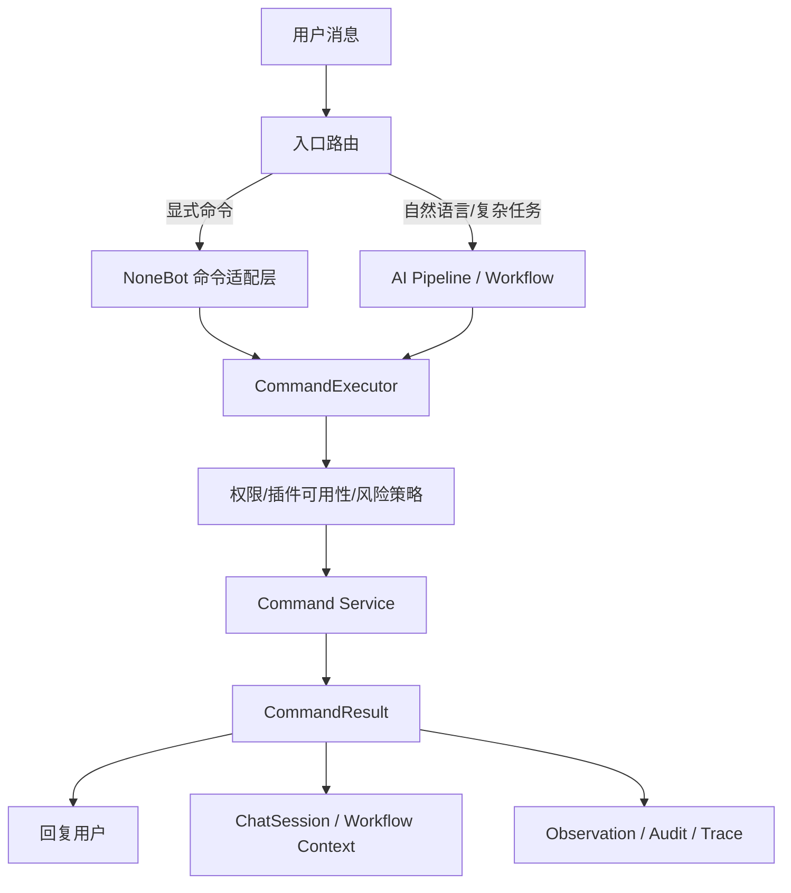
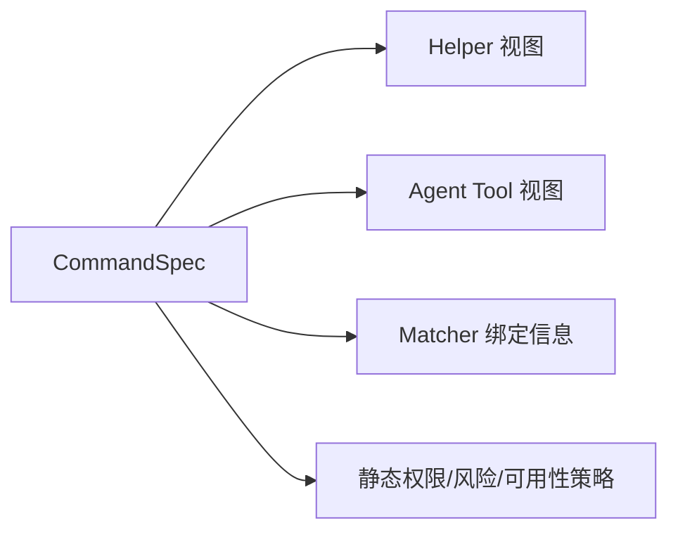

# 命令与 Agent 一体化架构设计

> 核验日期：2026-05-05

本文档用于整理 ClassRobot 下一阶段“命令系统 + Agent 工作流”统一演进的设计思路。

它重点回答下面几个问题：

- 命令、`Helper`、权限、AutoGPT 工具目录为什么不能继续分散维护
- 用户直接发命令和 Agent 调命令，为什么应该最终走同一套能力执行链
- `on_alconna` / `on_command`、`Helper`、Agent tool、插件启停应该如何统一
- 需要新增哪些模块、目录应该如何拆分，才能便于维护、测试和后续扩展

## 设计结论

ClassRobot 后续最推荐采用的核心原则是：

- `command` 是能力本体，`NoneBot matcher` 和 `Agent workflow` 都只是调用入口
- 命令元数据必须有单一事实来源，不能再同时手写 `matcher + Helper + Agent tool`
- 用户直发命令和 Agent 调命令，最终应统一走 `CommandExecutor`
- `help`、权限校验、AutoGPT 工具目录、插件启停都应基于同一套命令注册表工作
- 新增和显著改造的命令走统一声明式架构，未接入 service 的命令不进入 Agent 工具目录

可以把目标态理解为：

```text
CommandSpec
  -> 派生 Helper
  -> 派生 Agent Tool
  -> 派生 NoneBot Matcher 绑定信息
  -> 派生权限与可用性策略

用户直接命令 / Agent 工作流
  -> CommandExecutor
  -> 领域 Service
  -> CommandResult
  -> 用户输出 + 会话上下文回写
```

## 已落地进度

> 更新日期：2026-05-05

当前已经完成第一批工程化落地，范围是“先统一元数据、可见性、Agent 工具目录和管理端口径”，还没有一次性 service 化全部历史命令。

已完成：

- 新增 `utils/commands/` 核心包，包含 `CommandSpec`、`CommandRegistry`、`CommandPolicy`、`CommandAvailabilityService`、`CommandExecutor`、`CommandResult` 与适配层。
- 新增 `command_alconna()` / `command_command()` 包装器，用于从命令声明自动绑定 `CommandSpec` 和 `Helper`。
- `utils.helper.runtime` 已优先收集 matcher 上绑定的 helper，并在真实执行前优先走 `CommandPolicy`。
- `utils.helper.depends.HelpersDepends` 已接入软关闭过滤，让 `help` 和 AutoGPT 共享相同可见命令集合。
- AutoGPT 的 `CommandToolCatalog` 已优先使用 `CommandRegistry`，并识别 `risk_level`、`agent_callable`、`execution_mode`。
- AutoGPT 执行命令时只走 `AgentCommandAdapter -> CommandExecutor`，不再回放 NoneBot 事件。
- 管理端 `nonebot_runtime` 命令清单已合并注册表数据，能暴露风险等级、执行模式、Agent 可见性和软关闭状态。
- 第一批样例命令已迁移：`src.features.user.commands`、`src.features.curriculum.commands`。

仍在迁移中：

- 只由用户直接触发的命令使用 `execution_mode="matcher"` 或 `interactive`；需要 Agent 编排的命令必须逐步抽 service。
- 用户显式命令输入已通过命令输入记录器写入聊天上下文；命令结果由 matcher/发送记录器或 service 输出分别处理。
- 插件软关闭当前是进程内状态，后续可以接管理后台持久化配置。

## 当前问题

结合当前仓库实现，命令体系已经具备可用基础，但有几个明显问题。

### 1. 命令声明存在双写甚至多写

当前一条命令通常同时维护：

- `on_alconna(...)` 或 `on_command(...)`
- `__helpers__` 里的 `Helper(...)`
- AutoGPT 运行时再从 `Helper` 间接生成工具目录

这会直接导致：

- 参数名修改后，`Helper.params` 需要手动同步
- 命令别名修改后，帮助目录和 Agent 目录可能忘记同步
- 静态权限调整后，`matcher` 逻辑和 `Helper.roles` 可能漂移
- 某些命令已经存在，但 `Helper` 缺失或陈旧

### 2. `Helper` 当前承担了过多职责

当前 `Helper` 同时承担：

- 帮助文档来源
- 静态权限来源
- `help` 展示目录来源
- AutoGPT 可见命令来源
- matcher 前置鉴权来源

但它本身不是从命令对象自动派生的，这意味着“最重要的元数据”反而不在命令声明本体上。

### 3. Agent 调命令必须依赖统一执行器

早期 `dispatch_auto_task()` 曾尝试把 Agent 任务重新投递到 matcher 分支来实现“Agent 调命令”。

该方案已经废弃且不再保留实现，因为它存在几个限制：

- 返回结果以“发送给用户的文本”形式为主，结构化程度不足
- 多轮 `got()` / 文件上传 / 交互式命令对 Agent 不够友好
- 业务结果、展示结果、上下文摘要没有清晰分层
- 很难稳定支持静默执行、批量执行、失败恢复和统一审计

### 4. 用户直接命令与 Agent 调用链路尚未完全统一

当前实际存在两套路径：

- 用户直接发命令：走 matcher，通常不写入 Agent 会话语义层
- Agent 调命令：走 `AutoTask -> AgentCommandAdapter -> CommandExecutor -> service handler`，再回写观察结果

目标态不应继续维持两套松散链路，而应变成：

- 用户直接命令：不走 AI 规划，但会把执行摘要写进会话上下文
- Agent 调命令：走统一执行器，并把结构化结果写回工作流观察与会话上下文

### 5. 插件启停与命令可用性还没有统一抽象

当前插件加载主要依赖 `pyproject.toml` 中的：

- `plugins`
- `plugin_dirs`

这意味着：

- 启动时插件会整体加载
- 热加载 API 有 `load_plugin`，但当前环境下没有稳定公开的 `unload_plugin`
- “是否允许用户调用”和“插件代码是否已经加载”不是同一件事

因此后续需要区分：

- 插件硬关闭：是否参与启动加载，通常需要重启生效
- 插件软关闭：当前进程里仍已加载，但命令入口、`help`、Agent 目录和统一执行器都拒绝继续调用

## 目标架构

### 总体流程



### 元数据派生关系



## 核心设计原则

### 1. 命令元数据必须单一事实来源

后续应把以下信息集中到 `CommandSpec`：

- 命令名
- 别名
- 参数定义
- 说明文案
- AI 描述
- 静态角色权限
- 展示目录
- 风险等级
- 是否允许 Agent 调用
- 执行模式

`Helper`、Agent tool、matcher 绑定信息都从这里自动派生。

### 2. 业务逻辑与消息入口分离

后续应明确区分：

- `matcher`：平台消息解析、参数收集、回显输出
- `service`：真正的领域能力实现
- `executor`：统一调度、鉴权、审计、上下文回写

不要再把“业务主逻辑”完全锁死在 `@matcher.handle()` 内部。

### 3. 静态权限与动态业务约束分层

需要统一收敛的是静态权限：

- 哪些角色可调用
- 哪些角色明确禁止
- 在 `help` 哪个目录展示
- 是否允许 Agent 调用

仍然保留在业务逻辑里的，是动态约束：

- 是否为该班级的教师
- 是否为当前群对应班级的成员
- 当前数据是否存在
- 当前状态是否允许删除、转让、退出

### 4. 用户直发命令不经过 AI 规划，但结果必须写入会话

这是后续统一交互体验的关键要求：

- 用户直发命令时，不需要进入 LLM Pipeline
- 但命令执行的摘要和结果应进入 `ChatSession`
- 后续用户继续用自然语言追问时，Agent 可以理解“刚刚发生了什么”

### 5. Agent 只调用统一执行器

目标态应是：

- Agent 只走 `CommandExecutor -> Service`
- 未接入 service handler 的命令不会进入 Agent 工具目录

也就是说，Agent 不再调用 matcher 分支；迁移命令时要先抽 service，再开放 Agent 调用。

## 核心对象设计

下面这些对象是后续最值得优先引入的基础设施。

### `CommandSpec`

职责：命令的统一声明对象。

建议字段：

- `name`
- `aliases`
- `description`
- `ai_description`
- `params`
- `roles`
- `exclude_roles`
- `scopes`
- `risk_level`
- `agent_callable`
- `execution_mode`
- `plugin_module`
- `tags`
- `examples`

### `CommandParam`

职责：统一描述命令参数，而不是让 `Helper.params`、Agent tool schema、Alconna 参数各自维护一份语义。

建议字段：

- `name`
- `description`
- `mode`
- `value_type`
- `multiple`
- `from_alconna`

### `CommandBinding`

职责：补充命令声明上的项目级元数据，尤其是 Alconna 无法表达的部分。

建议字段：

- `roles`
- `exclude_roles`
- `scopes`
- `risk_level`
- `agent_callable`
- `plugin_module`
- `summary_strategy`

### `CommandExecutionContext`

职责：描述一次命令调用的运行时上下文。

建议字段：

- `user_id`
- `platform`
- `channel_id`
- `guild_id`
- `trace_id`
- `invoker`
- `silent`
- `session_id`

其中 `invoker` 至少区分：

- `user_command`
- `agent_workflow`

### `CommandResult`

职责：统一承载命令执行结果。

建议字段：

- `success`
- `summary`
- `visible_outputs`
- `context_outputs`
- `data`
- `requires_confirm`
- `followup_hint`

这里要特别区分：

- `visible_outputs`
  面向用户展示
- `context_outputs`
  面向会话摘要和 Agent 继续规划

### `CommandRegistry`

职责：全局命令注册表。

负责：

- 注册 `CommandSpec`
- 按命令名/别名查找
- 为 `help` 导出视图
- 为 Agent 导出工具目录
- 为管理后台导出命令与插件清单

### `CommandExecutor`

职责：统一命令执行入口。

负责：

- 解析 `CommandSpec`
- 检查插件状态
- 检查静态权限
- 调用对应 service
- 生成 `CommandResult`
- 写 `CommandObservation`
- 写 `ChatSession`

### `CommandAvailabilityService`

职责：统一管理命令和插件可用性。

负责：

- 判断插件是否软关闭
- 判断某命令是否允许 Agent 调用
- 为 `help`、Agent、后台管理端提供统一可用性视图

## 执行模式分层

不是所有命令都适合同一种调用方式。

建议增加执行模式枚举，例如：

- `service`
  推荐模式，用户和 Agent 都可通过统一执行器调用
- `matcher`
  只允许用户直接通过 NoneBot matcher 调用，不进入 Agent 工具目录
- `interactive`
  依赖 `got()`、文件上传、多轮输入，优先保留给用户直接调用
- `disabled`
  当前仅展示或保留，不允许 Agent 调用

这层分类非常重要，因为它决定了：

- 哪些命令可以直接暴露给 Agent
- 哪些命令只允许用户显式发起
- 哪些命令需要先重构 service 才适合进入自动工作流

## 推荐目录结构

为了让后续维护成本可控，建议新增一个不会被 NoneBot 当作插件自动加载的核心命令目录：

```text
utils/
└── commands/
    ├── __init__.py
    ├── schema.py
    ├── spec.py
    ├── binding.py
    ├── registry.py
    ├── context.py
    ├── result.py
    ├── executor.py
    ├── policy.py
    ├── availability.py
    ├── history.py
    ├── discovery.py
    ├── adapters/
    │   ├── __init__.py
    │   └── agent.py
    └── renderers/
        ├── __init__.py
        ├── helper.py
        └── tool.py
```

### 各模块职责

| 模块 | 职责 |
| --- | --- |
| `schema.py` | 命令参数、模式、风险等级、执行模式等枚举和基础模型 |
| `spec.py` | `CommandSpec` 定义 |
| `binding.py` | `command_alconna()`、`command_command()` 等统一包装器 |
| `registry.py` | 命令注册表、查找、枚举 |
| `context.py` | `CommandExecutionContext` |
| `result.py` | `CommandResult` |
| `executor.py` | 统一执行器 |
| `policy.py` | 静态权限、角色判断、风险控制 |
| `availability.py` | 插件/命令启停、Agent 可见性控制 |
| `history.py` | 命令输入记录器注册表，供聊天记录、审计或可观测插件挂接 |
| `discovery.py` | 扫描和导出命令清单，供后台与调试使用 |
| `adapters/agent.py` | Agent 工作流入口适配 |
| `renderers/helper.py` | `CommandSpec -> Helper` |
| `renderers/tool.py` | `CommandSpec -> Agent Tool` |

## 业务插件内部的推荐结构

后续每个业务插件/管理模块也建议按相同思路收敛。

推荐形态：

```text
src/features/user/
├── __init__.py
├── commands.py
├── service.py
├── depends.py
└── presenters.py
```

其中：

- `commands.py`
  定义 `CommandSpec`、`Alconna`、matcher 绑定
- `service.py`
  提供真正业务能力，供用户入口和 Agent 入口复用
- `depends.py`
  继续保留 NoneBot 运行时依赖
- `presenters.py`
  负责把领域结果转成 `CommandResult` 或用户展示内容

这意味着：

- 命令定义更清晰
- 业务逻辑不被 matcher 锁死
- 单元测试可以直接测 `service`
- Agent 与用户入口都能复用同一份能力

## 与现有模块的关系

这套架构不是推倒重来，而是围绕当前仓库已有资产做整合。

### 与 `utils/helper/` 的关系

后续目标是：

- `Helper` 降级为展示层视图模型
- `helper_menu` 不再是命令事实来源
- `utils/helper/runtime.py` 继续负责 matcher guard 和 help 视图收集

### 与 AutoGPT 的关系

当前目标是：

- `core/agent/runtime/command_tools.py`
  改为从 `CommandRegistry` 和 `CommandSpec` 生成工具目录
- `src/features/autogpt/__init__.py`
  只走 `AgentCommandAdapter -> CommandExecutor`，未 service 化命令直接拒绝 Agent 调用

### 与管理后台的关系

后续目标是：

- 管理端插件中心、命令中心、技能中心都从统一注册表取数
- 插件软关闭和命令可用性状态统一由 `availability.py` 暴露
- 当前管理端里的命令扫描逻辑可逐步转向注册表直出，避免继续依赖分散的运行时探测

## `Helper` 与命令声明的统一方式

后续最重要的改造之一，是给 `on_alconna` / `on_command` 提供项目级包装器。

推荐目标形态：

```python
logout_cmd = command_alconna(
    Alconna(
        "注销",
        Args["role", str],
        meta=CommandMeta(
            description="注销当前用户，删除相关数据",
            example="注销 学生",
        ),
    ),
    aliases={"删除账号", "账号注销"},
    binding=CommandBinding(
        roles={UserRole.user},
        scopes={HelperScope.user},
        risk_level="high",
        agent_callable=False,
    ),
)
```

包装器内部负责：

- 创建 matcher
- 从 `Alconna` 自动提取命令名、别名、参数
- 从 `CommandMeta` 读取描述、用法、示例
- 从 `CommandBinding` 读取权限、目录、风险、Agent 可见性
- 自动生成 `Helper`
- 自动注册到 `CommandRegistry`

这样后续修改：

- 参数名
- 参数可选性
- 别名
- 帮助描述
- 静态权限

就不再需要分别同步多处配置。

## 为什么要优先推广 `on_alconna`

`on_alconna` 相比 `on_command` 更适合作为统一命令定义基础。

原因：

- 可以稳定拿到命令名
- 可以拿到参数定义
- 可以推导可选参数和多值参数
- 可以借助 `CommandMeta` 挂描述、示例、用法

而 `on_command` 更适合作为：

- 简单无参命令
- 历史兼容命令
- 特殊消息入口

因此后续建议：

- 新业务命令优先使用 `on_alconna`
- 旧 `on_command` 命令逐步迁移
- 对实在无法迁移的命令，走 `command_command()` 弱化包装器，并显式补参数元数据

## Agent 调命令的推荐方式

后续应明确区分三层：

### 1. 规划层

负责：

- 自然语言理解
- 选择候选命令
- 组织执行步骤
- 风险分级与确认

当前可继续复用：

- `MessageProcessingPipeline`
- `AgentPlan`
- `TaskWorkflow`

### 2. 执行层

负责：

- 调用 `CommandExecutor`
- 返回 `CommandResult`
- 写观察记录

这里应尽量避免继续把“执行结果”等价成“用户最终看到的文本”。

### 3. 非 service 命令边界

对还没有 service 化的 matcher 命令：

- 用户仍可直接通过 NoneBot matcher 调用
- Agent 不会回放事件，也不会把该命令纳入工具目录
- 需要 Agent 调用时，先抽领域 service 并注册 `command_executor.handler()`

## 用户直接命令与 Agent 会话的统一

后续应把用户直接发命令的上下文也接进 `ChatSession`。

推荐行为：

1. 用户发送显式命令
2. matcher 不走 AI 规划，直接调用 `CommandExecutor`
3. 执行结果正常返回给用户
4. 同时把命令摘要和结构化结果写入 `ChatSession`

建议写入格式至少包含：

- 用户发起了什么命令
- 命令参数是什么
- 执行是否成功
- 执行摘要是什么

这样后续用户再问：

- “我刚刚查的是哪个班级？”
- “继续处理刚才那个任务”
- “我现在是什么身份，还能创建班级吗？”

Agent 就可以基于最近命令结果继续工作。

## 插件启停与命令可用性设计

后续建议把插件启停分成两层。

### 软关闭

特点：

- 当前进程中插件仍然已加载
- 命令入口、`help`、Agent 工具目录统一不可用
- 可以即时生效

适合：

- 后台管理端快速关停某组能力
- 临时屏蔽有问题的命令

### 硬关闭

特点：

- 插件不参与启动加载
- 通常需要修改启动配置并重启生效

适合：

- 长期下线插件
- 彻底停掉启动钩子、后台任务和副作用

后续建议由 `CommandAvailabilityService` 和后台插件中心统一管理两层状态。

## 推荐迁移路线

### Phase 1：先引入统一命令注册表

目标：

- 新增 `utils/commands/`
- 支持 `CommandSpec`
- 支持 `Helper` 自动派生
- 旧 `__helpers__` 保持兼容

### Phase 2：包装 `on_alconna`

目标：

- 引入 `command_alconna()`
- 把 `CommandMeta + CommandBinding` 统一纳入命令声明
- 从命令对象自动提取参数和别名

推荐先迁移：

- `src/features/user/commands.py`
- `src/features/curriculum/commands.py`

这两组最能验证：

- 参数自动同步
- 权限自动同步
- `help` 自动同步
- Agent 工具自动同步

### Phase 3：抽出高价值命令的 service 层

优先重构：

- `我的信息`
- `查询课表`
- `添加班级`
- `加入班级`

目标：

- 用户入口和 Agent 入口都复用 service
- 单元测试不再只能测 matcher

### Phase 4：让 Agent 优先走执行器

目标：

- `AutoGPT` 先调用 `AgentCommandAdapter`
- 对 service 化命令直接执行
- 对未 service 化命令直接拒绝，不尝试 matcher 分支

### Phase 5：把用户直接命令结果写进会话

目标：

- 显式命令不走 AI
- 但会话能感知命令执行结果

### Phase 6：接入插件中心与命令中心

目标：

- 后台统一查看注册表
- 后台统一软关闭插件或命令
- `help`、Agent、管理端三端口径一致

## 测试策略

这套改造后，测试也应该跟着分层。

### 单元测试

重点覆盖：

- `CommandSpec -> Helper`
- `CommandSpec -> Agent Tool`
- 参数模式自动推导
- 静态权限判断
- 插件可用性判断
- `CommandResult` 摘要与上下文回写

### 集成测试

重点覆盖：

- 用户直接命令 -> `CommandExecutor`
- Agent 工作流 -> `CommandExecutor`
- 两种入口的结果是否一致
- 软关闭插件后 `help`、Agent、执行器是否都拒绝

### 迁移边界测试

重点覆盖：

- `matcher` 命令仍可被用户直接触发并受 matcher guard 保护
- 未 service 化命令不会进入 Agent 工具目录
- service 化前后的命令权限、输出和数据归属保持一致

## 与当前文档的关系

本文档是“目标态设计文档”，和现有文档关系如下：

- [../guides/command-auth-and-help.md](../guides/command-auth-and-help.md)
  说明当前 `Helper` 驱动的统一鉴权与帮助机制，是现状指南
- [./agent-workflow-orchestration.md](./agent-workflow-orchestration.md)
  说明当前 AutoGPT 工作流如何依附现有命令体系运行
- 本文
  说明后续如何把“命令系统”和“Agent 工作流”升级成共享同一能力内核的目标架构

## 适合立即开始的实现切片

如果要最小成本开始推进，最推荐的第一批切片是：

1. 新增 `utils/commands/schema.py`、`spec.py`、`registry.py`
2. 实现 `renderers/helper.py` 和 `renderers/tool.py`
3. 改造 `utils/helper/runtime.py`，优先读取 matcher 上绑定的 helper
4. 实现 `command_alconna()` 包装器
5. 迁移 `user` 与 `curriculum` 两组命令
6. 为“参数自动同步、权限自动同步、Agent 工具自动同步”补测试

这样既不会一次性冲击全部命令，又能尽快把“命令双写”和“Agent/command 分裂”的核心问题收住。
