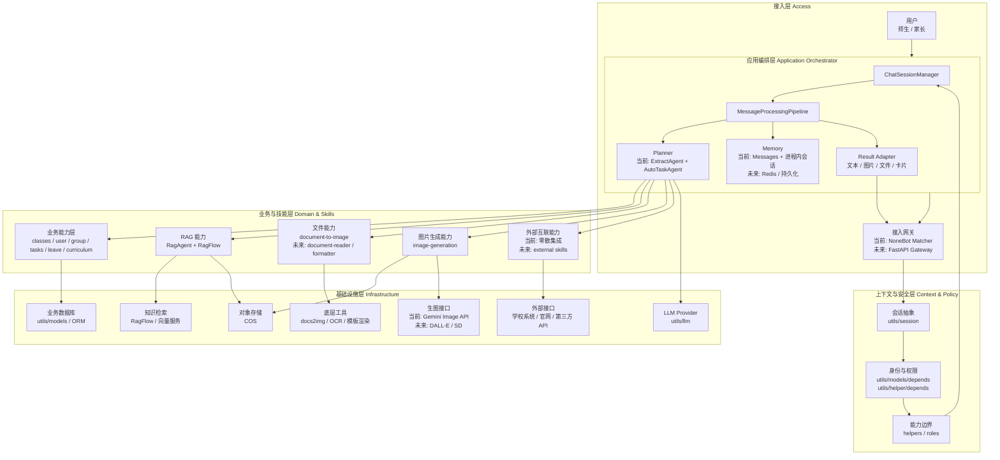

# 当前系统架构设计

> 核验日期：2026-04-18

本文档是对当前 ClassRobot 的正式架构设计说明。

它不是纯“目标蓝图”，也不是纯“代码现状映射”，而是结合当前已经落地的能力、前面整理过的消息流、RAG、文件处理、生图场景后，给出的“现在就适合继续沿着它演进”的系统架构方案。

## 设计目标

当前系统架构需要同时满足下面几件事：

- 能继续承载现有 `NoneBot` 机器人业务，不打断当前可用功能
- 能把 AI 会话、RAG、文件处理、生图等能力统一到同一条中枢链路
- 能让新增能力优先以 `skill` 和 `Agent` 的方式扩展，而不是继续堆到命令入口里
- 能为飞书 Webhook、FastAPI、Redis 记忆层、更多外部系统接入预留稳定位置
- 能把“业务规则”和“AI 能力”分开，避免后续越改越乱

## 当前推荐架构

## 架构分层说明

### 1. 接入层

职责：

- 接收平台消息、命令、文件、图片和回调事件
- 把平台差异收敛成统一内部输入
- 把处理结果回发到对应平台

当前落点：

- `src/plugins/`
- `src/others/`
- `src/routers/`

当前实现代表：

- `src/plugins/autogpt/__init__.py`
- `src/others/image_generate/__init__.py`

设计要求：

- 接入层不直接处理复杂 AI 编排
- 接入层不直接写底层工具逻辑
- 飞书接入时应新增适配层，而不是复制一套业务和 AI 流程

### 2. 上下文与安全层

职责：

- 构建平台会话标识
- 完成用户绑定、角色识别、群与班级关系识别
- 按角色过滤可见命令和可见能力
- 在调用 AI 中枢之前先确定权限边界

当前落点：

- `utils/session/`
- `utils/models/depends.py`
- `utils/helper/depends.py`

设计要求：

- 权限必须在代码层校验，不能只依赖 Prompt
- 用户和平台关系必须统一从这里进入，不要散落在插件里重复实现
- 后续如果增加审批、审计、策略控制，也优先挂在这一层附近

### 3. 应用编排层

职责：

- 维护会话状态
- 组织消息处理流水线
- 抽取上下文、规划任务、决定调用哪个 Agent 或 skill
- 汇总结果，并适配成平台可发送的返回结构

当前落点：

- `src/plugins/autogpt/pipeline.py`
- `src/plugins/autogpt/util.py`
- `utils/llm/agents/tools.py`

当前核心组件：

- `ChatSessionManager`
  - 管理会话生命周期和内存态消息
- `MessageProcessingPipeline`
  - 作为当前统一的 AI 处理中枢
- `ExtractAgent`
  - 负责结构化上下文抽取
- `AutoTaskAgent`
  - 负责命令规划与自动任务生成
- `SummaryAgent`
  - 负责长上下文压缩

设计要求：

- 所有自然语言入口尽量统一走编排层
- 编排层负责“决定调谁”，不负责底层实现细节
- 当前 `Planner` 还是隐式的，后续建议从 `ExtractAgent + AutoTaskAgent` 中继续显式化

### 4. 业务与技能层

这层分成两块，但应该并行存在，而不是互相替代。

#### 4.1 业务能力层

职责：

- 承载班级、用户、群、课表、任务、请假等稳定业务规则
- 保证业务数据写入和读取的正确性
- 对外表现为命令、服务或领域能力

当前落点：

- `src/managers/`
- `src/plugins/tasks/`
- `src/plugins/leave/`
- `src/plugins/curriculum/`

设计要求：

- 业务规则不能被 Agent 直接替代
- 即使未来通过 AI 触发，也应该最终落到业务层执行
- 业务层继续保持“规则中心”，AI 只做理解和编排

#### 4.2 Skill 层

职责：

- 承载可复用的 AI 增强能力和工具能力
- 让 Agent 或命令入口通过统一方式调用
- 把“能力边界”从零散函数升级为稳定模块

当前落点：

- `skills/`
- `utils/skills/`
- `utils/tools/`

当前已成型的 skill：

- `document-to-image`
- `ocr`
- `qr-code`
- `markdown-to-image`
- `image-generation`

推荐扩展的 skill：

- `document-reader`
- `document-formatter`
- `external-skill`
- 未来若需要，也可以把 RAG 能力进一步抽象成更显式的 `rag-skill`

设计要求：

- skill 负责“做能力”
- Agent 负责“决定何时调用、如何组织、是否扩写 Prompt”
- 命令入口和 Agent 尽量共用同一个 skill，而不是各写一套

### 5. 基础设施层

职责：

- 提供大模型、数据库、对象存储、知识检索、文档处理、OCR、外部 API 等底层依赖

当前落点：

- `utils/llm/`
- `utils/models/`
- `utils/llm/agents/ragflow/`
- `utils/tools/cos/`
- `utils/tools/docs2img/`
- `utils/tools/ocr/`

设计要求：

- 业务层和 skill 层尽量不要直接依赖零散第三方 SDK
- 先在基础设施层收敛接入，再向上暴露稳定接口
- 后续若更换模型、知识库或存储实现，应尽量控制在这一层完成替换

## 当前系统的五条核心链路

### 1. 普通业务命令链路

路径：

- 用户消息
- 接入层命令入口
- 权限与上下文依赖
- 业务层处理
- 返回文本或图片结果

适用能力：

- 班级管理
- 课表查询
- 任务提交
- 请假查询

### 2. AI 会话编排链路

路径：

- 用户自然语言
- 接入层
- `ChatSessionManager`
- `MessageProcessingPipeline`
- `ExtractAgent / AutoTaskAgent / SummaryAgent`
- 返回文本结果或命令计划

适用能力：

- 自然语言对话
- 自然语言转命令
- 长对话上下文保持

### 3. RAG 知识问答链路

路径：

- 接入层
- 权限与上下文层
- `MessageProcessingPipeline`
- `RagAgent`
- `RagFlow`
- 返回带引用材料的答案

适用能力：

- 校规校纪问答
- 文件制度问答
- 学校知识库检索

### 4. 文件理解链路

路径：

- 用户上传文件
- 接入层下载或接收文件
- 编排层识别为文件处理请求
- `FileAgent`
- `document-to-image`
- 多模态模型理解
- 返回摘要、解释或提取结果

适用能力：

- 文档内容理解
- 文件摘要
- 文档信息抽取

### 5. 图片生成链路

路径：

- 用户文本或图片输入
- 接入层命令或未来自然语言入口
- `image-generation` skill
- 底层生图接口
- COS 上传
- 返回图片消息

适用能力：

- 文生图
- 图生图
- 海报、插画、视觉草图生成

## 当前架构中的关键边界

### 1. 业务层和 Agent 层的边界

- Agent 负责理解用户意图和规划动作
- 业务层负责真正执行班级、任务、请假等稳定规则
- 不要让 Agent 直接跳过业务层去写数据库

### 2. Agent 层和 skill 层的边界

- Agent 负责选择能力、扩写 Prompt、决定顺序
- skill 负责真正执行能力
- 不要把复杂业务决策写进 skill

### 3. skill 层和基础设施层的边界

- skill 对上暴露稳定能力接口
- 基础设施层对下管理第三方依赖和底层实现
- 不要让业务层直接操作零散 SDK 或底层工具函数

### 4. 接入层和编排层的边界

- 接入层负责平台适配
- 编排层负责系统内决策
- 飞书、QQ、OneBot 只是入口不同，不应复制中间流程

## 当前推荐的目录理解方式

可以把当前仓库理解成下面这几块：

- 接入层
  - `src/plugins/`
  - `src/others/`
  - `src/routers/`
- 安全与上下文层
  - `utils/session/`
  - `utils/models/depends.py`
  - `utils/helper/depends.py`
- 应用编排层
  - `src/plugins/autogpt/`
  - `utils/llm/agents/`
- 业务层
  - `src/managers/`
  - 部分 `src/plugins/*`
- Skill 层
  - `skills/`
  - `utils/skills/`
- 基础设施层
  - `utils/models/`
  - `utils/tools/`
  - `utils/llm/`
  - `utils/llm/agents/ragflow/`

## 现阶段最适合的演进路线

### 第一阶段：把边界继续显式化

- 保留当前 `NoneBot` 主体结构
- 保持 `MessageProcessingPipeline` 作为统一 AI 中枢
- 新增能力优先按业务层或 skill 层归位
- 减少继续在入口 handler 里堆逻辑

### 第二阶段：补齐缺失组件

- 新增 `FastAPI` 接入骨架
- 把飞书 Webhook 接进接入层
- 把记忆层抽象成可替换接口，为 Redis 做准备
- 把 `Planner` 显式拆出

### 第三阶段：增强复杂能力

- 落地 `document-reader` / `document-formatter`
- 落地标准化 `external-skill`
- 把更多异步任务做成可追踪流程

## 架构结论

当前系统最合适的架构，不是“继续保持纯插件堆叠”，也不是“马上重构成大量微服务”，而是：

- 以 `NoneBot` 为当前接入层
- 以 `ChatSessionManager + MessageProcessingPipeline` 为当前 AI 编排中枢
- 以 `src/managers/*` 和业务插件为业务规则层
- 以 `skills/ + utils/skills/` 为通用能力层
- 以 `utils/models/ + utils/tools/ + utils/llm/` 为基础设施接入层

换句话说，当前系统应该演进成一个“模块化单体 + 显式分层 + skill 驱动扩展”的架构，而不是继续把所有能力堆到命令处理文件里。

配合阅读：

- [当前系统整合图映射](./current-system-integration.md)
- [消息处理流程](../guides/message-processing-flow.md)
- [Skill 系统说明](../guides/skill-system.md)
- [目标架构蓝图](./target-ai-architecture.md)
