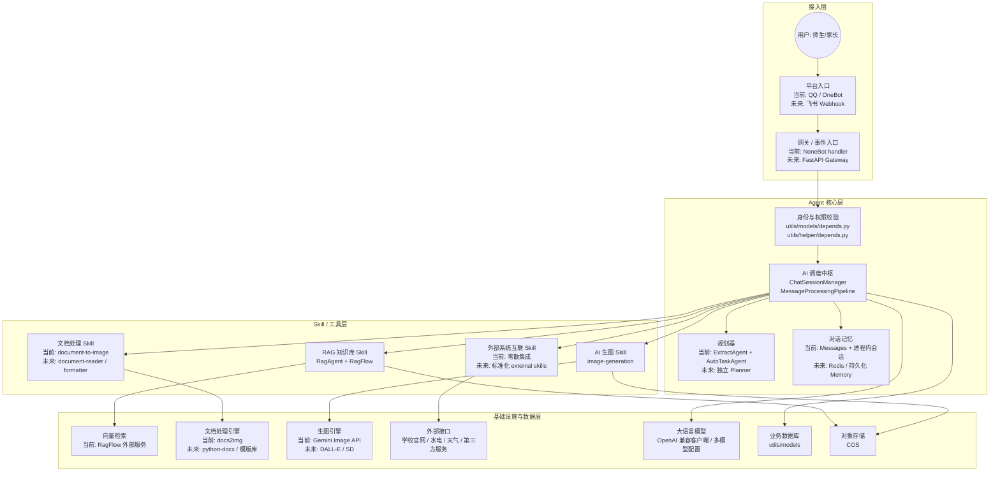

# 当前系统整合图映射

> 核验日期：2026-04-18

本文档用于把“接入层 -> Agent 核心层 -> Skill 层 -> 数据基础设施层”这类总架构图，映射到当前仓库已经存在的真实实现上，并明确哪些部分已经落地，哪些部分仍属于下一阶段演进目标。

## 适用目的

- 帮助开发者把新能力放到正确层级
- 避免把平台逻辑、Agent 逻辑、skill 逻辑和底层工具混写在一起
- 为后续接入飞书、FastAPI、Redis、更多外部系统提供统一蓝图

## 当前系统整合图

## 分层映射

### 1. 接入层

这层只负责把外部平台的消息、事件、文件和回调请求带进系统。

当前对应实现：

- `pyproject.toml`
  - 已启用 OneBot V11、OneBot V12、QQ 官方适配器
- `src/plugins/autogpt/__init__.py`
  - 当前 AI 主入口
- `src/others/image_generate/__init__.py`
  - 图片生成命令入口
- `src/plugins/*`
  - 其他业务命令与消息入口

当前状态：

- 已有 `NoneBot` 接入层
- 还没有独立的 `FastAPI Gateway`
- 还没有飞书 Webhook 入口

整合原则：

- 接入层只做验签、解析、用户绑定、权限获取、调用中枢、回发消息
- 不在接入层直接写复杂业务规则或底层工具调用

### 2. Agent 核心层

这层负责理解请求、维护上下文、决定调用哪个 Agent 或 skill，并把不同能力编排成一个统一处理流程。

当前对应实现：

- `src/plugins/autogpt/pipeline.py`
  - `MessageProcessingPipeline`
  - 当前消息处理中枢
- `src/plugins/autogpt/util.py`
  - `ChatSession`
  - `ChatSessionManager`
- `utils/llm/agents/tools.py`
  - 当前已实现的 Agent 集合
- `utils/session/__init__.py`
  - 平台会话抽象

当前映射关系：

- `Agent`
  - 当前对应 `MessageProcessingPipeline` + `utils/llm/agents/tools.py`
- `Planner`
  - 当前主要对应 `ExtractAgent` 和 `AutoTaskAgent`
  - 它们共同承担“抽取上下文 + 规划命令任务”的轻量规划职责
- `Memory`
  - 当前主要对应 `ChatSessionManager`、`Messages`
  - 目前是进程内内存态，不是 Redis

当前状态：

- 已有可运行的 Agent 编排主链路
- 已有轻量规划能力
- 记忆层已存在，但还没有持久化记忆服务

### 3. Skill / 工具层

这层负责把可复用能力整理成稳定边界，供 Agent 或命令入口复用。

当前对应实现：

- `skills/`
  - skill 元数据与能力目录
- `utils/skills/`
  - skill 注册、发现、懒加载、运行时绑定
- `utils/tools/`
  - 底层工具实现

当前已落地的 skill：

- `document-to-image`
- `ocr`
- `qr-code`
- `markdown-to-image`
- `image-generation`

当前与图中节点的对应关系：

- `RAG_Skill`
  - 当前更接近 `RagAgent + utils/llm/agents/ragflow/`
  - 还没有完全独立成一个单独的 skill 目录
- `Doc_Skill`
  - 当前已落地的部分是 `document-to-image`
  - 自动排版仍是下一阶段扩展
- `Image_Skill`
  - 当前已落地为 `image-generation`
- `External_Skill`
  - 当前还比较零散，主要分布在：
  - `src/others/`
  - `utils/tools/cos/`
  - 各业务插件自身的外部调用代码

当前状态：

- skill 体系已经建立
- 文档处理和图片生成已部分 skill 化
- 外部系统互联还没有完全标准化成 skill

### 4. 数据与基础设施层

这层提供数据库、对象存储、知识检索、大模型和外部接口等支撑能力。

当前对应实现：

- 业务数据库
  - `utils/models/`
- 知识检索
  - `utils/llm/agents/ragflow/`
- 对象存储
  - `utils/tools/cos/`
- 文档处理
  - `utils/tools/docs2img/`
- OCR
  - `utils/tools/ocr/`
- 大模型调用
  - `utils/llm/__init__.py`

当前与图中节点的关系：

- `VectorDB`
  - 当前没有直接在仓库里操作 Milvus、Chroma
  - 当前通过外部 RagFlow 服务间接提供
- `PyDocx / 模版库`
  - 当前还没有完整接入
  - 现阶段以文档转图片为主
- `DALL-E / Stable Diffusion`
  - 当前生图默认走 Gemini 图像生成接口
- `学校官网 / 水电 / 天气接口`
  - 当前还没有形成统一的外部互联层
- `LLM`
  - 当前已经支持多模型配置和 OpenAI 兼容客户端

## 当前系统与目标态的差异

### 已经落地的部分

- 平台入口已存在，并能承接消息和命令
- 权限与用户绑定依赖已存在
- Agent 编排主链路已收敛到 `MessageProcessingPipeline`
- skill 体系已存在，并支持目录自动加载和手动注册
- RAG、文档转图、生图、OCR、二维码等能力已经有明确落点

### 还未完全落地的部分

- 独立 `FastAPI Gateway`
- 飞书 Webhook 接入层
- Redis 或数据库持久化记忆层
- 独立的 `Planner` 模块
- `document-reader` / `document-formatter`
- 标准化 `external-skill`
- 统一异步任务回调机制

## 对当前仓库的整合结论

如果按照这张总架构图继续演进，当前仓库可以理解成：

- `src/plugins/`、`src/others/`
  - 当前接入层与部分应用入口
- `src/plugins/autogpt/`
  - 当前 Agent 核心层主链路
- `utils/llm/agents/`
  - 当前 Agent 组件层
- `skills/`、`utils/skills/`
  - 当前 Skill 层
- `utils/models/`、`utils/tools/`、`utils/llm/agents/ragflow/`
  - 当前数据与基础设施接入层

这说明当前项目并不是“没有分层”，而是“分层已经出现，但还没有被完全显式化命名”。

## 后续推荐的整合顺序

建议按下面的顺序继续演进，而不是一次性大拆：

1. 继续保留 `NoneBot` 作为当前接入层
2. 新增 `FastAPI` 作为飞书 Webhook 和后台 API 的统一入口
3. 把 `ChatSessionManager + MessageProcessingPipeline` 继续收敛成更明确的 Agent 中枢
4. 把 `Planner` 从现有 `ExtractAgent` / `AutoTaskAgent` 中进一步独立出来
5. 把文档编辑、生图、外部系统互联继续做成标准 skill
6. 把记忆层从进程内迁移到 Redis 或持久化存储

## 对开发者的放置建议

- 新平台接入代码优先放在接入层，不要直接塞进 skill
- 新的智能决策逻辑优先放在 Agent 核心层，不要放进命令 handler
- 新的通用能力优先做成 skill，不要直接暴露底层工具给业务层
- 新的数据接入或第三方服务适配，优先放在基础设施接入层，再由 skill 或 Agent 复用

配合阅读：

- [消息处理流程](../guides/message-processing-flow.md)
- [Skill 系统说明](../guides/skill-system.md)
- [目标架构蓝图](./target-ai-architecture.md)
