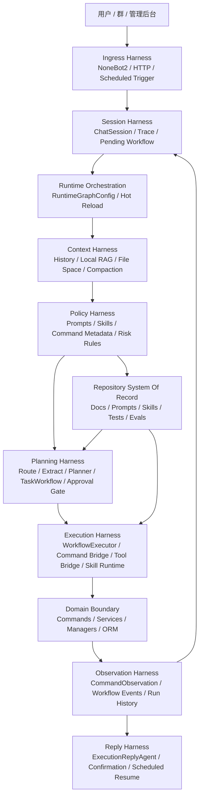

# Harness Engineering 架构蓝图

> 核验日期：2026-05-06

本文档用于把 ClassRobot 的 AI Agent 设计正式收敛到一套更接近 Harness Engineering 的工程模型上。

这里说的 Harness，不是单指某个框架，而是：

- 围绕模型构建的代码边界
- 仓库中的政策与文档契约
- 工具和工作流的执行边界
- 记忆、上下文、审批、观测和评测机制

它解决的不是“怎么再多接一个模型”，而是：

> 如何让 Agent 在校园业务场景里稳定地理解、规划、执行、恢复和演进。

## 外部参考与采用原则

这一版设计主要吸收了 3 组公开资料中的工程方法：

- OpenAI《Harness engineering: leveraging Codex in an agent-first world》
  - 强调 humans steer, agents execute
  - 强调 repository knowledge 是 system of record
  - 强调不要用人工补锅掩盖问题，而要补 guardrails、skills、tests、docs
- OpenAI《Symphony》与 `SPEC.md`
  - 强调 policy / configuration / coordination / execution / integration / observability 分层
  - 强调 orchestration policy 要跟仓库一起版本化
  - 强调运行对象、运行状态和可观测性必须显式化
- OpenClaw 官方文档
  - 强调 gateway/control plane、agent runtime、context engine、skills、memory、delegate boundary
  - 强调上下文构建、技能优先级、长期记忆和组织级权限边界要工程化

ClassRobot 不会照搬这些项目的目录或产品形态，而是采用它们背后的工程结构。

## 核心结论

ClassRobot 后续应采用一套 **消息驱动、工作流驱动、仓库驱动** 的 Harness Architecture：

```text
用户消息
  -> NoneBot2 接入
  -> RuntimeGraphConfig 运行时编排图
  -> Session / Context Harness
  -> Intent + Planning Harness
  -> TaskWorkflow AI 任务执行流
  -> Execution Harness
  -> Observation / Approval / Recovery Harness
  -> Reply / Scheduled Resume
```

同时，仓库本身要成为 Agent 的系统事实来源：

```text
架构文档 + Prompt + Skill + Command 元数据 + 测试 + 评测样例
  = Agent 的工程约束面
```

## 为什么要从“Agent 功能开发”升级到“Harness Engineering”

如果只把注意力放在：

- 换模型
- 改 prompt
- 加 RAG
- 再接一个 tool

系统最终会越来越像“多功能黑盒”。

Harness Engineering 的思路是反过来：

1. 先定义仓库里的稳定契约。
2. 再定义运行时的层次与边界。
3. 最后才往里放模型、工具和工作流。

这样做的直接收益是：

- 功能新增不会不断污染主流程
- Prompt 问题和工程问题更容易分离
- 聊天、命令、RAG、长期任务能共享统一框架
- 安全、审批、日志、恢复不会事后补丁式加入

## ClassRobot 的 Harness 分层

### 1. Policy Layer

负责定义 Agent 应该如何工作，而不是直接让模型自由发挥。

当前和目标落点：

- `resources/prompts/*.jinja`
- `docs/architecture/*.md`
- `docs/guides/*.md`
- `.codex/skills/classrobot-agent-dev/`
- `src/core/agent/runtime/harness/policy.py`
- `Helper` / `CommandToolCatalog` 中的命令、参数、风险和可见性元数据

这一层应保存：

- 路由规则
- Prompt 输出契约
- 命令风险等级
- 审批原则
- 记忆与隐私边界
- 评测样例和回归规则

### 2. Context Layer

负责控制模型每轮真正能看到什么。

当前和目标落点：

- `src/core/agent/runtime/knowledge.py`
- `src/core/agent/runtime/harness/context.py`
- `src/core/storage/chat_history.py`
- `src/core/storage/local_rag.py`
- `src/core/storage/files.py`
- `src/plugins/application/passive/message_history_collector/__init__.py`
- `src/plugins/library/message_history/collector.py`
- 后续可扩展的 context-engine 抽象

这一层要回答的问题：

- 当前轮是否需要聊天记录
- 当前轮是否需要文件上下文
- 当前轮是否需要长期记忆
- 如何在 token 预算内压缩上下文
- 如何保证不能越级读取其他用户/群的数据

### 3. Coordination Layer

负责把自然语言请求转成显式计划与工作流。

当前和目标落点：

- `src/core/agent/runtime/pipeline.py`
- `src/core/agent/runtime/schema.py`
- `src/core/agent/runtime/util.py`
- `src/core/agent/runtime/harness/runtime.py`
- `src/core/agent/runtime/playbooks.py`
- `src/core/agent/runtime/orchestration_config.py`
- `src/core/agent/runtime/graph_executor.py`

这一层的职责是：

- Intent routing
- 开发者控制的 Runtime 条件图
- 本地确定性 shortcut
- Planner
- 风险与确认前置判断
- 选择 command / tool / skill / RAG / 定时任务
- 生成 AI 临时 `TaskWorkflow`

### 4. Execution Layer

负责安全执行，不能让模型直接穿透领域层。

当前和目标落点：

- `src/core/agent/runtime/workflow.py`
- `src/plugins/application/active/autogpt/__init__.py`
- `src/platform/commands/`
- `src/plugins/application/active/*`
- 后续统一 tool executor / MCP bridge

原则：

- Agent 负责编排
- 现有命令和 service 负责真正执行业务
- 写操作不能靠 prompt 直接替代

### 5. Integration Layer

负责连接模型、平台和外部系统。

当前和目标落点：

- NoneBot2 平台接入
- `src/core/llm/`
- `src/core/agent/`
- `src/core/skills/`
- 后续 MCP host / gateway
- 外部知识库、COS、学校业务系统

这一层要保持 adapter 化：

- 换模型不改主流程
- 换 RAG 实现不改工作流语义
- 换外部系统优先改 adapter，不污染 planner

### 6. Observability and Governance Layer

负责让 Agent 可追踪、可恢复、可审计。

当前和目标落点：

- `trace_id`
- `src/core/agent/runtime/harness/observability.py`
- `CommandObservation`
- `RuntimeGraphConfig`
- `TaskWorkflow`
- `WorkflowCheckpointStore`
- `WorkflowRunStore`
- 后续评测、成本、审批面板

这一层至少要回答：

- 本轮做了什么
- 为什么走这条路径
- 哪一步失败
- 是否需要确认
- 是否能恢复
- 是否越权

## Harness 分层与当前代码映射

| Harness 层 | 当前核心模块 | 当前状态 | 后续重点 |
| --- | --- | --- | --- |
| Policy | `resources/prompts/`, `docs/`, `.codex/skills/`, `src/core/agent/runtime/harness/policy.py` | 已有，并开始落到显式代码入口 | 收敛为明确契约和评测标准 |
| Context | `src/core/agent/runtime/knowledge.py`, `src/core/agent/runtime/harness/context.py`, `src/core/storage/*` | 已有聊天记录、本地 RAG、文件空间，并开始收敛上下文入口 | 抽象成可替换的 context engine |
| Coordination | `src/core/agent/runtime/pipeline.py`, `schema.py`, `orchestration_config.py`, `graph_executor.py` | 已有热更新 Runtime 图、路由、计划和 AI 任务流 | 增强 tool loop、长期任务规划 |
| Execution | `src/core/agent/runtime/workflow.py`, `dispatch_auto_task()`, 命令系统 | 已能顺序执行命令并回填 observation | 统一 command/tool/skill 结果结构 |
| Integration | `src/core/llm/`, `src/core/agent/`, skill runtime, adapters | 已接入模型、Agent、技能和 RAG | 逐步引入 MCP host 和外部服务 adapter |
| Observability | `trace_id`, `src/core/agent/runtime/harness/observability.py`, workflow checkpoint/run | 已有基础，并开始把阶段反馈收敛到显式层次 | 增加评测、审批和后台可视化 |

## Repository Is The System Of Record

这是 Harness Engineering 在 ClassRobot 里最该落地的一条原则。

后续 Agent 不应该主要依赖“维护者脑子里记得什么”，而应该优先读取仓库中的明确资产。

### 必须版本化的仓库资产

| 资产 | 当前落点 | 作用 |
| --- | --- | --- |
| 架构原则 | `docs/architecture/` | 定义系统边界和设计方向 |
| 开发规则 | `docs/guides/` | 定义新增能力应如何实现 |
| Prompt 契约 | `resources/prompts/` | 约束模型输出结构和语义职责 |
| Skill 规则 | `.codex/skills/`、`src/core/skills/` | 约束 Agent 如何使用能力 |
| 命令元数据 | `Helper`、`CommandToolCatalog` | 约束命令可见性、参数与风险 |
| 记忆边界 | `src/core/storage/README.md`、相关代码 | 约束隐私和上下文归属 |
| 测试与回归 | `tests/autogpt/`, `tests/storage/` | 防止能力退化 |

### 对开发方式的影响

- 出现同类问题，不优先人工补答，而优先补规则、补 skill、补文档、补测试。
- Prompt 只是 Policy Layer 的一部分，不再承担全部系统约束。
- 每次新能力都应该同步产生：
  - 文档入口
  - skill 说明
  - 最小回归样例

## 借鉴 OpenClaw，但不照搬 OpenClaw

OpenClaw 对 ClassRobot 最有价值的，不是“多渠道桌面 personal agent 产品形态”，而是下面几个架构概念。

### 1. Control Plane / Gateway 思维

OpenClaw 把 Gateway 当作唯一控制面。

在 ClassRobot 里，对应思路应是：

- NoneBot2 接入层 + `ChatSession` + workflow 状态
  - 共同组成消息控制面

不需要复制 OpenClaw 的 WebSocket Gateway 本体，但需要保留“统一控制面”的设计思想。

### 2. Context Engine 思维

OpenClaw 明确把“上下文如何组装”独立成 context engine。

在 ClassRobot 里，对应落点应是：

- 让 `knowledge.py + summary + local RAG + history compaction`
  - 逐步收敛成一个可替换的 Context Harness

也就是说，后续不要把“上下文拼装策略”零散塞在各个 node 里。

### 3. Skill 优先级与环境门控

OpenClaw 对 skill 的位置、优先级和 load-time gating 做得很明确。

在 ClassRobot 里应采用：

- 项目级 skill 放 `.codex/skills/`
- 运行时 skill 放 `src/core/skills/`
- 每个 skill 都要写清：
  - 什么时候触发
  - 依赖什么
  - 能做什么
  - 不能做什么

### 4. Delegate Boundary

OpenClaw delegate architecture 强调：

- agent 用自己的身份
- 权限显式授予
- 组织级硬限制优先于 agent 自由发挥

这对 ClassRobot 的启发是：

- 后续如果引入“班级助理”“通知代理”“自动提醒代理”
- 必须先定义：
  - 它代表谁
  - 能读什么
  - 能发什么
  - 什么场景必须确认

## 借鉴 Symphony，但不照搬 Symphony

Symphony 更像“编排 spec”，而不是具体产品。

它最适合迁移到 ClassRobot 的地方有 3 个。

### 1. 分层清晰

Symphony 把系统拆成：

- Policy
- Configuration
- Coordination
- Execution
- Integration
- Observability

这正适合 ClassRobot 当前需要做的架构收敛。

### 2. 运行对象显式化

Symphony 把 issue、workspace、run attempt、live session 都建成显式对象。

ClassRobot 的对应对象应继续强化：

- `AgentTurnResult`
- `AgentPlan`
- `RuntimeGraphConfig`
- `TaskWorkflow`
- `WorkflowStep`
- `CommandObservation`
- `WorkflowCheckpoint`
- `WorkflowRun`

### 3. 目标优先，而不是僵硬状态机

OpenAI 在 Symphony 总结里明确提到：不要把 agent 永远塞进僵硬状态机。

对 ClassRobot 来说，正确做法是：

- 让目标、约束、风险和工具边界显式化
- 让模型在明确边界内组织步骤
- 不让模型绕过代码边界直接操作系统事实

## ClassRobot 的目标 Harness 架构图



## 运行时设计原则

### Humans steer, agents execute

- 人类负责定义目标、规则、审批和验收。
- Agent 负责在边界内理解、规划、执行和回写观察结果。

### Objective over raw prompt chaining

- 目标、风险、缺失信息、候选能力要显式化。
- 不再依赖一个超长 prompt 在一轮里包办全部决策。

### Context is assembled, not dumped

- 上下文必须按需组装，而不是把所有历史都塞给模型。
- 当前用户、当前群、当前 workflow 是上下文作用域的主键。

### Execution must cross a boundary

- 业务写操作必须穿过 Command / Service / Tool 边界。
- 模型不能直接成为最终执行面。

### Every capability must degrade safely

- 模型失败、RAG 失败、上下文不足、配置不完整、外部系统不可用时都要能降级。

## 近期落地路线

### Phase 1：文档和契约收敛

- 让 `docs/`, `resources/prompts/`, `.codex/skills/`, `tests/autogpt/` 形成统一入口
- 明确 Policy Layer 和 Context Layer 的文件落点

### Phase 2：Context Harness 抽象

- 把当前 `knowledge.py`、summary、history 和 local RAG 的上下文拼装逻辑收敛成统一抽象
- 为后续长期记忆留接口

### Phase 3：Execution Harness 标准化

- 统一 command / tool / skill / MCP observation 结构
- 补齐审批、失败、恢复、重试语义

### Phase 4：Governance 和 Eval

- 建立 agent 回归样例
- 建立命令调用、RAG、图片理解、长期任务的评测集
- 后续让后台可查看 trace、workflow run 和 observation

## 不应该做的事

- 不要把所有 Agent 能力继续堆进一个 prompt。
- 不要为了“看起来更智能”绕过现有命令和 service。
- 不要把长期记忆和聊天记录做成无边界共享。
- 不要盲目复制 OpenClaw 的桌面/移动端控制面设计。
- 不要为了追求形式上的多 Agent，把单 Agent 都没稳定的链路先拆碎。

## 关联文档

- [Agent 工作流编排架构](./agent-workflow-orchestration.md)
- [命令与 Agent 一体化架构设计](./command-agent-unified-architecture.md)
- [统一 AI 平台架构总纲](./unified-ai-platform-handbook.md)
- [Agent 工程化研发手册](../guides/agent-engineering-playbook.md)

## 外部参考

- [Harness engineering: leveraging Codex in an agent-first world](https://openai.com/index/harness-engineering/)
- [An open-source spec for Codex orchestration: Symphony](https://openai.com/index/open-source-codex-orchestration-symphony/)
- [Symphony SPEC.md](https://github.com/openai/symphony/blob/main/SPEC.md)
- [OpenClaw Gateway architecture](https://docs.openclaw.ai/concepts/architecture)
- [OpenClaw Agent runtime](https://docs.openclaw.ai/concepts/agent)
- [OpenClaw Agent Loop](https://docs.openclaw.ai/concepts/agent-loop)
- [OpenClaw Context Engine](https://docs.openclaw.ai/concepts/context-engine)
- [OpenClaw Memory Overview](https://docs.openclaw.ai/concepts/memory)
- [OpenClaw Skills](https://docs.openclaw.ai/tools/skills)
- [OpenClaw Delegate Architecture](https://docs.openclaw.ai/concepts/delegate-architecture)
