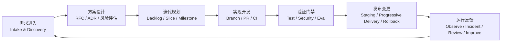

# 软件工程流程方案

> 核验日期：2026-04-18

## 目标

本方案用于把 ClassRobot 的未来建设方式从“功能驱动开发”升级为“面向交付质量、可持续演进、可审计治理的软件工程流程”。它适用于本项目后续的架构演进、领域重构、Agent 能力建设、MCP 互联、知识工程和生产运维。

这套流程默认遵循以下原则：

- 需求、设计、实现、测试、发布、运维形成闭环
- 架构决策和代码变更都必须留下可追溯工件
- 安全、评测、观测和回滚能力要前置到流程中
- AI 相关能力必须在普通 SDLC 之外增加模型、知识和工具治理

## 流程总览

## 角色与职责

| 角色 | 核心职责 |
| --- | --- |
| Product Owner / 需求负责人 | 定义目标、范围、优先级、验收标准 |
| Tech Lead / 架构负责人 | 决定方案边界、技术路线、拆分策略 |
| Domain Owner | 维护领域规则、一致性和业务术语 |
| AI Owner | 维护模型、Prompt、Tool、RAG、Eval 策略 |
| Reviewer / Code Owner | 负责代码评审、方案把关、风险识别 |
| QA / 验证负责人 | 维护测试策略、回归集、发布验证 |
| Security / Compliance Owner | 维护威胁建模、权限、供应链和审批要求 |
| Operator / SRE | 维护环境、发布、观测、告警、故障响应 |

小团队可以一人兼多角，但职责不能消失。

## Phase 1: 需求进入与问题定义

### 输入

- 新的业务诉求
- 架构重构诉求
- 稳定性或性能问题
- 安全、合规或治理缺口
- 生产事故或用户反馈

### 必备工件

每个正式工作项都应至少有以下内容：

- `problem statement`
- `expected outcome`
- `scope / out of scope`
- `stakeholders`
- `risk level`
- `acceptance criteria`
- `non-functional requirements`

### 分类方式

建议按以下维度分类：

- `feature`
- `architecture`
- `integration`
- `reliability`
- `security`
- `data / knowledge`
- `operations`

### 输出

- 可进入评审的需求卡片
- 初步优先级
- 风险等级

## Phase 2: 方案设计与决策沉淀

### 设计工件

按复杂度选择工件层级：

- 小改动：补充到需求卡片和 PR 描述
- 中改动：新增 `RFC`
- 架构级改动：新增 `RFC` + `ADR`

### RFC 至少应包含

- 背景与问题
- 目标与非目标
- 方案选项与取舍
- 对架构、数据、流程的影响
- 风险与回滚策略
- 验收方式

### ADR 至少应包含

- 决策名称
- 上下文
- 决策内容
- 替代方案
- 影响范围
- 后续跟进

### AI 相关改动额外要求

涉及以下内容时，必须增加专项说明：

- 模型切换
- Prompt 大改
- Tool 新增或权限升级
- MCP Server 对外开放能力
- 知识入库规则变化
- 检索链路或重排策略变化

专项说明至少应包含：

- 安全影响
- 误调用/误检索风险
- 评测计划
- 可回滚策略

## Phase 3: 迭代规划与任务切片

### 规划原则

- 一次迭代只推进少量高价值改动
- 先切基础边界，再切具体功能
- 尽量做可独立上线的小批量变更
- 高风险变更与大范围重构不要捆绑发布

### 工作项拆分建议

一个可交付切片最好同时满足：

- 可以独立开发
- 可以独立测试
- 可以独立回滚
- 对主干影响范围清晰

### 推荐优先级顺序

1. 稳定性与安全门禁
2. 领域边界澄清
3. Tool / Workflow / Knowledge 基础设施
4. 新增对外能力
5. 体验优化

## Phase 4: 开发流程

### 分支策略

默认采用轻量、分支化的主干协作模式：

- `main` 只接受通过评审和检查的变更
- 每个工作项使用独立短生命周期分支
- 分支名使用可读且可追踪的格式，例如 `feat/tool-registry`、`refactor/domain-boundary`

这与 GitHub 官方推荐的轻量分支协作方式一致，适合中小团队和持续交付节奏。

### 提交规范

- 每个 commit 尽量保持单一意图
- 提交信息应描述“做了什么”和“为什么”
- 不要把重构、行为修改和测试修复混在一个 commit 里

### Pull Request 流程

每个 PR 至少应包含：

- 变更摘要
- 背景问题
- 影响范围
- 验证方式
- 风险与回滚说明

### 评审要求

- 普通改动至少 1 个 reviewer
- 架构、权限、数据或 AI 关键链路改动至少 2 个 reviewer
- 关键目录建议配置 `CODEOWNERS`
- 重要分支开启保护规则，要求通过状态检查和审批后才能合并

### 代码评审关注点

- 是否符合 RFC / ADR
- 是否破坏领域边界
- Tool schema 和权限是否完整
- 是否增加了不可观测或不可回滚行为
- 测试是否覆盖关键路径
- 是否对 Prompt、RAG、MCP 改动补充了专项验证

## Phase 5: 自动化验证与质量门禁

### CI 最低门槛

每次 PR 至少执行：

- 依赖安装与环境校验
- 代码风格检查
- 静态检查
- 单元测试
- 关键集成测试

### 测试分层

建议采用四层验证：

- `unit tests`
- `integration tests`
- `workflow / contract tests`
- `end-to-end smoke tests`

### AI 专项验证

凡是以下改动，必须补充 AI 专项验证：

- Prompt 变更
- Tool 描述变更
- Tool 权限变更
- RAG 检索策略变更
- 模型版本变更
- MCP 对外能力变更

AI 专项验证至少包括：

- 结构化输出正确率
- 工具选择正确率
- 检索引用正确率
- 高风险事务拦截率
- 回归样例通过率

### 安全与供应链门禁

建议纳入：

- 依赖漏洞扫描
- 密钥与凭据扫描
- 基础威胁建模检查
- 关键路径权限检查
- 供应链来源与构建产物留痕

## Phase 6: 发布与变更管理

### 环境分层

至少区分：

- `local`
- `test / ci`
- `staging`
- `production`

### 发布策略

推荐采用渐进式发布：

- 先在 `staging` 完整验证
- 再做小流量或小范围发布
- 优先用 feature flag 或 capability flag 控制高风险能力

### 数据与知识变更

以下变更必须单独规划：

- 数据库迁移
- 知识重建与索引重算
- MCP 能力开放范围变化
- Tool 权限模型变化

### 回滚要求

每个高风险变更上线前必须明确：

- 回滚触发条件
- 回滚负责人
- 回滚路径
- 数据修复策略

## Phase 7: 运行、反馈与持续改进

### 观测基线

运行后至少要能看到：

- 请求量与错误率
- 工作流运行状态
- Tool 调用链
- 检索命中与引用情况
- 模型成本与延迟
- MCP 调用成功率

### 事故处理

建议统一使用：

- `incident level`
- `owner`
- `timeline`
- `impact`
- `root cause`
- `corrective actions`

### 复盘机制

每次重要故障或回滚后都应补齐：

- 触发原因
- 为什么未在设计/测试阶段发现
- 哪个门禁应当补强
- 哪些工件需要更新

## AI / Agent / RAG / MCP 专项流程

### 1. Prompt 变更流程

- 记录版本号
- 记录目标行为变化
- 跑回归样例
- 保留可回滚版本

### 2. Tool 变更流程

- 更新 schema
- 更新权限等级
- 更新描述与使用约束
- 补 contract tests

### 3. RAG 变更流程

- 记录数据来源
- 记录切块、元数据、重排策略
- 验证引用准确性
- 验证租户隔离与权限隔离

### 4. MCP 变更流程

- 明确是 Client 还是 Server 侧改动
- 明确暴露能力与授权边界
- 验证只读和写入能力是否分级
- 验证审计和回滚路径

## 关键工件清单

建议在流程中长期保留以下工件：

- `Requirement / Work Item`
- `RFC`
- `ADR`
- `Threat Model`
- `Test Plan`
- `Eval Report`
- `Release Note`
- `Incident Review`
- `Operational Runbook`

## Definition of Ready

一个工作项进入开发前，至少满足：

- 目标明确
- 范围明确
- 验收标准明确
- 风险等级明确
- 依赖关系明确
- 是否需要 RFC / ADR 明确

## Definition of Done

一个工作项完成前，至少满足：

- 代码合并
- 测试通过
- 文档更新
- 评审完成
- 回滚路径明确
- 观测与告警已接通
- 若涉及 AI，专项评测已通过

## 推荐仓库治理规则

### 分支与合并

- `main` 开启 protected branch
- 要求状态检查通过
- 要求至少 1 到 2 个审批
- 禁止直接向 `main` 推送

### 目录 ownership

建议至少为这些目录配置 owner：

- `src/domain/`
- `src/interfaces/`
- `utils/llm/`
- `utils/skills/`
- `docs/architecture/`

### 自动化检查

建议后续在 CI 中逐步纳入：

- `ruff` / `black` / `isort`
- `pytest`
- 文档链接与 Markdown 基本检查
- 配置与密钥扫描
- Eval 回归测试

## 度量指标

建议使用 DORA 作为交付表现基线，并叠加 AI 专项指标。

### 交付指标

- `change lead time`
- `deployment frequency`
- `failed deployment recovery time`
- `change fail rate`
- `deployment rework rate`

### 工程质量指标

- PR 周转时间
- 评审耗时
- 自动化测试通过率
- 回滚次数
- 缺陷逃逸率

### AI 专项指标

- Tool 选择正确率
- 结构化输出正确率
- 检索引用准确率
- 高风险操作拦截率
- 单次请求成本与延迟

## 与当前项目最匹配的落地方式

对 ClassRobot 当前阶段，最适合的不是重型流程，而是“轻量工件 + 严格门禁”：

- 需求项用 Issue 或文档卡片管理
- 中大改动用 `RFC + ADR`
- 开发采用短分支 + PR
- 发布前强制执行测试、审查、评测
- 运行后用观测与事故复盘驱动下一轮改进

这意味着我们不追求流程文档很多，而是追求每个阶段都有最小但关键的工程证据。

## 官方依据

以下资料用于校验本流程中的关键工程实践：

- [GitHub Flow](https://docs.github.com/en/get-started/using-github/github-flow)
- [GitHub Docs: About pull request reviews](https://docs.github.com/en/pull-requests/collaborating-with-pull-requests/reviewing-changes-in-pull-requests/about-pull-request-reviews)
- [GitHub Docs: Managing protected branches](https://docs.github.com/en/repositories/configuring-branches-and-merges-in-your-repository/managing-protected-branches)
- [GitHub Docs: Build and test Python](https://docs.github.com/en/actions/tutorials/build-and-test-code/python)
- [NIST SP 800-218: Secure Software Development Framework](https://www.nist.gov/publications/secure-software-development-framework-ssdf-version-11-recommendations-mitigating-risk)
- [NIST SP 800-218A: SSDF Community Profile for Generative AI](https://www.nist.gov/publications/secure-software-development-practices-generative-ai-and-dual-use-foundation-models-ssdf)
- [OWASP SAMM](https://owaspsamm.org/model/)
- [DORA Metrics](https://dora.dev/guides/dora-metrics/)
