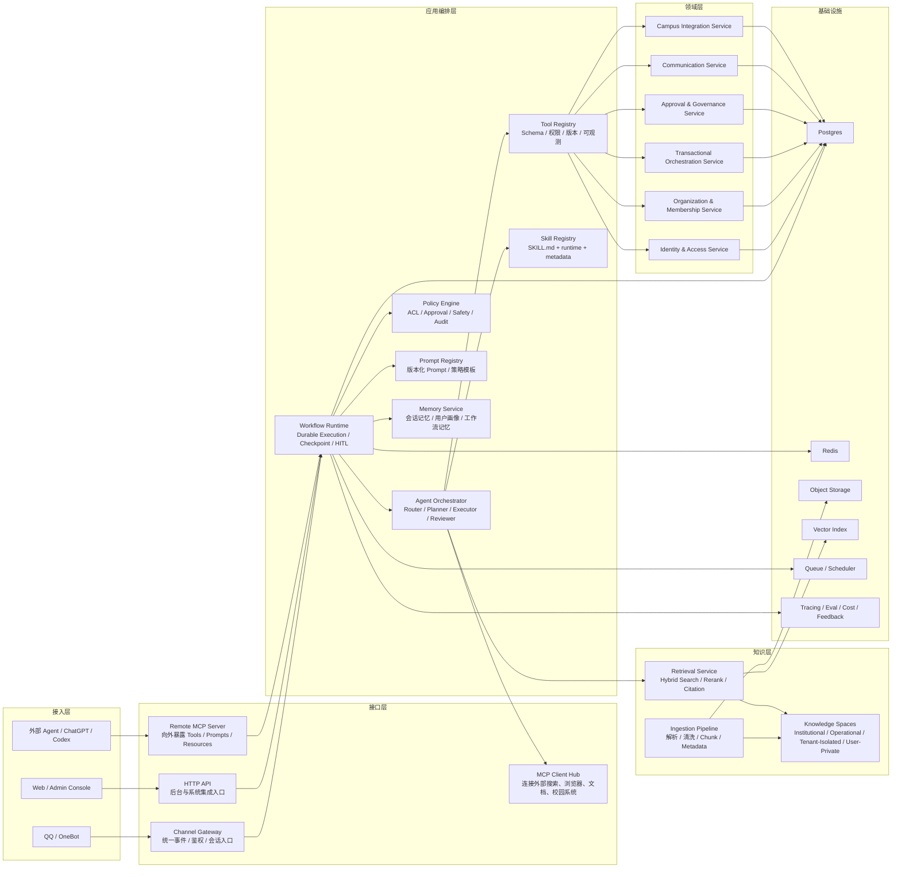

# 目标 AI 架构蓝图

> 核验日期：2026-04-18

## 设计目标

ClassRobot 的目标不再只是“会聊天、会转命令的班级机器人”，而是一个面向校园信息化场景的 AI 能力平台。机器人、后台、外部 Agent、自动化运行器都应共享同一套领域能力、工具协议和知识服务，并能够与身份、事务、资源、运营等校内外系统稳定互联。

核心目标如下：

- 高扩展性：新能力可以以 Domain、Tool、Skill、MCP Connector 的形式接入
- 高可迭代：架构允许先以模块化单体运行，再按瓶颈拆服务
- 高可靠性：重要流程可恢复、可审批、可追踪、可回放
- 高互操作性：既能消费外部 MCP 服务，也能把本系统能力作为 MCP Server 对外暴露
- 高知识利用率：知识检索、引用、重排、权限隔离成为独立基础设施

## 总体原则

### 1. Domain First

身份与访问、组织关系、事务编排、审批治理、消息触达、校园系统集成这些是稳定核心。Agent 负责“理解和编排”，不能直接替代领域规则本身。

### 2. Workflow First

复杂请求应落入持久化工作流，而不是单次 Prompt Chain。工作流要支持状态机、检查点、恢复、重试、人工审批和超时。

### 3. Tool Contract First

所有可调用能力都先收敛成统一 Tool Contract，再决定它是否以 Skill、MCP、HTTP API 或内部函数形式暴露。

### 4. Knowledge Plane First

RAG 是独立知识平面，不应混入聊天历史拼接逻辑。知识入库、切块、元数据、检索、重排、引用和权限要独立治理。

### 5. MCP Everywhere

MCP 不只是“连外部工具”的方式，也应成为本系统对外开放能力的标准协议层。

### 6. Guardrails by Design

权限、审批、审计、成本控制和内容安全必须是运行时能力，而不是只写在 Prompt 里的希望。

## 目标架构图

## 分层职责

| 层级 | 职责 | 不负责什么 |
| --- | --- | --- |
| 接入层 | 接收消息、HTTP 请求、外部 Agent 调用 | 不承载业务规则 |
| 接口层 | 统一把不同入口转成标准化请求 | 不直接做复杂编排 |
| 应用编排层 | 决策、规划、调用工具、执行工作流 | 不直接耦合 ORM 和平台消息细节 |
| 领域层 | 稳定业务规则、事务、一致性、权限语义 | 不关心模型 Prompt 如何写 |
| 知识层 | 文档解析、索引、检索、引用、权限隔离 | 不直接执行业务事务写操作 |
| 基础设施层 | 数据、缓存、消息、追踪、评测 | 不关心具体业务意图 |

## 推荐的运行拓扑

### 第一阶段：模块化单体

最推荐的起步方式不是立刻做微服务，而是做“模块化单体 + 明确边界”：

- `NoneBot` 继续作为渠道入口
- 新增 `FastAPI` 作为内部和后台 API 层
- 工作流、Tool Registry、Domain Service、Knowledge Service 仍在一个 Python 仓库中
- 通过清晰模块边界和契约为后续拆分做准备

这样做的好处是：

- 迭代速度高
- 调试成本低
- 不会过早被网络调用和分布式事务拖慢

### 第二阶段：按瓶颈拆分

当以下压力出现时再拆服务：

- 文档处理、OCR、索引构建吞吐独立增长
- RAG 请求量和业务请求量差异明显
- MCP 对外服务需要独立部署和授权
- 后台管理与 Bot 入口需要不同扩缩容策略

优先可拆出的服务通常是：

- `knowledge-service`
- `mcp-gateway`
- `agent-runtime`

## Skill、Tool、MCP、RAG 的边界

### Skill

Skill 是对能力边界、适用场景和调用方式的声明，偏向“给 Agent 看懂和稳定复用”。

适合放进 Skill 的能力：

- 多模态文档理解
- 结构化信息抽取
- 渲染与可视化输出
- 外部系统交互编排
- 领域知识增强模板

### Tool

Tool 是运行时可调用契约，必须具备：

- 唯一名称
- 参数 Schema
- 权限级别
- 超时与重试策略
- 调用日志和结果结构

### MCP

MCP 是互联协议层，主要做两件事：

- 作为 Client 消费外部工具、资源、提示词
- 作为 Server 把本系统能力标准化暴露出去

推荐策略：

- 本地开发优先 `stdio`
- 生产环境的远程服务优先 `Streamable HTTP`
- 先开放只读能力，再开放写能力

### RAG

RAG 单独形成知识平面，负责：

- 文档接入与清洗
- 分块与元数据
- 向量与关键词混合检索
- 重排与引用
- 知识空间隔离

RAG 不应该：

- 越权写业务数据
- 把所有上下文都塞进聊天历史里
- 代替业务服务做事务控制

## 推荐的请求流

### 普通对话或服务编排请求

1. 渠道消息进入 `Channel Gateway`
2. Gateway 标准化为统一请求对象
3. `Workflow Runtime` 根据意图选择短链路或长工作流
4. `Agent Orchestrator` 调用 Tool Registry
5. Tool 进一步调用 Domain Service 或 Retrieval Service
6. 结果经过 Policy Engine 检查后返回渠道层

### 知识问答请求

1. Orchestrator 判断问题需要知识检索
2. `Retrieval Service` 从对应 Knowledge Space 做混合检索
3. Rerank 后返回带引用的上下文
4. 模型在受控上下文里生成答案
5. 最终输出保留引用和来源信息

### 高风险写操作

1. Planner 生成写操作计划
2. Policy Engine 根据用户角色和工具级别决定是否审批
3. 审批通过后才进入 Domain Service
4. 执行过程写入审计日志和工作流轨迹

### 外部 Agent 调用本系统

1. 外部 Agent 通过 `Remote MCP Server` 获取本系统的 tools/prompts/resources
2. 写能力需单独授权并附带审计上下文
3. 实际执行仍然经过本系统 Policy Engine 和 Domain Service

## 对当前仓库的映射建议

| 当前模块 | 未来归属 | 说明 |
| --- | --- | --- |
| `src/plugins/*` | `interfaces/` + `application/` + `domain/` | 现有插件需要拆出接入逻辑和领域逻辑 |
| `utils/llm/agents/*` | `application/workflows/` + `application/agents/` | 从工具链式调用升级为工作流节点 |
| `utils/helper/*` | `application/tools/` + `prompt registry` | 帮助系统可演进为 Tool 描述、约束和服务目录 |
| `skills/*` | 保留为 `skills/*` | 继续作为能力定义层，但增加版本与测试 |
| `utils/tools/*` | `integrations/` 或 `knowledge/` | 底层实现保留，但不再直接暴露给业务层 |

## 最应避免的架构误区

- 让 LLM 直接拼命令文本，再把文本回放成业务执行
- 把权限校验放在 Prompt 里而不是代码里
- 会话状态只存在进程内存
- 所有问题都强制走多 Agent
- RAG 检索没有引用、权限隔离和评测
- 一开始就拆成大量微服务，结果开发速度反而显著下降

## 推荐基线

如果需要一套“今天就能开始实施，同时仍然足够前沿”的技术基线，推荐如下：

- 入口层：`NoneBot` + `FastAPI`
- 工作流运行时：具备 durable execution、checkpoint、HITL 能力的工作流框架，优先采用 `LangGraph` 或具备同等级能力的自研运行时
- 模型层：以 `OpenAI Responses API` 对接最新模型与工具能力，并保留 provider adapter
- 工具互联：内部统一 Tool Registry，外部统一 MCP
- 知识层：以 `RAGFlow` 作为首个可替换知识引擎，后面挂在统一 Retrieval Provider 抽象后
- 数据层：`Postgres` + `Redis` + `COS/S3` + `pgvector` 或等价向量索引
- 观测层：`OpenTelemetry` 风格的 tracing、成本与评测体系

上面的具体选型是基于官方能力边界做出的工程推断，不是要求所有组件必须一步到位。
