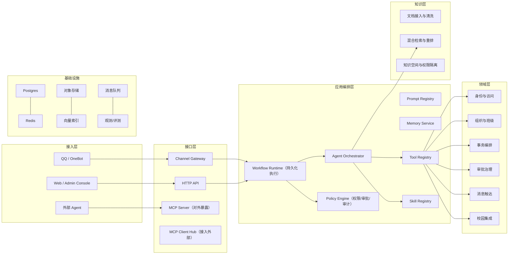

# 目标架构与技术决策

> 核验日期：2026-05-05

本文档合并原来的"目标 AI 架构蓝图"和"技术决策与工程规范"，形成一份精简的未来方向与决策参考。

## 目标定位

ClassRobot 的演进方向是：从机器人项目升级为面向校园场景的 AI 能力平台。机器人、后台、外部 Agent 共享同一套领域能力、工具协议和知识服务。

## 目标分层模型

## 演进阶段

| 阶段 | 目标 | 关键产物 |
|------|------|---------|
| Phase 1 | 领域边界显式化 | Domain Service、DTO、Repository 接口 |
| Phase 2 | Tool/Skill 统一 | Tool Registry、权限元数据、Skill 增强 |
| Phase 3 | 工作流运行时 | Durable Execution、检查点、审批流 |
| Phase 4 | 知识平面独立 | Ingestion、Retrieval、Citation、知识空间 |
| Phase 5 | MCP 双向接入 | MCP Client Hub、Remote MCP Server |
| Phase 6 | 观测与治理 | Tracing、Eval、Feedback、Admin API |

## 12 项技术决策

| # | 主题 | 决策 | 理由 |
|---|------|------|------|
| D1 | 总体形态 | 先模块化单体，按瓶颈拆服务 | 兼顾迭代速度和扩展性 |
| D2 | 工作流 | 采用 Durable Execution 运行时 | Agent 业务不是单次模型调用 |
| D3 | 模型调用 | Provider Adapter 封装，优先兼容 OpenAI 工具调用 | 避免被单一 SDK 锁死 |
| D4 | Tool 体系 | 所有执行能力统一进 Tool Registry | 便于权限、观测和复用 |
| D5 | Skill 体系 | 保留为能力说明与最佳实践层 | Skill 声明"何时用"，Tool 负责"如何执行" |
| D6 | MCP | 同时做 Client 与 Server | 既能接入外部，也能对外开放 |
| D7 | 知识体系 | RAG 独立成 Knowledge Plane | 知识问答必须可解释、可隔离、可评测 |
| D8 | 记忆体系 | 会话/画像/状态/知识分层存储 | 避免不同性质数据混在一起 |
| D9 | 安全 | 写操作经 Policy Engine，可附加审批 | Prompt 不能替代权限系统 |
| D10 | 观测 | 默认接入 tracing、cost、feedback、eval | 无可观测性就无法稳定迭代 |
| D11 | Agent 形态 | 默认单编排器 + 专家工具 | 不鼓励无约束多 Agent |
| D12 | Prompt 管理 | 版本化、可回滚、可测试 | Prompt 是运行时资产 |

## Skill、Tool、MCP、RAG 的边界

| 概念 | 主要职责 | 适合独立服务化 |
|------|---------|:---:|
| Domain | 定义业务规则和一致性边界 | 是 |
| Tool | 标准化可执行能力契约（schema/权限/超时/审计） | 是 |
| Skill | 定义能力边界、入口和最佳实践（SKILL.md + runtime） | 视情况 |
| Agent | 理解目标、做决策、调度能力 | 是 |
| RAG | 知识检索、引用、权限隔离 | 是 |
| MCP | 与外部 Agent/工具互联的协议层 | 是 |

## 当前不推荐

- 让 LLM 直接输出命令文本回放执行
- 会话状态仅存进程内存
- RAG 检索不做引用和权限隔离
- 靠 Prompt 限制高风险操作
- 在无 Tool Registry 时把任意函数暴露给 Agent
- 未建评测就大规模增加 Agent 数量

## 推荐技术基线

| 模块 | 推荐 |
|------|------|
| 入口 | NoneBot + FastAPI |
| 工作流 | LangGraph 或同等 Durable/HITL 能力运行时 |
| 模型 | Provider Adapter，优先兼容 OpenAI Responses API |
| 互联 | 内部 Tool Registry + 外部 MCP |
| 数据库 | Postgres |
| 缓存 | Redis |
| 存储 | COS / S3 兼容 |
| 向量 | pgvector 起步 |
| 知识引擎 | RAGFlow 作为首个 Provider |
| 观测 | OpenTelemetry 风格 tracing |

## 配套阅读

- [架构视图总览](./architecture-views.md) — 当前系统架构
- [Agent 工作流编排架构](./agent-workflow-orchestration.md) — 工作流设计
- [统一 AI 平台架构总纲](./unified-ai-platform-handbook.md) — 概念术语
- [迁移路线图](./migration-roadmap.md) — 阶段计划
- [软件工程流程](./software-engineering-process.md) — 工程规范
