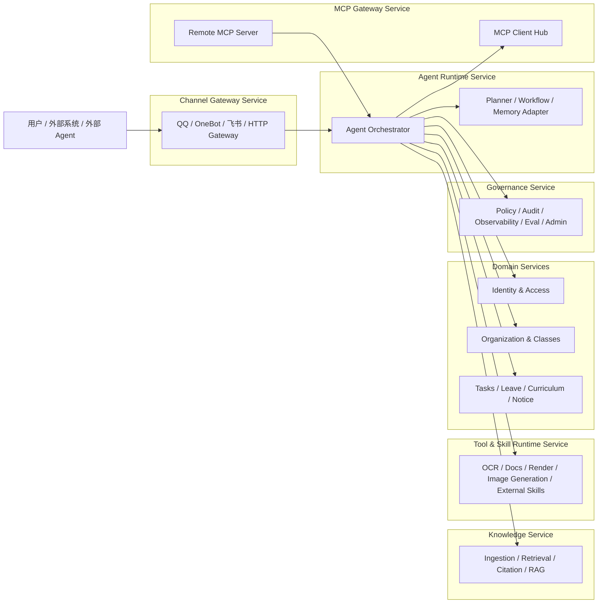

# 统一 AI 平台架构总纲

> 核验日期：2026-04-18

本文档用于把当前项目中涉及的 `Tool`、`MCP`、`Agent`、`Agent Skill`、`RAG`、业务服务、多服务部署等概念统一起来，形成一份适合阅读、讨论、继续开发和后续重构的总纲文档。

如果你现在的感觉是“概念很多、图很多、文档也越来越多，但脑子里还没有形成一个统一模型”，那么这篇文档就是为这个问题准备的。

## 文档目标

这份总纲文档解决五件事：

1. 明确系统到底是什么
2. 明确各个技术名词分别代表什么
3. 明确这些概念之间怎么协作，而不是各自孤立存在
4. 明确当前项目应该如何继续演进，而不是一边开发一边改方向
5. 明确未来如果拆成多套服务，边界应该怎么划分

## 一句话结论

ClassRobot 不应该继续被理解成“一个带 AI 的机器人插件项目”，而应该被理解成：

一个以校园场景为核心、以领域规则为基础、以 Agent 编排为中枢、以 Skill/Tool 为能力层、以 RAG 为知识平面、以 MCP 为互联协议层、并支持逐步拆成多服务运行的 AI 平台。

换句话说：

- 机器人只是入口之一
- Agent 不是全部
- Skill 不是全部
- MCP 不是全部
- RAG 不是全部
- 真正的核心是“统一架构下的能力组织方式”

## 阅读顺序建议

如果你是第一次系统性梳理这套架构，建议按下面顺序阅读：

1. 先看本文档，建立总模型
2. 再看 [当前系统架构设计](./current-system-architecture-design.md)，理解当前系统推荐架构
3. 再看 [当前系统整合图映射](./current-system-integration.md)，理解这些层目前落在哪些代码里
4. 再看 [消息处理流程](../guides/message-processing-flow.md)，理解具体链路如何流转
5. 最后再看 [目标架构蓝图](./target-ai-architecture.md)、[技术决策与工程规范](./technology-decisions.md)、[迁移路线图](./migration-roadmap.md)

## 系统定位

### 当前定位

当前仓库首先还是一个可运行的校园机器人系统，已有：

- QQ / OneBot 等渠道入口
- 用户、班级、群、任务、请假、课表等业务能力
- AI 对话与命令编排能力
- RAG 检索能力
- 文件理解能力
- 图片生成能力
- skill 自动发现与运行时绑定能力

### 未来定位

未来不应只停留在“机器人项目”，而应升级成：

- 一个统一的校园 AI 平台
- 一个统一的能力平台
- 一个统一的知识与工具平台
- 一个可被多个入口、多个系统、多个外部 Agent 共用的平台

这意味着未来可能同时存在：

- 机器人入口服务
- 飞书 Webhook 服务
- Agent Runtime 服务
- RAG / Knowledge 服务
- MCP Gateway 服务
- 后台管理与治理服务
- 若干校园业务集成服务

## 核心术语统一

这一节是最重要的部分之一。后续所有设计、开发、文档、讨论，尽量都按这套术语使用，避免同一个词在不同地方表达不同意思。

### 1. Domain / 业务域

定义：

- 稳定的业务概念、规则和一致性边界

在本项目里通常包括：

- 用户与身份
- 班级与组织关系
- 任务与作业流转
- 请假与审批
- 课表与校园信息
- 群与班级绑定关系

特点：

- 不依赖具体模型
- 不依赖具体平台
- 不应该被 Prompt 替代

一句话理解：

业务域决定“什么是对的”，Agent 只是决定“怎么理解和触发”。

### 2. Tool

定义：

- 一个运行时可调用、具有明确输入输出契约、权限、风险等级和可观测性的执行能力

Tool 关注的是：

- 能不能被调用
- 如何被调用
- 输入输出是什么
- 风险多大
- 是否需要审批
- 是否可审计

典型例子：

- 查询某个班级信息
- 提交一个任务
- 上传一个文件到 COS
- 调用 OCR
- 生成一张图片
- 读取一份文档内容

一句话理解：

Tool 是“可执行能力的标准契约”。

### 3. Skill

定义：

- 对能力边界、适用场景、使用方式、最佳实践和运行时入口的封装说明层

Skill 关注的是：

- 什么时候该用这个能力
- 这个能力适合处理什么问题
- 最推荐的调用姿势是什么
- 运行时入口应该走哪里

它通常由两部分组成：

- `SKILL.md`
  - AI / 开发者可读说明
- `runtime.py`
  - Python 运行时绑定

在本项目里，Skill 已经是一等公民。

当前已落地的典型 Skill：

- `document-to-image`
- `ocr`
- `qr-code`
- `markdown-to-image`
- `image-generation`

一句话理解：

Skill 是“能力说明层 + 项目内可复用入口”，它不等于 Tool，但常常会绑定一个或多个 Tool 或 Runtime。

### 4. Agent

定义：

- 负责理解目标、组织上下文、做决策、调用 Tool / Skill、整合结果的智能编排单元

Agent 关注的是：

- 用户到底想做什么
- 应该调用哪个能力
- 调用顺序是什么
- 是否需要补上下文
- 是否需要 RAG
- 是否需要多模态
- 最终如何组织回复

当前项目里的典型 Agent：

- `SummaryAgent`
- `ExtractAgent`
- `RagAgent`
- `AutoTaskAgent`
- `VisionAgent`
- `FileAgent`

一句话理解：

Agent 是“决策者和编排者”，不是“所有能力的集合体”。

### 5. Agent Skill

定义：

- 专门为 Agent 设计、并被 Agent 稳定调用的 Skill

它和普通 Skill 的区别不是技术形态，而是使用场景：

- 普通 Skill 可能既可以被命令入口调用，也可以被业务代码调用
- Agent Skill 更强调“供 Agent 理解和调用”

在当前项目里，很多 Skill 已经具备 Agent Skill 的雏形，例如：

- `document-to-image`
  - 已被文件理解链路复用
- `image-generation`
  - 已被命令层复用，未来也适合被生图 Agent 复用

未来更典型的 Agent Skill 会是：

- `document-reader`
- `document-formatter`
- `poster-designer`
- `external-skill`
- `rag-skill`

一句话理解：

Agent Skill 是“更偏向 Agent 消费的 Skill”。

### 6. RAG

定义：

- 检索增强生成能力，由知识接入、索引、检索、重排、引用和权限隔离组成

RAG 不等于“查文档 + 拼 Prompt”。

一个完整 RAG 至少包含：

- 文档接入
- 切块与元数据
- 检索
- 重排
- 引用
- 权限过滤
- 结果回溯

当前项目的 RAG 更接近：

- `RagAgent`
- `utils/llm/agents/ragflow/`
- 外部 RagFlow 服务

一句话理解：

RAG 是“知识平面”，不应该只是聊天附件。

### 7. MCP

定义：

- 一种标准化的 Agent 互联协议层，用于消费外部能力，也用于对外暴露本系统能力

MCP 有两种典型角色：

#### 作为 Client

用于接外部能力，例如：

- 搜索
- 浏览器
- 文档系统
- 校园系统连接器
- 代码工具

#### 作为 Server

用于把本系统能力暴露出去，例如：

- 只读班级查询
- 只读知识访问
- 工具目录
- 受控写操作入口

一句话理解：

MCP 是“互联协议层”，不是业务层，也不是 Agent 本身。

### 8. Workflow / 工作流

定义：

- 把一个复杂请求拆成多个节点，并支持状态、恢复、审批、重试和异步继续执行的运行模型

什么时候需要 Workflow：

- 长流程
- 审批流
- 异步任务
- 多阶段生成
- 外部系统回调
- 知识入库

一句话理解：

Workflow 是“复杂请求的骨架”，Agent 是“骨架中的智能节点”。

## 这些概念之间的关系

下面是最容易混乱、但也最需要统一的一张关系表。

| 概念 | 主要职责 | 是否直接执行业务 | 是否面向 AI | 是否适合独立服务化 |
| --- | --- | --- | --- | --- |
| Domain | 定义业务规则和一致性边界 | 是 | 否 | 是 |
| Tool | 提供标准化可执行能力契约 | 是 | 间接 | 是 |
| Skill | 定义能力边界、入口和最佳实践 | 间接 | 是 | 视情况 |
| Agent | 理解目标、做决策、调度能力 | 否 | 是 | 是 |
| Agent Skill | 专供 Agent 消费的 Skill | 间接 | 是 | 视情况 |
| RAG | 提供知识检索与引用能力 | 否 | 是 | 是 |
| MCP | 负责与外部 Agent/工具互联 | 否 | 是 | 是 |
| Workflow | 负责复杂流程状态机与执行骨架 | 否 | 间接 | 是 |

## 最关键的边界判断

### 什么时候做 Domain，而不是 Agent？

如果一个能力具备下面特征，优先放到 Domain：

- 有稳定业务规则
- 会改业务数据
- 有权限语义
- 有一致性要求
- 不希望因为模型变化而行为漂移

例如：

- 创建任务
- 查询班级
- 提交请假
- 绑定用户

### 什么时候做 Tool，而不是 Skill？

如果重点是“执行契约”和“运行控制”，优先做 Tool：

- 需要明确 schema
- 需要权限等级
- 需要风险等级
- 需要审计
- 需要重试/超时/观测

### 什么时候做 Skill，而不是 Tool？

如果重点是“能力边界”和“复用入口”，优先做 Skill：

- 需要告诉 Agent/开发者什么时候用
- 需要定义最佳实践
- 需要把底层实现统一成一个项目内入口
- 需要让命令入口和 Agent 共用

### 什么时候做 Agent，而不是 Skill？

如果重点是“决策、规划、调度”，优先做 Agent：

- 需要先判断用户意图
- 需要选择多个能力中的一个或多个
- 需要扩写 Prompt
- 需要组织多个步骤
- 需要根据上下文改变策略

### 什么时候做 MCP，而不是普通 API？

如果目标是“让外部 Agent 标准化消费/暴露能力”，优先考虑 MCP：

- 需要被外部 Agent 调用
- 需要和其他 Agent 平台互联
- 需要统一 tools/prompts/resources 的开放方式

### 什么时候做 RAG，而不是普通查询？

如果问题依赖的是“文档知识”而不是“业务结构化数据”，优先走 RAG：

- 文件制度问答
- 校规校纪问答
- 非结构化知识说明

如果是强结构化、强事务语义的数据，优先仍走 Domain Query，不要强行套 RAG。

## 推荐的统一分层模型

为了让这些概念真的能共存而不打架，推荐把系统统一理解成七层。

### 第 1 层：入口层

职责：

- 接收外部平台消息、Webhook、文件、回调

典型形态：

- NoneBot
- FastAPI Gateway
- 飞书 Webhook
- 后台 API

### 第 2 层：上下文与策略层

职责：

- 会话识别
- 身份绑定
- 权限判断
- 能力边界控制

### 第 3 层：编排层

职责：

- Agent 调度
- Workflow 运行
- Planner 决策
- 结果组装

### 第 4 层：能力层

职责：

- Tool
- Skill
- Agent Skill
- 领域服务入口

### 第 5 层：知识层

职责：

- RAG
- 知识接入
- 检索
- 引用
- 权限隔离

### 第 6 层：业务层

职责：

- 用户、班级、任务、请假、课表等稳定业务规则

### 第 7 层：基础设施层

职责：

- 模型、数据库、缓存、对象存储、队列、外部 API、向量索引、观测与评测

## 当前项目在这套模型中的位置

### 当前已经有的部分

- 入口层
  - `src/plugins/`
  - `src/others/`
- 上下文与策略层
  - `utils/session/`
  - `utils/models/depends.py`
  - `utils/helper/depends.py`
- 编排层
  - `src/plugins/autogpt/`
  - `utils/llm/agents/`
- 能力层
  - `skills/`
  - `utils/skills/`
- 知识层
  - `RagAgent + RagFlow`
- 业务层
  - `src/managers/`
  - 多个业务插件
- 基础设施层
  - `utils/models/`
  - `utils/tools/`
  - `utils/llm/`

### 当前还不完整的部分

- 真正统一的 Tool Registry
- 显式的 Planner 模块
- 持久化 Memory Service
- 独立 Knowledge Service
- MCP Client Hub / MCP Server
- 外部系统互联的标准化 Skill/Tool
- 多服务部署形态下的运行边界

## 推荐的系统总体形态

### 当前阶段

当前最推荐的总体形态是：

模块化单体 + 显式边界 + Skill 驱动扩展

原因：

- 当前项目已经有业务能力积累，不能为了架构而打断交付
- 现在最需要的是统一边界，而不是立刻分布式化
- 很多概念问题本质上是“职责混写”，不是“服务拆得不够多”

### 下一阶段

当前边界清晰后，系统可以逐步演进为：

模块化单体 + 若干独立服务

典型拆法不是按“代码目录”拆，而是按“运行职责”拆。

## 推荐的服务拆分思路

当系统未来不只是一套服务时，推荐优先拆成下面几类服务，而不是随意按功能名拆。

### 1. Channel Gateway Service

职责：

- 机器人入口
- 飞书 Webhook
- 外部消息标准化
- 文件下载与回发

特点：

- 强入口属性
- 不承载复杂业务规则

### 2. Agent Runtime Service

职责：

- Agent 编排
- Planner
- Workflow
- Session / Memory 协调

特点：

- 是智能处理中枢
- 不直接承担平台适配细节

### 3. Knowledge Service

职责：

- 文档接入
- 知识切块
- 检索
- 重排
- 引用

特点：

- 可单独扩缩容
- 与聊天入口解耦

### 4. Tool / Skill Runtime Service

职责：

- OCR
- 文档转图
- 生图
- 渲染
- 外部系统自动化

特点：

- 更偏执行器
- 适合隔离重依赖

### 5. Domain Service

职责：

- 用户与身份
- 班级与组织
- 任务与请假
- 课表与校园能力

特点：

- 稳定规则中心
- 最终写操作应尽量落到这里

### 6. MCP Gateway Service

职责：

- 消费外部 MCP
- 对外暴露本系统 MCP
- 管理开放能力和授权范围

### 7. Admin / Governance Service

职责：

- 后台管理
- 观测与追踪
- Prompt/Tool/Skill/Workflow 治理
- 审批与审计

## 多服务形态下的推荐关系

## 当前最值得坚持的原则

### 原则 1：业务优先于 AI

AI 不应替代业务规则。

### 原则 2：Agent 是中枢，不是大杂烩

Agent 主要做判断、规划、调度，不应该把所有执行逻辑都吞进去。

### 原则 3：Skill 是能力边界，不是临时函数包装

只要一个能力会被复用，就优先考虑收敛成 Skill。

### 原则 4：Tool 是执行契约，不是任意函数暴露

只要一个能力要被系统稳定调用，就应该逐步进入 Tool Registry。

### 原则 5：RAG 是知识平面，不是聊天补丁

知识链路要独立治理，不要继续混在普通会话拼接里。

### 原则 6：MCP 是互联协议层，不是系统中心

MCP 很重要，但它是“协议层”，不应该替代业务层、Agent 层或 Skill 层。

### 原则 7：先统一边界，再拆服务

没有边界的拆服务，只会把混乱扩大。

## 当前项目的推荐开发规范

### 新需求进入时的判断顺序

建议每次新需求都按下面问题来判断：

1. 这是不是一个稳定业务规则？
   - 是：先看 Domain
2. 这是不是一个可复用执行能力？
   - 是：先看 Tool / Skill
3. 这是不是一个需要 Agent 规划和调度的问题？
   - 是：放到 Agent / Workflow
4. 这是不是一个知识问题？
   - 是：放到 RAG / Knowledge Plane
5. 这是不是一个对外互联问题？
   - 是：看 MCP / External Skill / Integration Layer

### 推荐放置规则

- 平台入口逻辑
  - 放接入层
- 权限与用户绑定
  - 放上下文与策略层
- 自然语言决策
  - 放 Agent / Workflow
- 可复用能力
  - 放 Skill / Tool
- 稳定业务规则
  - 放 Domain
- 第三方 SDK 接入
  - 放基础设施层

## 未来文档建议如何使用

从现在开始，建议把文档分成四类，不再混写：

### 1. 总纲类

回答：

- 整个系统是什么
- 各概念关系是什么

对应文档：

- 本文档

### 2. 当前架构类

回答：

- 当前系统怎么分层
- 当前代码落在哪

对应文档：

- `current-system-architecture-design.md`
- `current-system-integration.md`

### 3. 目标与决策类

回答：

- 未来目标是什么
- 技术上为什么这样选

对应文档：

- `target-ai-architecture.md`
- `technology-decisions.md`

### 4. 落地推进类

回答：

- 应该按什么顺序做
- 工程流程怎么跑

对应文档：

- `migration-roadmap.md`
- `software-engineering-process.md`

## 最终建议

如果只用一句话概括未来开发方式，推荐采用下面这个总原则：

把 ClassRobot 从“功能驱动的机器人项目”，升级成“以业务域为基础、以 Agent 为中枢、以 Skill/Tool 为能力层、以 RAG 为知识平面、以 MCP 为协议互联层、支持逐步多服务化部署”的统一 AI 平台。

进一步拆开来说：

- 业务规则继续下沉到业务层
- AI 相关复杂决策统一上收至 Agent / Workflow
- 可复用能力继续 skill 化，并逐步 tool 化
- 知识能力独立成 Knowledge Plane
- 对外互联统一收敛到 MCP 与 Integration Layer
- 只有当边界清楚后，再按职责拆成多套服务运行

这会比“哪里需要就往哪里堆功能”稳定得多，也比“先拆成很多服务再说”更适合你当前项目阶段。

## 配合阅读

- 当前系统架构设计：`docs/architecture/current-system-architecture-design.md`
- 当前系统整合图映射：`docs/architecture/current-system-integration.md`
- 目标 AI 架构蓝图：`docs/architecture/target-ai-architecture.md`
- 技术决策与工程规范：`docs/architecture/technology-decisions.md`
- 迁移路线图：`docs/architecture/migration-roadmap.md`
- 软件工程流程方案：`docs/architecture/software-engineering-process.md`
