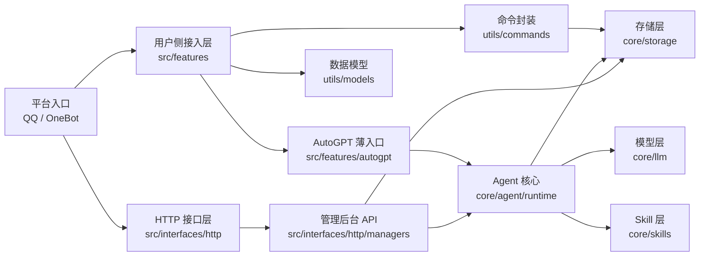

# 项目结构说明

## 一眼看懂项目

如果你想看更完整的系统设计图，而不只是目录结构，可以继续阅读 [架构视图总览](../architecture/architecture-views.md)。

## 顶层目录

- `src/`: 接入层，只放 NoneBot 用户侧功能入口与 HTTP 接口入口。
- `core/`: 核心能力层，承载 Agent、LLM、Skill、Storage 等系统级能力。
- `utils/`: 项目通用工具层，保留配置、ORM 模型、命令封装、角色、消息发送等共享能力。
- `resources/`: 非源码运行资源，例如 prompts、HTML 模板、Agent 编排配置和 OCR 模型。
- `tests/`: 单元测试、nonebug 命令测试、管理端 API 测试和 Agent 回归测试。
- `docs/`: 使用、架构和开发文档。
- `website/`: Web 前端资源，`website/managers/` 是本地管理后台前端。

## src 下的约定

- `src/features/`: 用户侧 NoneBot 功能入口，包含命令 matcher、事件入口、权限边界和轻量参数接线。
- `src/interfaces/http/`: HTTP 接口入口，负责挂载本地管理后台 API。
- `src/interfaces/http/managers/`: 管理后台 API 唯一实现目录，承载 `/api/v1/manager/*`。

`src/features` 中的功能模块应该保持“薄入口”：命令声明、事件接入和返回用户消息可以放在这里，复杂业务规则应下沉到 `core` 或明确的 service 模块。

## core 下的约定

- `core/agent/`: Agent 类、工具调用 Agent、运行时编排图和 AutoGPT 消息处理流水线。
- `core/llm/`: LLM 配置、网关、消息结构、模型调用和工具类型。
- `core/skills/`: Agent Skill 的标准入口、运行时注册表和内置 skill 代码。
- `resources/skills/`: Skill 的资源定义文件，例如 `SKILL.md`。
- `core/storage/`: 文件空间、聊天记录、本地 RAG 和存储隔离规则。

新增 Agent、模型调用、Skill 或存储能力时，优先放在 `core` 对应子包；不要把核心能力塞回 `src/features`。

## utils 下的约定

- `utils/config.py`: 全局配置和路径入口。
- `utils/models/`: ORM 模型与数据库相关依赖。
- `utils/commands/`: 命令统一注册、Helper 绑定、AgentCommandAdapter 和结构化执行上下文。
- `utils/helper/`: 帮助系统与参数抽象。
- `utils/roles/`: 用户身份与权限枚举。
- `utils/tools/`: OCR、文档转图、COS 等底层工具能力。
- `utils/template/`: 渲染 prompt 和 HTML 模板的统一入口。

`utils` 不再承载 LLM、Storage、Skill 的兼容门面；这些能力统一从 `core` 导入。

## Agent Skill 目录约定

- `resources/skills/<name>/SKILL.md`: AI 可读的 skill 元数据与使用说明。
- `core/skills/builtin/<name>/runtime.py`: 可选的 skill 运行时入口，存在时可被自动加载。
- `core/skills/registry.py`: 支持目录自动加载和手动注册。

目前已经拆分的内置能力包括：

- `document-to-image`
- `image-generation`
- `markdown-to-image`
- `ocr`
- `qr-code`

## 放置建议

- 新增用户命令：放在 `src/features/<feature>/commands.py`，共享逻辑放同目录 service 或更底层的 `core`。
- 新增管理端接口：放在 `src/interfaces/http/managers/api/` 和对应领域子包中。
- 新增 Agent 编排能力：放在 `core/agent/runtime`，并更新对应 Agent 文档和测试。
- 新增 Skill：资源放在 `resources/skills/<name>/`，代码放在 `core/skills/builtin/<name>/runtime.py`。
- 新增存储能力：放在 `core/storage`，同时补充路径逃逸、归属隔离和删除语义测试。

推荐做法：

- 先按层放置代码，再决定是否需要新增子目录。
- `src/features` 保持薄入口，`core` 保持高内聚核心能力。
- 文档中的代码路径使用仓库相对路径，不写本机绝对路径。
