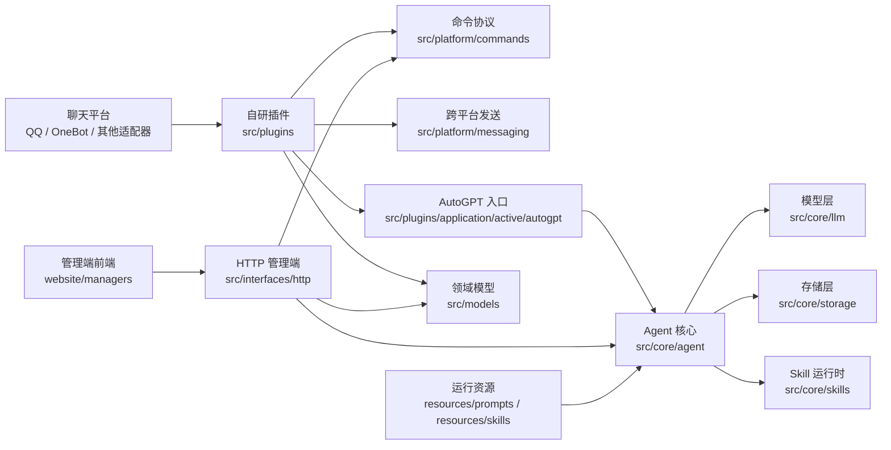

# 项目结构说明

ClassRobot 采用“单一 `src` 代码根 + 顶层资源/文档/前端”的结构。开发时先判断代码属于插件、平台协议、核心能力、接口、模型还是轻量工具，再决定落点。

## 一眼看懂项目

## 顶层目录

- `src/`: 项目自研 Python 代码唯一入口。
- `resources/`: Prompt、Skill manifest、HTML 模板、静态资源等非源码运行资源。
- `tests/`: 单元测试、nonebug 命令测试、管理端 API 测试和 Agent 回归测试。
- `docs/`: 使用、架构和开发文档。
- `website/`: Web 前端资源，`website/managers/` 是管理后台前端。
- `migrations/`: ORM / Alembic 迁移相关文件。

## src 下的约定

- `src/plugins/`: ClassRobot 自研 NoneBot 插件。用户侧命令在 `application/active`，消息采集这类能力插件在 `library`。
- `src/platform/`: 命令、帮助、会话、跨平台发送等运行协议层。
- `src/core/`: Agent、LLM、Storage、Cache、Auth、Skills 等不依赖具体平台事件的核心能力。
- `src/interfaces/`: HTTP、管理端和外部接口。
- `src/models/`: ORM 模型、领域实体和数据库依赖。
- `src/shared/`: 加密、模板、OCR、vendored 包等轻量通用工具。

更多放置规则看 [src/README.md](../../src/README.md)。

## 常见放置建议

- 新增用户命令：放在 `src/plugins/application/active/<feature>/commands.py`，业务逻辑放同插件的 service 模块或更底层核心服务。
- 新增消息采集、身份解析、上下文注入能力：放在 `src/plugins/library/<name>`。
- 新增命令封装、Helper、Agent 命令适配：放在 `src/platform/commands` 或 `src/platform/helper`。
- 新增跨平台发送能力：放在 `src/platform/messaging`。
- 新增 Agent 编排能力：放在 `src/core/agent`，并更新 Agent 文档和 `tests/autogpt`。
- 新增 Skill：资源放在 `resources/skills/<name>/`，代码放在 `src/core/skills/builtin/<name>/runtime.py`。
- 新增存储能力：放在 `src/core/storage`，同步补充路径逃逸、归属隔离和删除语义测试。

## 已移除的旧入口

`core/`、`utils/`、`src/features/` 已经不是业务入口。旧文档或旧提交中的路径可按下面理解：

| 旧路径 | 新路径 |
| --- | --- |
| `core/*` | `src/core/*` |
| `utils.commands` | `src.platform.commands` |
| `utils.models` | `src.models` |
| `utils.roles` | `src.core.auth` |
| `utils.cache` | `src.core.cache` |
| `src/features/*` | `src/plugins/application/active/*` 或 `src/plugins/library/*` |

新代码不要新增兼容 alias，也不要继续从旧路径导入。
