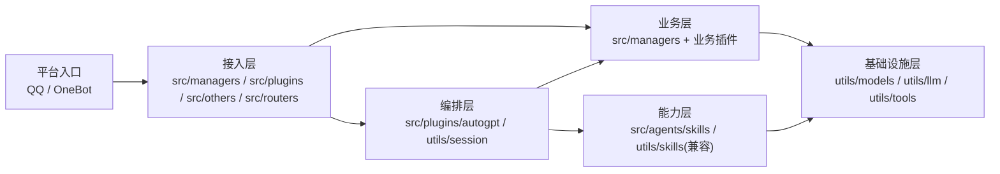

# 项目结构说明

## 一眼看懂项目

如果你想看更完整的系统设计图，而不只是目录结构，可以继续阅读 [架构视图总览](../architecture/architecture-views.md)。

## 顶层目录

- `src/`: NoneBot 插件与路由
- `utils/`: 跨插件共享的配置、模型、会话、LLM 和工具
- `resources/`: 非源码运行资源，例如 prompts、HTML 模板和 OCR 模型
- `scripts/`: 仓库级辅助脚本
- `migrations/`: 数据库迁移
- `docs/`: 使用和开发文档

## src 下的约定

- `src/managers/`: 班级、用户、权限等管理能力
- `src/plugins/`: 面向最终功能的主要插件
- `src/others/`: 额外实验性或外部集成能力
- `src/routers/`: 路由或路径相关模块

## utils 下的约定

- `config.py`: 全局配置和路径入口
- `models/`: ORM 模型与依赖
- `helper/`: 帮助系统与参数抽象
- `llm/`: 大模型客户端、消息结构和 Agent 能力
- `utils/skills/`: 兼容旧导入路径的门面层，实际实现已迁到 `src/agents/skills/`
- `tools/`: OCR、文档转图、COS 等工具能力
- `template/`: 渲染 prompt 和 HTML 模板的统一入口

## Agent Skill 目录约定

- `src/agents/skills/builtin/<name>/SKILL.md`: AI 可读的 skill 元数据与使用说明
- `src/agents/skills/builtin/<name>/runtime.py`: 可选的 skill 运行时入口，存在时可被自动加载
- 目前已经拆分的能力包括：
  - `document-to-image`
  - `ocr`
  - `qr-code`
  - `markdown-to-image`
- `src/agents/skills/` 负责定义能力边界、运行时发现与调用
- `utils/skills/` 保留为兼容层，避免历史插件导入路径立刻失效
- `src/agents/skills/registry.py` 同时支持目录自动加载和手动注册两种模式
- `utils/tools/` 继续承载底层实现细节，例如 OCR 模型、Office 转图、二维码库封装等

## 当前整理原则

- 源码和资源文件分离，避免模型和模板散落在代码目录里
- 能力边界优先以 skill 表达，再决定底层代码落在 `utils/tools/` 还是其他共享模块
- 明显拼写错误直接收敛到统一命名，避免同义目录和文件长期并存
- 优先做低风险收敛，再考虑后续把 `utils/` 进一步拆成更清晰的领域模块
- 平台消息如何流经权限、流水线、Agent 与数据库，统一参考 [消息处理流程](../guides/message-processing-flow.md)

## 面向总架构图的放置建议

如果后续按“接入层 -> Agent 核心层 -> Skill 层 -> 数据基础设施层”继续扩展，建议遵循下面的放置方式：

- 接入层
  - 当前优先放在 `src/plugins/`、`src/others/`、`src/routers/`
  - 未来如果引入 FastAPI，可逐步收敛到独立 `gateway/`、`interfaces/` 或 `src/routers/http/`
- Agent 核心层
  - 当前优先放在 `src/plugins/autogpt/`、`src/agents/`、`utils/llm/agents/`、`utils/session/`
  - 例如消息流水线、Planner、记忆层、上下文编排
- Skill 层
  - 内置 skill 放在 `src/agents/skills/builtin/`
  - 运行时注册与绑定放在 `src/agents/skills/`
  - `utils/skills/` 仅作为兼容出口保留
  - 底层可复用实现仍放在 `utils/tools/` 或其他基础设施模块
- 数据与基础设施层
  - ORM 与业务数据放在 `utils/models/`
  - 知识检索接入放在 `utils/llm/agents/ragflow/`
  - 对象存储、OCR、文档处理等放在 `utils/tools/`

推荐做法：

- 先按层放置代码，再决定是否要新增目录名
- 优先保证职责边界正确，不要一开始就为了“看起来高级”做大规模目录迁移
- 未来如果代码量继续增长，再把这些边界从“约定”升级成更显式的目录结构
