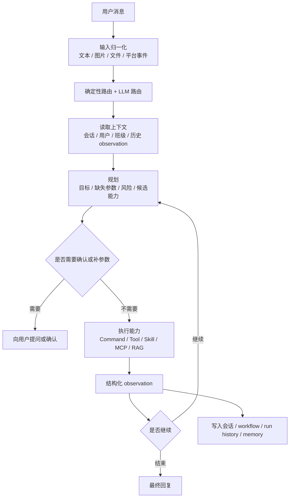
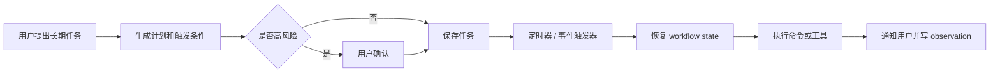

# Agent 工程化研发手册

> 核验日期：2026-05-05

本文档用于指导 ClassRobot 后续所有 AI Agent 能力开发，包括 `agent`、function tools、workflow、skill、MCP、RAG、长期记忆、会话压缩、提示词和 NoneBot2 集成。

它不是再解释一遍当前 AutoGPT 代码，而是回答一个更实用的问题：

> 以后我们继续把机器人做得更智能时，每种能力应该放在哪里、怎么设计、怎么测试、怎么避免 LLM 乱猜。

## 外部实践摘要

这轮设计参考了当前主流 agent 系统的公开资料，但不会把它们的名字、目录或产品概念硬塞进项目。ClassRobot 学的是工程方法，不是复制产品形态。

| 来源 | 值得借鉴的点 | 在 ClassRobot 中的落点 |
| --- | --- | --- |
| Claude Code | 能读项目上下文、制定计划、调用工具、验证结果；通过 memory、subagent、hooks、MCP 扩展工作流 | 让 AutoGPT 成为“上下文 + 计划 + 工具 + 观察 + 验证”的闭环，而不是一次性命令生成器 |
| MCP | Host / Client / Server 分层，工具、资源、提示词三类 primitive，能力发现和权限边界清晰 | 后续外部系统接入优先走 MCP 网关，内部业务命令仍留在统一 Command 体系 |
| OpenClaw | workspace、skills、长期记忆、后台运行、可持续任务、工具使用和消息入口结合 | 学习“持久上下文 + 技能说明 + 心跳任务”的组织方式，但不引入无关部署和第三方实现细节 |
| LangGraph | durable execution、checkpoint、interrupt、human-in-the-loop、可恢复状态图 | 对长任务、审批任务和定时任务逐步补检查点与恢复能力 |

参考资料：

- [Claude Code overview](https://docs.anthropic.com/en/docs/claude-code/overview)
- [Claude Code memory](https://docs.anthropic.com/en/docs/claude-code/memory)
- [Claude Code subagents](https://docs.anthropic.com/en/docs/claude-code/sub-agents)
- [Claude Code hooks](https://docs.anthropic.com/en/docs/claude-code/hooks)
- [Claude Code MCP](https://docs.anthropic.com/en/docs/claude-code/mcp)
- [MCP architecture overview](https://modelcontextprotocol.io/docs/learn)
- [MCP server concepts](https://modelcontextprotocol.io/docs/learn/server-concepts)
- [OpenClaw gateway architecture](https://docs.openclaw.ai/concepts/architecture)
- [OpenClaw agent runtime](https://docs.openclaw.ai/concepts/agent)
- [OpenClaw agent loop](https://docs.openclaw.ai/concepts/agent-loop)
- [OpenClaw memory](https://docs.openclaw.ai/concepts/memory)
- [OpenClaw skills](https://docs.openclaw.ai/skills)
- [LangGraph overview](https://docs.langchain.com/oss/python/langgraph)
- [LangGraph durable execution](https://docs.langchain.com/oss/python/langgraph/durable-execution)
- [LangGraph interrupts](https://docs.langchain.com/oss/python/langgraph/interrupts)

## ClassRobot 的 Agent 定位

ClassRobot 的智能体不是一个绕过系统权限、直接改数据库的万能入口。它应该是校园机器人场景下的智能编排层：

1. 理解用户消息，包括文本、图片、文件和上下文。
2. 判断任务类型：聊天、问答、查询、写操作、复杂工作流、长期任务或多模态任务。
3. 找到项目中已有的命令、服务、tool、skill、RAG 或 MCP 能力。
4. 把必要结果作为 observation 写回上下文。
5. 在需要时继续规划、确认、执行或等待。
6. 用用户能理解的话给出最终结果。

核心边界：

- `src.plugins.autogpt` 是用户侧自然语言智能入口，后续优先在这里增强。
- `utils.llm.agents` 是轻量 agent 基础模块，适合放通用 agent、tool calling、模型路由、会话压缩和可复用执行循环。
- 业务写操作优先通过 `src.commands`、领域 service 和现有 NoneBot matcher 执行。
- Agent 可以组织命令，但不能把命令层已有的权限、参数校验、审计和业务规则写进 prompt 里凑合。

## 推荐运行闭环

现代 agent 的关键不是“模型多聪明”，而是运行时能否形成稳定闭环。



这个闭环在代码里要体现为明确对象，而不是靠一段大 prompt 让模型自由发挥。每个阶段都应该能单独测试、单独降级、单独打日志。

## 能力放置规则

后续新增智能能力时，先按下面规则选择位置。

| 能力类型 | 适用场景 | 推荐位置 | 关键约束 |
| --- | --- | --- | --- |
| Domain Service | 稳定业务规则，例如班级、任务、请假、课表 | `src/managers/*`、`src/plugins/*/services.py` | 不依赖 LLM，不写 prompt |
| Command | 用户可直接触发的业务能力 | `src/commands` + 插件 matcher | 元数据必须进入统一命令注册表 |
| Function Tool | Agent 可调用的结构化函数 | `utils/llm/agents/tool.py` 或 AutoGPT tool catalog | 必须有 typed schema、风险等级、可观测结果 |
| Skill | 可复用的能力说明和运行时封装 | `src/agents/skills/` | 必须有 `SKILL.md`，说明触发条件和边界 |
| MCP Server | 外部系统、跨应用工具、标准协议集成 | 后续 `src/agents/mcp/` 或独立服务 | 不让 MCP server 读取完整会话，Host 控制上下文和权限 |
| RAG | 校园制度、文档、知识库、FAQ 检索 | `utils/llm/agents/ragflow/` 或知识服务 | 只在需要知识检索时调用，配置缺失必须降级 |
| Workflow | 多步、有状态、可恢复任务 | `src/plugins/autogpt/workflow.py` 及后续 workflow engine | 每步要有状态、输入输出、失败策略 |
| Prompt | 语义理解、规划、回复组织 | `resources/prompts/` | 单 prompt 单职责，必须有结构化输出约束 |
| Scheduled Task | 定时提醒、长期跟踪、会话心跳 | 任务/通知插件 + workflow checkpoint | 触发器和业务执行分离 |
| Memory | 长期偏好、稳定事实、项目经验 | 后续 memory store 或文件化 memory | 只保存稳定有用信息，敏感内容要受控 |

## 工作流类型

用户消息进入系统后，不应该都走同一种重链路。

| 消息类型 | 示例 | 推荐工作流 |
| --- | --- | --- |
| 普通聊天 | `写一个 Python 九九乘法表` | 直接回复，必要时用轻量模型，不调用命令 |
| 本地状态查询 | `我是不是管理员`、`我在哪个班级` | 优先确定性路由到用户/班级命令，读取结果后再组织回复 |
| 短期命令 | `帮我查今天课表` | 规划到单个 Command，执行后把返回消息写入上下文 |
| 多步业务任务 | `给一班创建作业并明天提醒我` | 生成显式 workflow，逐步执行，必要时确认 |
| 长期任务 | `明天早上提醒我收作业` | 创建持久化计划和定时触发器，到点恢复上下文执行 |
| 多模态任务 | 图片、文件、截图 | 先让视觉/文件能力理解内容，再决定聊天、RAG 或命令 |
| 知识问答 | `学校请假制度是什么` | 按需 RAG，引用知识来源，失败时给出降级说明 |
| 外部集成 | 查外部系统、同步数据 | 优先封装为 Tool 或 MCP，权限和凭证不进 prompt |

## 确定性逻辑优先

Agent 里最容易出问题的地方，是把本来可以确定处理的逻辑交给 LLM 猜。

必须写成代码规则的内容：

- 用户身份、角色、权限、是否管理员。
- 命令是否存在、是否启用、当前用户是否可调用。
- 工具风险等级、是否需要确认。
- RAG URL、模型 URL、COS 配置等环境变量合法性。
- 最大工具调用次数、超时、重试、失败降级。
- 图片、文件、空消息、平台事件的输入归一化。
- 明确的短语映射，例如“我的信息”“我是不是管理员”“我在哪个班级”。

可以交给 LLM 的内容：

- 用户自然语言意图归类。
- 缺失参数的自然语言追问。
- 多步任务的初步计划。
- 工具返回结果的用户友好表达。
- 长内容总结、会话压缩、知识问答组织。

经验规则：

> LLM 负责语义弹性，代码负责系统边界。

## Tool Observation 规范

调用工具或命令后，结果必须进入聊天上下文。不能只把命令重新投递出去，也不能只把命令输出发给用户后丢掉。

推荐所有 Agent 工具统一返回下面这种语义对象：

```text
ToolObservation
  status: success | failed | skipped | waiting_confirmation
  tool_name: string
  display_text: 给用户看的结果
  context_summary: 给后续 LLM 使用的简短事实
  raw_result: 可选结构化结果
  artifacts: 图片、文件、链接等产物
  error_code: 可选错误码
  next_actions: 建议下一步
  risk_level: low | medium | high
```

写回规则：

- `display_text` 可以发给用户。
- `context_summary` 必须进入会话历史或 workflow observation。
- `raw_result` 用于审计和调试，不默认塞进 prompt。
- 错误也要写 observation，让下一轮能知道刚才失败在哪里。
- 对用户显式命令和 Agent 调命令，都应尽量走同一个 observation 写回通道。

## Prompt 设计规则

Prompt 是工程资产，不是随手写的长文本。后续所有 prompt 都应该放在 `resources/prompts/` 或对应模块旁，并遵守下面规则。

| Prompt | 责任 | 禁止事项 |
| --- | --- | --- |
| `intent_route` | 判断消息类型和是否需要能力调用 | 不生成业务命令参数细节 |
| `extract` | 抽取稳定事实、上下文、缺失信息 | 不自行决定执行 |
| `agent_plan` | 生成目标、步骤、风险和候选能力 | 不编造不存在的命令 |
| `auto_task` | 把计划转换成可执行任务 | 不绕过权限或确认 |
| `final_reply` | 汇总 observation 并回复用户 | 不暴露内部思考链 |
| `summary` | 压缩会话 | 不丢弃未完成任务、确认状态和关键事实 |
| `memory` | 提炼长期记忆 | 不保存临时闲聊和敏感凭证 |

每个 prompt 至少要写清楚：

- 输入字段是什么。
- 输出 JSON schema 是什么。
- 哪些情况必须返回空任务或需要确认。
- 不能问用户哪些无关问题。
- 工具结果已经在上下文中时，应该直接基于结果回复。
- 不确定时如何降级，而不是编造。

## 用户可见进度反馈

用户需要知道系统在处理，但不需要看到内部管线噪声。

适合发送的反馈：

- `我在查你的班级信息。`
- `我需要先确认一下这个操作会修改班级数据。`
- `我在读取图片内容。`
- `我已经创建提醒，到时间会继续处理。`

不适合发送的反馈：

- `正在执行 IntentRouteNode。`
- `正在进入 PlannerNode。`
- `正在校验 JSON。`
- `正在 dispatch command。`

规则：

- 普通聊天不发阶段提示。
- 单步查询通常只发最终结果。
- 超过 2 秒的外部请求、文件解析、RAG、长任务可以发一条简短提示。
- 高风险写操作必须让用户看到操作摘要和确认按钮或确认话术。
- 阶段提示要服务用户理解，不展示内部实现。

## Memory 与压缩

ClassRobot 后续记忆应分层，而不是把所有历史都塞进一个 messages 列表。

| 记忆层 | 内容 | 生命周期 |
| --- | --- | --- |
| Turn State | 当前消息、当前计划、当前工具结果 | 单轮 |
| Session Memory | 最近聊天、短期上下文、待确认任务 | 会话级 |
| Workflow State | 多步任务状态、检查点、已完成 observation | 直到任务结束或取消 |
| User Memory | 用户长期偏好、常用班级、稳定身份事实 | 长期 |
| Project Memory | 项目开发规则、工具约定、prompt 经验 | 长期 |
| Knowledge Base | 学校制度、文档、FAQ、课程资料 | 长期，走 RAG |

压缩规则：

- 压缩前先提取未完成任务、用户确认状态和最近 observation。
- 压缩摘要必须区分“事实”“用户偏好”“待办”“工具结果”。
- 不把 API key、token、cookie、私密路径写入长期记忆。
- 对业务数据优先存 ID 和摘要，不存过长原文。

## Skill 与 MCP 接入规则

Skill 适合教 Agent “什么时候、怎么使用某类能力”。MCP 适合把外部能力用标准协议暴露给 Agent。

优先写 Skill 的场景：

- 能力已经在项目内部存在，只需要让 Agent 更稳定地使用。
- 能力有明确触发条件、常见错误和最佳实践。
- 能力由多个内部函数或命令组合而成。

优先写 MCP 的场景：

- 能力来自外部系统，例如企业微信、教务系统、GitHub、文档库、数据库。
- 希望未来被多个 Agent 或其他客户端复用。
- 需要标准化的 tools、resources、prompts 发现机制。
- 需要把外部能力隔离在单独服务或权限域里。

MCP 接入边界：

- ClassRobot 应作为 MCP Host 控制会话上下文和权限。
- 每个 MCP server 只拿到执行当前能力所需的最小上下文。
- MCP tools 的结果要转成项目内 `ToolObservation`。
- MCP resources 只作为上下文来源，不自动触发写操作。
- MCP prompts 可以成为工作流模板，但需要项目内策略层再次校验。

## RAG 使用规则

RAG 是知识检索，不是所有消息的默认步骤。

应该调用 RAG 的情况：

- 用户询问制度、说明、文档、FAQ、课程资料等知识。
- Planner 判断缺少外部知识，且本地业务命令无法回答。
- 用户明确要求“根据文档”“查资料”“引用来源”。

不应该调用 RAG 的情况：

- 普通聊天和代码生成。
- 查询当前用户、班级、课表、任务等数据库状态。
- RAG 配置缺失或 URL 不合法。
- 当前命令结果已经足够回答。

降级规则：

- RAGFlow 未配置时跳过检索，并记录 `skipped` observation。
- RAG 请求失败不能中断普通对话。
- RAG 结果必须带来源摘要，避免把检索片段当成确定事实。

## 长任务与定时任务

长期任务不是“记一句话，到时候再问模型”。它需要持久化任务对象。

推荐设计：



工程规则：

- 定时触发器只负责唤醒，不负责业务判断。
- 唤醒后必须恢复 workflow state 和用户上下文摘要。
- 重复任务需要幂等 key，避免重启后重复执行。
- 到期执行失败要有重试和用户可见失败说明。
- 高风险长期任务在创建时确认，执行前可按风险再次确认。

## 测试与评测要求

Agent 能力必须能离线测试，不能每次都靠真实模型跑。

推荐测试层次：

- Router 单测：输入自然语言，断言 intent、requires_command、requires_rag。
- Prompt golden test：固定模型输出或 fixture，断言 JSON 解析和降级逻辑。
- Tool schema test：断言工具参数、风险等级、权限元数据正确。
- Workflow test：断言计划能构建 workflow，失败步骤会停止并写 observation。
- Command bridge test：断言命令返回内容能进入上下文。
- RAG degradation test：断言配置缺失、URL 错误、请求失败都不会打断普通消息。
- NoneBot/nonebug test：断言显式命令和 Agent 调命令在用户侧行为一致。
- Regression eval：保存典型用户消息集，例如管理员查询、班级查询、课表查询、图片理解、长期提醒。

测试原则：

- LLM 输出用 fixture 或 stub，核心策略用确定性断言。
- 对用户侧结果断言“可用事实”，不要求逐字一致。
- 每次修复线上 agent bug，都补一个最小回归样例。

## 后续开发路线

短期优先级：

1. 继续稳定 AutoGPT 的路由、工具执行和 observation 写回。
2. 把更多命令迁移到统一 `CommandSpec + CommandExecutor + CommandResult`。
3. 给 `resources/prompts/` 建立 prompt schema、fixture 和回归测试。
4. 为 RAG、视觉、文件、命令桥接补完整降级测试。
5. 补一层用户长期记忆和 workflow state 的清晰边界。

中期优先级：

1. 引入更完整的 workflow checkpoint 和恢复机制。
2. 设计 MCP Host/Gateway，让外部系统能力标准化接入。
3. 把高频能力沉淀成 skill，并让 skill 能被 Agent 自动发现。
4. 建立 agent eval 数据集，覆盖校园核心场景。
5. 给管理后台增加 Agent trace、workflow run、tool observation 查看能力。

长期方向：

1. 让 ClassRobot 具备可持续运行的长期任务能力。
2. 支持多 Agent 或专业子 Agent，但只在任务边界明确时引入。
3. 支持外部知识、外部系统和内部命令的统一能力目录。
4. 形成“命令可直用、Agent 可调用、MCP 可暴露、Skill 可教学、RAG 可引用”的一体化智能平台。

## 开发前检查清单

每次新增 agent 能力前，先问这几个问题：

- 这个能力是业务规则、命令、tool、skill、MCP、RAG，还是 workflow？
- 有没有确定性规则可以先写在代码里？
- 工具调用结果会不会写回上下文？
- 用户是否需要确认，确认内容是否清楚？
- 配置缺失时是否能降级？
- 是否会泄露 token、隐私数据或无关内部实现？
- 有没有对应单元测试或回归样例？
- 文档应该放在模块 README、`docs/guides/`，还是 `docs/architecture/`？

只要这份清单能被稳定回答，Agent 能力就会越来越强，而不是越来越玄学。
