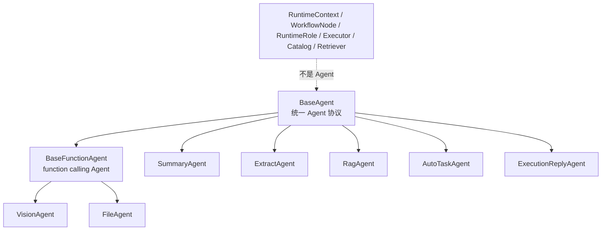
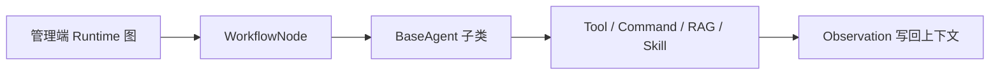

# Agent 继承与扩展开发指南

> 核验日期：2026-05-15

本文定义 ClassRobot 的 Agent 统一写法。后续开发时先按本文判断：你要写的是 **Agent**、**Tool**、**Skill**、**WorkflowNode**、**Retriever**，还是 **Catalog**。不要因为某个对象服务于 AI 流程，就把它命名成 Agent。

## 核心标准

ClassRobot 中只有两类对象可以称为 Agent：

- 继承 `src.core.agent.BaseAgent` 的可执行智能体。
- 继承 `src.core.agent.BaseFunctionAgent` 的函数型智能体。

其他对象不叫 Agent：

| 对象 | 正确命名 | 职责 |
| --- | --- | --- |
| 运行时上下文 | `RuntimeContext` | 保存当前用户、群、平台、消息 ID 等运行态 |
| 编排节点 | `WorkflowNode` | 表示 AutoGPT Runtime 图中的一个处理阶段 |
| Skill 目录 | `SkillCatalog` | 把项目 Skill 摘要暴露给 Planner |
| 本地知识检索 | `LocalKnowledgeRetriever` | 检索聊天记录、文件空间和本地 RAG |
| Runtime 节点定义 | `RuntimeNodeDefinition` | 描述管理端画布可拖拽的流程节点 |
| Runtime 图配置 | `RuntimeGraphConfig` | 保存可热更新的编排图 |
| Host 角色记录 | `RuntimeRoleDescriptor` / `RuntimeRoleTraceRecord` | 描述本轮经过的运行时职责边界，不执行推理 |
| 执行动作适配 | `ActionExecutor` | 执行 command、MCP、Skill 等工具动作 |

这条边界用于避免概念漂移、平行抽象和手工注册表反模式。

## Agent 继承树



`BaseAgent` 负责统一元数据、执行入口、工具声明和类型驱动发现。新增 Agent 后不需要再把类手写进多个 list/dict，系统会通过继承树发现。

内置 Agent 的源码按职责放在 `src/core/agent/builtin/`：

- `conversation.py`
  - `SummaryAgent`、`ExtractAgent`、`ExecutionReplyAgent`
- `multimodal.py`
  - `VisionAgent`、`FileAgent`
- `retrieval.py`
  - `RagAgent`
- `planning.py`
  - `AutoTaskAgent`

Agent 实现统一放在 `src/core/agent/`，其中内置 Agent 放在 `src/core/agent/builtin/`。

## BaseAgent 标准协议

新增 Agent 时优先设置这些类级元数据：

```python
from src.core.agent import BaseAgent
from src.core.llm.message import Messages


class ClassSummaryAgent(BaseAgent):
    """根据当前上下文生成班级摘要。"""

    agent_name = "class_summary_agent"
    display_name = "班级摘要智能体"
    capabilities = ("class_summary", "context_synthesis")
    risk_level = "low"

    async def execute(self, messages: Messages) -> Messages:
        """执行 Agent 核心能力。"""

        messages.assistant_message("这里是班级摘要结果。")
        return messages
```

约束：

- `agent_name` 必须全局唯一。
- `execute()` 必须返回结果，不要只做副作用。
- 业务读写优先走已有 command、service 或 tool，不在 Agent 中绕过权限。
- 调 LLM 时统一走 `src.core.llm.client_create`，不要绕过模型配置。
- 复杂参数用 `Params` 或 Pydantic 模型表达，别把 JSON 解析散落到业务代码里。

## 自动发现

`BaseAgent` 提供类型驱动发现：

```python
from src.core.agent import BaseAgent


agent_classes = BaseAgent.iter_agent_classes()
summary_class = BaseAgent.get_agent_class("summary_agent")
summary_agent = BaseAgent.create("summary_agent")
```

适用场景：

- 管理端展示 Agent 类型。
- 测试约束所有 Agent 继承统一基类。
- 后续把 Agent 暴露到 Runtime 节点或工具目录。

不适用场景：

- Runtime 图节点仍由 `RuntimeNodeDefinition` 管理，因为节点是流程阶段，不是 Agent。
- Command 工具仍由 `CommandToolCatalog` 管理，因为命令来自 Helper 和统一命令注册表。

## 工具调用闭环放在哪里

项目不再维护 `ToolCallingAgent` 这类通用空壳。工具调用闭环由 AutoGPT Runtime 承载：

```text
ContextPack -> Planner -> TaskWorkflow -> ActionExecutor -> ToolObservation -> ExecutionReplyAgent
```

新增工具能力时优先选择这些位置：

- 内部业务能力：写成 `src.platform.commands` 的 service-style command。
- 外部实时能力：写成 MCP tool，并进入 runtime capability catalog。
- 多步执行策略：放进 `CognitiveAgentLoop`、`ActionExecutor` 或 workflow 节点。
- 最终用户回复：交给 `ExecutionReplyAgent` 基于 observation 汇总。

如果未来确实需要 subagent，必须同时满足三个条件：有真实 `BaseAgent` 实现、有独立 context slice、有明确 tool/capability 权限；否则只能叫 runtime role、workflow stage 或 executor。

## Function Agent

当 Agent 需要作为 function calling 工具挂到其他 Agent 下时，继承 `BaseFunctionAgent`：

```python
from pydantic import BaseModel, Field

from src.core.agent import BaseFunctionAgent
from src.core.llm.message import Messages


class QueryScheduleAgent(BaseFunctionAgent):
    """查询用户课表，并把查询结果写回模型上下文。"""

    agent_name = "query_schedule"
    display_name = "课表查询工具智能体"
    capabilities = ("schedule_query",)
    risk_level = "low"

    class Params(BaseModel):
        user_id: int = Field(description="系统用户 ID")
        day_offset: int = Field(default=0, description="日期偏移，今天为 0，明天为 1")

    async def execute(self, messages: Messages) -> Messages:
        for tool_call in self.call_tools(messages):
            params = self.Params.parse_raw(tool_call.function.arguments)
            messages.tool_message(tool_call.id, f"用户 {params.user_id} 的课表查询完成。")
        return messages
```

## 接入 AutoGPT Runtime

继承 `BaseAgent` 不会自动让它出现在管理端编排画布里。画布编排的是 Runtime 节点，不是 Agent 类。

如果要把某个 Agent 接入主流程：

1. 在 `src/core/agent/runtime/coordination/nodes.py` 编写 `WorkflowNode` 子类。
2. 节点内部调用 `BaseAgent.get_agent_class()` 或直接实例化具体 Agent。
3. 在 `src/core/agent/runtime/node_registry.py` 新增 `RuntimeNodeDefinition`。
4. 在 Runtime 节点目录中注册节点类型。
5. 补 `tests/autogpt` 的图构建、禁用规则和回归测试。



## 代码风格要求

- 不新增无意义 `_helper` 方法。
- 能表达业务概念的方法写成公开方法，便于测试和复用。
- 多个方法稳定围绕一个概念工作时，抽成小类，例如 `WorkflowStepBuilder`、`WorkflowApprovalBuilder`。
- 私有方法只保留给非常局部、不可复用的实现细节。
- 不把 Runtime、Context、Retriever、Catalog 命名成 Agent。

## 测试入口

相关测试在：

- `tests/autogpt/test_agent_standard.py`
- `tests/autogpt/test_orchestration_config.py`
- `tests/autogpt/test_knowledge.py`
- `tests/autogpt/test_harness.py`

建议每次改 Agent 基类或 Runtime 边界后运行：

```powershell
D:\Software\anaconda3\envs\classbot\python.exe -m pytest tests\autogpt -q
D:\Software\anaconda3\envs\classbot\python.exe -m mypy --explicit-package-bases --follow-imports skip core\llm core\agent src\features
```
