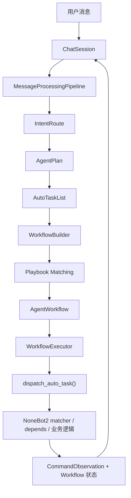

# AutoGPT 智能能力改进方案

本文用于统一 ClassRobot 的 AI Agent 演进方向。当前用户侧智能入口仍然是 `src.plugins.autogpt`，后续应在这条主链路上增强，而不是再增加平行入口。

## 设计目的

AutoGPT 最初承担的是“自然语言转项目命令”的职责：用户用白话描述需求，系统根据当前用户可见的 Helper 命令清单，生成回复和 `AutoTaskList`，再通过 `handle_event()` 把任务重新投递给 NoneBot。

它真正要解决的不是自由聊天，而是三件事：

1. 理解用户在班级、教师、学生、任务、通知、地图等场景里的意图。
2. 判断当前系统是否已有命令可以完成这件事。
3. 在权限和参数足够时调用项目命令，在不够时向用户确认。

这里的“命令调用”只指本机器人系统中的命令，例如 `添加班级`、`创建任务`、`校园地图`。它不是 Windows/Linux shell 命令，也不是外部部署工具调用。

## 当前工作流程

当前链路由 `ChatSession` 和 `MessageProcessingPipeline` 串起来：

1. `ChatSession` 按用户维护会话、锁和当前可用命令清单。
2. `SummaryAgent` 在历史过长时压缩聊天内容。
3. `NormalizeUserInputNode` 把平台消息转换成统一的文本、图片或文件内容。
4. `AppendUserMessageNode` 把用户消息写入会话。
5. `ExtractAgent` 通过一次 LLM 调用从历史中抽取当前任务上下文。
6. `RagAgent` 根据上下文调用 RagFlow 检索补充资料。
7. `AutoTaskAgent` 再通过一次 LLM 调用生成回复和自动任务。
8. `autogpt` 把任务重新投递给 NoneBot，让原有 matcher、权限依赖和数据库依赖继续生效。

这个设计有一个优点：它没有绕过业务命令层，能复用项目已有权限、参数解析和业务逻辑。

## 主要问题

当前实现更像早期“LLM 自动命令规划器”，还不是现代任务型 Agent。关键问题如下：

- 串行流程过重：普通问候也会走抽取、RAG、规划，多次模型调用成本高、延迟高。
- RAG 被当成固定步骤：RagFlow 没配置或 URL 不合法时也会尝试请求，导致普通对话出现无关错误。
- 缺少任务分类：系统没有先判断“聊天、问答、命令、复杂任务、文件/图片处理、违规内容”等路线。
- 缺少显式 Planner：`ExtractAgent + AutoTaskAgent` 隐式承担规划职责，无法清楚表达目标、事实、缺失参数、风险和执行步骤。
- 缺少工具执行循环：现代 Agent 通常是“计划 -> 调工具 -> 观察结果 -> 再计划”，当前只生成一批任务后一次性投递。
- 缺少确认与审计模型：`need_confirm` 是一个字段，但没有统一的高风险命令确认策略、执行记录和回滚视角。
- 错误边界粗糙：抽取失败、JSON 解析失败、RAG 失败、命令执行失败时，用户只看到“消息理解失败”。
- 上下文记忆太简单：当前主要依赖进程内 `Messages`，没有区分短期对话、长期记忆、任务状态和命令执行结果。
- 命令能力描述不足：Helper 文档不够结构化，模型只能读自然语言说明，无法稳定判断参数、权限、副作用和确认要求。
- 可观测性不足：缺少一次请求的 trace id、节点耗时、模型选择、任务计划、命令执行结果等调试信息。

你遇到的 RagFlow 报错属于“可选能力强依赖化”：`ragflow_url` 没有合法协议时，httpx 会报 `Request URL is missing an 'http://' or 'https://' protocol`。RAG 应该降级，而不是中断 AutoGPT。

## 目标架构

新的 AutoGPT 应演进成一个项目内任务型 Agent Orchestrator：

```text
用户消息
  -> 输入归一化
  -> 意图路由
  -> 上下文与记忆读取
  -> Planner 生成计划
  -> Tool/Command Executor 执行项目能力
  -> Observation 写回
  -> 必要时继续规划
  -> 回复、确认或任务结果
```

核心原则：

- 业务写操作仍然落到项目命令和业务层执行。
- RAG、图片、文件、通知、任务、班级管理都作为可选工具能力。
- 每个工具都有结构化 schema、权限、风险等级、是否需要确认、执行结果。
- Agent 可以多轮执行，但每轮有最大步数、超时和错误降级。
- 用户看到的是清晰结果，不看到内部推理；系统内部保留计划和审计记录。

## 当前实现的工作流化升级

为了把这条路线从“规划概念”推进到“工程骨架”，当前 `autogpt` 已经从单纯的 `AutoTaskList` 输出，升级成“本轮结果对象 + 显式工作流 + 顺序执行器”的模式。

### 当前运行时结构



### 新增的关键结构

- `AgentTurnResult`
  - 统一承载本轮 `route`、`plan`、`auto_tasks`、`workflow`
- `AgentWorkflow`
  - 面向执行与审计的显式工作流对象
- `WorkflowStep`
  - 可顺序执行的命令步骤
- `WorkflowExecutor`
  - 顺序执行步骤，失败即停，回写观察记录
- `playbooks.py`
  - 为高频多步任务提供稳定模板，避免完全依赖模型临时拆解

### 这样做的意义

- 把 AI 的临时规划结果转换成系统内部稳定对象
- 为后续补审批、恢复、持久化状态提供统一边界
- 继续复用 NoneBot2 的 matcher、depends、权限和业务逻辑
- 让高频多步任务逐渐收敛成更稳定的模板化工作流

## 与 OpenClaw 风格能力的映射

这次改造不是直接复制 OpenClaw，而是把它最有价值的工程思路落到当前代码里：

| OpenClaw 风格能力 | 当前落地方式 |
| --- | --- |
| 消息驱动 Agent 编排 | `ChatSession + MessageProcessingPipeline` |
| typed tool / capability catalog | `CommandToolCatalog` |
| 用户消息定制工作流 | `IntentRoute + AgentPlan + WorkflowBuilder` |
| 确定性执行 | `WorkflowExecutor + handle_event()` |
| 观察记录与追踪 | `trace_id + CommandObservation + record_workflow()` |
| 多轮继续规划 | 会话历史 + 工作流状态回写 |

当前还没有完全落地的部分包括：

- 独立的长期记忆层
- 完整历史 workflow run
- 更细粒度的审批和回滚策略

当前已经补上了第一层 playbook 匹配、“最新工作流检查点”持久化、审批元数据和基础 workflow run history，但还没有进入“完整 workflow engine / 多节点审批 / 长任务调度”的阶段。

## 改进路线

### 第一阶段：止血与稳定

- RAG 配置缺失时跳过检索，普通对话不能被可选依赖打断。
- 给 `ExtractAgent`、`AutoTaskAgent`、`RagAgent` 增加明确失败降级。
- 去掉 `print()` 调试输出，改为结构化日志。
- 保留 `handle_event()` 命令投递方式，继续复用项目权限和依赖。
- 让 `Param.separate` 真正参与消息投递，支持分步 matcher。

### 第二阶段：拆出路由与规划

- 新增 `IntentRouterNode`，先判断请求属于聊天、知识问答、命令执行、复杂任务、图片文件、违规内容。
- 新增显式 `Planner` 数据结构，包含目标、事实、缺失参数、风险等级、候选命令、计划步骤。
- 只有知识问答或需要资料时才调用 RAG。
- 只有命令明确且参数足够时才生成可执行任务。
- 对高风险命令统一要求确认。

### 第三阶段：工具循环

- 把 Helper 命令包装成统一 `CommandTool`。
- 把 RAG、文件理解、图片理解、通知、任务等能力包装成 `AgentTool`。
- 引入执行循环：模型提出工具调用，系统执行，结果作为 observation 写回，再由 Planner 决定继续或结束。
- 增加最大步骤数、单步超时、失败重试和中断机制。

### 第四阶段：记忆、审计与任务状态

- 会话记忆拆成短期上下文、长期摘要、用户偏好、任务状态。
- 命令执行记录写入审计日志，包含用户、命令、参数、结果、模型计划。
- 定时任务和长任务进入持久化队列，而不是只靠进程内状态。
- 为每次 AutoGPT 请求生成 trace id，便于排查线上问题。

## 近期落地优先级

1. 先修 RAG 配置降级和错误边界。
2. 再加 Intent Router，避免所有消息都走完整重链路。
3. 然后把 AutoTask 规划升级为显式 Planner。
4. 最后引入工具循环和持久化任务状态。

这条路线可以逐步接近现代任务型 Agent 的体验，同时不破坏 ClassRobot 已经稳定的 NoneBot 命令体系。

## 已落地进度

- RAG 配置缺失或 URL 不合法时会跳过检索，不再中断普通对话。
- 已加入 `IntentRouteNode`，普通聊天可以直接回复，只有需要知识或命令能力时才进入后续链路。
- 已加入显式 `PlannerNode` 和 `AgentPlan`，在生成自动任务前先产出目标、事实、缺失信息、风险等级、候选命令和确认问题。
- 已加入 `ExecutionPolicyNode` 和 `ValidateAutoTasksNode`，用代码规则拦截高风险操作、不可执行计划、不可用候选命令和模型幻觉命令。
- `Param.separate=true` 已参与命令投递，支持把后续参数作为独立消息交给同一个 matcher。
- 已加入命令投递 observation：AutoGPT 会记录主命令、分离参数、缺失命令和投递失败，并写回会话上下文，供下一轮规划参考。
- 已加入 `trace_id`：每轮 AutoGPT 请求会生成独立追踪 ID，流水线节点、路由结果、规划结果和命令投递 observation 会使用同一个 ID 串联。
- 已加入命令工具目录 `CommandToolCatalog`：把当前用户可见的 Helper 命令包装成结构化工具，保留真实命令名、ASCII 安全工具名、别名、参数约束和默认风险等级。
- 已加入显式工作流对象 `AgentWorkflow` 与 `WorkflowStep`：每轮自然语言请求会被提升成可被检查、记录和顺序执行的工作流。
- 已加入 `WorkflowExecutor`：工作流步骤会按顺序复用 `handle_event()` 重新投递到 NoneBot2 命令系统，失败即停并回写状态。
- 已加入 `AgentTurnResult`：`ChatSession` 现在会保存本轮路由、计划、自动任务和工作流结果，便于后续扩展审批、恢复和长期记忆。
- 已加入内置 `playbook` 模板目录：高频命令序列会被提升成更稳定的模板化工作流，并补充步骤标题与说明。
- 已加入待确认工作流恢复：用户回复“确认 / 继续执行 / 取消”时，会话层可以恢复或取消上一条待确认工作流。
- 已加入工作流检查点持久化：`WorkflowCheckpointStore` 会把每个用户最近一次工作流状态保存到 `AgentWorkflowCheckpoint`，让 `needs_confirm` 场景在进程重启后仍可恢复。
- 已加入审批元数据：`WorkflowApproval` 会记录当前确认属于高风险确认还是信息缺失确认，并保留 `pending / approved / rejected` 状态。
- 已加入运行历史：`WorkflowRunStore` 会按 `trace_id` 保存 `AgentWorkflowRun`，把待确认规划、确认恢复后的子运行、取消状态和最终执行状态串起来。
- 已加入工作流事件时间线：`AgentWorkflow.events` 会记录工作流创建、审批请求、恢复、步骤开始、步骤完成、失败和取消等离散事件。
- 已加入克制的用户反馈：AutoGPT 只在确实需要等待时发送一条面向用户的状态提示，例如查资料或处理项目能力，不暴露内部路由、Planner、校验等流水线细节。
- `print()` 调试输出已逐步替换为 logger，便于后续接入 trace 和审计。

当前 observation 记录的是“是否成功投递到 NoneBot 事件系统”，不是业务命令最终是否完成。业务结果仍由原有 matcher、权限依赖和业务逻辑负责回复用户。后续如果要做完整审计，可以在业务命令层补充成功、失败、影响对象和回滚信息。

排查 AutoGPT 行为时，可以先在日志里搜索 `AutoGPT trace`。同一个 `trace_id` 下通常会包含节点耗时、意图路由、Planner 输出摘要、命令投递和 observation 写回结果。

当前工作流状态会通过 `record_workflow()` 写回会话上下文，保存工作流类型、状态、步骤和时间戳。这样下一轮如果用户继续追问“刚才执行到哪一步了”“帮我继续”，系统已经有了统一的状态挂点，而不是只能读自然语言聊天历史。

当工作流属于“已经知道要执行什么，但仍需用户拍板”的场景时，会话层还会把它登记为 `pending_workflow`。这让用户只需回复简短确认语句，就能继续上一条流程，而不需要重新从自然语言重新规划整条命令链。

当前 `pending_workflow` 还会同步写入持久化检查点。这样即使 NoneBot 进程重启，新的 `ChatSession` 也能先从 `WorkflowCheckpointStore` 恢复待确认状态，再继续处理“确认执行 / 取消”这类短指令。为了避免数据库尚未迁移时直接中断主流程，检查点存储默认允许降级为“只记日志，不阻塞会话”。

除了最新检查点，现在系统还会同步写入历史运行表。这样一条工作流如果先进入 `needs_confirm`，随后被用户确认恢复执行，就会留下两条可追踪记录：

- 父 run：原始待确认工作流
- 子 run：确认后恢复出来的新 `trace_id`

如果用户选择取消，则会直接把原始待确认 run 更新为 `cancelled`，而不是额外造出一条“取消版假 run”。这样后续要看审批链路、失败链路和恢复链路时，历史会更干净。

除了 run history，现在每条工作流快照里还会同步保留事件时间线。这样排查时不只能看到“最后状态是什么”，还能看到“先进入待确认，后被用户确认，再开始执行到第几步失败/完成”的顺序。

命令工具目录目前先用于 Planner、Router 和 AutoTask 提示词，以及候选命令校验。它不会绕过 `handle_event()` 直接执行业务逻辑。后续进入工具循环阶段时，可以把 `CommandTool.name` 暴露给 function calling，把模型返回的工具名映射回 `CommandTool.command`，再继续交给项目原有命令体系执行。

用户反馈通过 `MessageProcessingPipeline` 的 `progress_reporter` 回调实现，发送失败只记录日志，不会中断主流程。反馈内容必须对用户有价值，默认最多发送一条“正在查资料/正在处理”的等待提示，不能把内部节点、模型规划或命令名直接暴露给用户。

## 下一步建议

如果继续沿这条路线开发，建议按下面顺序推进：

1. 新增工作流模板 / playbook 选择器
2. 为高风险命令补更细粒度的审批节点
3. 把长期记忆从进程内会话拆出来
4. 让定时任务和长任务也能挂到统一工作流状态之下
5. 再进入更重的 tool loop、多 Agent 或外部协议接入

对应的架构层说明见 [Agent 工作流编排架构](../architecture/agent-workflow-orchestration.md)。
具体的模板和确认恢复机制见 [Agent Playbook 与确认执行](./agent-playbooks.md)。
