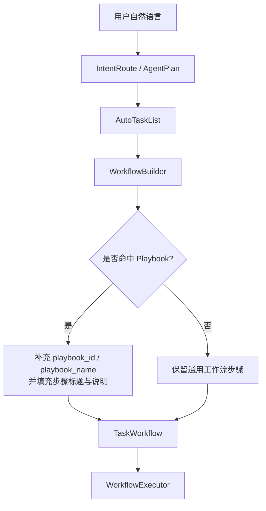
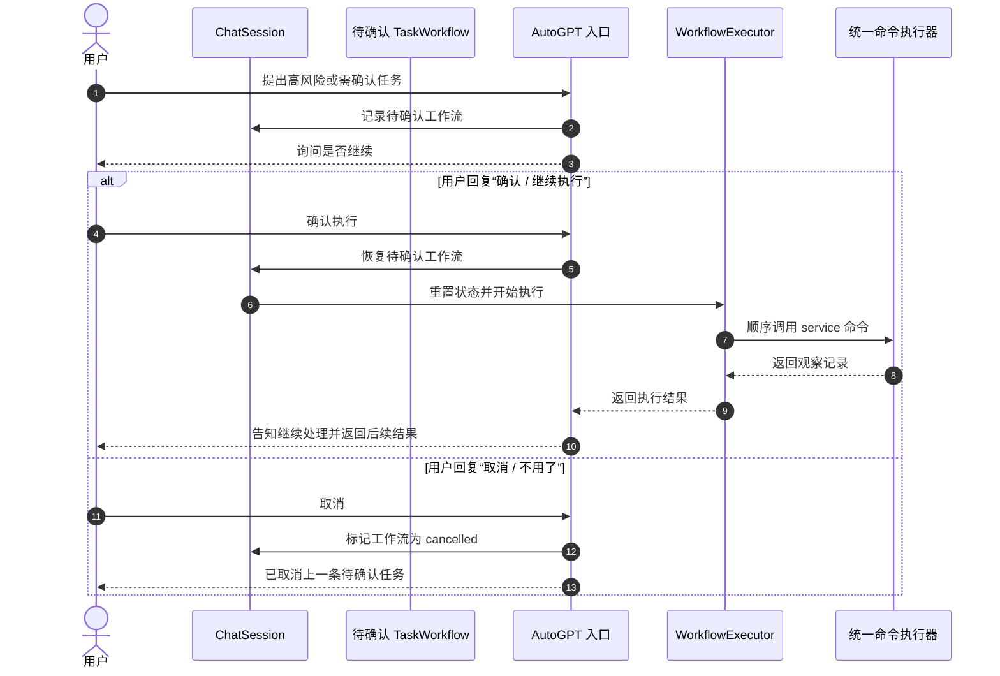

# Agent Playbook 与确认执行

本文档说明当前 AutoGPT Runtime 中两类很关键的工程能力：

- `playbook`
  - 把高频、多步、可复用的命令组合沉淀成稳定模板
- `确认后继续执行`
  - 让待确认工作流在用户回复“确认 / 取消”后真正恢复或终止

这两类能力决定了系统能否把“一次性的临时规划”沉淀成“稳定、可复用、可恢复的执行模板”，也是后续继续增强 Agent 工程化时最值得优先维护的部分。

## 为什么需要 Playbook

如果所有多步任务都完全依赖 LLM 临时规划，会出现几个问题：

- 同一类任务每次拆解顺序可能不一致
- 高价值场景很难沉淀成团队共识
- 后续补审批、测试和审计时缺少稳定锚点

所以当前设计引入了 `playbook`：

- Planner 仍然负责理解用户目标
- AutoTask 仍然负责生成当前轮任务
- 但 `WorkflowBuilder` 会尝试把命令序列匹配到内置模板

这样做之后，“临时智能规划”就会逐步收敛成“智能选择稳定模板 + 填参数”。

## 当前内置模板

当前内置在 [playbooks.py](../../src/core/agent/runtime/playbooks.py) 里的模板包括：

- `class_bootstrap_and_notice`
  - `添加班级 -> 修改班级加入方式 -> 创建通知`
- `task_publish_and_notify`
  - `创建任务 -> 创建通知`
- `curriculum_setup`
  - `添加课表 -> 设置当前周`
- `join_request_review`
  - `查询入班申请 -> 处理入班申请`

这些模板不是硬编码替代 LLM，而是给工作流层提供更稳定的标题、步骤说明和执行语义。

## 匹配规则

当前匹配策略是“顺序子序列匹配”：

1. 从 `AutoTaskList` 中抽出命令序列
2. 依次匹配模板中的步骤顺序
3. 优先选择最贴近当前命令长度的模板

这意味着：

- 命令顺序必须合理
- 可以先从较小序列命中某个模板
- 后续如果要做更强的参数化模板选择，可以在此基础上继续增强

## 运行时流程

## 为什么需要“确认后继续执行”

当前系统已经可以识别很多需要确认的情况，例如：

- 高风险操作
- 删除、批量修改、群发通知
- 需要用户最后拍板的执行链路

如果只是给用户回一句“是否继续”，但下一条用户说“确认”时系统不能恢复执行，那工作流链路就是断的。

所以现在 `ChatSession` 已经支持：

- 保存待确认工作流
- 识别短确认语句
- 识别取消语句
- 在同一会话中恢复待确认任务

## 确认执行流程

## NoneBot2 融合点

这里仍然坚持当前项目最重要的一个工程原则：

- AI 不直接调用数据库写操作
- AI 不绕过现有命令体系
- AI 恢复执行后，仍然通过 `CommandCLI -> CommandExecutor` 调用已 service 化命令

因此确认执行只是“恢复工作流”，不是“绕过规则”。

真正执行时，下面这些能力仍然有效：

- `CommandSpec` 参数和元数据
- `CommandPolicy`、软关闭和动态业务权限校验
- 用户身份与数据归属校验
- 领域 service 业务逻辑

## 当前实现边界

目前已经支持的是：

- 会话内待确认工作流挂起
- 用户短确认语句恢复执行
- 用户取消待确认工作流
- 工作流命中 playbook 后带模板元数据和步骤说明

目前还没有做的是：

- 跨进程或重启后的待确认工作流恢复
- 审批人、审批意见、审批时限
- 基于数据库的 workflow run 持久化
- 更复杂的模板参数约束与前置条件检查

这意味着当前设计已经适合单体系统内稳定演进，但还没有进入“可跨重启恢复”的工作流引擎阶段。

## 后续建议

下一步继续增强时，推荐顺序如下：

1. 给高风险命令补审批类型和审批说明
2. 为工作流运行状态增加持久化存储
3. 为 playbook 增加参数约束与前置条件校验
4. 再考虑把部分 playbook 升级为更强的 workflow DSL

## 相关代码

- [workflow.py](../../src/core/agent/runtime/workflow.py)
- [playbooks.py](../../src/core/agent/runtime/playbooks.py)
- [util.py](../../src/core/agent/runtime/util.py)
- [__init__.py](../../src/plugins/application/active/autogpt/__init__.py)
