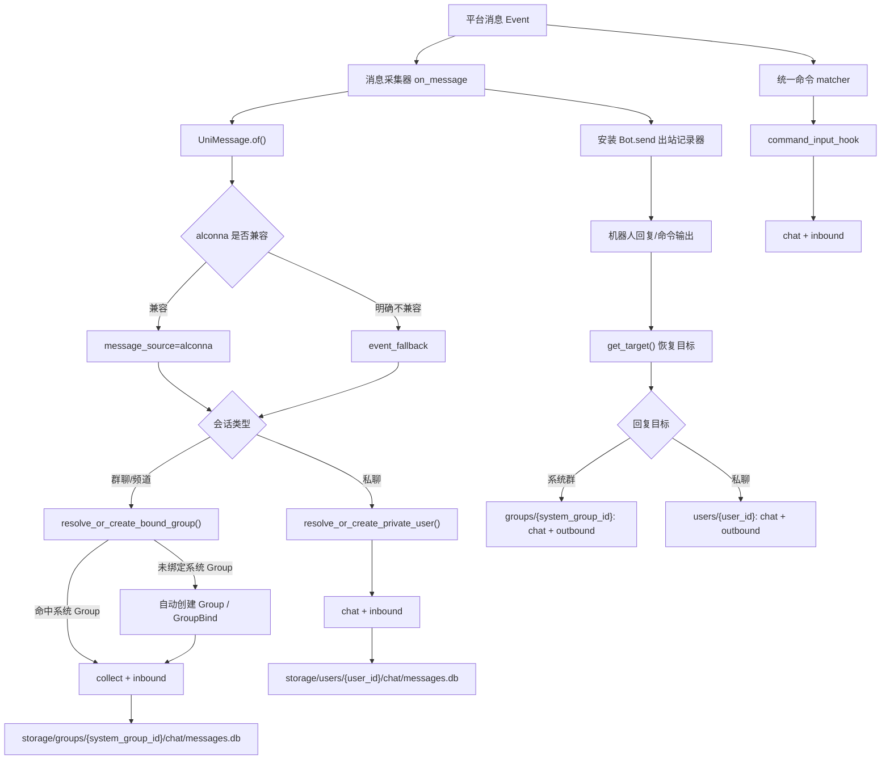

# 消息历史存储与归属说明

本文说明项目当前“消息历史”能力的边界、归属规则、存储结构与 Agent 使用约定。该能力是事实记录层，不负责替 Agent 做语义判断。

## 目标

消息历史模块负责：

- 采集用户入站消息，包括普通消息和命令消息。
- 记录机器人出站消息，包括命令回复和 AutoGPT 阶段性回复。
- 把消息归档到正确的系统用户空间或系统群组空间。
- 保留平台、时间、Bot、频道、消息方向等基础审计字段。
- 提供基础检索能力，供命令、后台管理和 Agent 工具复用。
- 在消息解析层优先使用 `nonebot-plugin-alconna` 的统一消息模型，只有明确不兼容时才回退到事件字段。

它不负责：

- 自动判断用户是否想回顾历史。
- 自动提取语义关键词。
- 自动总结争议。
- 自动决定应查询群空间还是用户空间。

这些判断应交给上层 Agent 或显式命令。

## 消息类型与方向

当前消息表通过两个维度区分数据用途：

- `record_kind=collect`：系统群环境中的采集消息，主要用于“回顾当前系统群最近聊过什么”。
- `record_kind=chat`：聊天消息，主要用于记录用户与机器人之间的输入输出。
- `direction=inbound`：用户或平台发给机器人的消息。
- `direction=outbound`：机器人发出的消息。

常见落库组合如下：

| 场景 | owner | record_kind | direction | actor_role |
| --- | --- | --- | --- | --- |
| 系统群普通消息 | `groups/{system_group_id}` | `collect` | `inbound` | `user` |
| 系统群命令消息 | `groups/{system_group_id}` | `collect` | `inbound` | `user` |
| 系统群显式命令输入 | `groups/{system_group_id}` | `chat` | `inbound` | `user` |
| 系统群命令回复 | `groups/{system_group_id}` | `chat` | `outbound` | `assistant` |
| 私聊普通消息 | `users/{user_id}` | `chat` | `inbound` | `user` |
| 私聊命令消息 | `users/{user_id}` | `chat` | `inbound` | `user` |
| 私聊命令回复 | `users/{user_id}` | `chat` | `outbound` | `assistant` |

## 归属规则

### 群消息

群消息不是直接按平台 `group_id` 归档，而是先解析为系统内 `Group.id`。当前实现已经改为“自动建档”模式：

- 如果平台群已经绑定到系统 `Group`，则直接使用现有 `Group.id` 归档。
- 如果平台群首次出现且尚未绑定，消息采集层会自动创建最小 `Group` 与 `GroupBind`，随后再写入聊天记录。
- 如果后续该平台群被正式创建为班级群，班级创建流程会复用原先自动创建的系统 `Group`，而不是新建第二个系统群。

这条规则的意义是：

- 平台 ID 只是接入层事实。
- `Group.id` 才是项目内部稳定主键。
- 后续班级、组织、权限、Agent 工具都应该围绕系统主键工作。

因此要特别注意：

- `storage/groups/{...}` 里的目录名应理解为系统 `Group.id`。
- 不要把平台群号、频道号直接当作群消息事实层或 Agent 工具层的业务主键。
- 管理端、检索命令、后续索引层都应基于系统 `Group.id` 读取同一份群空间数据。

### 私聊消息

私聊消息归档到系统内 `User.id` 对应的用户空间。如果该平台账号尚未绑定系统用户，则会创建最小用户并建立绑定，再进行落盘。

### 机器人出站消息

机器人回复通过 `Bot.send` 出站记录器统一捕获。NoneBot 的适配器可能覆盖基类 `Bot.send`，因此实现会同时处理已加载 Bot 子类，并在消息采集阶段对当前 Bot 实例做兜底 patch。

出站记录不会阻断原始发送。如果记录失败，只写日志警告，避免影响用户收到回复。

### alconna 优先与兜底边界

当前实现把 alconna 作为消息解析的主路径：

- 入站消息优先调用 `UniMessage.of(event.get_message(), bot=bot)`。
- 出站目标优先调用 `get_target(event, bot)`。
- 只有 `SerializeFailed`、`NotImplementedError`、`ValueError` 这类明确的兼容性问题才进入兜底。
- 不要把未知异常当成兼容问题吞掉，否则会把代码 bug 伪装成“自动降级”。

兜底时会把原因写入 `metadata`，便于后续排查：

- `message_source=event_fallback`
- `message_fallback_reason=<异常类型>`

### 命令输入为什么不会漏记

当前系统不会只依赖全局 `on_message` 来记录命令输入。

- 普通消息和群环境采集消息仍由 `message_history_collector` 负责。
- 通过 `command_alconna()` / `command_command()` 注册的非交互项目命令，会在 matcher 内部自动挂一层 `command_input_hook`。
- 这层 hook 会在命令业务 handler 前，把用户本次显式命令输入写入 `chat` 记录。
- 多轮交互命令的确认消息，例如 `yes/no`、补充参数、附件追加，当前不通过这条 hook 记录，避免破坏 matcher 交互态。
- 因此即使命令 matcher 使用了 `block=True`，或者后续命令优先级有调整，命令输入也不会仅因为消息采集链顺序变化而丢失。

这也是为什么“命令聊天记录是否完整”不应该只靠 `priority` 保证，而应由统一命令入口显式负责。

## 存储位置

```text
{data_dir}/storage/
├── groups/
│   └── {system_group_id}/
│       └── chat/
│           └── messages.db
└── users/
    └── {user_id}/
        └── chat/
            └── messages.db
```

## 核心字段

统一消息表为 `messages`，关键字段如下：

- `owner_kind` / `owner_id`：消息所属空间，值为 `user` 或 `group`。
- `record_kind`：消息用途，值为 `collect` 或 `chat`。
- `direction`：消息方向，值为 `inbound` 或 `outbound`。
- `actor_role`：发送主体角色，值为 `user`、`assistant` 或 `system`。
- `message_id`：平台消息 ID，缺失时使用内容、时间、方向等信息生成去重键。
- `user_id` / `user_name`：当前消息主体标识和展示名。
- `platform` / `platform_name`：平台稳定标识和平台展示名。
- `channel_id` / `guild_id`：群、频道或父级频道标识。
- `bot_id`：处理或发送消息的机器人 ID。
- `platform_user_id`：当前消息主体在平台侧的 ID。出站消息中通常为 Bot ID。
- `metadata`：扩展元数据，如记录来源、事件类型、发送结果等。

## 数据流



## 命令与 Agent

`检索群聊记录` 只检索当前系统群空间中的 `collect` 消息，用于回顾群环境中用户说过什么。命令自身也会被采集，但命令处理器会排除当前消息 ID，避免“检索命令本身”混入结果。

Agent 如果需要回顾系统群上下文，应优先调用 `检索群聊记录`。如果需要读取完整聊天流，可以读取对应空间的 `messages.db`，并明确过滤 `record_kind`、`direction` 和 `actor_role`。

如果你在排查“为什么数据库里明明有群消息，但 `bot_group` / `bot_group_bind` 为空”，当前正确预期应为：

- 首条被采集的群消息就会触发系统群自动建档。
- 之后同一平台群的消息、命令输入、机器人回复都会落到同一个系统 `Group.id` 空间。
- 正式建班时会复用这条系统群记录，不会额外再分裂出第二套群聊天空间。

## 代码入口

- 存储层：[../../src/core/storage/chat_history.py](../../src/core/storage/chat_history.py)
- 插件入口：[../../src/plugins/library/message_history/__init__.py](../../src/plugins/library/message_history/__init__.py)
- 采集逻辑：[../../src/plugins/library/message_history/collector.py](../../src/plugins/library/message_history/collector.py)
- 出站记录：[../../src/plugins/library/message_history/outbound.py](../../src/plugins/library/message_history/outbound.py)
- 归属解析：[../../src/platform/session/resolvers.py](../../src/platform/session/resolvers.py)
- 群历史命令服务：[../../src/plugins/library/message_history/services.py](../../src/plugins/library/message_history/services.py)

## 扩展原则

- 归属解析放在解析层，不要散落在 matcher、service、store 各处。
- 存储层只记录事实，不写 Agent 的推理逻辑。
- 新增查询能力时，先明确查询 `collect` 还是 `chat`。
- 新增字段优先放入显式列；只有低频、适配器特有的信息放入 `metadata`。
- 后台管理和 Agent 工具应复用 `ChatHistoryStore` 或统一消息表，不要自行创建第二套结构。
