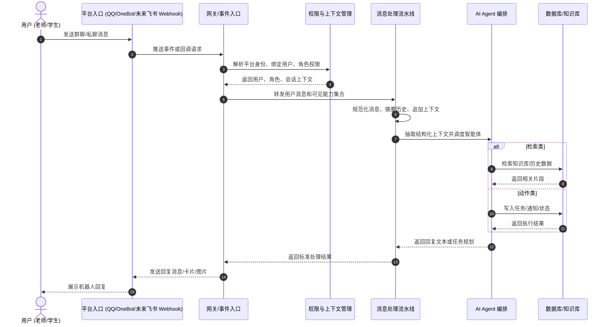
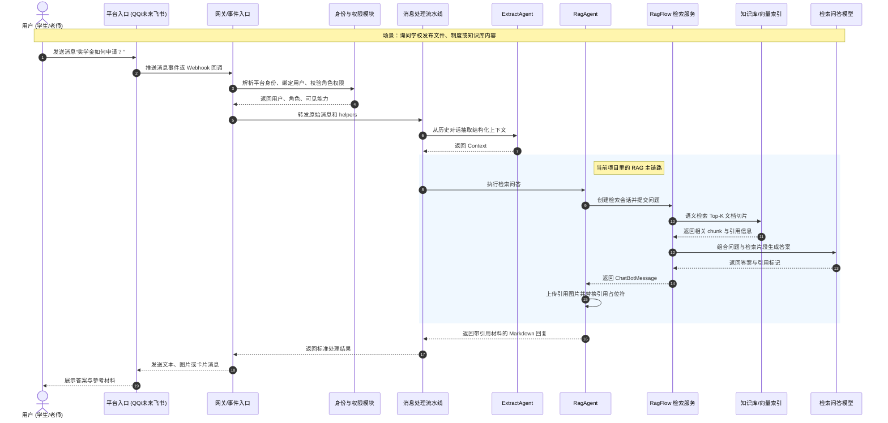
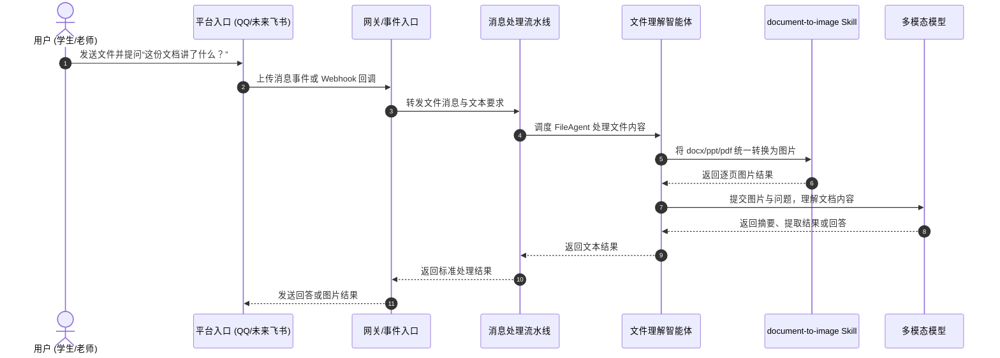
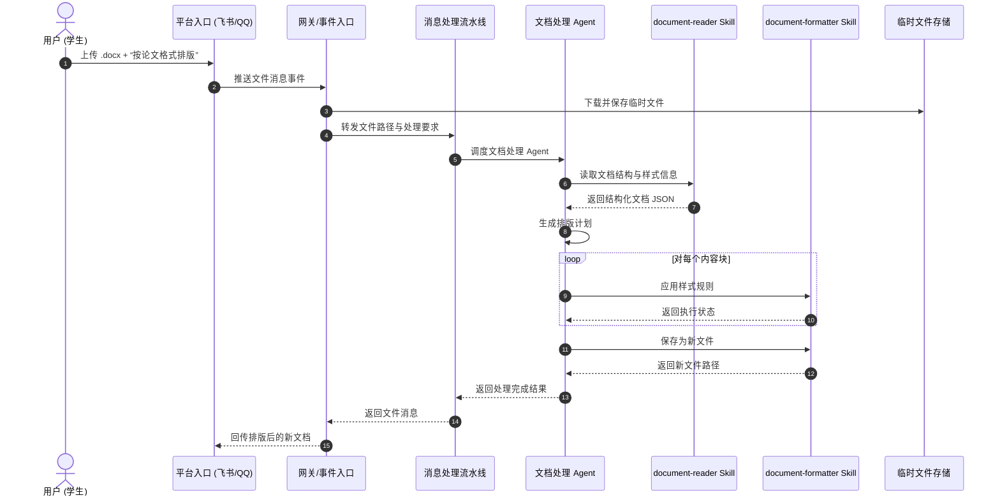
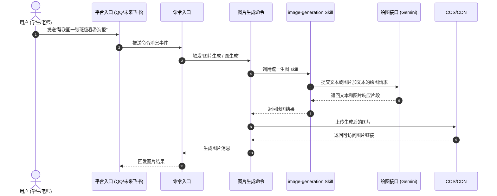
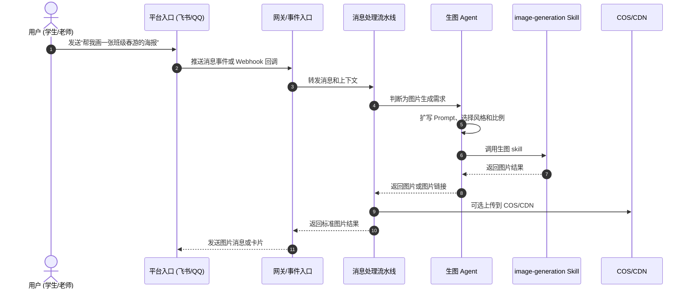

# 消息处理流程

本文档把项目当前已经存在的消息处理链路，和一个常见的“平台 Webhook -> 权限 -> Agent -> 数据库 -> 回复”流程做统一映射，便于后续接入飞书、企业微信或其他外部平台。

## 标准化流程图

## 当前项目中的模块映射

### 1. 平台入口

当前项目的平台入口主要由 NoneBot 适配器承担：

- OneBot V11
- OneBot V12
- QQ 官方适配器

对应位置：

- `pyproject.toml`
- `src/plugins/application/active/autogpt/__init__.py`

如果以后接飞书，飞书服务器回调可以被视为这里的另一种“平台入口”。

### 2. Gateway / 事件入口

当前没有单独命名为 `Gateway` 的目录，但这层职责已经存在：

- `src/plugins/application/active/autogpt/__init__.py`
  - 负责接收消息事件
  - 负责兜底异常
  - 负责把 AI 处理结果重新发送给平台

在未来接飞书时，这一层可以扩展为：

- Webhook HTTP 接口
- 事件验签
- 平台消息体转统一内部结构

### 3. 权限与上下文管理

当前已经有比较完整的权限和上下文层：

- `src/platform/session/__init__.py`
  - 负责构建平台会话信息
- `src/models/depends.py`
  - 负责用户绑定、用户创建、班级/教师/学生身份解析
- `src/platform/helper/depends.py`
  - 负责根据用户角色筛选可见命令帮助

这层对应你流程图里的 `Auth`。

### 4. 消息处理流水线

当前已抽出标准流水线实现：

- `src/core/agent/runtime/pipeline.py`

它把原先写在 `ChatSession.send_message(...)` 里的主流程拆成了更清晰的几个阶段：

1. 规范化消息
2. 历史摘要压缩
3. 追加用户消息
4. 抽取结构化上下文
5. 并行执行检索/动作类智能体
6. 写回助手回复
7. 解析为自动任务结果

这层就是当前系统里最接近 `Gateway -> Agent` 中间编排器的位置。

### 5. Agent 编排

当前 Agent 能力集中在：

- `src/core/agent/tool.py`

其中包括：

- `SummaryAgent`
- `ExtractAgent`
- `RagAgent`
- `AutoTaskAgent`
- `VisionAgent`
- `FileAgent`

这些 Agent 已经天然对应“检索类”和“动作类”两种处理分支。

### 6. 数据库 / 知识库

当前项目的数据访问有两类：

- 业务数据库
  - `src/models/`
  - 班级、用户、任务、请假等 ORM 数据
- 知识检索
  - `RagAgent`
  - `src/core/agent/ragflow/`

因此你图中的 `DB`，在本项目里实际上是“业务数据库 + 外部知识检索服务”的组合。

## RAG 检索场景流程

当用户的问题更像“查学校文件、查制度说明、查知识资料”时，当前系统走的是消息流水线中的 `RagAgent` 分支，而不是单独再起一套聊天系统。

### 当前项目中的 RAG 模块映射

- 平台入口 / Server
  - `src/plugins/application/active/autogpt/__init__.py`
  - 负责接收平台消息、调用会话处理并回发结果
- 权限与身份
  - `src/models/depends.py`
  - `src/platform/helper/depends.py`
  - 负责用户绑定、角色解析、能力边界筛选
- 消息流水线
  - `src/core/agent/runtime/pipeline.py`
  - 负责在标准流程中调度 `ExtractAgent` 和 `RagAgent`
- RAG 编排层
  - `src/core/agent/tool.py`
  - `RagAgent.execute(...)` 负责发起检索问答
- RagFlow 接入层
  - `src/core/agent/ragflow/client.py`
  - `src/core/agent/ragflow/ragflow.py`
  - `src/core/agent/ragflow/schema.py`
  - 负责调用外部 RagFlow 服务、创建会话、提交问题、解析引用结果
- 向量数据库 / 检索引擎
  - 当前没有直接在仓库里操作 Milvus、Chroma 或 LangChain
  - 这部分能力目前被封装在外部 `RagFlow` 服务后面

### 当前实现与通用 RAG 图的对应关系

- 你图里的 `Server`，在当前项目里对应“NoneBot 入口 + ChatSession + MessageProcessingPipeline”
- 你图里的 `RAG`，在当前项目里主要对应 `RagAgent` 和 `src/core/agent/ragflow/`
- 你图里的 `VectorDB` 和 `LLM`，当前项目没有直接内嵌实现，而是通过 RagFlow 服务间接调用
- 当前回复结果不仅能返回答案，还会把 RagFlow 返回的引用标记替换成“相关材料图片”，便于直接在聊天平台发送

### 如果以后接入飞书，推荐的融合方式

如果以后要把这条 RAG 流程接入飞书，推荐仍然只新增平台适配层：

1. 飞书 Webhook 负责验签、解析 `open_id` 和消息体
2. 继续复用 `src/models/depends.py` 做用户绑定和权限解析
3. 继续复用 `ChatSessionManager` 和 `MessageProcessingPipeline`
4. 让 `RagAgent` 继续作为统一的知识检索入口
5. 最后把 Markdown、图片、引用材料适配回飞书消息格式

也就是说，未来即使平台换成飞书，RAG 主链路依旧应该保留在当前 `Pipeline -> RagAgent -> RagFlow` 这一层。

## 文件处理场景流程

当用户上传 `.docx`、`.pptx`、`.pdf` 等文件并提出“帮我看内容”“提取重点”“按要求处理文件”之类的请求时，系统应继续复用统一消息入口，但在 Agent 层区分“文件理解”和“文件改写”两类能力。

### 1. 当前已经具备的文件理解流程

当前项目已经有一条可运行的“读取文件并理解内容”的链路，核心是 `FileAgent` 配合 `document-to-image` skill。

这一条链路在当前项目中的真实映射是：

- 文件入口仍然走平台消息处理层
- `src/core/agent/runtime/pipeline.py`
  - 负责把消息送入统一流水线
- `src/core/agent/tool.py`
  - `FileAgent` 负责下载文件、转图片并交给多模态模型理解
- `src/core/skills/builtin/document-to-image/`
  - 负责把 Word、PPT、PDF 转成统一图片中间结果

这意味着当前项目已经适合处理：

- 阅读文件内容
- 总结文档重点
- 从文档中提取信息
- 将文档转换为便于 OCR 或多模态识别的图片

### 2. 你图里的“文档排版”属于下一阶段扩展

你给的流程图更偏向“文档智能编辑”，它和当前 `FileAgent` 的定位不完全一样。

当前 `FileAgent` 更像：

- `read_docx(...)`
- `understand_document(...)`
- `summarize_document(...)`

而你图里的目标还包括：

- `apply_style(block_id, style_config)`
- `save_document()`
- 回传新的 `.docx`

这部分当前仓库里还没有现成运行时实现，因此更适合作为未来新增的两类 skill，而不是继续堆进现有 `document-to-image` skill：

- `src/core/skills/builtin/document-reader/`
  - 负责读取 `.docx`、`.pptx`、`.pdf` 的结构化内容
  - 例如标题、段落、表格、页眉页脚、图片占位
- `src/core/skills/builtin/document-formatter/`
  - 负责按规则修改文档样式并导出新文件
  - 例如字体、字号、段落、页边距、标题层级、表格样式

### 3. 推荐的目标融合流程

如果以后要实现“按论文格式排版”这类能力，推荐把流程接到当前系统里，而不是独立做一套文件服务：

### 4. 对当前项目的落地建议

- 文件“理解”继续复用 `FileAgent` + `document-to-image` skill
- 文件“编辑/排版”不要塞进 `FileAgent`
- 如果新增文档排版能力，优先新增专门的 Agent 和 skill：
  - Agent 放在 `src/core/agent/`
  - skill 放在 `src/core/skills/builtin/document-reader/`、`src/core/skills/builtin/document-formatter/`
  - 运行时实现继续挂到 `src/core/skills/runtime.py` 或独立模块
- 平台层只负责：
  - 下载文件
  - 保存临时路径
  - 调用统一流水线
  - 回传生成后的新文件

换句话说，当前系统已经能承接“文件进入系统”的通道，但你图里的“智能排版并保存回文档”还属于下一步能力扩展，最合适的接入点是“新 Agent + 新 skill”，而不是改写现有 RAG 或通用聊天主链路。

## 图片生成场景流程

当用户提出“帮我画一张海报”“根据这张图生成新图”“给这张图换个风格”之类的需求时，最适合的边界是“Agent 负责理解与扩写，skill 负责真正调用绘图接口，平台层负责上传和回发图片”。

### 1. 当前已经具备的图片生成流程

当前项目已经有一条可运行的图片生成链路，不过它目前主要以命令方式触发，再调用统一的 `image-generation` skill。

这一条链路在当前项目中的真实映射是：

- 命令定义
  - `src/plugins/application/active/image_generate/commands.py`
  - 提供 `图片生成`、`生成图片`、`图生图`、`图生成`
- 命令处理
  - `src/plugins/application/active/image_generate/__init__.py`
  - 负责接收参数、调用 skill、上传图片并回发消息
- 生图 skill
  - `src/core/skills/builtin/image-generation/`
  - `src/core/skills/runtime.py`
  - 负责把文本和图片输入提交给底层绘图接口
- 云存储
  - `src/shared/tools/cos/__init__.py`
  - 负责将返回的图片字节上传并换成平台可发送的链接

这意味着当前项目已经适合处理：

- 文本生图
- 图片加文本生图
- 生成后上传云存储再发送图片消息

### 2. 你图里的“Agent 扩写 Prompt”属于推荐增强方向

你给的流程图里，`Agent` 会先做意图识别和 Prompt 扩写，再调用 `ImageSkill`。这个方向是合理的，但和当前实现相比，还多了一层“智能规划”。

当前系统更接近：

- 用户命令
- 直接进入 `图片生成` 命令处理
- 命令再调用 `image-generation` skill

而你图里的目标更像：

- 用户自然语言请求
- Agent 判断需要生图
- Agent 扩写 Prompt、确定风格
- 调用 `image-generation` skill
- 平台层回发图片

这说明当前项目已经有“生图 skill”和“命令入口”，下一步如果要更贴近你图里的模式，最适合新增的是上层 Agent，而不是再造一个新的图片生成工具类。

### 3. 推荐的目标融合流程

如果以后要让 AutoGPT 或飞书 Webhook 也能自然语言触发生图，推荐按下面的方式融合：

### 4. 对当前项目的落地建议

- 底层生图能力统一走 `image-generation` skill
- 命令层继续保留 `图片生成` 作为直接入口
- 如果未来要支持自然语言自动生图，优先新增上层 Agent，而不是复制一套图片生成实现
- 平台层负责：
  - 接收文本和图片输入
  - 回发图片消息
  - 需要时上传 COS/CDN
- skill 层负责：
  - 调用绘图接口
  - 返回图片结果或响应片段

换句话说，当前项目已经完成了“生图接口 skill 化”，而你图里的下一步重点应该是把“Prompt 扩写与生成决策”上收进 Agent 层。

## 当前已经融合到代码中的关键点

为了让这套流程不只停留在概念图里，当前项目已经做了下面这些收敛：

- 把 AI 会话主流程抽成了 `MessageProcessingPipeline`
- 把“摘要 -> 抽取 -> 检索/规划 -> 回复”做成显式阶段
- 把技能型能力收敛到了 `src/core/skills/builtin/` + `src/core/skills/`
- 把角色筛选后的 `helpers` 作为 Agent 编排时的能力边界

这意味着以后即使换成飞书 Webhook，也可以复用同一套：

- 用户绑定
- 权限判断
- 会话管理
- Agent 编排
- 技能调用

## 未来接入飞书时的建议融合方式

推荐不要为飞书单独重写整条业务链路，而是只新增“平台适配层”。

推荐结构：

1. 飞书 Webhook 进入 HTTP 路由
2. 把飞书消息体转换成统一内部消息结构
3. 复用 `src/platform/session` 的平台会话抽象
4. 复用 `src/models/depends` 的用户绑定与角色解析
5. 复用 `ChatSessionManager` + `MessageProcessingPipeline`
6. 将结果再适配回飞书消息接口

也就是说，飞书应该替换的是“入口与出口”，而不是中间的业务和 AI 主链路。

## 对开发者的落地建议

- 新平台接入时，优先新增适配层，不要复制 AI 流程
- 新的检索型或动作型能力，优先挂到 Agent 或 skill，而不是塞进入口 handler
- 入口层尽量只做：
  - 验签/解析
  - 用户绑定
  - 权限获取
  - 调用流水线
  - 回发消息
- 中间处理层统一走：
  - `ChatSessionManager`
  - `MessageProcessingPipeline`
  - `src.core.agent.*`

## 相关代码位置

- 平台会话：`src/platform/session/__init__.py`
- 用户/权限依赖：`src/models/depends.py`
- 帮助与角色能力边界：`src/platform/helper/depends.py`
- AI 入口：`src/plugins/application/active/autogpt/__init__.py`
- AI 流水线：`src/core/agent/runtime/pipeline.py`
- 会话管理：`src/core/agent/runtime/util.py`
- Agent：`src/core/agent/tool.py`
- 技能：`src/core/skills/builtin/`、`src/core/skills/`
