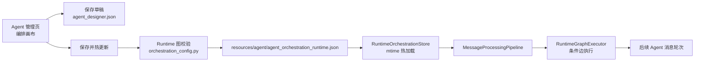
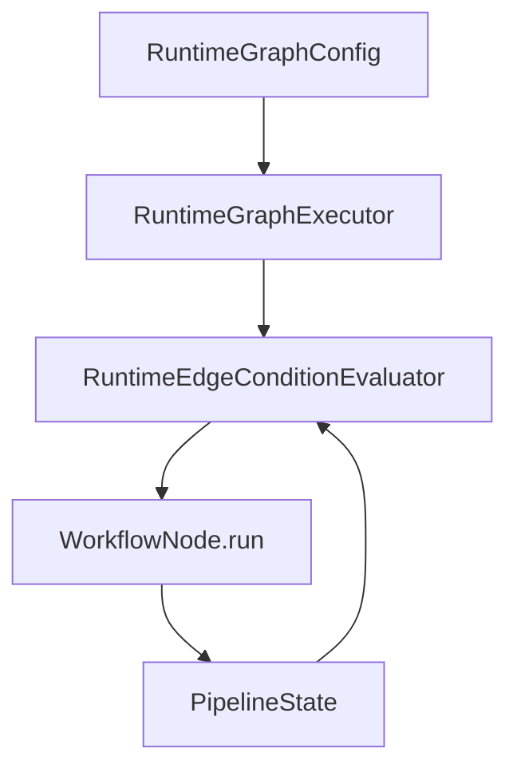

# Agent 可编排与运行时配置

本文档说明管理后台 Agent 编排画布如何与 AutoGPT Runtime 接轨，以及默认编排、热更新和后续扩展边界。

## 当前结论

- 管理后台可以保存 Agent 编排草稿、节点连线和节点参数。
- 管理后台可以选择“保存并热更新”，把合法编排写入运行时配置文件。
- AutoGPT 每轮处理消息时会检查运行时配置文件的修改时间，配置变化后自动热加载。
- AutoGPT 默认运行链路本身就是一张可编排 Runtime 图；配置文件不存在时直接使用默认图。
- 当前 Runtime 图是“受限条件 DAG over 现有 Pipeline 节点”，不是让 AI 任意改写系统运行时。
- 节点启用状态、条件边、节点配置和模型角色已经会影响后续 Agent 轮次。
- 节点级 `model` / `llm_name` 可直接覆盖当前节点的 LLM 调用，`model_profile` 可引用图级 `supervisor_model`、`worker_model`、`vision_model`、`summary_model`。
- 管理端编辑的是开发者控制的 `RuntimeGraphConfig`；AI 临时生成的 `TaskWorkflow` 只作为运行记录和执行对象，不在管理端画布里直接编辑。

## 代码落点

| 能力 | 文件 |
| --- | --- |
| 管理端 Agent 服务 | `src/interfaces/http/managers/agent/service.py` |
| 管理端路由 | `src/interfaces/http/managers/router.py` |
| 管理端请求模型 | `src/interfaces/http/managers/agent/models.py` |
| Runtime 节点注册表 | `src/core/agent/runtime/node_registry.py` |
| Runtime 编排配置读写与校验 | `src/core/agent/runtime/orchestration_config.py` |
| Runtime 条件图执行器 | `src/core/agent/runtime/graph_executor.py` |
| AutoGPT Pipeline 节点构建 | `src/core/agent/runtime/pipeline.py` |
| 管理端页面 | `website/managers/src/views/AgentsView.vue` |
| 后端测试 | `tests/admin/test_manager_api.py` |
| Runtime 编排测试 | `tests/autogpt/test_orchestration_config.py` |

## 配置文件

运行时编排配置写入项目资源目录：

```text
resources/agent/agent_orchestration_runtime.json
```

实际绝对路径由 `src.platform.config.agent_resources_dir` 决定。管理端响应中的 `runtime.config_path` 会返回当前进程实际读取的路径。

这份文件是 Agent Runtime 的工作流编排资源，不放入 NoneBot/localstore 的默认 `config` 目录。`.env` 仍只放模型密钥、静态地址等启动前配置；用户数据、聊天记录和运行历史仍走各自的存储目录。

配置结构核心字段：

```json
{
  "version": 1,
  "mode": "graph",
  "enabled": true,
  "applied_at": "2026-05-15T00:00:00",
  "source_hash": "...",
  "model_profiles": {
    "supervisor_model": "strong-model",
    "worker_model": "fast-model",
    "vision_model": "vision-model",
    "summary_model": "summary-model"
  },
  "nodes": [],
  "edges": [],
  "node_order": ["summary_history", "normalize_input"]
}
```

`source_hash` 用于判断当前草稿是否已经应用到运行时。管理端草稿中的画布坐标和备注不会参与哈希，因此移动节点位置或只修改说明不会误判为运行时逻辑变化。

如果历史本地配置仍写着旧的 `mode=fixed`，运行时会在内存中迁移为默认编排图，不再生成旧式不可编排配置。

## 接口约定

### 读取设计器

```http
GET /api/v1/manager/agents/designer
```

返回内容包括：

| 字段 | 说明 |
| --- | --- |
| `palette` | 可拖入画布的 Runtime 节点 |
| `draft` | 当前设计器草稿 |
| `config_schema` | 节点配置字段 |
| `runtime` | 当前运行时编排配置状态 |
| `applied_to_runtime` | 当前草稿是否和运行时配置一致 |

### 保存草稿

```http
PUT /api/v1/manager/agents/designer
```

请求体不带 `apply_to_runtime` 或传 `false` 时，只保存管理端草稿，不写入 Runtime 配置。

```json
{
  "nodes": [],
  "edges": [],
  "note": "本次编排说明",
  "apply_to_runtime": false
}
```

### 保存并热更新

同一个接口传 `apply_to_runtime=true` 时，后端会先把草稿转换为运行时图配置并校验。校验通过后才写入草稿和 Runtime 配置。

```json
{
  "nodes": [],
  "edges": [],
  "note": "本次编排说明",
  "apply_to_runtime": true
}
```

返回示例：

```json
{
  "saved": true,
  "applied_to_runtime": true,
  "restart_required": false,
  "message": "已保存并热更新到 AutoGPT Runtime。"
}
```

如果缺少安全关键节点、节点类型未知、图存在循环或断连，接口会返回 `400`，并且不会覆盖 Runtime 配置。

## 运行时数据流



热更新的含义是：已经开始执行的当前轮次不会被中途替换；下一轮 Agent 消息处理会读取新配置。

## 图校验规则

运行时图必须满足以下规则：

- 节点类型必须来自 `src/core/agent/runtime/node_registry.py`。
- 同一个 `node_type` 只能出现一次。
- 必需节点必须存在且启用。
- 图必须有且只有一个入口节点。
- 图必须有且只有一个终止节点。
- 启用节点必须全部连通。
- 默认不允许循环。
- 必需顺序不能被破坏，例如 `route` 必须早于 `extract`，`execution_policy` 必须早于 `plan_tasks`。
- 边条件必须来自内置条件键，不允许任意 Python 表达式。

当前支持的边条件包括：

```text
always
has_auto_tasks
no_auto_tasks
needs_local_knowledge
needs_external_rag
direct_vision_reply
scene_chat
scene_command
scene_knowledge
scene_vision
scene_task
scene_violation
```

当前必需节点包括：

```text
normalize_input
append_user_message
route
extract
plan
execution_policy
plan_tasks
validate_tasks
persist
```

这些节点承担输入归一、上下文写入、路由、规划、策略兜底、任务生成、任务校验和会话回写职责，不能被管理端绕过。

## 当前 Runtime 图边界

当前 Runtime 图负责按条件执行现有 Pipeline 节点：



它暂时不做这些事：

- 不支持循环工具调用。
- 不支持多 Agent 并行。
- 不支持节点级独立超时和重试。
- 不允许 AI 直接修改运行时图。

这些能力后续应该在 Runtime 图执行器、Tool Loop、节点级模型策略和可观测性层逐步补齐。

## 扩展路线

### 1. 节点级执行策略

`model`、`llm_name` 和 `model_profile` 已经会影响节点内 LLM 调用。后续还可以把 `temperature`、`timeout_seconds`、`max_iterations` 和 `risk_policy` 接入节点执行器，但必须先定义清晰降级规则。

### 2. TaskWorkflow 可观测记录

管理端第一版只编辑 `RuntimeGraphConfig`。后续适合增加“任务流运行记录”视图，用来查看 AI 本轮生成的 `TaskWorkflow`、实际执行的命令、observation 和最终回复。

### 3. 可观测性

Runtime 图下每个节点应继续写入：

- 节点 ID
- 节点类型
- 输入摘要
- 输出摘要
- 状态
- 耗时
- 错误信息

这些字段应进入 `AgentWorkflowRun.workflow_data.observability`，供管理后台展示和回归分析。

## 验证方式

后端和 Runtime：

```powershell
D:\Software\anaconda3\envs\classbot\python.exe -m pytest tests\autogpt\test_orchestration_config.py -q
D:\Software\anaconda3\envs\classbot\python.exe -m pytest tests\admin\test_manager_api.py -q
```

前端：

```powershell
cd website\managers
npm run build
```

静态检查：

```powershell
git diff --check
```
