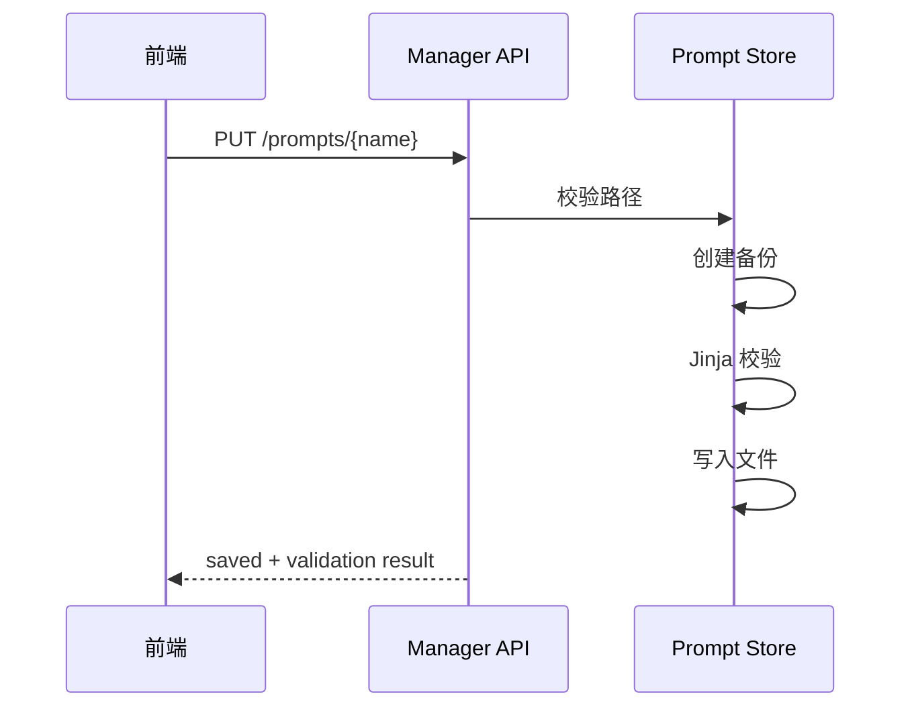
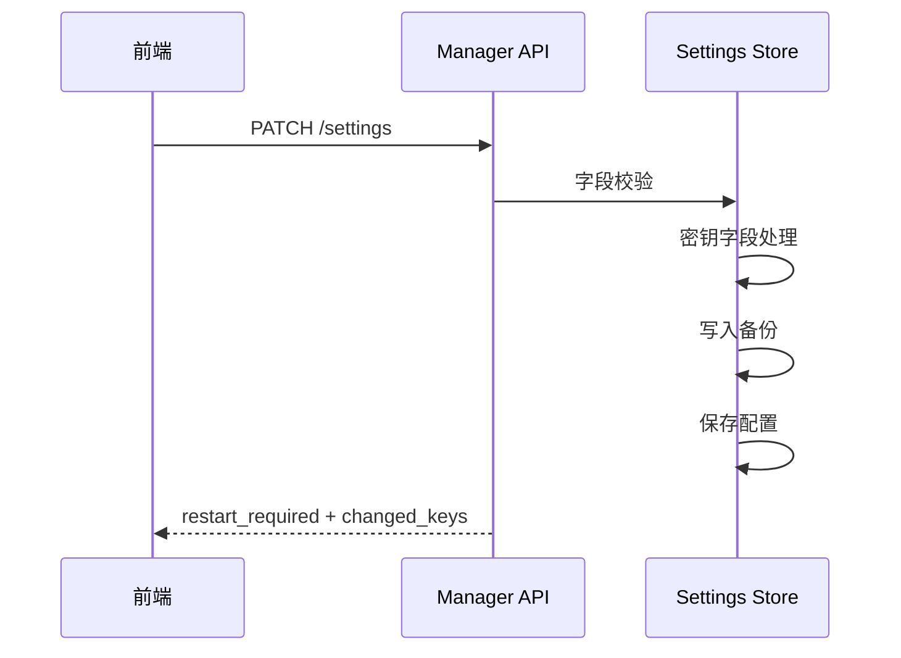

# 后端实现方案

## 代码放置

后台后端建议继续使用当前已经预留的目录：

```text
src/routers/managers/
```

推荐结构：

```text
src/routers/managers/
  __init__.py
  router.py
  security.py
  schemas.py
  service.py
  settings_store.py
  status.py
  skills.py
  prompts.py
  models.py
  agents.py
  logs.py
  operations.py
```

前端放置：

```text
website/managers/
```

## FastAPI 挂载方式

当前 `src/routers/path.py` 已经通过 `get_app()` 获取 FastAPI app 并挂载 `/api/v1`。

建议新增：

```python
from src.routers.managers.router import router as manager_router

app.include_router(manager_router)
```

后台 router 自身使用：

```python
APIRouter(prefix="/api/v1/manager", tags=["Manager"])
```

## 启动 token

建议在 `security.py` 中维护后台 token。

### MVP 策略

- 项目启动时生成随机 token。
- 在控制台输出一次。
- 进程内保存 hash。
- 登录时校验用户输入。
- 登录成功返回 session token。

### 轮换策略

- 系统设置页触发轮换。
- 新 token 输出到控制台。
- 旧 session token 失效。
- 前端跳转登录页。

### 不建议

- 不建议把启动 token 明文写入仓库。
- 不建议在前端展示完整 token。
- 不建议支持任意用户密码登录，避免和现有 `User.password` 混淆。

## 服务分层

### Router 层

职责：

- 参数解析。
- 鉴权依赖。
- 调用 service。
- 返回 Pydantic schema。

### Service 层

职责：

- 聚合 ORM、文件系统、配置和运行时信息。
- 做业务校验。
- 控制危险操作。
- 组装状态检查结果。

### Store 层

职责：

- 读写后台配置。
- 读写 `.env` 或 overlay 配置。
- 管理 Prompt 备份。
- 管理动作执行记录。

## 主要模块

### `security.py`

职责：

- 生成启动 token。
- 登录校验。
- session token 签发与校验。
- FastAPI dependency：`ManagerAuthDepends`。

### `status.py`

职责：

- 检测数据库连接。
- 检测 Alembic 版本。
- 检测 Redis。
- 检测路径存在性。
- 检测 Prompt 和 Skill 状态。
- 检测 COS、RAGFlow、模型连通性。

### `settings_store.py`

职责：

- 读取当前配置。
- 对密钥字段脱敏。
- 写入设置。
- 标记是否需要重启。
- 写入前创建备份。

推荐先支持两种写入：

- 后台自身状态写入 `config_dir/manager-settings.json`。
- 项目运行配置更新 `.env`，并返回 `restart_required`。

### `skills.py`

职责：

- 读取 `skill_registry.manifests`。
- 检查 skill 目录。
- 检查 runtime 是否存在。
- 调用 registry 重载。

### `prompts.py`

职责：

- 列出 `resources/prompts/*.jinja`。
- 读取 Prompt。
- 校验 Jinja 模板。
- 写入 Prompt 前备份。
- 提供 diff 需要的版本内容。

### `models.py`

职责：

- 读取 `plugin_config.llm_configs`。
- 脱敏模型 key。
- 测试指定模型。
- 保存模型配置。

注意：文件名 `models.py` 可能和 ORM `utils.models` 产生阅读歧义，也可以命名为 `llm_models.py`。

### `agents.py`

职责：

- 查询 `AgentWorkflowRun`。
- 查询 `AgentWorkflowCheckpoint`。
- 按 trace_id 读取详情。
- 删除检查点。
- 提取工作流事件、步骤、审批信息。

### `logs.py`

职责：

- 枚举允许读取的日志文件。
- 分页读取日志。
- tail 日志。
- 截断过大输出。

日志读取必须做路径限制。

### `operations.py`

职责：

- 定义自动化动作白名单。
- 执行动作。
- 收集 stdout、stderr、退出码和耗时。
- 返回执行结果。

## 自动化动作白名单

第一版建议支持：

| action_id | 命令或函数 | 风险 |
| --- | --- | --- |
| `check_config` | Python 函数检查配置完整性 | 低 |
| `check_database` | ORM 查询和表统计 | 低 |
| `validate_prompts` | Jinja 模板解析 | 低 |
| `reload_skills` | `skill_registry.load_skills()` | 中 |
| `test_models` | 发送极短测试请求 | 中 |
| `generate_sql` | `scripts/generate_sql.py` | 中 |
| `run_unit_tests` | `pytest` | 中 |

禁止：

- 任意 shell 输入。
- 删除目录。
- Git reset / checkout。
- 未经限制的文件写入。

## 前端静态资源

如果前端先做静态构建，可以由 FastAPI 挂载：

```text
/manager
```

对应静态目录：

```text
website/managers/dist
```

开发阶段可以单独启动前端 dev server，再代理 `/api/v1/manager`。

## 数据库访问

后台接口读取 ORM 时优先使用当前项目的模型：

```text
utils.models.models
```

涉及列表接口时要注意：

- 分页。
- 避免一次性加载大 JSON。
- `workflow_data` 只在详情接口返回。
- 用户列表不要默认展开所有关系。

## Prompt 编辑流程



## 设置保存流程



## 测试建议

### 单元测试

- token 校验。
- 密钥脱敏。
- Prompt 路径限制。
- Prompt 校验。
- 设置写入合并。
- 自动化动作白名单。

### 集成测试

- 未登录访问返回 `401`。
- 登录成功后可访问总览。
- 用户列表分页正常。
- Agent 详情不会在列表中展开大 JSON。
- 删除检查点需要合法 token。

### 手动验收

- 启动项目能看到后台 token。
- 登录后进入总览页。
- 所有页面刷新不丢状态。
- 修改设置能看到重启提示。
- 日志读取不会越权到任意路径。
- 模型测试失败时错误可读。
