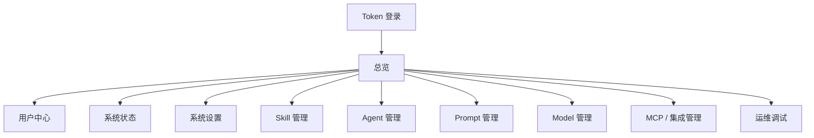

# 信息架构与页面清单

## 总体结构

管理后台采用左侧导航 + 顶部状态栏 + 主内容区 + 右侧详情抽屉的结构。

后台不做营销首页，登录后直接进入总览页。

## 导航分组

| 分组 | 页面 | 路由建议 |
| --- | --- | --- |
| 概览 | 总览 | `/manager/overview` |
| 身份 | 用户中心 | `/manager/users` |
| 系统 | 系统状态、系统设置 | `/manager/status`、`/manager/settings` |
| AI 资产 | Skill 管理、Prompt 管理、Model 管理 | `/manager/skills`、`/manager/prompts`、`/manager/models` |
| Agent | Agent 管理 | `/manager/agents` |
| 集成 | MCP / 集成管理 | `/manager/integrations` |
| 运维 | 运维调试 | `/manager/operations` |

## 顶部状态栏

顶部状态栏固定在主内容区上方，提供全局状态和快捷操作：

| 区域 | 内容 |
| --- | --- |
| 左侧 | 当前页面标题、环境标识、当前工作目录 |
| 中间 | 系统运行状态、数据库状态、缓存状态、模型状态 |
| 右侧 | 刷新、打开日志、重载 Skill、退出登录 |

状态颜色建议：

- 正常：绿色。
- 警告：琥珀色。
- 异常：红色。
- 未配置：灰色。
- 检查中：蓝色。

## 总览页

总览页只展示系统级信息，不展示校园业务数据。

### 内容区块

| 区块 | 内容 |
| --- | --- |
| 运行概览 | 进程状态、启动时间、Python 版本、NoneBot 驱动、当前数据库 |
| 关键资产 | Skill 数、Prompt 数、模型配置数、Agent 运行数、待确认工作流数 |
| 异常提醒 | 最近失败工作流、模型连通失败、缓存不可用、配置缺失 |
| 快捷动作 | 测试模型、校验 Prompt、重载 Skill、打开日志、生成 SQL |
| 最近运行 | 最近 Agent 工作流运行列表 |

### 交互

- 点击资产卡片跳转到对应管理页。
- 点击异常项打开详情抽屉。
- 快捷动作执行后显示结果面板。

## 用户中心

教师和学生作为用户详情中的扩展身份展示。

### 列表字段

| 字段 | 来源 |
| --- | --- |
| UID | `User.id` |
| 昵称 | `User.nickname` |
| 用户名 | `User.username` |
| 邮箱 | `User.email` |
| 手机 | `User.phone` |
| 角色 | `User.roles` 派生 |
| 管理员 | `User.is_admin` |
| 平台绑定数 | `UserBind` |
| 创建时间 | `User.created_at` |

### 详情分区

| 分区 | 内容 |
| --- | --- |
| 基础信息 | 用户名、昵称、头像、邮箱、手机、性别、生日 |
| 权限信息 | `role`、`roles`、`is_admin` |
| 平台绑定 | 平台名、平台 ID、账号 ID、绑定时间 |
| 教师扩展 | 教师姓名、学校、学院、管理班级 |
| 学生扩展 | 学生姓名、班级、学校、学号、寝室等 |

### 操作

- 搜索用户。
- 过滤管理员、学生、教师、普通用户。
- 查看详情。
- 切换 `is_admin`。
- 解除平台绑定需要二次确认。

## 系统状态

系统状态页以只读为主。

### 状态卡片

| 卡片 | 检查内容 |
| --- | --- |
| 数据库 | 连接状态、迁移版本、主要表行数 |
| 缓存 | Redis host、port、连通性 |
| 文件目录 | data、cache、config、prompts、skills、temp 目录是否存在 |
| 模型 | 已配置模型数量、连通性摘要 |
| RAG | RAGFlow URL、Key 是否配置、连通性 |
| COS | 配置完整性、上传能力状态 |
| Skill | 已发现、已加载、加载失败数量 |
| Prompt | 模板数量、语法校验状态 |

### 详情

点击卡片进入详情抽屉，展示检查项、检测时间、错误堆栈摘要和推荐处理动作。

## 系统设置

系统设置页用于编辑运行配置。

### 标签页

| 标签页 | 内容 |
| --- | --- |
| 基础 | 代理、共享目录、教师最大班级数 |
| AI / RAG | Google Key、RAGFlow URL、RAGFlow Key |
| 模型 | `llm_configs`、`llm_timeout` |
| 缓存 | Redis host、port |
| COS | SecretId、SecretKey、Region、Bucket、Scheme |
| 安全 | 加密盐、后台 token 轮换 |
| 路径 | data、cache、config、prompts、skills，只读展示 |

### 保存策略

- 保存前先校验字段。
- 保存后返回“立即生效”或“重启后生效”。
- 涉及密钥字段时只提交被修改字段。
- 保存失败时保留用户输入，展示错误原因。

## Skill 管理

### 列表字段

| 字段 | 来源 |
| --- | --- |
| 名称 | `SkillManifest.name` |
| 描述 | `SkillManifest.description` |
| 目录 | skill 目录 |
| 是否有 runtime | `runtime.py` 是否存在 |
| 加载状态 | Registry 运行结果 |
| 最近修改 | 文件系统时间 |

### 操作

- 查看 `SKILL.md`。
- 查看 runtime 类。
- 重载全部 Skill。
- 单个 Skill 健康检查。
- 后续可增加启停状态。

## Agent 管理

### 视图

| 视图 | 内容 |
| --- | --- |
| 运行记录 | `AgentWorkflowRun` 列表 |
| 检查点 | `AgentWorkflowCheckpoint` 列表 |
| 待确认 | `status = needs_confirm` 的工作流 |
| 失败记录 | `status = failed` 的工作流 |

### 列表字段

| 字段 | 来源 |
| --- | --- |
| Trace ID | `trace_id` |
| 用户 | `user_id` |
| 类型 | `kind` |
| 状态 | `status` |
| 目标 | `goal` |
| Playbook | `playbook_name` |
| 审批状态 | `approval_status` |
| 开始时间 | `started_at` |
| 结束时间 | `finished_at` |

### 详情

- 基础摘要。
- 步骤列表。
- 事件时间线。
- 审批信息。
- `workflow_data` JSON 查看器。
- 失败原因和 observation。

## Prompt 管理

### 列表字段

| 字段 | 来源 |
| --- | --- |
| 文件名 | `resources/prompts/*.jinja` |
| 大小 | 文件系统 |
| 最近修改 | 文件系统 |
| 关联模块 | 约定映射 |
| 校验状态 | Jinja 解析结果 |

### 操作

- 查看模板。
- 编辑模板。
- 格式校验。
- 查看差异。
- 创建备份。
- 恢复备份。

## Model 管理

### 内容

- 模型配置列表。
- 任务路由标签。
- 优先级。
- 是否多模态。
- 是否支持工具调用。
- 超时时间。
- 连通性测试结果。

### 操作

- 新增模型配置。
- 编辑模型配置。
- 删除模型配置。
- 测试模型。
- 调整优先级。

## MCP / 集成管理

当前仓库里 MCP 还处于目标架构阶段，本期页面以状态和占位为主。

### 内容

- MCP 能力说明。
- 当前接入状态。
- 未来注册表位置。
- 外部服务连接状态，例如 RagFlow、COS、模型 Provider。

### 操作

- 健康检查。
- 查看配置。
- 后续接入 MCP Server / Client 后扩展列表和权限管理。

## 运维调试

### 模块

| 模块 | 内容 |
| --- | --- |
| 日志查看 | stdout、stderr、NoneBot 日志、NapCat 日志索引 |
| 自动化动作 | 运行测试、生成 SQL、校验 Prompt、重载 Skill |
| 诊断工具 | 数据库表统计、配置完整性检查、模型连通性检查 |
| 调试结果 | 最近动作执行记录和输出摘要 |

### 操作约束

- 所有命令必须来自白名单。
- 不允许任意 shell 输入。
- 长任务需要进度状态。
- 输出需要截断和下载能力。
- 失败时保留退出码、耗时、stderr 摘要。
