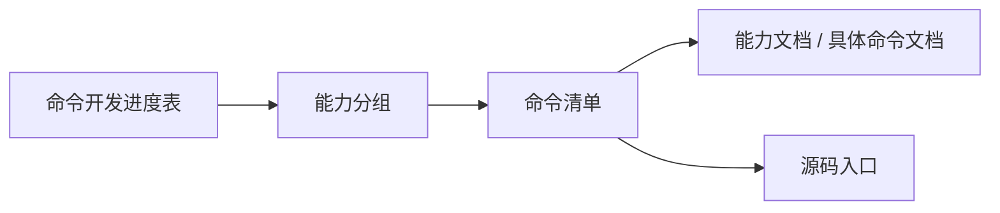

# 命令开发进度表

> 核验日期：2026-05-13
>
> 统计口径：仅统计项目中已经显式声明的命令入口；不含纯消息对话入口与内部工作流参考节点。
>
> 状态说明：
>
> - `已完成`：命令已接通、可正常使用，并有对应文档或源码入口。
> - `开发中`：能力已经可用，但命令体系、元数据、帮助口径或 Agent 接入仍在持续收敛。
> - `未完成`：命令入口存在，但核心业务逻辑未完整接通。
> - `待修复`：命令已接通，但当前存在已知缺陷，后续需要专门修整。

## 项目汇总

| 指标 | 数量 | 说明 |
| --- | ---: | --- |
| 能力分组 | 13 | 按业务能力和基础能力分组 |
| 显式命令 | 67 | 当前仓库中已声明的命令入口 |
| 已完成能力 | 11 | 当前可以稳定使用 |
| 开发中能力 | 1 | 命令基础设施与会话入口仍在持续收敛 |
| 未完成能力 | 1 | 通知与定时提醒逻辑未完整接通 |
| 待修复能力 | 0 | 当前未单独登记 |

## 能力总览

| 能力 | 状态 | 命令数 | 跳转 |
| --- | --- | ---: | --- |
| 命令基础设施与会话入口 | 开发中 | 6 | [查看](#命令基础设施与会话入口) |
| 学校、学院、专业、组织管理 | 已完成 | 16 | [查看](#学校学院专业与组织管理) |
| 教师管理 | 已完成 | 2 | [查看](#教师管理) |
| 学生管理 | 已完成 | 2 | [查看](#学生管理) |
| 班级管理 | 已完成 | 9 | [查看](#班级管理) |
| 课表管理 | 已完成 | 5 | [查看](#课表管理) |
| 任务管理 | 已完成 | 5 | [查看](#任务管理) |
| 请假管理 | 已完成 | 4 | [查看](#请假管理) |
| 文件管理 | 已完成 | 11 | [查看](#文件管理) |
| 群聊历史检索 | 已完成 | 1 | [查看](#群聊历史检索) |
| 学生检索与群内协作 | 已完成 | 2 | [查看](#学生检索与群内协作) |
| 图片生成 | 已完成 | 1 | [查看](#图片生成) |
| 通知与定时提醒 | 未完成 | 3 | [查看](#通知与定时提醒) |

## 快速跳转

- [命令基础设施与会话入口](#命令基础设施与会话入口)
- [学校、学院、专业、组织管理](#学校学院专业与组织管理)
- [教师管理](#教师管理)
- [学生管理](#学生管理)
- [班级管理](#班级管理)
- [课表管理](#课表管理)
- [任务管理](#任务管理)
- [请假管理](#请假管理)
- [文件管理](#文件管理)
- [群聊历史检索](#群聊历史检索)
- [学生检索与群内协作](#学生检索与群内协作)
- [图片生成](#图片生成)
- [通知与定时提醒](#通知与定时提醒)

## 命令基础设施与会话入口

状态：`开发中`

相关文档：

- [命令鉴权与 Help/AutoGPT 统一机制](../guides/command-auth-and-help.md)
- [命令与 Agent 一体化架构设计](../architecture/command-agent-unified-architecture.md)
- [命令体系说明](../../utils/commands/README.md)
- [AutoGPT 运行时说明](../../core/agent/runtime/README.md)

| 命令 | 状态 | 源码入口 | 说明 |
| --- | --- | --- | --- |
| `help` | 已完成 | [helper/__init__.py](../../src/features/helper/__init__.py) | 按身份展示可用命令。 |
| `我的信息` | 已完成 | [user/commands.py](../../src/features/user/commands.py) | 查看当前账号与身份信息。 |
| `绑定用户` | 已完成 | [user/commands.py](../../src/features/user/commands.py) | 跨平台绑定同一用户。 |
| `token` | 已完成（内部链路） | [user/commands.py](../../src/features/user/commands.py) | 绑定流程中的口令继续命令。 |
| `注销` | 已完成 | [user/commands.py](../../src/features/user/commands.py) | 注销当前账号及关联数据。 |
| `清空聊天` | 已完成 | [autogpt/__init__.py](../../src/features/autogpt/__init__.py) | 清空当前聊天上下文。 |

## 学校、学院、专业、组织管理

状态：`已完成`

相关文档：

- [命令使用文档](./command-reference.md)
- [身份与组织管理命令](../../src/features/README.md)

| 命令 | 状态 | 源码入口 | 说明 |
| --- | --- | --- | --- |
| `添加学校` | 已完成 | [group/commands.py](../../src/features/group/commands.py) | 创建学校。 |
| `修改学校` | 已完成 | [group/commands.py](../../src/features/group/commands.py) | 修改学校信息。 |
| `删除学校` | 已完成 | [group/commands.py](../../src/features/group/commands.py) | 删除学校及下属结构。 |
| `添加学院` | 已完成 | [group/commands.py](../../src/features/group/commands.py) | 为学校添加学院。 |
| `修改学院` | 已完成 | [group/commands.py](../../src/features/group/commands.py) | 修改学院信息。 |
| `删除学院` | 已完成 | [group/commands.py](../../src/features/group/commands.py) | 删除学院及其下属结构。 |
| `添加专业` | 已完成 | [group/commands.py](../../src/features/group/commands.py) | 为学院添加专业。 |
| `修改专业` | 已完成 | [group/commands.py](../../src/features/group/commands.py) | 修改专业信息。 |
| `删除专业` | 已完成 | [group/commands.py](../../src/features/group/commands.py) | 删除专业及关联班级。 |
| `添加组织` | 已完成 | [group/commands.py](../../src/features/group/commands.py) | 创建组织。 |
| `修改组织` | 已完成 | [group/commands.py](../../src/features/group/commands.py) | 修改组织信息。 |
| `删除组织` | 已完成 | [group/commands.py](../../src/features/group/commands.py) | 删除组织。 |
| `查询组织架构` | 已完成 | [group/commands.py](../../src/features/group/commands.py) | 查询学校组织结构。 |
| `查询组织` | 已完成 | [group/commands.py](../../src/features/group/commands.py) | 查询组织列表与详情。 |
| `加入组织` | 已完成 | [group/commands.py](../../src/features/group/commands.py) | 以学生或教师身份加入组织。 |
| `退出组织` | 已完成 | [group/commands.py](../../src/features/group/commands.py) | 退出组织。 |

## 教师管理

状态：`已完成`

相关文档：

- [命令使用文档](./command-reference.md#教师与班级命令)
- [身份与组织管理命令](../../src/features/README.md)

| 命令 | 状态 | 源码入口 | 说明 |
| --- | --- | --- | --- |
| `查询教师信息` | 已完成 | [teacher/commands.py](../../src/features/teacher/commands.py) | 查询教师资料与管理班级。 |
| `修改教师信息` | 已完成 | [teacher/commands.py](../../src/features/teacher/commands.py) | 修改教师姓名、学校、学院。 |

## 学生管理

状态：`已完成`

相关文档：

- [命令使用文档](./command-reference.md#学生命令)
- [身份与组织管理命令](../../src/features/README.md)

| 命令 | 状态 | 源码入口 | 说明 |
| --- | --- | --- | --- |
| `查询学生信息` | 已完成 | [student/commands.py](../../src/features/student/commands.py) | 查询学生资料与班级信息。 |
| `修改学生信息` | 已完成 | [student/commands.py](../../src/features/student/commands.py) | 修改学生附加资料。 |

## 班级管理

状态：`已完成`

相关文档：

- [命令使用文档](./command-reference.md#教师与班级命令)
- [班级模块说明](../../src/features/classes/README.md)

| 命令 | 状态 | 源码入口 | 说明 |
| --- | --- | --- | --- |
| `导入班级` | 已完成 | [classes/commands.py](../../src/features/classes/commands.py) | 批量导入班级与学生。 |
| `添加班级` | 已完成 | [classes/commands.py](../../src/features/classes/commands.py) | 创建班级或绑定班级。 |
| `查询班级` | 已完成 | [classes/commands.py](../../src/features/classes/commands.py) | 查询班级列表或详情。 |
| `删除班级` | 已完成 | [classes/commands.py](../../src/features/classes/commands.py) | 删除班级。 |
| `查询入班申请` | 已完成 | [classes/commands.py](../../src/features/classes/commands.py) | 查看入班申请。 |
| `处理入班申请` | 已完成 | [classes/commands.py](../../src/features/classes/commands.py) | 审核入班申请。 |
| `加入班级` | 已完成 | [classes/commands.py](../../src/features/classes/commands.py) | 学生加入班级。 |
| `退出班级` | 已完成 | [classes/commands.py](../../src/features/classes/commands.py) | 学生退出班级。 |
| `修改班级加入方式` | 已完成 | [classes/commands.py](../../src/features/classes/commands.py) | 修改班级加入规则。 |

## 课表管理

状态：`已完成`

相关文档：

- [命令使用文档](./command-reference.md#推荐使用顺序)
- [课表模块源码](../../src/features/curriculum/commands.py)

| 命令 | 状态 | 源码入口 | 说明 |
| --- | --- | --- | --- |
| `添加课表` | 已完成 | [curriculum/commands.py](../../src/features/curriculum/commands.py) | 添加个人课表。 |
| `删除课表` | 已完成 | [curriculum/commands.py](../../src/features/curriculum/commands.py) | 删除个人课表。 |
| `查询课表` | 已完成 | [curriculum/commands.py](../../src/features/curriculum/commands.py) | 查询个人或班级课表。 |
| `分享课表` | 已完成 | [curriculum/commands.py](../../src/features/curriculum/commands.py) | 生成或读取课表分享。 |
| `设置当前周` | 已完成 | [curriculum/commands.py](../../src/features/curriculum/commands.py) | 设置当前周。 |

## 任务管理

状态：`已完成`

相关文档：

- [任务模块源码](../../src/features/tasks/commands.py)
- [AutoGPT 运行时说明](../../core/agent/runtime/README.md)

| 命令 | 状态 | 源码入口 | 说明 |
| --- | --- | --- | --- |
| `提交任务` | 已完成 | [tasks/commands.py](../../src/features/tasks/commands.py) | 提交作业或任务附件。 |
| `创建任务` | 已完成 | [tasks/commands.py](../../src/features/tasks/commands.py) | 创建任务。 |
| `删除任务` | 已完成 | [tasks/commands.py](../../src/features/tasks/commands.py) | 删除任务。 |
| `导出任务` | 已完成 | [tasks/commands.py](../../src/features/tasks/commands.py) | 导出任务提交内容。 |
| `查询任务` | 已完成 | [tasks/commands.py](../../src/features/tasks/commands.py) | 查询任务详情。 |

## 请假管理

状态：`已完成`

相关文档：

- [请假模块源码](../../src/features/leave/commands.py)

| 命令 | 状态 | 源码入口 | 说明 |
| --- | --- | --- | --- |
| `请假` | 已完成 | [leave/commands.py](../../src/features/leave/commands.py) | 提交请假。 |
| `请假列表` / `查询请假` | 已完成 | [leave/commands.py](../../src/features/leave/commands.py) | 查询请假列表。 |
| `设置请假推送` | 已完成 | [leave/commands.py](../../src/features/leave/commands.py) | 配置请假推送对象。 |
| `删除请假` | 已完成 | [leave/commands.py](../../src/features/leave/commands.py) | 删除请假记录。 |

## 文件管理

状态：`已完成`

相关文档：

- [文件管理插件 README](../../src/features/file_manager/README.md)
- [文件管理命令源码](../../src/features/file_manager/commands.py)

| 命令 | 状态 | 源码入口 | 说明 |
| --- | --- | --- | --- |
| `pwd` | 已完成 | [file_manager/commands.py](../../src/features/file_manager/commands.py) | 查看当前目录。 |
| `ls` | 已完成 | [file_manager/commands.py](../../src/features/file_manager/commands.py) | 列出目录内容。 |
| `cd` | 已完成 | [file_manager/commands.py](../../src/features/file_manager/commands.py) | 切换目录。 |
| `mkdir` | 已完成 | [file_manager/commands.py](../../src/features/file_manager/commands.py) | 创建目录。 |
| `touch` | 已完成 | [file_manager/commands.py](../../src/features/file_manager/commands.py) | 创建空文件。 |
| `rm` | 已完成 | [file_manager/commands.py](../../src/features/file_manager/commands.py) | 删除文件或目录。 |
| `cat` | 已完成 | [file_manager/commands.py](../../src/features/file_manager/commands.py) | 查看文本文件。 |
| `find` | 已完成 | [file_manager/commands.py](../../src/features/file_manager/commands.py) | 搜索文件名或路径。 |
| `grep` | 已完成 | [file_manager/commands.py](../../src/features/file_manager/commands.py) | 搜索文本内容。 |
| `tree` | 已完成 | [file_manager/commands.py](../../src/features/file_manager/commands.py) | 查看文件树。 |
| `上传文件` | 已完成 | [file_manager/commands.py](../../src/features/file_manager/commands.py) | 保存消息附件。 |

## 群聊历史检索

状态：`已完成`

相关文档：

- [chat_context README](../../src/features/chat_context/README.md)
- [消息历史存储与归属说明](../guides/message-history-storage.md)

| 命令 | 状态 | 源码入口 | 说明 |
| --- | --- | --- | --- |
| `检索群聊记录` | 已完成 | [chat_context/commands.py](../../src/features/chat_context/commands.py) | 检索当前系统群的采集消息。 |

## 学生检索与群内协作

状态：`已完成`

相关文档：

- [find_at 源码](../../src/features/find_at/commands.py)

| 命令 | 状态 | 源码入口 | 说明 |
| --- | --- | --- | --- |
| `查找学生` | 已完成 | [find_at/commands.py](../../src/features/find_at/commands.py) | 按条件检索学生。 |
| `at` | 已完成 | [find_at/commands.py](../../src/features/find_at/commands.py) | 检索并 at 目标用户。 |

## 图片生成

状态：`已完成`

相关文档：

- [图像生成模块源码](../../src/features/image_generate/commands.py)

| 命令 | 状态 | 源码入口 | 说明 |
| --- | --- | --- | --- |
| `图片生成` | 已完成 | [image_generate/commands.py](../../src/features/image_generate/commands.py) | 文生图或图生图。 |

## 通知与定时提醒

状态：`未完成`

相关文档：

- [通知模块源码](../../src/features/notice/commands.py)
- [AutoGPT 运行时说明](../../core/agent/runtime/README.md)

| 命令 | 状态 | 源码入口 | 说明 |
| --- | --- | --- | --- |
| `创建通知` | 未完成 | [notice/commands.py](../../src/features/notice/commands.py) | 命令定义已存在，但处理逻辑未接通。 |
| `查询通知` | 未完成 | [notice/commands.py](../../src/features/notice/commands.py) | 命令定义已存在，但处理逻辑未接通。 |
| `删除通知` | 未完成 | [notice/commands.py](../../src/features/notice/commands.py) | 命令定义已存在，但处理逻辑未接通。 |

## 维护规则

- 如果某个能力新增了命令，先在对应模块完成实现，再回到这份进度表补状态。
- 如果某个能力从 `开发中` 变成 `已完成`，要同步更新相关 README 和命令文档入口。
- 如果某个能力出现新的已知缺陷，先标成 `待修复`，并写清楚影响范围与修复优先级。
- 这份表应优先作为“命令导航 + 状态记录”使用，不要把它写成纯粹的流水账。
