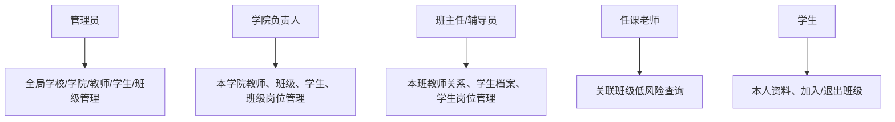

# 命令使用文档

> 核验日期：2026-05-19

本文档覆盖当前已经接通的学校、学院、专业、教师、学生、班级、组织与组织成员相关命令。

如果你想先从全局状态确认“哪些命令已经做完、哪些还在开发中、源码在哪”，请先阅读 [命令开发进度表](./command-development-progress.md)。

## 适用范围

本批命令主要围绕以下模型展开：

- 学校
- 学院
- 专业
- 教师
- 学生
- 班级
- 入班申请
- 组织
- 组织成员

## 权限说明



管理型写操作不能只看 `UserRole`，还必须在 service 层检查目标学校、学院或班级是否属于当前用户的可管理范围。

### 管理员命令

以下命令默认通过管理员扩展控制：

- `添加学校`
- `修改学校`
- `删除学校`
- `添加学院`
- `修改学院`
- `删除学院`
- `添加专业`
- `修改专业`
- `删除专业`
- `添加组织`
- `修改组织`
- `删除组织`
- `设置学院负责人`
- `取消学院负责人`

### 教师 / 班级管理命令

以下命令主要面向教师或班级管理者：

- `查询教师信息`
- `修改教师信息`
- `查询教师`
- `添加教师`
- `修改教师档案`
- `删除教师`
- `导入班级`
- `添加班级`
- `查询班级`
- `删除班级`
- `查询入班申请`
- `处理入班申请`
- `修改班级加入方式`
- `设置班级教师`
- `取消班级教师`
- `设置学生岗位`
- `取消学生岗位`

说明：

- `修改教师信息` 在当前账号尚未绑定教师身份时，会尝试创建教师信息。
- 如果当前账号已经是学生身份，则不能再通过该命令直接创建教师信息。
- `查询教师`、`添加教师`、`修改教师档案`、`删除教师` 是管理型教师档案命令；管理员可全局操作，学院负责人只能操作自己负责学院内的教师。
- `设置班级教师`、`设置学生岗位` 需要管理员、学院负责人或班主任/辅导员具备目标班级管理权限。

### 学生命令

以下命令主要面向已绑定学生身份的用户：

- `查询学生信息`
- `修改学生信息`
- `加入班级`
- `退出班级`

说明：

- 学生可以使用 `加入班级` 切换班级，但不能加入自己任教的班级。
- 学生不能通过 `修改学生信息` 自行设置班干部、班助/助教等班级岗位。

### 通用查询命令

以下命令默认所有用户都可以查询：

- `查询组织架构`
- `查询组织`
- `我的信息`

### 已绑定业务身份命令

以下命令要求当前账号已经绑定学生或教师身份：

- `加入组织`
- `退出组织`

说明：

- `加入组织` 和 `退出组织` 要求当前账号已经绑定为学生或教师。
- 如果当前账号同时拥有学生和教师身份，执行组织成员命令时建议显式携带 `学生` 或 `教师`。

## 管理员命令

### 添加学校

命令格式：

```text
添加学校 <学校名称> [地址]
```

示例：

```text
添加学校 深圳大学 广东省深圳市南山区
```

### 修改学校

命令格式：

```text
修改学校 <学校名称> <字段=值>...
```

支持字段：

- `名称`
- `地址`
- `描述`

示例：

```text
修改学校 深圳大学 地址=广东省深圳市南山区学苑大道 描述=综合性大学
修改学校 深圳大学 名称=深圳大学本部
```

### 删除学校

命令格式：

```text
删除学校 <学校名称>
```

说明：

- 会二次确认。
- 删除学校时会级联删除其下属学院、专业、班级和组织。

### 添加学院

命令格式：

```text
添加学院 <学校名称> <学院名称>
```

示例：

```text
添加学院 深圳大学 计算机与软件学院
```

### 修改学院

命令格式：

```text
修改学院 <学校名称> <学院名称> <字段=值>...
```

支持字段：

- `名称`
- `描述`

示例：

```text
修改学院 深圳大学 计算机与软件学院 描述=负责软件工程与计算机相关教学
修改学院 深圳大学 计算机与软件学院 名称=计算机学院
```

### 删除学院

命令格式：

```text
删除学院 <学校名称> <学院名称>
```

说明：

- 会二次确认。
- 删除学院时会级联删除其下属专业和班级。

### 设置学院负责人

命令格式：

```text
设置学院负责人 <学校名称> <学院名称> <教师ID>
```

说明：

- 仅管理员可用。
- 目标教师如果还没有学校或学院归属，会自动对齐到目标学院。
- 如果目标教师已经属于其他学校或学院，命令会拒绝，避免跨组织授权。

示例：

```text
设置学院负责人 深圳大学 计算机与软件学院 8
```

### 取消学院负责人

命令格式：

```text
取消学院负责人 <学校名称> <学院名称> <教师ID>
```

说明：

- 仅管理员可用。
- 只撤销 `CollegeTeacher` 中的学院负责人岗位，不删除教师档案。

### 添加专业

命令格式：

```text
添加专业 <学校名称> <学院名称> <专业名称>
```

示例：

```text
添加专业 深圳大学 计算机与软件学院 软件工程
```

### 修改专业

命令格式：

```text
修改专业 <学校名称> <学院名称> <专业名称> <字段=值>...
```

支持字段：

- `名称`
- `描述`

示例：

```text
修改专业 深圳大学 计算机与软件学院 软件工程 描述=面向工程实践的软件开发专业
修改专业 深圳大学 计算机与软件学院 软件工程 名称=软件工程实验班
```

### 删除专业

命令格式：

```text
删除专业 <学校名称> <学院名称> <专业名称>
```

说明：

- 会二次确认。
- 删除专业时会级联删除其关联班级。

### 添加组织

命令格式：

```text
添加组织 <学校名称> <组织名称> [组织类型] [组织说明]
```

支持的组织类型：

- `general` / `通用`
- `departmental` / `院系`
- `interest` / `兴趣`
- `governance` / `治理`
- `temporary` / `临时`
- `class` / `班级`

示例：

```text
添加组织 深圳大学 软件工程协会 interest 面向软件工程学生的协作组织
添加组织 深圳大学 学生事务治理组 governance
```

### 修改组织

命令格式：

```text
修改组织 <学校名称> <组织名称> <字段=值>...
```

支持字段：

- `名称`
- `类型`
- `描述`

说明：

- `类型` 支持与 `添加组织` 相同的中英文值。

示例：

```text
修改组织 深圳大学 软件工程协会 描述=负责校内技术交流活动
修改组织 深圳大学 软件工程协会 类型=interest 名称=软件工程创新协会
```

### 删除组织

命令格式：

```text
删除组织 <学校名称> <组织名称>
```

说明：

- 会二次确认。
- 删除组织时会删除对应的组织成员关系。

## 教师与班级命令

### 查询教师信息

命令格式：

```text
查询教师信息
```

别名：

- `教师信息`
- `我的教师信息`

当前会展示：

- 教师 ID 与姓名
- 归属学校、学院
- 管理班级数量与班级列表
- 当前参与的组织

### 修改教师信息

命令格式：

```text
修改教师信息 <字段=值>...
```

支持字段：

- `姓名`
- `学校`
- `学院`

说明：

- 如果当前账号还不是教师，会在校验通过后自动创建教师信息。
- 如果已经管理班级，修改学校或学院时会校验是否与现有班级归属冲突。

示例：

```text
修改教师信息 姓名=张老师 学校=深圳大学 学院=计算机与软件学院
修改教师信息 学院=人工智能学院
```

### 查询教师

命令格式：

```text
查询教师 [教师ID]
```

说明：

- 管理员可查询所有教师。
- 学院负责人只能查询自己负责学院内的教师。
- 不带 `教师ID` 时返回可见范围内的教师列表。

### 添加教师

命令格式：

```text
添加教师 <用户ID> <教师姓名> [学校名称] [学院名称]
```

说明：

- 管理员可全局添加。
- 学院负责人只能给自己负责的学院添加教师。
- 目标用户不能已经是学生身份或已绑定教师档案。

### 修改教师档案

命令格式：

```text
修改教师档案 <教师ID> <字段=值>...
```

支持字段：

- `姓名`
- `学校`
- `学院`

说明：

- 管理员可修改教师基础信息和组织归属。
- 学院负责人只能修改本学院教师的基础信息，不能调整学校或学院归属。

### 删除教师

命令格式：

```text
删除教师 <教师ID>
```

说明：

- 删除教师档案不会删除系统用户账号。
- 学院负责人不能删除自己的教师档案。

### 导入班级

命令格式：

```text
导入班级 <Excel文件>
```

必填列：

- `学校`
- `学院`
- `班级`
- `姓名`
- `学号`

常用可选列：

- `专业`
- `性别`
- `民族`
- `手机号`
- `政治面貌`
- `家庭地址`
- `家庭联系方式`
- `寝室`
- `出生日期`

说明：

- 会自动创建缺失的学院、专业、班级和学生账号。
- 如果班级已存在但不归当前教师管理，导入会直接失败。
- 如果手机号或邮箱已被其他用户占用，导入会跳过该字段更新并在结果摘要中统计。

### 添加班级

命令格式：

```text
添加班级 <班级名称> [学校名称] [学院名称] [专业名称]
```

说明：

- 需要在群聊或频道子频道中执行。
- 如果当前教师已经管理同名班级，则会把当前群绑定到该班级。
- `学校 / 学院 / 专业` 为可选项，用于补全班级归属信息。
- 如果指定了专业，则该专业必须已存在。

示例：

```text
添加班级 软件工程1班
添加班级 软件工程2班 深圳大学 计算机与软件学院 软件工程
```

### 查询班级

命令格式：

```text
查询班级 [班级ID]
```

说明：

- 不带 `班级ID` 时返回当前教师管理的全部班级。
- 带 `班级ID` 时返回单个班级的详细信息。

示例：

```text
查询班级
查询班级 12
```

### 删除班级

命令格式：

```text
删除班级 [班级ID]
```

说明：

- 群聊内不带 `班级ID` 时，默认删除当前群绑定的班级。
- 私聊中建议显式携带 `班级ID`。
- 如果班级中仍有学生，会要求 `yes/no` 二次确认。
- 删除班级时会同步删除其关联的群载体与绑定信息。

### 查询入班申请

命令格式：

```text
查询入班申请 [班级ID]
```

别名：

- `入班申请列表`

说明：

- 群聊中不带 `班级ID` 时，优先查看当前群绑定班级的申请。
- 私聊中不带 `班级ID` 时，返回当前教师全部班级的待处理申请。

### 处理入班申请

命令格式：

```text
处理入班申请 <申请ID> <通过|拒绝>
```

别名：

- `审核入班申请`

说明：

- `通过` 也支持 `同意` / `approve` / `pass`
- `拒绝` 也支持 `驳回` / `reject`

示例：

```text
处理入班申请 18 通过
处理入班申请 19 拒绝
```

### 修改班级加入方式

命令格式：

```text
修改班级加入方式 [班级ID] <加入方式>
```

支持的加入方式：

- `直接通过`
- `申请加入`
- `邀请加入`

也支持英文值：

- `direct`
- `apply`
- `invite`

示例：

```text
修改班级加入方式 12 申请加入
修改班级加入方式 12 direct
```

群聊内示例：

```text
修改班级加入方式 申请加入
```

此时命令会默认作用于当前群绑定的班级。

### 设置班级教师

命令格式：

```text
设置班级教师 <班级ID> <教师ID> <班级教师岗位>
```

支持岗位：

- `班主任` / `homeroom`
- `辅导员` / `counselor`
- `任课老师` / `teacher`

说明：

- 管理员、学院负责人、目标班级的班主任或辅导员可以执行。
- 如果教师还没有学校或学院归属，会自动对齐到班级归属。
- 如果教师已属于其他学校或学院，命令会拒绝跨组织绑定。

### 取消班级教师

命令格式：

```text
取消班级教师 <班级ID> <教师ID>
```

说明：

- 不会删除教师档案，只删除教师与班级的关系。
- 班级至少需要保留一位班主任或辅导员。

### 设置学生岗位

命令格式：

```text
设置学生岗位 <学生ID> <学生岗位>
```

常用岗位：

- `班长`
- `副班长`
- `团支书`
- `学习委员`
- `班助/助教`
- `学生`

说明：

- 管理员、学院负责人、目标班级的班主任或辅导员可以执行。
- 除 `学生` 外，其余岗位都会让用户派生 `class_cadre` 角色。

### 取消学生岗位

命令格式：

```text
取消学生岗位 <学生ID>
```

说明：

- 等价于把学生岗位恢复为普通 `student`。

## 组织查询与成员命令

### 查询组织架构

命令格式：

```text
查询组织架构 [学校名称]
```

说明：

- 不带学校名称时，返回学校列表与学校级统计。
- 指定学校名称时，返回学院、专业、班级、组织的结构化信息。

示例：

```text
查询组织架构
查询组织架构 深圳大学
```

### 查询组织

命令格式：

```text
查询组织 [学校名称] [组织名称]
```

说明：

- 不带参数时，返回按学校汇总的组织总览。
- 只带学校名称时，返回该学校下的组织列表。
- 同时带学校名称和组织名称时，返回组织详情与成员摘要。

示例：

```text
查询组织
查询组织 深圳大学
查询组织 深圳大学 软件工程协会
```

### 加入组织

命令格式：

```text
加入组织 <学校名称> <组织名称> [身份] [岗位]
```

说明：

- `身份` 只支持 `学生` / `教师`，也支持 `student` / `teacher`。
- 如果当前账号只绑定了一个业务身份，则可以省略 `身份`。
- `岗位` 为可选项，用于记录在组织中的职责。

示例：

```text
加入组织 深圳大学 软件工程协会
加入组织 深圳大学 软件工程协会 学生 干事
加入组织 深圳大学 学生事务治理组 教师 指导老师
```

### 退出组织

命令格式：

```text
退出组织 <学校名称> <组织名称> [身份]
```

示例：

```text
退出组织 深圳大学 软件工程协会
退出组织 深圳大学 软件工程协会 学生
```

## 学生命令

### 查询学生信息

命令格式：

```text
查询学生信息
```

别名：

- `学生信息`
- `我的学生信息`

当前会展示：

- 学生 ID、姓名、班级岗位
- 学校、班级、专业
- 学号、寝室、家庭联系方式等附加资料
- 当前参与的组织

### 修改学生信息

命令格式：

```text
修改学生信息 <字段=值>...
```

当前稳定支持的字段：

- `姓名`
- `电话` / `手机号`
- `邮箱`
- `宿舍`
- `学号`
- `家庭联系方式`
- `政治面貌`

说明：

- 采用 `字段=值` 形式，可一次修改多个字段。
- 班级岗位不能由学生自行修改，应由管理员、学院负责人、班主任或辅导员通过 `设置学生岗位` 维护。

示例：

```text
修改学生信息 姓名=张三 学号=20240001 宿舍=6A-302
修改学生信息 电话=13800000000 家庭联系方式=13900000000 政治面貌=团员
```

### 加入班级

命令格式：

```text
加入班级 [班级ID] [申请说明]
```

说明：

- 群聊中不带 `班级ID` 时，会默认识别当前群是否已绑定班级。
- 如果班级加入方式是 `申请加入`，则会生成入班申请，等待教师处理。
- 如果当前已经在其他班级中，系统会先询问是否切换班级。

### 退出班级

命令格式：

```text
退出班级
```

说明：

- 会提示当前所在班级并要求 `yes/no` 二次确认。

## 个人信息命令

### 我的信息

命令格式：

```text
我的信息
```

当前会展示：

- 基础账号信息
- 当前有效角色
- 所属组织列表
- 教师归属学校、学院、班级数量
- 学生归属学校、班级、专业、学生岗位

## 推荐使用顺序

如果你是在初始化一套新的学校组织数据，建议顺序如下：

1. `添加学校`
2. `添加学院`
3. `添加专业`
4. `添加组织`
5. `修改教师信息`
6. `添加班级` 或 `导入班级`
7. `修改班级加入方式`
8. 学生使用 `加入班级`
9. 教师使用 `查询入班申请` / `处理入班申请`
10. 学生或教师使用 `加入组织`

## 注意事项

- 同一学校下允许存在不同类型但同名的组织；如果查询或加入时出现歧义，建议先调整组织命名。
- `添加班级` 指定专业时不会自动创建专业；如果专业不存在，应先由管理员执行 `添加专业`。
- `导入班级` 会自动创建缺失的学院、专业、班级和学生，但不会绕过教师的学校/学院归属校验。
- 普通用户不能直接成为组织成员，必须先绑定为学生或教师。
- `Group` 当前仍然是班级群或会话绑定载体，不等于正式组织实体。
