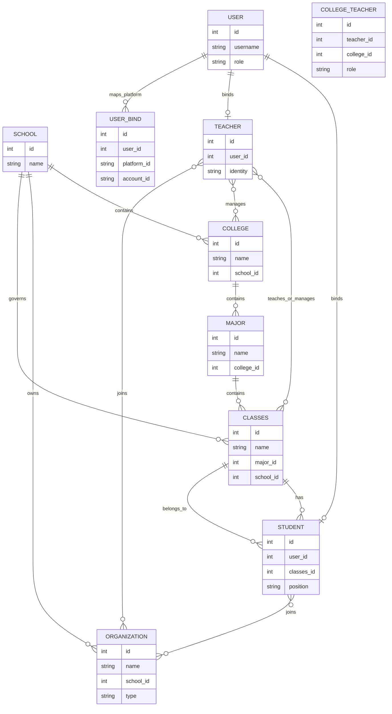
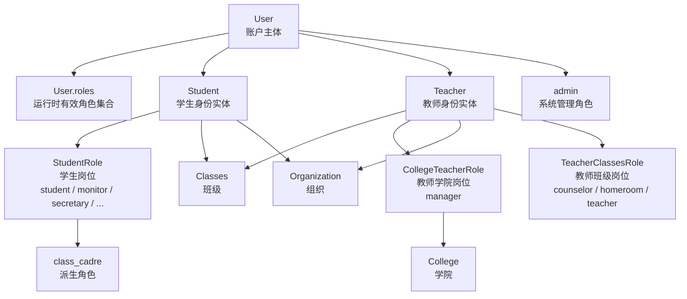

# 角色与组织关系说明

## 文档目标

本文档用于说明 ClassRobot 当前与目标中的两类核心模型：

- 角色模型：用户是谁，拥有什么权限
- 组织模型：用户属于哪个学校、学院、专业、班级、组织，以及这些权限在哪个范围内生效

这份文档既描述当前代码已经存在的结构，也描述后续推荐收敛的目标领域关系。

## 角色与组织的边界

在本项目中，下面几类概念必须区分：

- `User`：账户主体
- `Student` / `Teacher`：业务身份实体
- `StudentRole` / `TeacherClassesRole` / `CollegeTeacherRole`：组织岗位
- `School` / `College` / `Major` / `Classes` / `Organization`：组织层级与组织单元

简单说：

- 角色回答“你是谁”
- 组织回答“你属于哪里”
- 岗位回答“你在组织中担任什么职责”

## 目标组织关系

根据当前项目语义和你给出的目标约束，推荐采用以下组织关系作为统一领域模型基线。

### 组织实体关系图（ER Diagram）

该图用于描述学校域下的实体层级、主归属关系和跨组织成员关系。

## 目标约束说明

从上图展开后，核心约束如下：

1. 一个学校包含多个学院。
2. 一个学院包含多个专业。
3. 一个专业包含多个班级。
4. 一个班级包含多个学生。
5. 一个学生只能属于一个班级。
6. 一个学生可以加入多个组织。
7. 一个教师可以关联多个班级。
8. 一个班级可以关联多个教师。
9. 一个学院可以有多个学院负责人。
10. 一个教师可以负责多个学院，但权限只在对应学院内生效。
11. 一个组织可以包含学生和教师。
12. 一个组织不能包含普通用户。
13. 班级和组织都归属于学校域。

## 班级与组织的区别

### 班级

班级是稳定的教学组织单元：

- 是学生的主归属单元
- 学生通常只能拥有一个班级归属
- 可关联多个教师
- 可承载教学、事务、审批、通知等业务

### 组织

组织是非班级的协作或治理单元：

- 归属于学校域
- 成员可以是学生或教师
- 普通用户不能直接加入组织
- 学生和教师都可以加入多个组织
- 更适合承载治理组、协作组、兴趣组、临时工作组等结构

## 用户、身份、岗位的关系

除了组织层级之外，用户和身份之间还存在一层运行时关系。

### 身份与岗位关系流向图（Flowchart）

该图用于描述账户、业务身份、组织岗位与运行时角色之间的派生关系。

## 当前代码中的角色体系

当前项目里的角色并不是单一概念，而是三层并存：

1. 平台账户层角色
2. 业务身份层角色
3. 组织内岗位层角色

## 1. 平台账户层角色

这层角色关注系统级管理权限。

### `user`

- 最基础的账户身份
- 每个绑定到系统的用户都至少具备该身份

### `admin`

- 业务系统内部管理员
- 当前主要由 `User.is_admin` 表达
- 运行时会被追加到 `User.roles`

### `superuser`

- 在 `src/core/auth/system.py` 中存在定义
- 当前更偏向框架或扩展层概念
- 现阶段项目内真正生效的管理员扩展主要通过 `AdminExtension` + `user.is_admin` 判断

## 2. 业务身份层角色

这层角色定义在 `src/core/auth/__init__.py` 的 `UserRole` 中。

### `user`

- 普通用户
- 默认拥有
- 可进行基础查询、账号绑定等通用操作
- 是否具备组织成员资格，取决于是否进一步绑定为学生或教师身份

### `admin`

- 管理员
- 用于受限管理类操作
- 当前典型入口是 `AdminExtension`

### `student`

- 学生身份
- 用户绑定学生实体后自动具备

### `teacher`

- 教师身份
- 用户绑定教师实体后自动具备

### `class_cadre`

- 班干部派生身份
- 不是独立账户类型，而是从学生岗位自动派生

## 3. 组织内岗位层角色

### 学生岗位

定义在 `StudentRole` / `StudentRoleLang` 中，当前包括：

- `student`
- `monitor`
- `vice_monitor`
- `secretary`
- `study`
- `life`
- `sports`
- `organization`
- `mental`
- `publicity`
- `arts`
- `assistant`

说明：

- 除 `student` 外，其余岗位都会让用户额外获得 `class_cadre`
- `assistant` 表示班助/助教，本质仍是学生身份的班级岗位，不会把学生变成教师

### 教师在班级中的岗位

定义在 `TeacherClassesRole` 中，当前包括：

- `counselor`
- `homeroom`
- `teacher`

说明：

- 这是教师在某个班级中的岗位
- 不是全局账户身份
- 同一个教师在不同班级中可以有不同岗位
- 当前管理型班级操作默认认可 `counselor` 与 `homeroom`，普通 `teacher` 只表达任课关系

### 教师在学院中的岗位

定义在 `CollegeTeacherRole` 中，当前包括：

- `manager`

说明：

- `manager` 表示学院负责人。
- 这是教师与学院之间的关系岗位，不是 `UserRole`。
- 学院负责人只能管理自己负责学院内的教师、班级、学生和班级岗位。
- 授予或撤销学院负责人岗位必须由管理员执行。

## 当前运行时有效角色的计算方式

系统当前真正用于命令筛选的是 `User.roles`，不是单独的 `User.role` 字段。

`User.roles` 的派生逻辑大致如下：

1. 所有用户默认拥有 `user`
2. 如果 `is_admin=True`，追加 `admin`
3. 如果绑定了学生实体，追加 `student`
4. 如果绑定了教师实体，追加 `teacher`
5. 如果学生岗位不是普通学生，追加 `class_cadre`

注意：

- 学院负责人不会额外追加新的 `UserRole`。
- 命令 help 仍按 `teacher` 目录展示学院管理能力，真实执行时再由 service 校验该教师是否负责目标学院。
- 这样可以保持 `UserRole` 只表达全局身份，避免把“某学院内有效”的关系岗位误做成全局角色。

## 当前命令权限入口

命令层的权限开放主要依赖 `Helper.roles`。

筛选方式主要体现在 `Helper.is_available_for(...)` 与 `Helpers.get_roles_helpers()` 中，规则是：

- 如果命令没有声明 `roles`，默认所有用户都可见
- 如果命令声明了 `roles`，当前用户只要命中其中任一角色即可通过
- 如果命令声明了 `exclude_roles`，只要命中任一排除角色就会被拒绝

需要特别注意：

- 当前实现是“并集语义 + 排除优先”
- 也就是说，`roles={teacher, student}` 表示教师或学生都可以通过
- 如果还写了 `exclude_roles={student}`，那么学生会被显式排除
- 真实执行前，`src/platform/helper/runtime.py` 绑定的 matcher 前置 guard 还会再做一次同规则校验

因此当前应区分两件事：

- `Helper.roles`：帮助系统和 AI 可见性过滤
- 命令处理函数中的业务校验：真正执行时的限制逻辑

如果你想结合代码理解整条“用户绑定 -> 角色派生 -> help/AutoGPT 可见性 -> matcher 鉴权”链路，建议继续阅读 [src/platform/helper/README.md](../../src/platform/helper/README.md)。

## 当前代码与目标模型的对应关系

当前仓库里已经有部分结构雏形，但还没有完全达到目标模型。

### 已有的结构

- `School`
- `College`
- `Major`
- `Classes`
- `Student`
- `Teacher`
- `TeacherClasses`
- `CollegeTeacher`
- `Group`
- `Organization`
- `OrganizationMember`

### 当前已表达的关系

- 学校与学院：已建模
- 学院与专业：已建模
- 专业与班级：已通过 `Major` + `Classes.major_id` 建模
- 班级与学校：已补充 `Classes.school_id` 直接外键
- 班级与教师：已通过多对多关系建模
- 学院与负责人：已通过 `CollegeTeacher` 关系表建模
- 班级与学生：已建模
- 学生与班级：当前是一对一主归属关系
- 学生与组织：已通过 `OrganizationMember` 多对多关系建模
- 教师与组织：已通过 `OrganizationMember` 多对多关系建模
- “组织成员不能是普通用户”：已通过 `OrganizationMember.student_id / teacher_id` 互斥约束表达
- 班级与群载体：当前通过 `Group` 一对一关联

### 当前尚未完整表达的部分

- 组织内岗位目前仍使用 `OrganizationMember.position` 通用字符串表达，还不是标准化岗位字典
- `OrganizationType` 目前还是 `Organization.organization_type` 字段，还没有拆成独立主数据表
- 现有大部分业务入口仍主要围绕 `Classes + Group` 运转；组织域的基础增删改查和成员加入退出已经接入命令层，但更深的流程编排与治理仍待继续收敛
- `Group` 与 `Organization` 目前还没有形成统一的会话载体关联模型

## 对当前 `Group` 的理解

当前代码里的 `Group` 现在更适合作为“会话/群聊载体”理解：

- 班级绑定的会话/群聊载体
- 平台侧群、频道、子频道的绑定承载体

它不再适合继续承担真正的组织实体职责。原因在于：

- 当前 `Group` 与 `Classes` 是一对一关系
- 它更偏向班级群绑定
- `Organization` / `OrganizationMember` 已经承担了正式的成员型组织建模

所以更准确的结论是：

- 当前 `Group` 是通信载体
- 当前 `Organization` 是成员型组织实体
- 后续需要考虑的是两者之间是否建立显式关联，而不是再用 `Group` 代替组织

## 推荐的后续领域模型

当前已经补入以下核心实体或关系：

- `Major`
- `Organization`
- `OrganizationMember`
- `CollegeTeacher`

如果下一步继续标准化，建议进一步补足：

- `OrganizationType`
- `OrganizationRole`
- `OrganizationRoleAssignment`

现阶段已经可以通过 `Organization.organization_type` 区分：

- `class`
- `departmental`
- `interest`
- `governance`
- `temporary`

如果后续再引入 `OrganizationRole`，则组织成员治理会更接近标准的 `organization and membership` 模型。

## 当前结论

当前项目已经具备一个可运行的角色体系，也具备部分组织结构雏形，但它仍然是“逐步演进出来的实现型模型”，还不是最终统一的授权与组织模型。

现阶段可以把它概括为：

- 普通账户身份由 `User` 提供
- 学生/教师身份由绑定实体提供
- 班干部、班助/助教、班级教师和学院负责人由关系岗位提供
- 命令开放由 `Helper.roles` 控制
- 管理能力由 `is_admin`、`CollegeTeacher`、`TeacherClasses` 和命令 service 共同限制
- 学校、学院、专业、班级已经有模型基础
- 组织与组织成员关系已经进入显式建模阶段
- 组织域能力已经进入命令层，后续仍需继续向流程层和更细粒度权限层接入

这套模型足够支撑当前仓库里的主体功能，也为后续重构成更标准的 `identity and access`、`organization and membership`、`approval and governance` 模型提供了基础。
