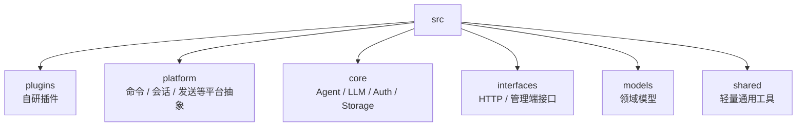
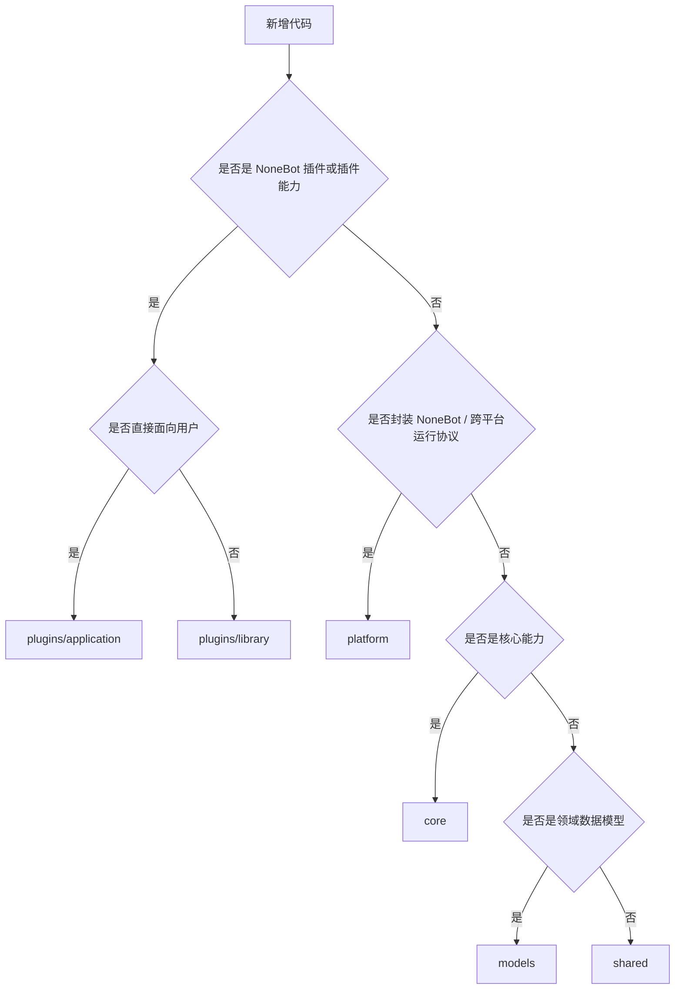
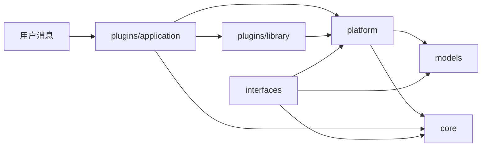
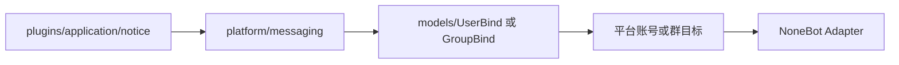

# src 代码根目录说明

`src/` 是 ClassRobot 唯一的 Python 主代码根。项目自研代码统一放在这里，顶层不再保留 `core/`、`utils/`、`src/features/` 这类旧入口。

这份文档只回答“代码应该放在哪里”。如果要看命令封装、Helper、Agent 调用、权限元数据和测试要求，请继续阅读 `src/platform/commands/README.md`。

## 目标结构

```text
src/
├── plugins/       # ClassRobot 自研 NoneBot 插件
├── platform/      # NoneBot 与跨平台聊天能力的统一抽象
├── core/          # 不依赖平台事件的核心能力
├── interfaces/    # HTTP、管理端和外部接口
├── models/        # 领域数据模型
└── shared/        # 轻量通用工具
```



## 放置判断

新增代码时，先按下面的顺序判断：



## 常见例子

| 需求 | 放置位置 | 原因 |
| --- | --- | --- |
| 班级、请假、课表、文件管理命令 | `plugins/application` | 用户主动调用的业务插件 |
| 消息历史采集与 `MessageHistory` 注入 | `plugins/library/message_history` | 给其他插件和 Agent 复用的能力插件 |
| 当前事件解析成系统用户 | `plugins/library/identity` | 依赖 NoneBot 事件和平台绑定 |
| 命令注册、帮助目录、Agent 命令适配 | `platform/commands` | 项目运行协议，不属于单个业务插件 |
| 跨平台统一发送消息 | `platform/messaging` | 统一处理用户绑定、Bot 选择和平台目标 |
| Agent、LLM、存储、授权规则 | `core` | 不应依赖具体平台事件 |
| `User`、`UserBind`、`GroupBind` 等模型 | `models` | 表达系统领域数据 |
| 字符串、模板、加密、轻量 schema 工具 | `shared` | 没有业务归属的通用能力 |

## 调用关系



跨平台通知发送的典型链路：



## 旧结构映射

这张表只作为迁移历史，帮助阅读旧提交或旧文档时理解路径变化。新代码不要再从旧路径导入。

| 当前位置 | 目标位置 |
| --- | --- |
| `src/features/*` | `src/plugins/application` 或 `src/plugins/library` |
| `utils.commands` | `src/platform/commands` |
| `utils.send` | `src/platform/messaging` |
| `utils.roles` | `src/core/auth` |
| `utils.models` | `src/models` |
| `core/*` | `src/core/*` |

## 关键约束

- 不把业务插件写进 `shared`。
- 不把跨平台发送、命令协议、会话解析写成普通工具函数。
- 不在 `plugins/application` 里堆 Agent、LLM、Storage 的核心实现。
- 不在 `plugins/library` 里承载面向最终用户的大型命令体验。
- 具体目录的内部规则看各目录自己的 `README.md`。
