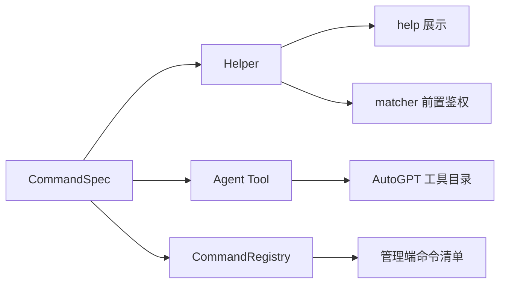
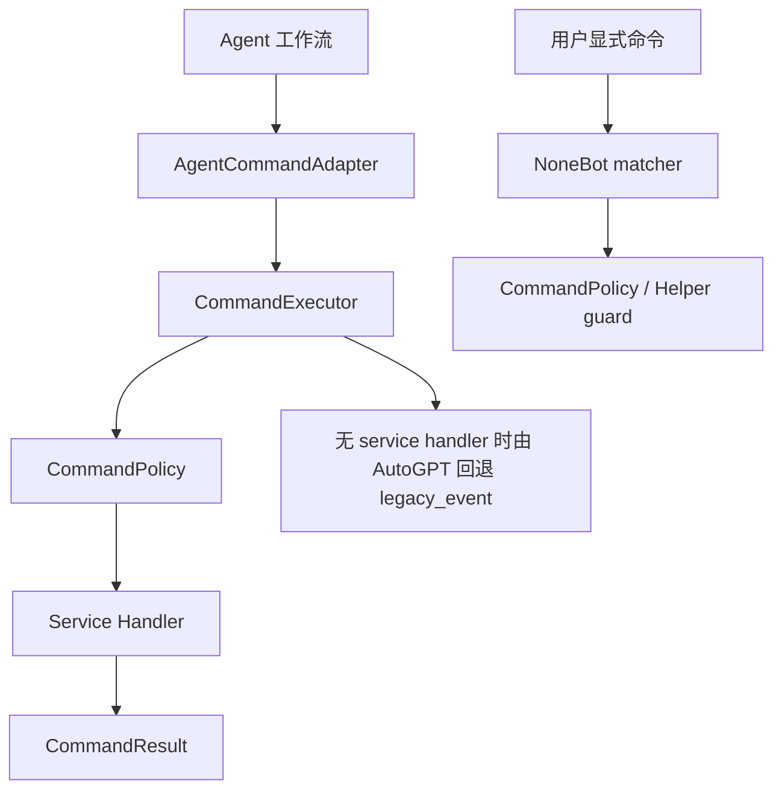

# `src/commands`

`src/commands` 是项目命令体系的统一元数据、权限策略、可用性与执行调度层。

它的目标不是一次性替换现有业务插件，而是先把命令的公共事实和运行策略收敛起来：

- 从 `on_alconna` / `on_command` 派生命令元数据
- 生成 `Helper`，供 `help` 与统一鉴权继续使用
- 生成 Agent tool schema，供 AutoGPT 规划与工具调用
- 建立 `CommandRegistry`，供管理端、插件开关与执行器使用
- 通过 `CommandAvailabilityService` 支持命令/插件软关闭
- 通过 `CommandExecutor` 支持后续 service 化命令被用户入口和 Agent 入口复用

## 当前落地状态

- `utils.helper.runtime` 已支持优先收集 matcher 上的 `__command_spec__` / `__helper__`。
- `utils.helper.depends.HelpersDepends` 已接入软关闭过滤，`help` 与 AutoGPT 会共享同一份可见命令集。
- `src.plugins.autogpt.command_tools.CommandToolCatalog` 会优先从 `CommandSpec` 生成 Agent 工具。
- `src.plugins.autogpt.dispatch_auto_task()` 会先尝试 `AgentCommandAdapter -> CommandExecutor`，没有 service handler 时回退旧的 NoneBot 事件重放。
- `src.routers.managers.nonebot_runtime` 已合并 `CommandRegistry` 元数据，管理端命令清单可以看到风险等级、执行模式、Agent 可见性和软关闭状态。
- `src.managers.user.commands` 与 `src.plugins.curriculum.commands` 已作为第一批样例迁移到 `command_alconna()`。

## 当前模块

- `schema.py`
  命令参数、风险等级、执行模式等基础结构
- `spec.py`
  `CommandSpec`，一条命令的单一事实来源
- `context.py`
  `CommandExecutionContext`，描述用户直发、Agent 工作流或系统任务的一次调用上下文
- `result.py`
  `CommandResult`，统一承载用户输出、上下文输出和结构化数据
- `binding.py`
  `command_alconna()` / `command_command()` 包装器，并保留真实业务模块归属
- `registry.py`
  进程内命令注册表
- `policy.py`
  静态角色、Agent 可调用性与可用性策略
- `availability.py`
  命令/插件软关闭服务
- `executor.py`
  service-style 命令统一执行器
- `discovery.py`
  注册表到管理端命令清单的导出层
- `session_bridge.py`
  命令结果写回 Agent 会话上下文的桥接工具
- `adapters/`
  NoneBot、Agent、旧事件重放等入口适配层
- `renderers/helper.py`
  `CommandSpec -> Helper`
- `renderers/tool.py`
  `CommandSpec -> Agent tool schema`

## 核心流程





## 使用原则

新增命令优先使用 `command_alconna()`，让参数、帮助、权限和 Agent 元数据从同一个声明派生。

旧命令可以继续保留 `__helpers__`，`utils.helper.runtime` 会兼容收集；迁移时建议逐个模块推进，不需要一次性重写所有命令。

## 新命令推荐写法

```python
from arclet.alconna import Alconna, Args, CommandMeta
from src.commands import CommandBinding, command_alconna
from utils.helper import HelperScope
from utils.roles import UserRole

query_score_cmd = command_alconna(
    Alconna(
        "查询成绩",
        Args["semester?", str],
        meta=CommandMeta(description="查询当前学生的指定学期成绩"),
    ),
    aliases={"成绩查询"},
    binding=CommandBinding(
        roles={UserRole.student},
        scopes={HelperScope.student},
        param_labels={"semester": "学期"},
        risk_level="low",
        agent_callable=True,
        execution_mode="legacy_event",
    ),
    priority=1,
    block=True,
)
```

## service 化命令推荐写法

当命令业务逻辑已经从 matcher 中抽到 service 后，可以注册到统一执行器：

```python
from src.commands import CommandExecutionContext, CommandResult, command_executor


@command_executor.handler("查询成绩")
async def query_score_service(params: dict, context: CommandExecutionContext) -> CommandResult:
    semester = params.get("学期")
    # 这里调用领域 service，不直接依赖 NoneBot matcher。
    return CommandResult.ok(f"已查询 {semester or '当前学期'} 成绩。")
```

这样 Agent 会优先走 `CommandExecutor`，用户显式命令后续也可以逐步改为复用同一 service。

## 迁移注意事项

- 不要在业务插件中直接维护第二份 Agent tool schema。
- 已迁移命令仍可暂时保留 `__helpers__`，用于兼容旧测试和旧文档；最终应逐步删除双写。
- 包装器会修正 matcher 的 `module_name`，不要手动修改 matcher 归属。
- 软关闭不是卸载插件，只是让 `help`、Agent、统一执行器和 matcher guard 一致拒绝调用。
- 多轮 `got()`、文件上传、强交互命令可以先标记为 `execution_mode="interactive"`，等 service 化后再切到 `service`。
