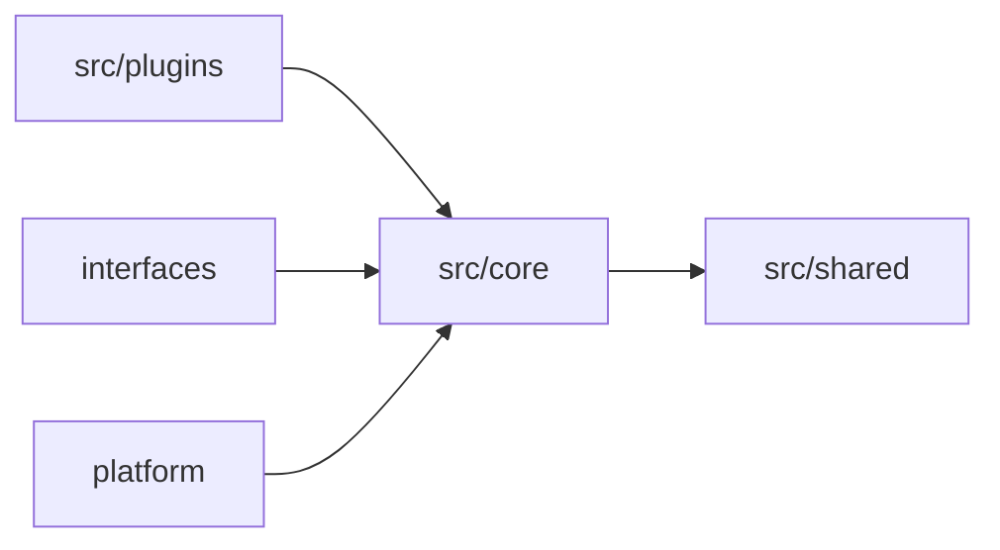

# src/core 核心能力层

`src/core` 放不依赖具体平台事件的核心能力。它可以被插件、管理端、Agent 和测试复用。

务实例外：少量核心基础设施会读取 `src.platform.config` 中的运行时路径或配置值，这是当前配置入口尚未完全下沉前的过渡约定。除此之外，`core` 不应依赖具体业务插件，也不应接收 NoneBot 事件对象。

```text
src/core/
├── agent/
├── auth/          # 角色、权限、密码散列等认证授权能力
├── cache/
├── llm/
├── skills/
└── storage/       # 文件空间、聊天历史、对象存储
```

## 放什么

- Agent 工作流、记忆检索、工具调用编排。
- LLM 客户端、模型选择、提示词执行相关能力。
- 存储、缓存、文件空间、聊天历史事实层。
- 授权规则、角色策略、权限点定义。
- Skill 注册、加载和执行能力。
- 对象存储上传、密码散列等核心基础设施能力。

## 不放什么

- NoneBot matcher、事件对象、Bot 实例。
- 具体业务插件命令。
- 管理端 HTTP 路由。
- 简单工具函数。

## 调用关系



## 扩展规则

- 能力需要脱离聊天平台独立测试时，优先考虑放在 `src/core`。
- 如果实现依赖 NoneBot 事件或平台 Bot，通常不应放在 `src/core`。
