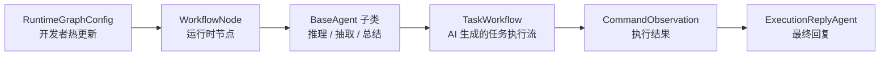

# Agent 核心开发指南

`src.core.agent` 是 ClassRobot 唯一的 Agent 标准入口。以后只有继承 `BaseAgent` 或 `BaseFunctionAgent` 的对象，才允许命名为 `Agent`。

如果你看到的是 `RuntimeContext`、`WorkflowNode`、`SkillCatalog`、`Retriever`、`RuntimeNodeDefinition` 这类对象，它们属于运行时组件，不属于 Agent。

## 先看什么

- `src/core/agent/base.py`
  - `BaseAgent`、`BaseFunctionAgent`、`BaseAgentConfig`
- `src/core/agent/agent.py`
  - `ToolCallingAgent`、`ToolCallingAgentConfig`、`AgentSession`
- `src/core/agent/builtin/`
  - 内置 Agent 示例
- `src/core/agent/runtime/README.md`
  - AutoGPT 运行时如何编排和调用 Agent

## 标准写法

每个 Agent 都必须显式声明 `config`，不要把运行参数散落在类字段里。

```python
from pydantic import BaseModel, Field

from src.core.agent import BaseAgent, BaseAgentConfig
from src.core.llm.message import Messages


class LLMConfig(BaseAgentConfig):
    llm_name: str
    api_base: str | None = None
    api_key: str | None = None
    temperature: float = 0.1


class LLMAgent(BaseAgent):
    agent_name = "llm_agent"
    display_name = "通用大模型智能体"
    capabilities = ("chat", "planning")
    risk_level = "low"

    config: LLMConfig = Field(default_factory=lambda: LLMConfig(llm_name="default"))

    async def execute(self, messages: Messages) -> Messages:
        return messages
```

## 必须实现什么

- 类级元数据：
  - `agent_name`
  - `display_name`
  - `capabilities`
  - `risk_level`
- 实例字段：
  - `config: XxxAgentConfig`
- 核心方法：
  - `execute(messages)`

`BaseAgent` 已统一提供这些能力：

- `iter_agent_classes()`
- `get_agent_class()`
- `create()`
- `as_tool()`
- `metadata()`
- `config_schema()`

## `config` 和 `Params` 的区别

- `config`
  - Agent 自身的运行配置。
  - 适合放模型名、温度、超时、检索策略、默认指令、风险开关。
- `Params`
  - 当 Agent 被其他 Agent 当成 function/tool 调用时的输入参数。
  - 适合放一次工具调用真正要传入的用户参数。

示例：

```python
class QueryUserConfig(BaseAgentConfig):
    llm_name: str = "Doubao-Seed-1.6"


class QueryUserAgent(BaseFunctionAgent):
    config: QueryUserConfig = Field(default_factory=QueryUserConfig)

    class Params(BaseModel):
        user_id: int = Field(description="系统用户 ID")
```

## 如何增加新配置参数

1. 在 `XxxAgentConfig` 中增加字段。
2. 在 `execute()` 或其他公开方法里消费 `self.config.xxx`。
3. 如果需要兼容旧调用方式，继续允许调用方传散装字段。
   `BaseAgent` 会把与 `config` 同名的旧字段自动折叠进 `config`。
4. 如果该 Agent 需要接入管理端编排，把字段同步到节点级 `agent_config` 解析逻辑。

## 什么时候写 Agent，什么时候不要写

适合写 Agent：

- 需要模型推理、规划、工具循环、总结、抽取、检索整合。
- 需要把命令、Skill、RAG 或本地记忆 observation 汇总成面向用户的最终回复。

不适合写 Agent：

- 只是保存状态。
- 只是描述编排图节点。
- 只是列出 Skill 或命令目录。
- 只是做文件检索、聊天记录检索、路径解析。

这些情况应分别命名为：

- `WorkflowNode`
- `RuntimeContext`
- `SkillCatalog`
- `LocalKnowledgeRetriever`
- `RuntimeGraphConfig`

## Runtime 图和任务流

Agent 只负责执行智能能力，不负责代表运行时编排图本身。



开发者如果要改“消息先经过哪些阶段”，应改 `src.core.agent.runtime.orchestration_config` 和管理端图配置。如果要改“某个阶段如何推理、抽取、总结”，才新增或修改 `BaseAgent` 子类。

`ExecutionReplyAgent` 是内置 Agent 示例：它不执行命令，而是把 `TaskWorkflow` 和 `CommandObservation` 汇总成用户能直接理解的回复。类似能力应优先通过 prompt、上下文契约和 observation 质量优化，只有缺少执行边界或数据流时才改代码。

## Prompt-first 规则

Agent 问题不要先假设是代码问题。先判断：

- 上下文是不是没喂对。
- Prompt 有没有把规则说清楚。
- Tool / Command / Skill 描述是否足够让模型正确选择。
- Observation 是否有写回上下文。

只有这些都没问题，且能力、权限、状态机、隐私边界真的缺失时，才优先改代码。

## 测试入口

- `tests/autogpt/test_agent_standard.py`
- `tests/autogpt/test_vision_pipeline.py`
- `tests/autogpt/test_harness.py`
- `tests/autogpt/test_orchestration_config.py`

建议修改 Agent 后至少运行：

```powershell
D:\Software\anaconda3\envs\classbot\python.exe -m pytest tests\autogpt -q
```
