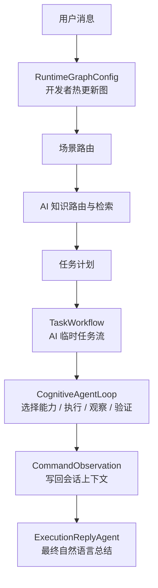
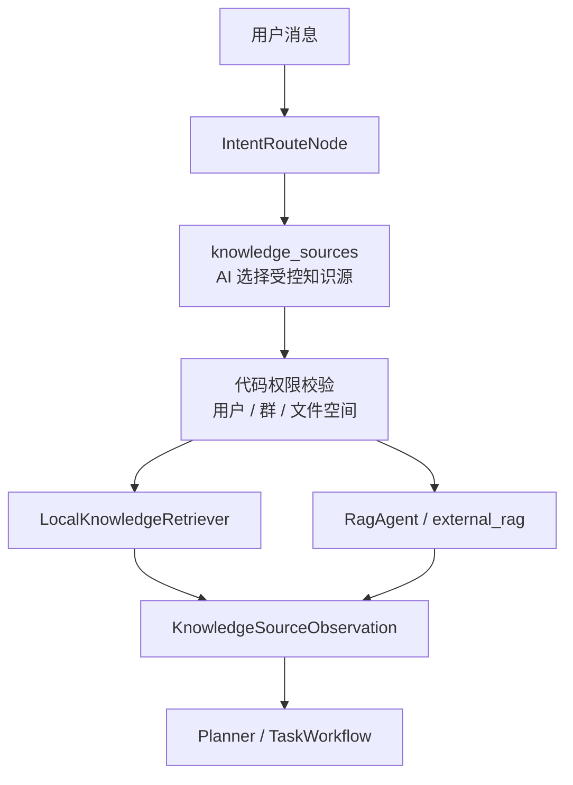
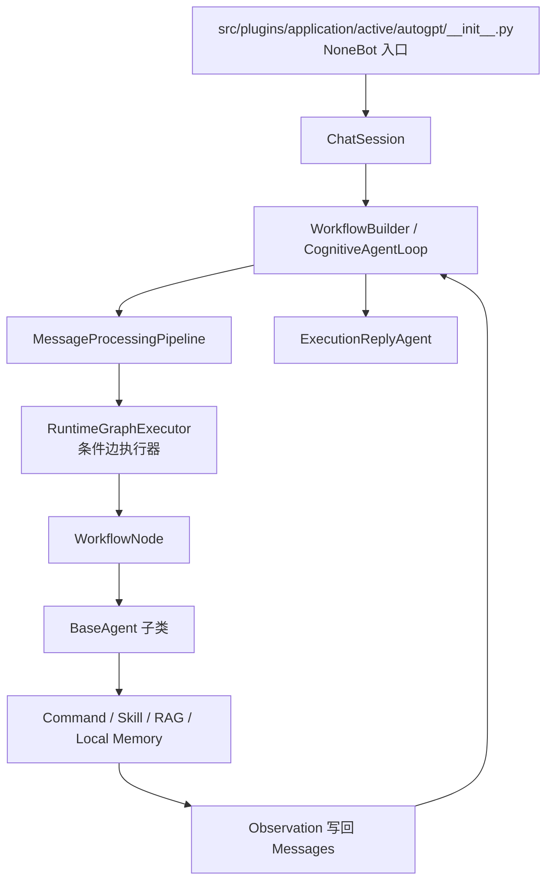

# AutoGPT Runtime 开发指南

`src.core.agent.runtime` 是 AutoGPT 的真实运行时层。`src/plugins/application/active/autogpt/__init__.py` 现在只负责 NoneBot 消息入口、会话接线和结果发送；重逻辑统一放在这里。

## 模块边界

- `pipeline.py`
  - 组织一次消息处理链路，并读取热更新后的运行时图。
- `coordination/`
  - 工作流节点和状态对象。
- `execution/`
  - 统一执行协议、ActionExecutor 注册表，以及 AutoTask 到 service command 的调度适配。
- `harness/`
  - 策略、上下文、可观测性装配层。
- `knowledge.py`
  - 受控知识源检索、本地聊天、文件空间、本地 RAG 和 Skill 目录。
- `workflow.py`
  - 显式工作流构建、审批语义和执行器。
- `loop.py`
  - 观察驱动循环、循环预算锁、Observation 事实化和能力目录契约。
- `orchestration_config.py`
  - 运行时图编排配置、热更新、默认图和图校验。
- `node_registry.py`
  - 编排画布可见节点目录。
- `schema.py`
  - AutoGPT Runtime 的结构化数据协议。

## 双层工作流

AutoGPT Runtime 里现在固定区分两层工作流，后续开发不要再混用名称。

| 层级 | 对象 | 控制权 | 作用 |
| --- | --- | --- | --- |
| 运行时编排图 | `RuntimeGraphConfig` | 开发者和管理端 | 决定一轮消息进入系统后依次经过哪些 Runtime 节点，以及分支条件和模型角色 |
| AI 任务执行流 | `TaskWorkflow` | AI 在系统约束内生成 | 决定本轮用户目标要执行哪些 command、skill、confirm、respond 或 schedule 步骤 |

运行时编排图是系统控制面，AI 不能修改。AI 只能在运行时图约束下生成 `TaskWorkflow`，再由执行器校验、执行、记录 observation，最后交给回复 Agent 汇总给用户。

## Agent Host 与多 Agent 委派

运行时现在增加 `AgentHost` 作为一轮用户消息的控制面封装。它不替代现有 `MessageProcessingPipeline` 和 `CognitiveAgentLoop`，而是先把每轮消息统一包成 `TurnEnvelope`，再生成分层 `ContextPack`、专长 Agent handoff 记录和 `TurnOutputBundle`。

第一版专长 Agent 目录由 `AgentCatalog` 声明，包含：

- `workflow_supervisor`
- `conversation_agent`
- `knowledge_agent`
- `realtime_lookup_agent`
- `execution_agent`
- `reply_synthesis_agent`

这些 Agent 目前由 Host 统一委派和审计，不允许自由递归调用。子 Agent 只能看到自己声明的 context layer，例如 `turn_context`、`workflow_context` 或 `tool_state_context`，后续长期记忆、token budget 和权限切片都应挂到 `ContextEngine`。

执行层新增 `ActionRequest` / `ActionResult` / `ActionExecutorRegistry` 协议，用来逐步把 command、MCP、Skill、RAG、schedule 和 delegate 收敛到同一条 `ToolObservation` 后处理链。当前 command 与 MCP 执行前已经会构造 `ActionRequest` 并写入 live trace，后续替换具体执行器时不要绕过这个契约。

回复层新增 `ReplyEnvelope` / `ReplyPolicy`，用于统一 progress、确认、最终回复和失败回复的用户可见输出边界。平台入口应优先发送 Host 产出的 `ReplyEnvelope`，不能直接信任旧的 `auto_tasks.reply`。如果回复文案声明“我去查/调用工具”，但本轮没有 workflow step，Host 会改写成“未实际执行”的诚实说明，避免空 workflow 假装成功。

`ContextPack` 会携带最近的最终回复记录和工具 observation 摘要，供“第五条是什么”“用中文说”“继续刚才的”这类追问优先承接上轮结果。完整 raw output 仍只属于审计或日志，不进入普通上下文切片。



## 观察驱动循环

`CognitiveAgentLoop` 是任务执行层的新标准，不再为某个业务场景写死“先查再建再查”的过程代码，而是用同一套通用闭环处理任务、班级、通知、课表等能力：

```text
理解目标 -> 选择能力 -> 执行一步 -> 读取观察 -> 自我修正规划 -> 验证结果 -> 总结/追问
```

循环中的核心对象：

- `CapabilityCatalog`
  - 当前用户可见且可由 Agent 调用的能力目录。第一版承接 service-style command，后续 skill、RAG、schedule 按同一契约加入。
- `ObservationFact`
  - 把 `CommandObservation` 转成结构化事实，例如 `exists=false`、`changed=true`、`verified=false`。
- `AgentLoopDecision`
  - 单轮下一步动作，只保存可审计摘要，不保存冗长推理。
- `LoopBudget`
  - 代码强制的循环锁，负责最大步数、最大验证次数、重复动作次数和运行时间上限。

已有 `TaskWorkflow.steps` 会作为候选步骤进入循环；每步执行后都会解释 observation。若 observation 显示“需要验证”或“目标不存在且可继续处理”，循环可通过 `resources/prompts/agent_loop_decision.jinja` 让监督模型基于能力目录决定下一步。模型只能选择能力目录中的能力，不能绕过权限、可见性、风险确认或循环预算。

## 循环锁配置

循环锁是启动级硬配置，写在 `.env`，不是热更新配置，也不是 prompt 建议：

```dotenv
AGENT_LOOP_MAX_STEPS=8
AGENT_LOOP_MAX_VERIFY_ATTEMPTS=3
AGENT_LOOP_MAX_REPEAT_ACTIONS=2
AGENT_LOOP_MAX_RUNTIME_SECONDS=120
```

含义：

- `AGENT_LOOP_MAX_STEPS`
  - 单轮最多执行多少次 act-observe 动作。
- `AGENT_LOOP_MAX_VERIFY_ATTEMPTS`
  - 同一验证目标最多验证多少次。
- `AGENT_LOOP_MAX_REPEAT_ACTIONS`
  - 同一命令和同一参数最多重复多少次。
- `AGENT_LOOP_MAX_RUNTIME_SECONDS`
  - 单轮循环最长运行秒数。

达到上限后，循环必须停止，并基于已有 observation 说明已经尝试了哪些步骤、为什么停止、用户可以怎样继续。不能静默失败，也不能编造成已经成功。

## AI 知识路由

本地历史和文件检索不再由关键词触发。入口路由器会在 `IntentRoute.knowledge_sources` 中声明本轮需要哪些受控知识源，运行时只负责校验权限、执行检索和写回 observation。

可选知识源：

- `user_chat_history`
  - 当前用户与机器人的历史聊天。
- `group_chat_history`
  - 当前绑定系统群的群聊采集消息。
- `user_file_space`
  - 当前用户自己的文件空间。
- `group_file_space`
  - 当前绑定系统群的文件空间。
- `external_rag`
  - 外部知识库，例如校规、制度、学校资料或公共知识库。

关键边界：

- AI 负责判断“用户目标需要查哪里”，不要再把“刚才、文件、聊天记录”等关键词作为主决策规则。
- 代码负责判断“当前用户能不能查”，不能读取其它用户私聊，也不能把平台 `channel_id` 当成系统群 ID 直接读取。
- 每个来源都会生成结构化 observation，包含 `source`、`query`、`status`、`confidence`、`items_count` 和摘要。
- `status=miss`、`status=skipped` 或检索失败时，后续 Planner 和回复不能编造成已查到。



## Agent 决策层不做关键词预路由

默认运行时图已经移除 `local_context`、`local_chat_statistics` 这类抢跑节点。身份、班级、课表、聊天统计等需求都应通过 `IntentRoute -> Planner -> service command` 的统一链路处理：

- Runtime 暴露当前用户可见的完整 service command catalog 和 Skill catalog。
- Route / Planner 依据用户目标和能力描述做语义选择。
- 代码只做权限、参数、风险、执行入口和 observation 回填校验。
- 聊天统计作为“统计聊天记录” service-style command 暴露给 Agent，而不是在路由前用字符串规则拦截。
- RAG、文件搜索、后台筛选中的关键词检索属于工具内部实现，不参与 Agent 路径决策。

## 外部实时信息

新闻、热点、热搜、当前动态和其它最新公共信息不属于项目内部命令。运行时通过 `RuntimeCapabilityCatalog` 告诉模型当前是否存在实时公共外部能力：

- 如果存在 `freshness=realtime`、`scope=public_external` 的 MCP tool，Planner 可以把真实工具名写入 `candidate_mcp_tools`，后续任务流生成 `mcp_tool` 步骤。
- 如果不存在实时外部能力，路由或规划阶段应设置 `unavailable_reason="realtime_source_missing"`，最终回复自然说明当前没有可用实时检索工具。
- 不允许把实时新闻问题降级成“请说明要执行哪个项目命令”，也不允许编造不存在的 MCP 工具。

这层不是关键词预路由。模型仍根据语义判断用户目标，代码只根据模型声明的能力需求和真实能力目录做可用性校验。

普通 `chat` 分支也不能直接信任 `IntentRoute.reply`。路由器只输出分流判断；最终直答由 `direct_chat_reply` prompt 生成，并再次看到能力目录。如果路由器误把“最近热点”当成普通聊天，直答回复器仍应说明缺少实时检索能力，而不是发送“我在，有什么需要……”这类空泛回复。

## 用户可见进度

内部阶段标签如 `route`、`extract`、`plan` 只用于日志和 observability，默认不发给用户。普通问答应尽快给最终回复；只有本地记忆检索、外部 RAG、MCP 调用、多步执行或明显耗时任务才发送 1 到 2 条自然语言进度。

用户可见进度不要包含 `route:`、`extract:`、`plan:` 等内部术语。需要展示时，说清楚用户关心的动作，例如“我正在检索相关资料”或“我正在整理工具返回的结果”。

## 开发态 Live Trace

运行时提供开发态实时观测层，用于后台管理页通过 WebSocket 查看一条消息当前走到哪里。它与持久化的 `AgentWorkflowRun` / `AgentWorkflowCheckpoint` 分层：

- live trace 保存在进程内 `AgentLiveTraceRegistry`，用于正在运行和刚完成的 trace。
- 历史审计仍写入数据库的 workflow run/checkpoint，避免把高频调试事件长期塞进 `workflow_data`。
- 参数预览由 `AgentTraceRedactor` 脱敏并截断，token、cookie、authorization、api key 等字段不会直出。
- 后台接口位于 `/api/v1/manager/agents/live/status`、`/api/v1/manager/agents/live/traces`、`/api/v1/manager/agents/live/traces/{trace_id}`。

默认配置关闭：

```dotenv
AGENT_LIVE_TRACE_ENABLED=false
AGENT_LIVE_TRACE_MAX_TRACES=50
AGENT_LIVE_TRACE_MAX_EVENTS_PER_TRACE=400
AGENT_LIVE_TRACE_RETENTION_SECONDS=1800
AGENT_LIVE_TRACE_INCLUDE_DEBUG_PREVIEW=true
```

启用后，Host turn、ContextPack、Agent handoff、Runtime 节点、LLM 请求、MCP `tools/list`、MCP `tools/call`、command dispatch、quality gate、observation、reply 和 persist 都会产生结构化事件。这个能力只用于开发排障，不改变用户消息主链路，也不替代普通日志。

## 调用链



## 默认编排图

系统默认编排链路就是外部最初的 AutoGPT 主流程，现在由 `default_graph_config()` 显式生成，而不是藏在一串硬编码 `if/else` 里。

节点目录由 `node_registry.py` 定义，运行时编排由 `orchestration_config.py` 加载和热更新。

每个节点要区分三种概念：

- `node_type`
  - 画布上的运行时节点类型。
- `agent_name`
  - 节点内部最终要实例化的 Agent 类型。
- `agent_config`
  - 传给 Agent 的运行配置。

默认图是一张受限 DAG，会按内置条件选择下一跳：

- `has_auto_tasks`
  - 上游已经产生直接回复、确定性命令或待确认任务时，直接进入持久化节点。
- `needs_local_knowledge`
  - `IntentRoute.knowledge_sources` 中包含本地知识源时，进入本地 RAG；不再用关键词判断。
- `direct_vision_reply`
  - 简单图片问答不需要命令或检索时，直接走视觉回复。
- `needs_external_rag`
  - `knowledge_sources` 包含 `external_rag`、路由 `requires_rag=true` 或 Planner 明确需要外部知识库时，进入外部 RAG。
- `always`
  - 作为同源节点的兜底边，必须放在更具体条件之后。

热更新配置写入 `resources/agent/agent_orchestration_runtime.json`，实际目录由 `src.platform.config.agent_resources_dir` 决定。配置非法时运行时会回退默认图，并在快照中记录 warning。

## 模型角色

`RuntimeGraphConfig.model_profiles` 支持开发者给不同职责绑定模型：

- `supervisor_model`
  - 路由、任务流设计、风险监督和最终回复。
- `worker_model`
  - 抽取、检索摘要、低成本中间整理。
- `vision_model`
  - 图片和文件理解。
- `summary_model`
  - 长上下文压缩。

节点可以在 `node.config` 中写 `model` 或 `llm_name` 直接指定模型，也可以写 `model_profile` 指向上面的角色。没有显式配置时，运行时按节点定义和 LLM 任务类型自动选择角色，再回退到全局默认 LLM 配置。

## 执行后最终回复

AI 代替用户执行命令后，不能只把命令原始输出丢给用户。标准链路是：

1. `CognitiveAgentLoop` 执行 `TaskWorkflow` 步骤，并在每步后读取 observation 和循环预算。
2. 每个命令返回 `CommandObservation`。
3. `ChatSession.record_observations()` 把紧凑结果写回会话上下文。
4. `ExecutionReplyAgent` 基于 workflow、observation 和短原始输出生成最终自然语言回复。
5. `ChatSession.record_final_reply()` 把用户最终真正看到的回复写回会话，供下一轮“第五条是什么”“用中文说”继续复用。

这让行为更接近 Claude Code / Codex 的“执行工具后总结结果”体验，同时保留命令输出作为可审计 observation。

## 观察质量门

`ObservationQualityGate` 会在 command / MCP / RAG observation 进入最终回复前补齐质量字段：

- `relevance`
- `answer_quality`
- `display_summary`
- `context_summary`
- `next_actions`

它的目标不是做复杂语义裁决，而是拦住几个确定性错误：

- 工具成功但结果明显跑偏。
- 空结果被当成答案。
- raw output 直接被兜底发送给用户。

当最终回复器失败或超时，运行时必须回退到安全摘要，而不是原始输出。

## 如何增加一个新节点

1. 在 `coordination/nodes.py` 或新的节点模块里新增 `WorkflowNode` 子类。
2. 在 `node_registry.py` 注册对应 `RuntimeNodeDefinition`。
3. 如果节点内部会调用 Agent，优先通过 `BaseAgent.create(agent_name, config=...)` 实例化。
4. 如果节点需要写入管理端草稿配置，把字段同步到管理端 schema。
5. 补 `tests/autogpt/test_orchestration_config.py` 和相关行为测试。

## 如何让节点调用 Agent

推荐模式：

```python
agent = BaseAgent.create(
    "extract_agent",
    config={"some_flag": True},
    messages=pipeline.messages,
)
result = await agent.execute(pipeline.messages)
```

不要把 `RuntimeContext`、`WorkflowNode` 或 `Retriever` 直接命名成 Agent。

## 热更新规则

- Agent 运行时编排图保存到 `resources/agent/agent_orchestration_runtime.json`，路径由 `src.platform.config.agent_resources_dir` 统一提供。
- 运行时通过 `mtime` 检测自动重载。
- 图无效时退回默认编排图，并记录 warning。
- 管理端看到的是 `WorkflowGraph` 和 `RuntimeNodeDefinition`，不是随意拼出来的匿名步骤。

## Prompt-first 规则

在这里做 Agent Runtime 开发时，先问自己：

- 是不是 Prompt 不够清晰？
- 是不是 observation 回填不够好？
- 是不是 command / skill 描述太弱？
- 是不是上下文召回策略需要改？

如果答案是“是”，先改 Prompt、目录描述、上下文契约；不要急着把问题硬编码成分支。

## 测试入口

- `tests/autogpt/test_harness.py`
- `tests/autogpt/test_knowledge.py`
- `tests/autogpt/test_orchestration_config.py`
- `tests/autogpt/test_agent_loop.py`
- `tests/autogpt/test_workflow.py`
- `tests/autogpt/test_session.py`
