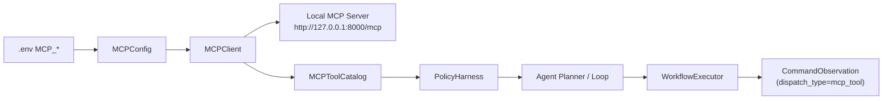

# MCP Client Integration

`src.core.mcp` 是 ClassRobot 的 MCP Client/Host 接入层。它负责连接外部 MCP server，把远端 tools 转成 Agent 能理解的能力目录，并把调用结果转成 workflow observation。

当前项目仍使用 Pydantic v1，而官方 `mcp` Python SDK 需要 Pydantic v2。`MCPClient` 会优先尝试官方 SDK；当 SDK 不可用时，自动回退到轻量 Streamable HTTP JSON-RPC 客户端，避免为了 MCP 接入破坏现有项目依赖树。



## Configuration

启动级配置写在 `.env`：

```env
MCP_ENABLED=true
MCP_SERVER_URL=http://127.0.0.1:8000/mcp
MCP_TRANSPORT=streamable_http
MCP_TIMEOUT=10
MCP_AUTH_TOKEN=
MCP_TOOL_ALLOWLIST=[]
```

`MCP_TOOL_ALLOWLIST=[]` 表示允许当前 MCP server 暴露的全部 tools。非空时只允许列表中的 tool 进入 Agent 能力目录。

## Public Entry Points

- `MCPConfig`：解析 `.env` / NoneBot driver config。
- `MCPClient.list_tools()`：读取远端 MCP tools。
- `MCPClient.call_tool(name, arguments)`：调用远端 MCP tool。
- `MCPToolCatalog`：把 MCP tools 渲染给 prompt 和 Agent loop。
- `mcp_result_to_observation()`：把远端结果写回 workflow observation。

## Agent Boundary

MCP 是外部集成协议层，不是 Agent 本身，也不替代项目内部命令。校园业务写操作仍优先走 `src.platform.commands` 和领域 service；MCP 用于外部系统、跨应用工具和标准协议互联。

Agent 只能选择 `MCPToolCatalog` 中真实存在且通过 allowlist 的 tool。MCP server 不会获得完整会话历史，只接收本次 tool 调用所需参数。

## Testing

测试不依赖真实本机 MCP 服务。新增测试应 mock `MCPClient.list_tools()` / `MCPClient.call_tool()`，覆盖配置解析、目录渲染、执行观察和失败降级。
