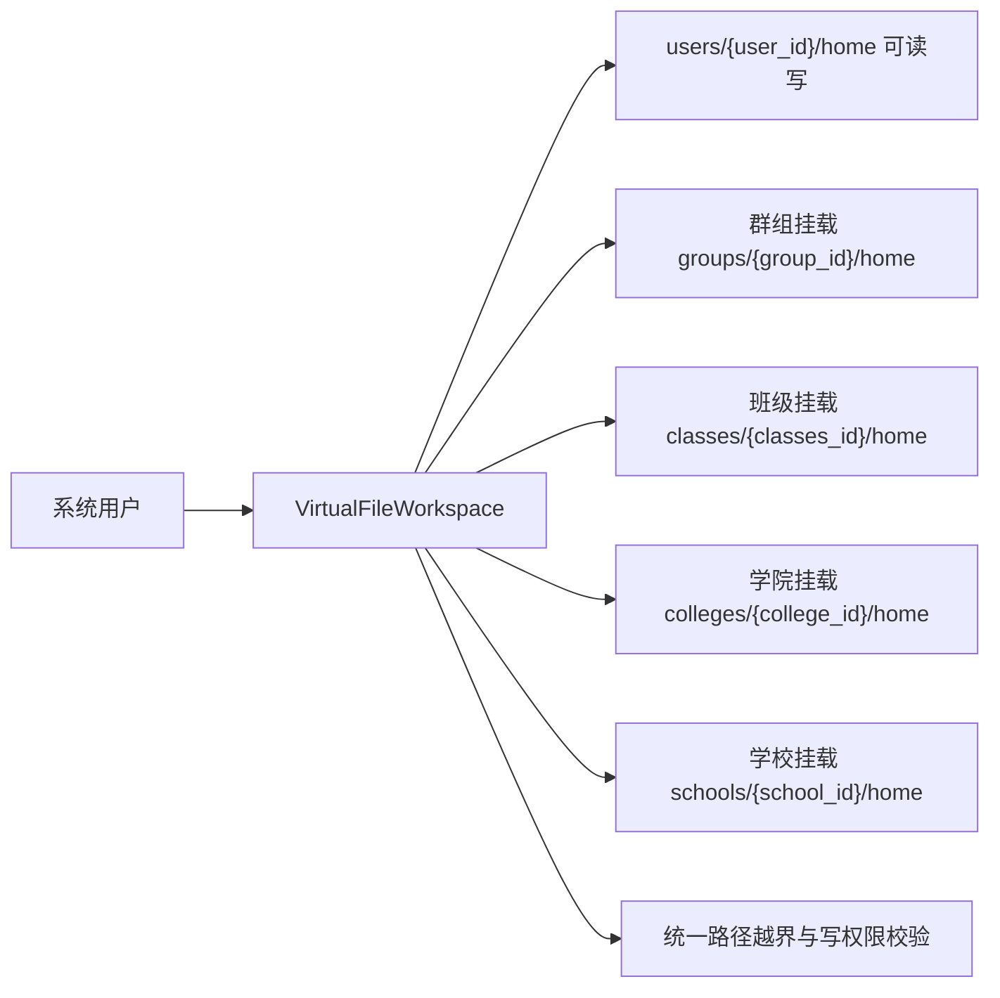
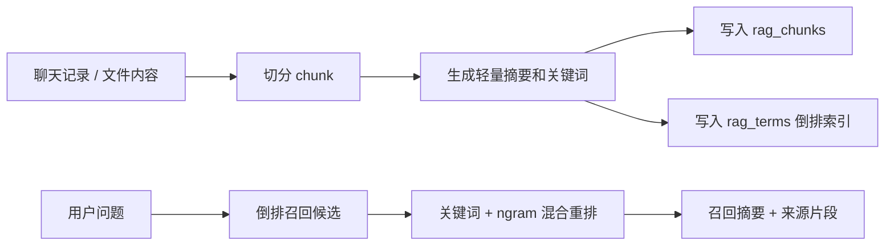

# 隔离文件空间

`src.core.storage` 提供和 NoneBot 解耦的文件空间能力，用于把个人用户、群组、班级、学院、学校、公共系统文件隔离到 `{data_dir}/storage` 下。

其中：

- `users/{user_id}` 永远使用系统内 `User.id`。
- `groups/{group_id}` 永远使用系统内 `Group.id`。
- `classes/{classes_id}` 永远使用系统内 `Classes.id`。
- `colleges/{college_id}` 永远使用系统内 `College.id`。
- `schools/{school_id}` 永远使用系统内 `School.id`。
- 平台账号、平台群号、频道号以及 `UserBind` / `GroupBind` 自身主键只负责“绑定解析”，不能直接作为用户或群组文件空间目录名。

## 基础结构

```text
{data_dir}/storage/
├── public/
├── groups/{group_id}/
│   ├── chat/
│   └── home/
│       ├── documents/
│       ├── videos/
│       ├── images/
│       └── audio/
├── classes/{classes_id}/
│   ├── chat/
│   └── home/
│       ├── documents/
│       ├── videos/
│       ├── images/
│       └── audio/
├── colleges/{college_id}/
│   ├── chat/
│   └── home/
│       ├── documents/
│       ├── videos/
│       ├── images/
│       └── audio/
├── schools/{school_id}/
│   ├── chat/
│   └── home/
│       ├── documents/
│       ├── videos/
│       ├── images/
│       └── audio/
└── users/{user_id}/
    ├── chat/
    └── home/
        ├── documents/
        ├── videos/
        ├── images/
        └── audio/
```

## 聊天记录约定

`chat` 目录不仅保存运行时状态，也用于承载消息历史数据库：

- 系统群环境采集消息：
  - `storage/groups/{system_group_id}/chat/messages.db`
- 用户聊天消息：
  - `storage/users/{user_id}/chat/messages.db`
  - `storage/users/{user_id}/chat/daily/YYYY-MM-DD.jsonl`
- 机器人回复消息：
  - 按回复目标落到对应的 `groups/{system_group_id}` 或 `users/{user_id}` 空间

这里的 `system_group_id` 指系统内 `Group.id`，不是平台原始群号。

`messages.db` 是结构化查询和统计的主索引；用户空间下的 `daily/*.jsonl` 是按日期追加的聊天时间线镜像。这样后续做“查看某天聊天记录”“导出某天历史”“按日期构建长期记忆”时，不需要先扫描整库。每日镜像只在数据库成功插入新消息后写入，因此重复消息不会重复追加。

补充业务规则：

- 群聊消息采集会在首次遇到平台群时自动创建系统 `Group` / `GroupBind`。
- 因此 `storage/groups/{system_group_id}` 使用的永远是系统群主键，而不是平台群号。
- 如果该平台群后续被创建为正式班级群，系统会继续复用同一个 `Group.id` 与对应存储目录，不会迁移到新的群目录。

当前统一消息表为 `messages`，并通过 `record_kind` 和 `direction` 区分：

- `collect`
  - 系统群环境采集消息
- `chat`
  - 人机聊天消息，包括私聊聊天、命令回复和群内机器人回复
- `inbound`
  - 用户或平台发给机器人的消息
- `outbound`
  - 机器人发出的消息

这样做的目的，是让 Agent 和后续开发能直接知道：

- 要看群环境上下文，就去系统群空间读 `collect`
- 要看人机聊天流，就读对应空间的 `chat`
- 要区分用户输入和机器人输出，就过滤 `direction`

## 使用方式

```python
from src.core.storage import storage_manager

space = storage_manager.user_space(user.id)
space.mkdir("documents/project")
space.cd("documents/project")
space.touch("readme.txt")
display, entries = space.list_entries()

class_space = storage_manager.class_space(classes.id)
college_space = storage_manager.college_space(college.id)
school_space = storage_manager.school_space(school.id)
```

如果业务上需要删除整个用户或群组空间，而不只是删除 `home` 内的单个文件，可以直接使用：

```python
from src.core.storage import storage_manager

storage_manager.delete_user_space(user.id)
storage_manager.delete_group_space(group.id)
storage_manager.delete_class_space(classes.id)
storage_manager.delete_college_space(college.id)
storage_manager.delete_school_space(school.id)
```

这些方法会一次性清理对应空间下的 `chat`、`home` 以及未来新增的其它子目录，适合账号注销、班级解散、群组删除、学院或学校归档等场景。

如果业务入口拿到的是平台群号，而不是系统 `Group.id`，应先通过绑定关系解析出系统群组，再调用 `group_space()`；不要直接写成 `group_space(channel_id)`。

## 安全规则

- `home` 是用户可访问根目录，对外展示为 `~`。
- `chat` 用于会话记录和运行状态，不会被文件命令当作用户路径暴露。
- 所有用户输入路径都会被拆分并重新拼接到当前 `home` 下。
- `ls ../../other/home`、`rm ../../other/home` 等越界查询或删除会抛出 `PathEscapeError`。
- `cd ..` 在 `~` 下不会越界，只会停留在 `~`。
- `documents`、`videos`、`images`、`audio` 是默认分类目录，不能直接删除，但可以管理其内部文件。

## 虚拟挂载层

底层 `FileSpace` 只负责单一物理空间的隔离和路径安全；文件管理命令中的“个人 + 群组 + 班级 + 学院 + 学校”视图由 `src.plugins.application.active.file_manager.virtual.VirtualFileWorkspace` 提供。

职责划分：

- `FileSpace`: 只知道自己的 `home` 和 `chat`，不处理用户身份。
- `StorageManager`: 只负责根据实体 ID 创建或删除物理空间。
- `VirtualFileWorkspace`: 根据用户身份与业务关系，把多个 `FileSpace` 挂载成一个虚拟 `~`。

这样做可以保证后台管理、Agent、NoneBot 命令都复用同一套底层安全能力，同时又不会让 `src.core.storage` 反向依赖业务模型或 NoneBot。



## 扩展建议

- 后续聊天记录落盘时，应优先写入 `space.chat_dir`，不要混入 `home`。
- 后台管理或 Agent 工具需要访问文件时，应复用 `StorageManager` / `FileSpace`，不要自行拼接路径。
- 如果新增文件类型分类，只需要调整 `DEFAULT_HOME_DIRS`，新空间初始化时会自动创建目录。
- 如果新增消息历史能力，优先复用 `src.core.storage.chat_history.ChatHistoryStore`，不要自行创建新的 SQLite 结构。
- 如果需要按日期读取用户聊天时间线，优先使用 `ChatHistoryStore.read_user_daily_messages(user_id, day)`，不要直接拼接 `daily/*.jsonl` 路径。
- 需要读取消息历史字段含义时，可参考 `docs/guides/message-history-storage.md`。

## 本地 RAG 索引

`src.core.storage.local_rag` 会把聊天记录和文件空间中的文本内容接成本地检索索引，供 AutoGPT / Agent 在规划前召回上下文。

索引文件同样保存在各空间的 `chat` 目录下：

- `storage/users/{user_id}/chat/local_rag.db`
- `storage/groups/{group_id}/chat/local_rag.db`

核心表：

- `rag_chunks`
  - 保存切分后的文本片段、轻量摘要、关键词、来源元数据和更新时间。
- `rag_terms`
  - 保存 chunk 的倒排词项。中文会额外生成 2-3 字 ngram，避免只能做整句精确匹配。

检索流程：



设计边界：

- 当前实现不引入新的向量数据库依赖，优先保证本地可运行、可测试、可维护。
- `LocalRagService` 是稳定入口，后续如果接入 embedding 或向量库，应优先在这一层替换召回实现，而不是让 Agent 直接依赖具体数据库。
- 文件索引只处理小型文本文件，跳过隐藏目录和二进制文件，避免把用户不可读或过大的内容塞进上下文。
