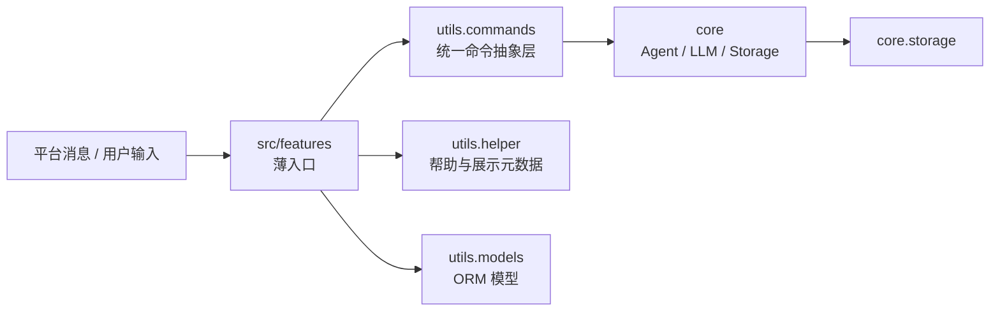

# Features 入口层说明

## 阅读导航

如果你想看“命令应该放在哪、目录怎么拆、`commands.py` / `services.py` / `permissions.py` 怎么分工”，请先读这份 `src/features/README.md`。

如果你想看“如何开发命令、如何绑定 `on_agent_command()`、Helper、Agent、权限、测试和命令 README 标准”，请继续阅读 [utils/commands/README.md](../../utils/commands/README.md)。

这两份文档的分工固定如下：

- `src/features/README.md`
  负责说明 `src/features` 的职责边界、目录组织方式、命令分层模板和业务模块拆分标准。
- `utils/commands/README.md`
  负责说明命令统一封装、`CommandSpec`、`CommandBinding`、Helper、Agent 调用、执行器、权限元数据和测试要求。

一句话概括：

- `features` 解决“代码放哪里、怎么分层”。
- `utils.commands` 解决“命令如何开发、如何接入统一能力”。

## 职责边界

`src/features` 是用户侧 NoneBot 功能入口层。

这里的职责应该只有：

- NoneBot matcher / command 入口
- 参数收集
- 权限边界接入
- 调用 `utils.commands`、`core` 或共享 service
- 返回结果给用户

这里不应该做的事：

- 堆放复杂业务规则
- 直接操作底层存储细节
- 复制 Agent / Runtime / LLM / Storage 的封装逻辑
- 让命令之间通过调用 matcher 互相复用

所有用户侧插件和命令入口都应放在 `src/features/<feature>`。新增功能时优先遵循这里的薄入口标准，不要再创建并行入口目录。

## 目录边界图



这张图只用于说明目录边界：

- `src/features` 是用户侧薄入口
- `utils.commands` 是统一命令抽象层
- `utils.helper` 负责帮助展示与命令目录
- `core` 负责核心能力
- `utils.models` 与 `core.storage` 负责数据与存储

## 命令目录规范

命令目录统一按业务域组织，不按角色组织。

固定规则如下：

- 顶层统一按业务域放置，例如 `user`、`classes`、`leave`、`file_manager`
- 不新增 `student_commands`、`teacher_commands`、`admin_commands`、`shared_commands` 这类顶层目录
- 用户侧命令统一放在 `src/features/<feature>`
- 身份分类通过 `roles`、`exclude_roles`、`scopes`、`tags` 表达，而不是通过物理目录表达

判断标准要保持固定：

- 目录回答“这是什么业务”
- 元数据回答“谁能用、显示到哪、Agent 能不能调”

例如：

- “查询请假”属于请假业务，应放在 `src/features/leave`
- “加入班级”属于班级业务，应放在 `src/features/classes`
- “我的信息”属于用户业务，应放在 `src/features/user`

而不是因为某个命令只有学生可用，就把它移动到 `src/features/student_commands`。

## 分层模板

### 小型 feature 模板

适用于 1 到 3 个命令、业务简单、没有明显子领域拆分需求的模块。

```text
src/features/<feature>/
├── __init__.py
├── README.md
├── commands.py
├── services.py
├── schemas.py
└── permissions.py
```

职责建议：

- `__init__.py`
  只做插件入口、导入命令和极轻量初始化。
- `commands.py`
  放 matcher 声明、参数接线、依赖注入和调用 service。
- `services.py`
  放真正业务逻辑，供用户命令和 Agent 共用。
- `schemas.py`
  放该业务自己的 pydantic 输入输出模型。
- `permissions.py`
  放动态权限和目标对象权限判断。

升级条件：

- `commands.py` 接近 400 到 500 行时，开始评估拆成 `commands/`
- `services.py` 同时承载多个稳定子流程时，开始评估拆成 `services/`
- 业务出现“查询 / 创建 / 修改 / 删除 / 管理”等明显分层时，升级到中型或大型模板

### 中型 feature 模板

适用于命令数量开始增长，但还没有必要完全拆成多个子包的模块。

```text
src/features/<feature>/
├── __init__.py
├── README.md
├── commands.py
├── services.py
├── permissions.py
├── schemas.py
├── resolvers.py
└── formatters.py
```

新增职责：

- `resolvers.py`
  放上下文解析、参数到领域对象的定位、系统 ID 到业务对象的映射。
- `formatters.py`
  放消息格式化、摘要渲染、列表输出或结构化结果转用户文案。

升级条件：

- 单文件 `commands.py` 超过约 500 行且命令开始按子类聚集时，拆成 `commands/`
- 单文件 `services.py` 超过约 500 行且服务逻辑出现稳定子领域时，拆成 `services/`
- 当命令已稳定分成 `query`、`create`、`manage` 这类子主题时，升级到大型模板

### 大型 feature 模板

适用于命令较多、权限边界复杂、长期演进明显的模块，例如 `classes`、`file_manager`。

```text
src/features/<feature>/
├── __init__.py
├── README.md
├── commands/
│   ├── __init__.py
│   ├── query.py
│   ├── create.py
│   ├── update.py
│   ├── delete.py
│   ├── manage.py
│   └── shared.py
├── services/
│   ├── __init__.py
│   ├── query.py
│   ├── create.py
│   ├── update.py
│   ├── delete.py
│   ├── manage.py
│   └── shared.py
├── permissions.py
├── schemas.py
├── resolvers.py
└── formatters.py
```

拆分规则：

- `commands/` 与 `services/` 优先保持镜像命名，方便定位调用链路
- `shared.py` 只表示“该业务模块内多个角色或多个命令共用的部分”
- 读写边界明显不同的命令优先拆文件，不要为了减少文件数量继续堆在一个大文件里
- 同一个命令模块中如果开始同时维护命令声明、权限、service、渲染、Agent 适配，就说明拆分已经过晚

## 共享命令如何存放

学生和教师共用命令，仍然按业务域存放，不新增顶层“师生共用”目录。

固定规则如下：

- 共享命令仍然放在对应业务的 `src/features/<feature>`
- 不新增顶层 `student_teacher_shared`、`shared_commands` 之类的分类
- 通过 `roles={student, teacher}`、`scopes={student, teacher}` 表达共享关系
- 如果某个业务命令很多，可以在该业务模块内部使用 `commands/shared.py`
- `shared.py` 只允许作为 feature 内部组织方式，不能升级成项目顶层分类

示例：

```text
src/features/leave/
├── __init__.py
├── README.md
├── commands/
│   ├── __init__.py
│   ├── student.py
│   ├── teacher.py
│   └── shared.py
├── services/
│   ├── __init__.py
│   ├── student.py
│   ├── teacher.py
│   └── shared.py
└── permissions.py
```

这里的 `shared.py` 表示“请假业务中师生共用的命令或逻辑”，不是新的系统顶层分类。

## 文件职责与边界

| 文件或目录 | 应负责的内容 | 不应负责的内容 |
| --- | --- | --- |
| `__init__.py` | 插件入口、导入命令、轻量初始化 | 堆命令实现、堆业务逻辑、堆数据库操作 |
| `commands.py` / `commands/` | matcher 声明、参数接线、依赖注入、调用 service、返回结果 | 大段业务规则、直接操作底层存储、调用其他 matcher 复用逻辑 |
| `services.py` / `services/` | 业务动作、结构化执行结果、命令与 Agent 共享逻辑 | 直接依赖平台事件对象、拼装平台消息细节 |
| `permissions.py` | 动态权限、目标对象权限、归属关系校验 | 命令声明、消息渲染 |
| `schemas.py` | feature 内部的 pydantic 输入输出模型 | 业务执行逻辑、平台绑定逻辑 |
| `resolvers.py` | 参数解析、上下文到领域对象映射、ID 定位 | 命令声明、重业务写操作 |
| `formatters.py` | 用户可见文本、摘要、列表和结构化结果渲染 | 权限决策、数据库写操作 |
| `README.md` | 功能作用、目录边界、命令入口、扩展方式、关键跳转 | 替代测试、替代源码注释 |

## 目录拆分决策规则

为了避免每次开发时重新判断，统一采用下面的决策规则：

### 什么时候继续保持单文件

- 命令数量很少
- 读写边界简单
- 没有明显的子主题拆分
- `commands.py` 和 `services.py` 都仍然容易阅读

### 什么时候拆成 `commands/`

- 命令声明已经超过约 500 行
- 同时存在查询、创建、管理、导入导出等明显子类
- 单个文件里需要频繁上下滚动才能理解命令边界

### 什么时候拆成 `services/`

- 业务流程明显按子主题分化
- 命令和 Agent 已经共享多套 service
- 单个 `services.py` 中同时维护太多不同职责

### 什么时候新增 `resolvers.py`

- 命令里反复出现“参数 -> 系统对象”的解析逻辑
- 班级、群组、文件空间、系统用户等领域对象定位开始重复

### 什么时候新增 `formatters.py`

- 返回文案开始有统一格式要求
- 命令和 Agent 需要共享结构化结果到文本的转换

## 与命令元数据的配合方式

`src/features` 只负责放置业务模块，不负责替代命令元数据。

角色、展示目录和 Agent 能力依然应该通过统一命令元数据表达，例如：

- `roles`
  表示谁可以使用
- `exclude_roles`
  表示谁被显式禁止
- `scopes`
  表示 help 应展示到哪个目录
- `tags`
  表示该命令属于哪个业务标签

因此：

- 目录负责表达“业务归属”
- 元数据负责表达“权限归属”

两者不能混用，也不要互相代替。

## 当前项目中的放置建议

结合当前项目，新增功能时优先遵循以下约定：

- 新增用户命令：放在 `src/features/<feature>/commands.py` 或 `commands/`
- 新增业务逻辑：放在同 feature 的 `services.py` / `services/`，或下沉到 `core`
- 新增命令权限逻辑：放在 `permissions.py`
- 新增复杂对象解析：放在 `resolvers.py`
- 新增统一渲染：放在 `formatters.py`
- 新增详细开发机制说明：写在命令模块的 `README.md`，并参考 [utils/commands/README.md](../../utils/commands/README.md)

## 最后的约束

后续开发中请固定遵守这几条：

- `src/features` 是用户侧唯一插件入口
- 顶层目录永远按业务域，不按角色域
- 共享命令允许在 feature 内部拆 `shared.py`，不允许提升为顶层分类
- `commands.py` 只做薄入口，不把复杂业务重新塞回来
- 命令开发细节、统一封装和测试要求统一以 [utils/commands/README.md](../../utils/commands/README.md) 为准
