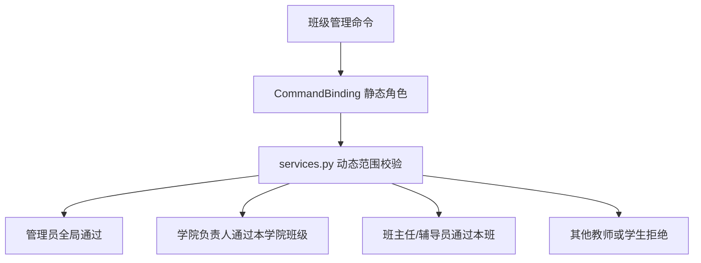

# 班级模块

`src/features/classes/` 负责和班级主归属直接相关的命令与流程，例如创建班级、加入班级、退出班级、入班申请与班级导入。

## 目录职责

- `commands.py`
  - 命令声明、参数定义、帮助元数据
- `__init__.py`
  - matcher 入口、交互编排和消息回复
- `services.py`
  - 班级查询、状态校验、申请处理等复用逻辑
- `presenters.py`
  - 列表、详情和确认文案渲染
- `depends.py`
  - 班级相关的依赖注入
- `importing.py`
  - 批量导入班级或成员时的数据清洗

## 当前关注的核心命令

- `添加班级`
- `查询班级`
- `删除班级`
- `加入班级`
- `退出班级`
- `查询入班申请`
- `处理入班申请`
- `修改班级加入方式`
- `设置班级教师`
- `取消班级教师`
- `设置学生岗位`
- `取消学生岗位`

## 维护约定

- “班级命令能不能进”放在命令权限和依赖层判断
- “当前用户能不能操作这个班级”放到 `services.py` 或领域规则里判断
- 尽量不要在 `__init__.py` 里重复写参数解析和状态校验
- 班级管理写操作必须调用 `services.py` 中的动态范围校验，不能只依赖 `UserRole.teacher`
- 学生岗位统一写入 `Student.role`，班助/助教使用 `StudentRole.assistant`

## 管理边界

`设置班级教师`、`取消班级教师`、`设置学生岗位` 和 `取消学生岗位` 都属于写操作。新增类似命令时，要同时补齐命令元数据、运行时校验、nonebug 测试和本文档。

## 关联文档

- 命令口径：[命令使用文档](../../../docs/reference/command-reference.md)
- 身份与角色：[角色与组织关系说明](../../../docs/reference/role-reference.md)
- 命令权限与帮助：[命令鉴权与 Help/AutoGPT 统一机制](../../../docs/guides/command-auth-and-help.md)
