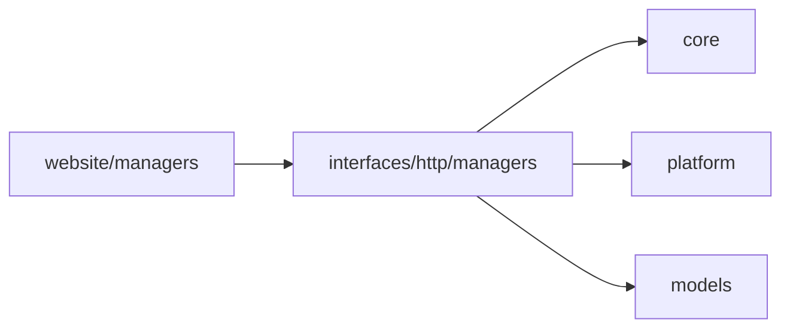

# interfaces 外部接口层

`interfaces` 放 HTTP、管理端和其他外部系统入口。它负责接收外部请求、做边界校验，然后调用 `core`、`platform`、`models` 或插件 service。

```text
interfaces/
└── http/
    ├── managers/
    └── path/
```

## 放什么

- 管理端 API 路由。
- HTTP 请求 schema、响应 schema。
- 面向外部系统的接口适配。
- 接口层权限、审计和错误响应。

## 不放什么

- 业务重逻辑。
- NoneBot matcher。
- Agent runtime 内部流程。
- 跨平台发送底层实现。

## 调用关系



## 扩展规则

- 路由文件保持薄，复杂逻辑下沉到 service。
- 管理端只能调用明确稳定的服务入口，不直接复制插件命令流程。
