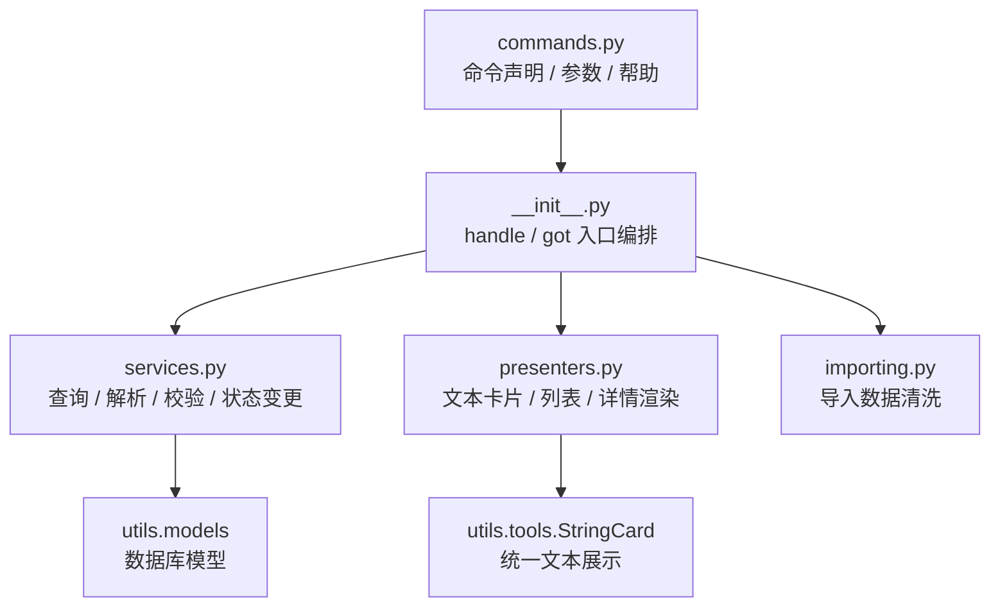

# 身份与组织管理命令

`src/managers` 负责用户、教师、学生、班级、学校组织等和身份强相关的命令模块。这里的命令会直接影响用户身份、班级归属和组织结构，因此目录职责需要保持清晰，避免把命令声明、帮助元数据和业务辅助逻辑混在同一个文件中。

## 模块职责

- `commands.py`: 只放命令注册、别名、参数声明、权限扩展和 `__helpers__` 帮助元数据。
- `__init__.py`: 只放 `handle` / `got` 等 matcher 入口函数，用于编排一次命令流程。
- `constants.py`: 放命令输入映射、枚举文案、字段别名等稳定常量。
- `services.py`: 放查询、解析、校验、确认、状态变更等可复用业务辅助逻辑。
- `presenters.py`: 放文本卡片、列表、详情页等展示渲染逻辑。
- `importing.py`: 放 Excel、CSV 等导入数据的清洗和转换逻辑。
- `depends.py`: 放 NoneBot 依赖注入相关逻辑。

## 维护约定

- 新增命令时，先在对应模块的 `commands.py` 声明命令和帮助元数据，再在 `__init__.py` 编写 handler。
- 不要在 `__init__.py` 顶部堆放独立工具函数；如果函数不是 `handle` / `got` 入口，按职责放入 `services.py`、`presenters.py`、`constants.py` 等文件。
- 面向后续维护的函数需要使用中文 docstring，并按 Python docs 风格写清楚 `Args`、`Returns`，有异常时补充 `Raises`。
- handler 内应优先调用服务函数完成解析和校验，避免复制同一套身份、学校、班级、组织判断逻辑。
- `commands.py` 中的参数名、权限和帮助文案应保持同步，避免用户帮助、Agent 调用和实际命令参数出现漂移。

## 当前模块

- [用户功能](./user/): 账号信息、平台绑定、注销。
- [教师功能](./teacher/): 教师资料查询与修改。
- [学生功能](./student/): 学生资料查询与修改。
- [班级功能](./classes/): 班级创建、删除、加入、退出、导入、入班申请审核。
- [学校与组织功能](./group/): 学校、学院、专业、组织的增删改查和组织成员关系。

## 调用结构

