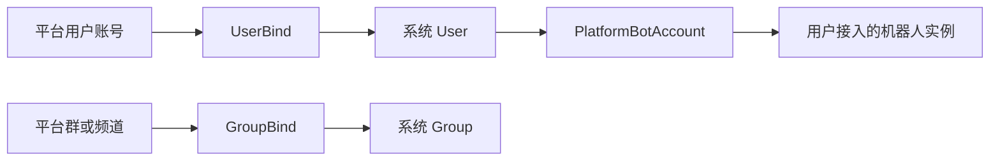

# models 领域模型层

`models` 放 ClassRobot 的领域数据模型。这里不仅是数据库表结构，也包含和数据强绑定的领域方法，例如平台绑定、组织关系、级联删除等。

## 放什么

- `User`、`UserBind`、`Group`、`GroupBind` 等系统身份和平台绑定模型。
- `PlatformBotAccount` 等用户接入机器人账号模型。
- 学校、学院、专业、班级、教师、学生等组织模型。
- 与模型强相关的创建、查询、绑定、删除方法。
- 数据删除时的级联行为说明。

## 不放什么

- NoneBot Depends 和事件解析。
- 命令声明、HTTP 路由。
- 跨平台发送实现。
- Agent 或 LLM 逻辑。

## 绑定关系示意

## `PlatformBotAccount` 与 `UserBind` 的区别

- `UserBind` 表示“平台上的某个用户账号是谁”，例如 `wxclaw.private + from_user_id` 绑定到系统 `User.id`。
- `PlatformBotAccount` 表示“系统里运行的某个机器人实例”，例如用户扫码接入的 wxclaw bot account。
- 机器人 token 只能保存在 `PlatformBotAccount.encrypted_token`，不要写进 `UserBind`，也不要写进 `.env`。
- 删除用户时，`PlatformBotAccount.owner_user_id` 会通过外键级联删除，后续启动不会再恢复该用户接入的机器人。

## 扩展规则

- 模型方法应描述稳定领域行为，不要塞平台事件对象。
- 与运行时注入相关的 Depends 放到 `plugins/library/identity`。
- 与权限规则相关的判断优先放到 `core/auth` 或具体业务 service。
