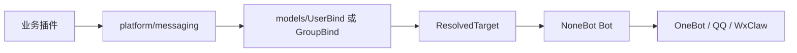

# platform 平台抽象层

`platform` 放项目自己的运行协议层。它负责把 NoneBot、Alconna、跨平台消息、命令系统这些能力整理成项目统一入口。

它不是业务插件，也不是普通工具箱。

```text
platform/
├── bots/         # 用户扫码接入的机器人账号运行时
├── commands/     # 命令注册、元数据、执行器、Agent 适配
├── files.py      # 平台文件消息下载与 Alconna 文件段转换
├── helper/       # 帮助目录和展示元数据
├── rendering/    # 依赖 htmlrender 的模板图片渲染
├── session/      # 平台会话和事件上下文
└── messaging/    # 跨平台统一发送
```

## 放什么

- 命令协议：`CommandSpec`、`on_agent_command`、命令注册表、执行器。
- 机器人账号协议：用户扫码接入 bot 的持久化恢复和 adapter provider。
- 帮助协议：help 展示、命令目录、角色过滤。
- 会话协议：平台、频道、用户、群组上下文。
- 文件协议：平台文件消息下载、上传前落盘、消息段转换。
- 渲染协议：依赖 NoneBot/htmlrender 的模板图片渲染。
- 发送协议：统一向系统用户或系统群组发送消息。

## 不放什么

- 具体业务命令。
- 领域模型定义。
- Agent 或 LLM 的核心流程。
- 纯工具函数。

## 跨平台发送链路



`notice` 这类业务只决定“通知什么、通知谁、什么时候通知”。真正把消息发到各平台账号或群组，应由 `platform/messaging` 负责。

## 扩展规则

- 新增跨平台协议时先考虑放在这里。
- 只有多个业务都会复用，且和 NoneBot 运行时相关，才进入 `platform`。
- 如果只是某个业务自己的逻辑，应放回对应插件。
