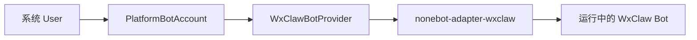

# 用户机器人账号运行时

`src/platform/bots` 负责管理用户通过扫码等方式接入的第三方机器人实例。它保存和恢复的是“机器人账号”，不是普通用户的平台绑定。

## 放什么

- 机器人账号启动恢复、状态更新和禁用逻辑。
- 具体平台 provider，例如 `providers/wxclaw.py`。
- 与 NoneBot adapter 对接的窄适配代码。

## 不放什么

- 用户命令声明，命令应放在 `src/plugins/application/active/bot_access`。
- 普通平台用户绑定，仍使用 `UserBind`。
- 通知业务规则，通知只调用 `src.platform.messaging`。

## 数据关系

## 扩展方式

新增 `qqclaw` 等平台时，先新增 provider，再让 `BotAccountService` 分发到对应 provider。不要在业务命令里直接调用第三方 adapter。
