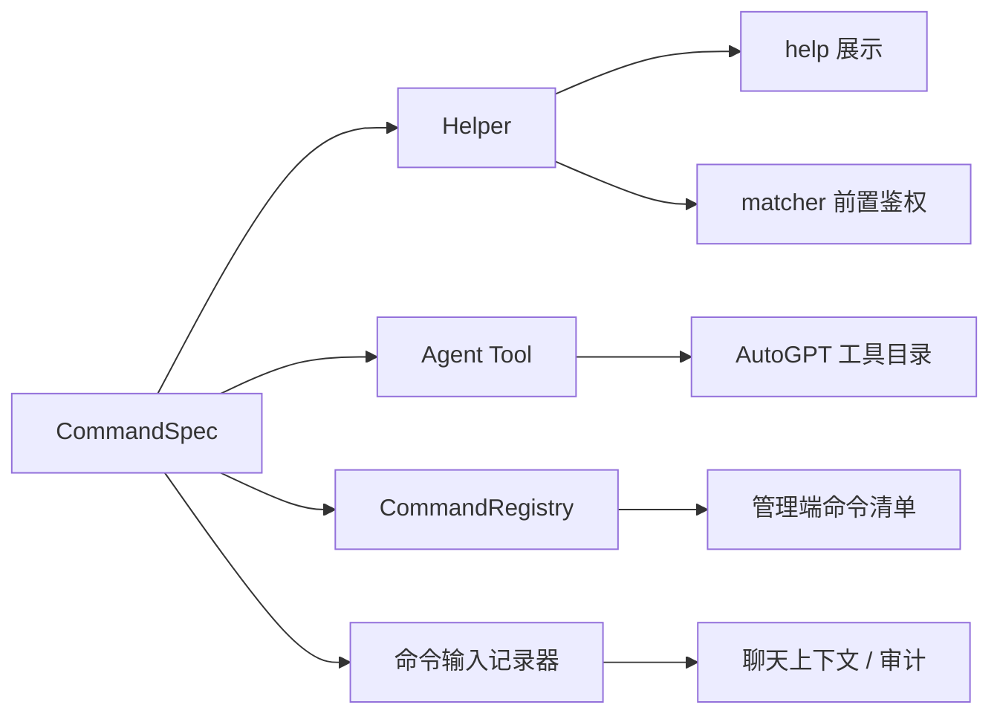
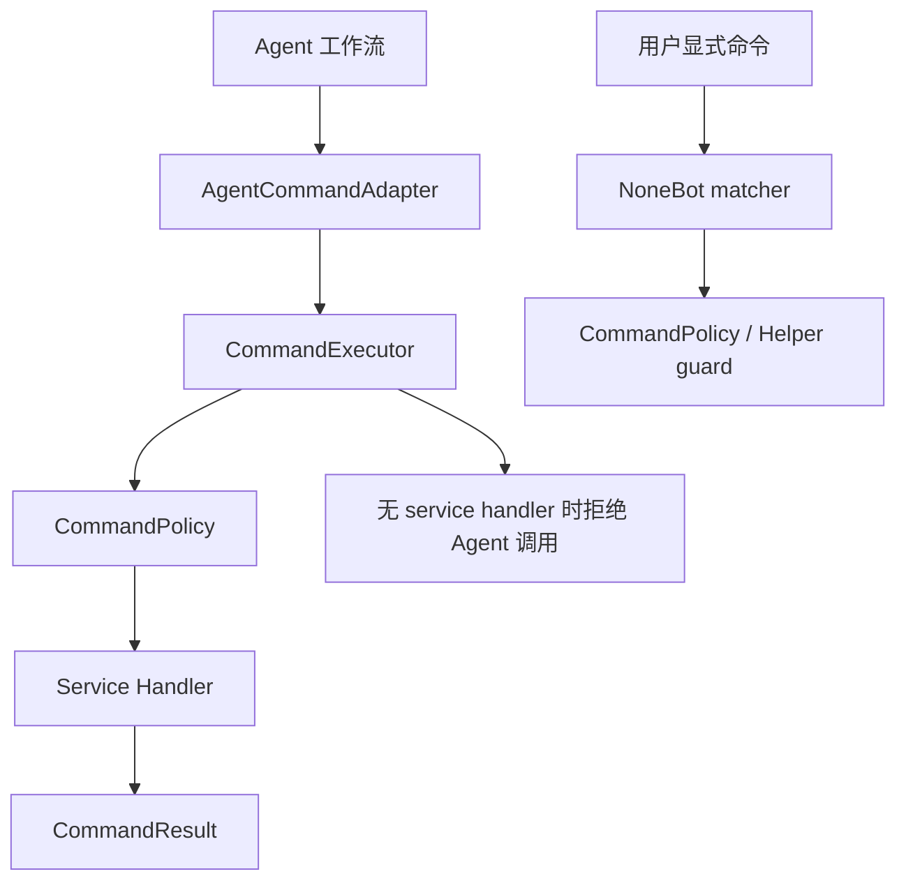

# `src/platform/commands`

`src/platform/commands` 是项目命令体系的统一元数据、权限策略、可用性与执行调度层。

该目录只放可复用封装，不放具体业务命令。具体命令声明和用户入口应放在 `src/plugins/application/active/*`，被动 matcher 或 hook 放在 `src/plugins/application/passive/*`，`src/plugins/library/*` 只提供复用能力。

如果你要看“为什么会有这层，以及它和 Agent、`Helper`、统一执行器是什么关系”，请先阅读 [命令与 Agent 一体化架构设计](../../../docs/architecture/command-agent-unified-architecture.md)。本文只聚焦当前代码目录的职责和落地方式，尽量不重复写整套架构推导。

它的目标是把命令的公共事实和运行策略收敛起来：

- 从 `on_alconna` / `on_command` 派生命令元数据
- 生成 `Helper`，供 `help` 与统一鉴权继续使用
- 生成 Agent tool schema，供 AutoGPT 规划与工具调用
- 建立 `CommandRegistry`，供管理端、插件开关与执行器使用
- 通过 `CommandAvailabilityService` 支持命令/插件软关闭
- 通过 `CommandExecutor` 支持后续 service 化命令被用户入口和 Agent 入口复用

## 当前落地状态

- `src.platform.helper.runtime` 已支持优先收集 matcher 上的 `__command_spec__` / `__helper__`。
- `src.platform.helper.depends.HelpersDepends` 已接入软关闭过滤，`help` 与 AutoGPT 会共享同一份可见命令集。
- `src.core.agent.runtime.command_tools.CommandToolCatalog` 会优先从 `CommandSpec` 生成 Agent 工具。
- `src.core.agent.runtime.dispatch_auto_task()` 只通过 `AgentCommandAdapter -> CommandExecutor` 调用 service 命令，没有 service handler 的命令不会暴露给 Agent。
- `src.interfaces.http.managers.runtime.nonebot` 已合并 `CommandRegistry` 元数据，管理端命令清单可以看到风险等级、执行模式、Agent 可见性和软关闭状态。
- `src.plugins.application.active.user.commands`、`src.plugins.application.active.curriculum.commands` 与 `src.plugins.application.active.classes.commands` 中的高频“查询班级”已作为样例迁移到 `command_alconna()`。
- 命令输入记录通过 `history.py` 的注册式钩子派发，具体聊天记录 hook 由 `src.plugins.application.passive.message_history_collector` 注册，避免命令封装层反向依赖业务插件。

## 当前模块

- `schema.py`
  命令参数、风险等级、执行模式等基础结构
- `spec.py`
  `CommandSpec`，一条命令的单一事实来源
- `context.py`
  `CommandExecutionContext`，描述用户直发、Agent 工作流或系统任务的一次调用上下文
- `result.py`
  `CommandResult`，统一承载用户输出、上下文输出和结构化数据
- `binding.py`
  `on_agent_command()`、`command_alconna()` / `command_command()` 包装器，并保留真实业务模块归属
- `registry.py`
  进程内命令注册表
- `policy.py`
  静态角色、Agent 可调用性与可用性策略
- `availability.py`
  命令/插件软关闭服务
- `executor.py`
  service-style 命令统一执行器
- `history.py`
  命令输入记录器注册表，供聊天记录、审计或可观测插件挂接
- `discovery.py`
  注册表到管理端命令清单的导出层
- `adapters/`
  Agent 调用统一执行器的入口适配层
- `renderers/helper.py`
  `CommandSpec -> Helper`
- `renderers/tool.py`
  `CommandSpec -> Agent tool schema`

## 核心流程





## 使用原则

新增命令优先使用 `on_agent_command()`，让 NoneBot matcher、Alconna 解析、`Helper`、命令注册表、Agent tool 元数据和可选 service handler 从同一个声明派生。

`command_alconna()` / `command_command()` 仍然保留，用于只需要用户直接触发的 matcher 命令；这类命令默认 `execution_mode="matcher"`，不会进入 Agent 工具目录。

新增或显著改造的项目内部命令不要再手写第二份 `__helpers__`。`Helper` 应由 `CommandSpec` 自动派生；`src.platform.helper.runtime` 仍保留读取模块级 `__helpers__` 的能力，只作为外部 command、第三方插件或暂未迁移命令的兼容入口。

如果某条命令已经需要接入统一注册表，但暂时不应该展示到 `help`，可以在 `CommandBinding` 中设置 `helper_visible=False`。适合的场景包括：

- 内部配套命令，例如只给工作流或特殊消息流程使用的命令
- 尚未完成、但需要先保留 matcher 或注册表接线的命令
- 像旧通知命令这类暂时不应暴露给普通用户的入口

## 统一命令推荐写法

```python
from arclet.alconna import Alconna, Args, CommandMeta
from src.platform.commands import CommandBinding, CommandExecutionContext, CommandResult, on_agent_command
from src.platform.helper import HelperScope
from src.core.auth import UserRole

query_score_cmd = on_agent_command(
    Alconna(
        "查询成绩",
        Args["semester?", str],
        meta=CommandMeta(description="查询当前学生的指定学期成绩"),
    ),
    aliases={"成绩查询"},
    binding=CommandBinding(
        roles={UserRole.student},
        scopes={HelperScope.student},
        param_labels={"semester": "学期"},
        risk_level="low",
        agent_callable=True,
    ),
    priority=1,
    block=True,
)


@query_score_cmd.agent_handler
async def query_score_service(params: dict, context: CommandExecutionContext) -> CommandResult:
    semester = params.get("学期")
    return CommandResult.ok(f"已查询 {semester or '当前学期'} 成绩。")
```

这样写以后：

- 用户直接发送 `查询成绩` 时仍然走 NoneBot matcher。
- `help` 和管理端命令清单会读取同一个 `CommandSpec`。
- AutoGPT 工具目录会从同一个 `CommandSpec` 生成工具说明。
- Agent 调用时会优先通过 `CommandExecutor` 执行 `agent_handler` 注册的 service 函数。

如果 service 函数已经存在，也可以直接传入 `service_handler`：

```python
from src.platform.commands import CommandBinding, CommandExecutionContext, CommandResult, on_agent_command


async def query_score_service(params: dict, context: CommandExecutionContext) -> CommandResult:
    ...


query_score_cmd = on_agent_command(
    Alconna("查询成绩", Args["semester?", str]),
    binding=CommandBinding(...),
    service_handler=query_score_service,
    priority=1,
    block=True,
)
```

传入 `service_handler` 时，如果没有显式声明其他执行模式，系统会自动把命令标记为 `execution_mode="service"`。

## 迁移注意事项

- 不要在业务插件中直接维护第二份 Agent tool schema。
- 已迁移命令不再维护手写 `__helpers__` 双写；如果测试或文档仍依赖手写 Helper，应同步改到 `CommandSpec` 派生视图。
- 包装器会修正 matcher 的 `module_name`，不要手动修改 matcher 归属。
- 软关闭不是卸载插件，只是让 `help`、Agent、统一执行器和 matcher guard 一致拒绝调用。
- 多轮 `got()`、文件上传、强交互命令可以先标记为 `execution_mode="interactive"`，等 service 化后再切到 `service`。
- 普通 matcher 命令使用 `execution_mode="matcher"`；如果未来要给 Agent 调用，先抽出 service handler，再改为 `service`。
