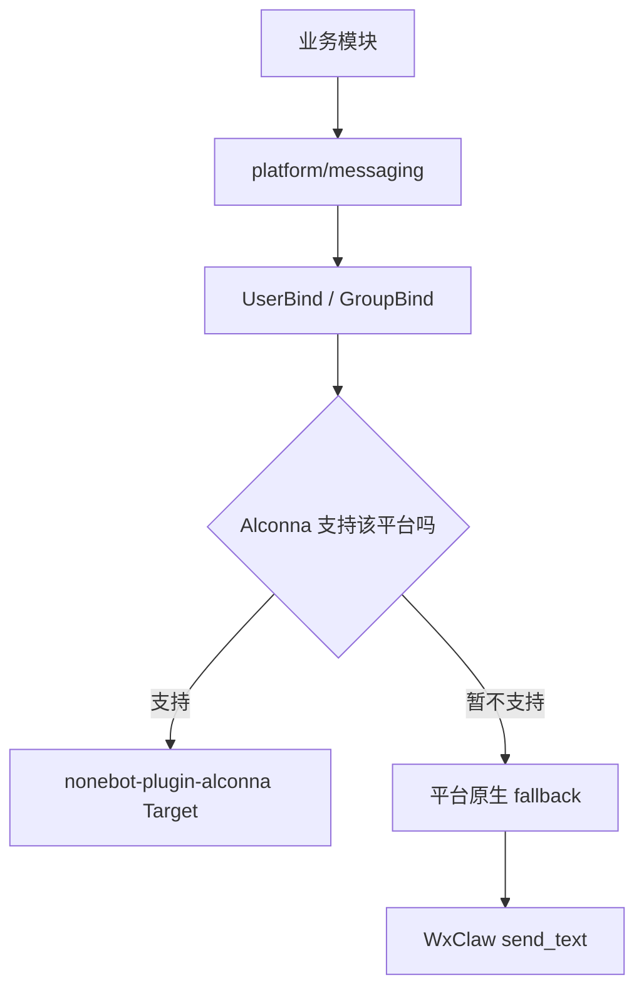

# 统一消息投递

`src/platform/messaging` 是 ClassRobot 对外发送消息的统一入口。通知、定时任务或后续跨平台转发能力都应该先调用这里，再由这里选择具体 adapter。

## 发送策略

## 当前能力

- OneBot / QQ 等 Alconna 已支持平台继续走 `Target.send()`。
- `wxclaw.private` 暂时走窄范围 fallback，只保证文本私聊通知。
- wxclaw 群组通知暂不支持，遇到系统群组绑定时只记录日志并跳过。

## 维护边界

- 业务模块不要直接判断 `wxclaw`、`onebot` 或 `qq`。
- 业务模块不要直接读取 `UserBind` 后调用 adapter。
- 如果某个平台后续被 Alconna 官方支持，应优先切回 `Target.send()`，再移除对应 fallback。
