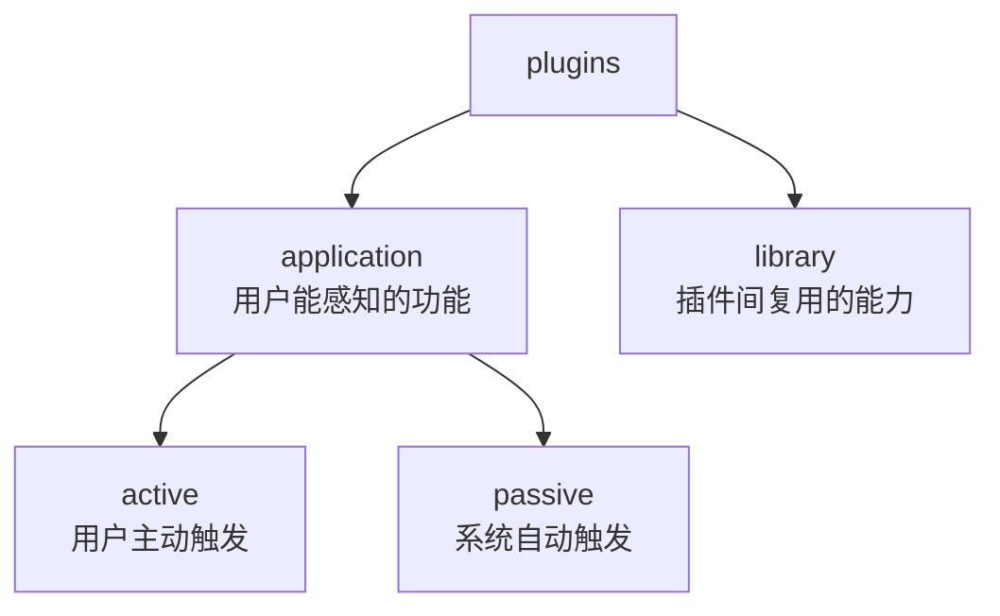

# plugins 插件层

`src/plugins/` 只放 ClassRobot 自研 NoneBot 插件。第三方 NoneBot 插件仍由项目配置加载，不放在这里。

插件层分成两类：

```text
plugins/
├── application/   # 面向用户的应用插件
└── library/       # 给应用插件复用的能力插件
```



## 放什么

- 用户命令、事件响应、业务插件入口。
- 依赖 NoneBot 生命周期、matcher、事件、消息对象的插件能力。
- 插件自己的 `commands.py`、`services.py`、`permissions.py`、`README.md`。

## 不放什么

- Agent、LLM、Storage 这类核心实现。
- 跨平台消息发送、命令注册协议、会话协议这类平台抽象。
- 纯字符串、模板、加密等轻量工具。

## 扩展规则

- 面向用户的业务放 `application`。
- 给多个插件复用、但不注册 matcher 或运行时 hook 的能力放 `library`。
- 每个插件目录都应有自己的 `README.md`，说明命令、权限、数据读写和扩展方式。
