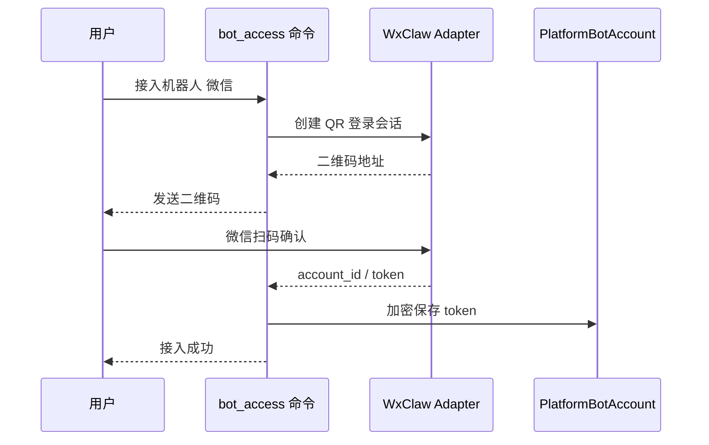

# 机器人接入插件

`bot_access` 提供用户侧“扫码接入自己的机器人账号”的命令入口。当前 v1 支持微信 wxclaw。

## 命令

### `接入机器人 微信`

- 作用：生成 wxclaw 微信机器人接入二维码，用户扫码后把该机器人实例保存到系统。
- 权限：普通系统用户即可使用；未绑定用户会按当前平台会话自动创建系统用户。
- Agent：不开放给 Agent 调用，因为该命令需要扫码、多轮等待和凭证写入。
- 数据写入：成功后写入 `PlatformBotAccount`，token 会加密保存。

## 执行流程

## 关键代码

- 命令声明：`commands.py`
- 命令流程：`__init__.py`
- 机器人账号服务：`src/platform/bots/service.py`
- wxclaw provider：`src/platform/bots/providers/wxclaw.py`
- 数据模型：`src/models/models.py` 中的 `PlatformBotAccount`

## 扩展说明

如果后续接入 `qqclaw`，不要复制一套命令目录。应继续使用 `接入机器人 <平台>`，在 `src/platform/bots/providers` 新增 provider，并让 `BotAccountService` 根据平台参数分发。
