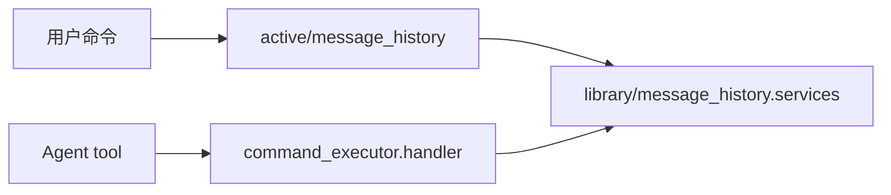

# message_history 主动命令插件

`src/plugins/application/active/message_history/` 负责消息历史相关的用户主动命令和 Agent 可调用入口。底层查询、统计和展示逻辑复用 `src.plugins.library.message_history`。

## 命令

- `检索群聊记录`：检索当前已绑定系统群的采集消息，可输入关键词。
- `统计聊天记录`：统计当前用户私聊或当前系统群的消息数量，可按 `all`、`today`、`yesterday`、`week` 筛选。

## Agent 行为

两个命令都使用 `on_agent_command()` 声明，并通过 `services.py` 注册 `command_executor.handler`，因此 Helper、命令目录和 Agent 工具目录都从同一份 `CommandSpec` 派生。

## 边界

- `commands.py` 只放命令声明和元数据。
- `__init__.py` 只放 matcher handle 级入口。
- `services.py` 只放命令执行器 adapter，把 `CommandExecutionContext` 转成 library 服务需要的参数。
- 普通消息采集不在这里实现，采集入口放在 `application/passive/message_history_collector`。

