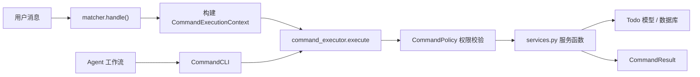

# 待办模块

`src/plugins/application/active/todo/` 提供个人私有待办能力：创建、查询、完成、删除。

待办是用户私有的行动清单条目，统一归属系统 `User.id`。带截止时间的待办相当于“日程”，不带截止时间的待办相当于“便签”，提醒投递与班级任务聚合作为后续扩展预留。

## 命令一览

| 命令 | 别名 | 作用 | 权限 | 风险 | 执行模式 | Agent 可调用 |
| --- | --- | --- | --- | --- | --- | --- |
| `创建待办` | `添加待办`、`记待办`、`新建待办` | 创建个人待办，可带截止时间和备注 | `UserRole.user` | medium | service | 是 |
| `查询待办` | `查看待办`、`待办列表`、`我的待办` | 查询自己的待办，默认只看待处理 | `UserRole.user` | low | service | 是 |
| `完成待办` | `标记完成`、`待办完成` | 把指定待办标记为已完成 | `UserRole.user` | medium | service | 是 |
| `删除待办` | `移除待办` | 删除自己的指定待办，不可恢复 | `UserRole.user` | high | service | 否 |

`删除待办` 默认 `agent_callable=False`：删除不可恢复，仅允许用户显式触发，避免 Agent 自动调用造成数据丢失。后续如需开放给 Agent，应先补确认流程。

## 参数与使用示例

```text
创建待办 提交实验报告
创建待办 提交实验报告 2026-05-30 14:00
创建待办 提交实验报告 2026-05-30 14:00 记得附上数据图
查询待办
查询待办 已完成
查询待办 全部
完成待办 12
删除待办 12
```

- `创建待办`
  - `标题`（必填）：待办标题，作为命令后的第一个词，本身不包含空格。
  - `截止时间`（可选）：标题之后可写 `2026-05-30` 或 `2026-05-30 14:00`，系统会自动从标题后的内容里识别开头的日期时间。
  - `备注`（可选）：截止时间之后的剩余文字作为备注；若开头不是可识别的时间，则全部作为备注。
- `查询待办`
  - `状态`（可选）：`待办`/`已完成`/`已取消`/`全部`，缺省只看待处理。
- `完成待办` / `删除待办`
  - `待办ID`（必填）：来自查询结果中的 `[ID]`。

## 权限与数据归属

- 所有命令仅对 `UserRole.user` 开放，且只操作当前用户自己的待办。
- 数据归属根是系统 `User.id`（`Todo.owner_user_id`），不使用平台 ID 或绑定 ID。
- `完成待办` / `删除待办` 先通过 `Todo.get_owned(user_id, todo_id)` 校验归属，跨用户访问会返回“不存在或不属于您”。
- `Todo.owner_user_id` 外键 `ondelete=CASCADE`，用户注销时待办随之清理。

## 架构流程



用户入口与 Agent 入口都走 `command_executor`，业务逻辑只在 `services.py` 实现一份。`__init__.py` 的 matcher 只负责解析参数、构建上下文、回发可见结果，保持薄入口。

## 关键代码跳转

- 命令声明：[commands.py](./commands.py)
- 服务逻辑（service handler）：[services.py](./services.py)
- 参数解析与状态映射：[schema.py](./schema.py)
- 列表与详情渲染：[presenters.py](./presenters.py)
- matcher 入口接线：[__init__.py](./__init__.py)
- 数据模型 `Todo` / `TodoStatus`：[models.py](../../../../models/models.py)
- 数据库迁移：[a7e1c3f9b2d4_add_todo.py](../../../../../migrations/versions/a7e1c3f9b2d4_add_todo.py)
- 测试入口：[test_todo.py](../../../../../tests/commands/test_todo.py)

## 如何扩展

- 新增字段（如标签、重复规则）：先在 `Todo` 模型加列并补迁移，再扩展 `schema.py` 解析、`services.py` 写入、`presenters.py` 展示。
- 提醒投递：基于现有 `remind_at` 字段，参考 `notice` 模块的 `nonebot_plugin_apscheduler` 用法，并通过 `src.platform.messaging` 统一投递，触发器与业务执行分离。
- 班级任务聚合：在 `查询待办` service 中追加一个外部来源，读取当前用户相关班级的 `Tasks`，合并为统一视图并标注 `source`，但不接管班级任务的创建/提交/删除。
- 新增命令（如 `修改待办`）：在 `commands.py` 声明，在 `services.py` 注册 `command_executor.handler`，在 `__init__.py` 接线 matcher，并补测试。

## 测试说明

`tests/commands/test_todo.py` 覆盖：

- 创建待办成功、标题为空失败、非法时间失败。
- 查询默认只看待处理、按状态过滤、全部查询。
- 完成待办状态流转与重复完成。
- 删除待办与跨用户归属隔离（不能操作他人待办）。
- Agent 调用边界：`删除待办` 不可被 Agent 调用，查询/创建可被 Agent 调用。

```powershell
D:\Software\anaconda3\envs\classbot\python.exe -m pytest tests\commands\test_todo.py -q
```
