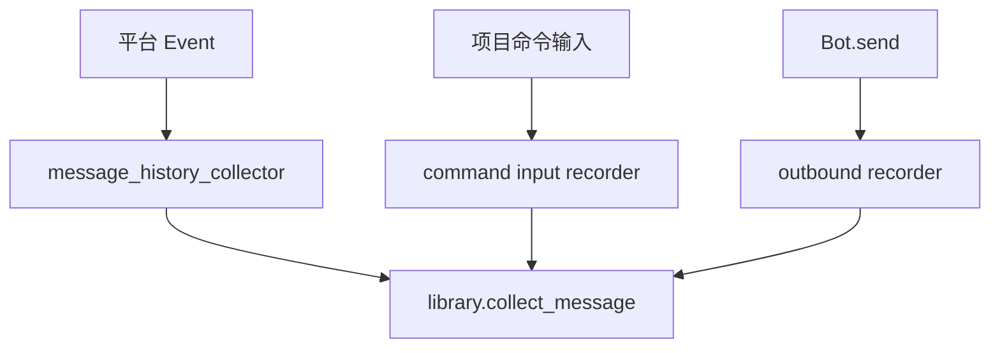

# message_history 被动采集插件

`src/plugins/application/passive/message_history_collector/` 负责注册消息历史的被动入口。它是用户业务可感知的自动采集插件，复杂采集逻辑复用 `src.plugins.library.message_history`。

## 当前入口

- `message_history_collector`：通过 `on_message(..., block=False)` 捕获普通消息。
- `record_command_input_for_message_history()`：注册到命令输入记录器，让 `block=True` 的项目命令也能写入聊天历史。
- `install_outbound_message_recorder()`：安装机器人出站消息记录器，记录 `Bot.send` 回复。

## 边界

- 这里可以注册 matcher、hook 和 NoneBot 运行时入口。
- 这里不声明用户命令；用户主动命令放在 `application/active/message_history`。
- 这里不直接实现复杂归档规则；采集、解析和落库逻辑放在 `library/message_history`。

