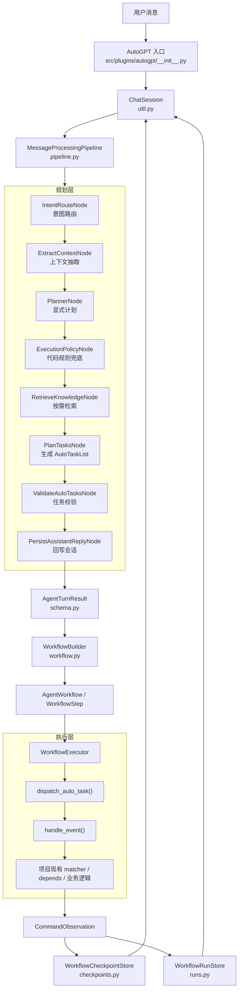
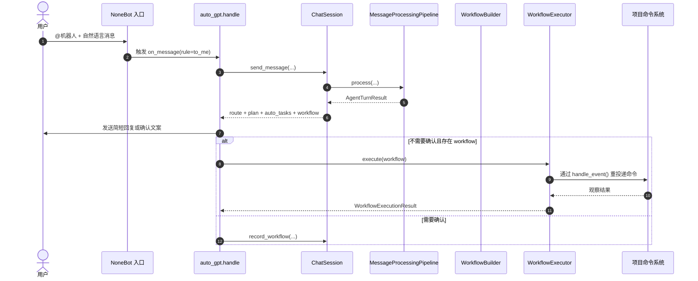
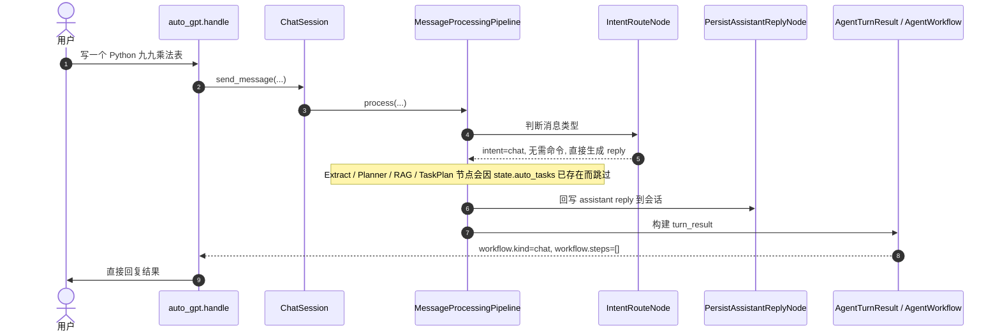
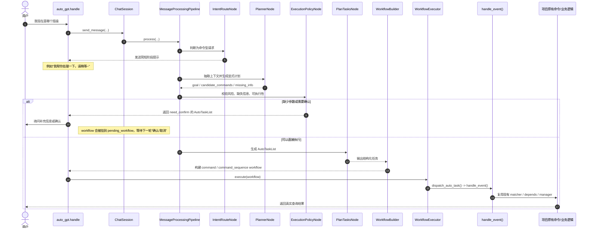
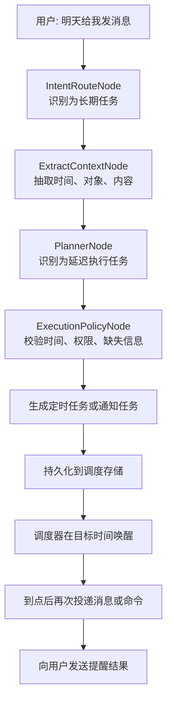
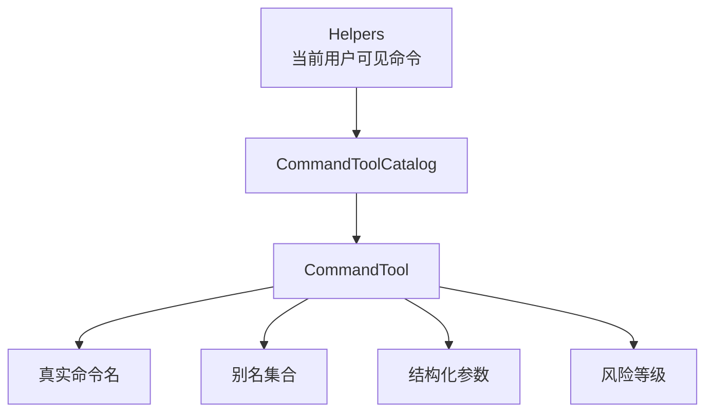
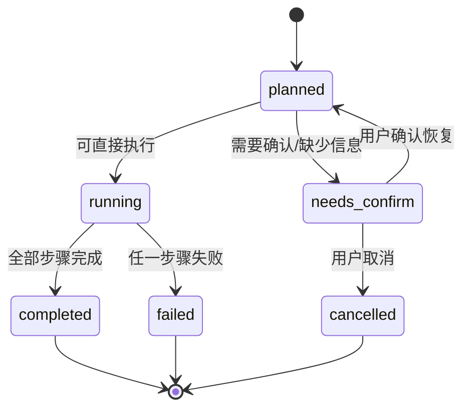
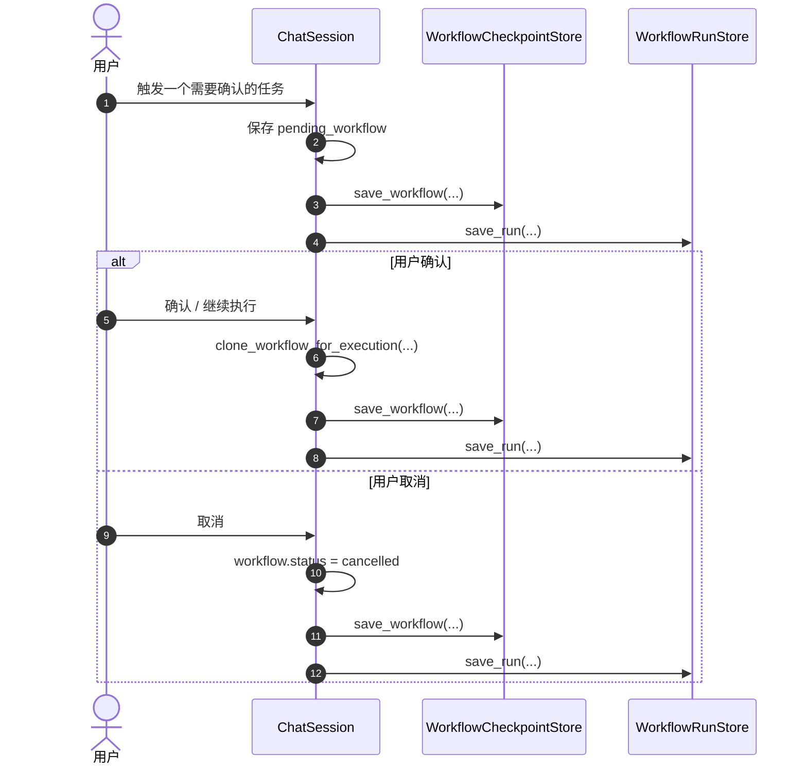
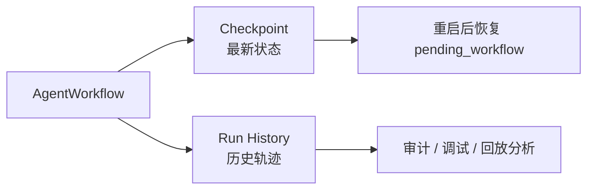

# AutoGPT 模块说明

本文档专门介绍 `src/plugins/autogpt/` 的当前实现，重点说明：

- AutoGPT 在项目中的定位
- 一条用户消息如何流经路由、规划、工作流和执行器
- 各核心文件分别负责什么
- 为什么当前实现选择“显式工作流 + 复用 NoneBot 命令体系”
- 后续扩展时应该从哪里下手

如果你是第一次接手这部分代码，建议按本文顺序阅读，再对照目录中的源码一起看。

在阅读边界上，可以这样理解：

- [docs/guides/agent-module.md](../../../docs/guides/agent-module.md)
  - 讲“为什么要这样改、接下来要往哪里演进”
- [docs/architecture/agent-workflow-orchestration.md](../../../docs/architecture/agent-workflow-orchestration.md)
  - 讲“显式工作流、检查点、恢复和审计为什么这样设计”
- 本文
  - 讲“`src/plugins/autogpt/` 这套代码现在具体是怎么组织的”

## 1. 模块定位

这里的 AutoGPT 不是一个“直接操作数据库的万能 AI”，而是项目里的自然语言编排层。

它的职责是：

1. 接收用户自然语言消息。
2. 判断这是普通聊天、知识查询、单步命令还是多步任务。
3. 生成显式计划和显式工作流。
4. 把最终步骤重新投递给项目现有命令系统执行。
5. 记录观察结果、工作流状态和待确认任务。

它**不直接替代**现有命令处理器，而是尽量复用它们。

## 2. 设计原则

当前实现遵循下面几条原则：

- AI 负责理解、路由、规划和组织步骤。
- 业务写操作仍通过 NoneBot matcher 和既有命令逻辑完成。
- 工作流必须是显式对象，而不是只留下一次性模型输出。
- 高风险或信息不足的任务必须进入确认流程。
- 用户只看到有价值的反馈，不暴露内部推理细节。

## 3. 总体架构

## 4. 一条消息的完整生命周期

### 4.1 从入口到回复

### 4.2 为什么要先规划，再执行

这样做有几个明显好处：

- 能区分“普通聊天”和“真正要执行命令”的消息。
- 能在执行前发现缺少参数、风险过高、命令不在权限范围内。
- 能把多步任务提升成结构化工作流，而不是一批散乱命令。
- 出错时可以明确知道是路由、规划、投递还是业务命令失败。

### 4.3 典型消息场景

下面用三个最常见的消息类型，说明当前 AutoGPT 的真实工作流。

#### 场景 A：普通生成型消息

示例：

- `写一个 Python 九九乘法表`
- `帮我解释一下什么是装饰器`

这类消息在当前实现里，通常会被 `IntentRouteNode` 判定为：

- `intent = chat`
- `requires_command = false`
- `requires_rag = false`

也就是说，它不会进入真正的命令规划和命令执行链路，而是直接走“聊天短路”。

当前实现里还有一个容易忽略的细节：

- 虽然它不执行项目命令，但 `build_turn_result()` 仍会统一构建一个 `kind=chat` 的工作流结果。
- 这个工作流没有步骤，因此执行器看到 `workflow.steps=[]` 后会直接结束，不会调用 `handle_event()` 投递命令。
- 因为入口路由已经明确是普通聊天，所以通常不会额外发送“我帮你处理一下”这类阶段提示。
- 如果回复文本换行很多，入口层还会把回复转成图片发送，避免消息过长影响阅读。

所以这类请求的本质是：

> 先由 AutoGPT 判断“这不是系统命令任务”，再用统一会话与工作流外壳返回一个纯聊天结果。

#### 场景 B：短期命令型消息

示例：

- `我现在是哪个班级`
- `我的课表是什么`
- `帮我查一下今天有没有课`

这类消息的特点是：

- 用户想要的是项目内部已有能力，而不是纯聊天回答。
- 结果通常应该由现有 matcher、depends、manager 和数据库逻辑给出。
- AutoGPT 的职责不是“自己编一个答案”，而是把自然语言稳定路由到正确命令。

在当前实现里，这类消息通常会被识别为：

- `intent = command` 或 `complex_task`
- `requires_command = true`
- `requires_rag = false` 或按需为 `true`

这条链路有几个工程上很重要的特征：

- 用户先收到一条很短的阶段提示，而不是一堆内部推理细节。
- 如果缺少关键信息，系统会先停在确认态，而不是盲目猜测。
- 最终结果优先来自已有业务命令，因此“我在哪个班级”“我的课表是什么”这类问题可以复用既有权限、数据库和业务规则。
- 如果一句话会拆成多个步骤，例如“先查我当前班级，再把这个班级的今天课表告诉我”，它会被提升成多步工作流，而不是让模型自由发挥。

所以这类请求的本质是：

> AutoGPT 负责理解和编排，真正的数据读取与业务判断仍交给项目原有命令体系。

#### 场景 C：长期任务型消息

示例：

- `明天早上八点提醒我交作业`
- `明天下午给我发消息说记得开班会`
- `下周一提醒我带实验报告`

这类消息和前两类最不一样的地方在于：

- 它不是“现在立刻回答”。
- 它也不是“现在立刻执行一个命令”。
- 它需要把一次自然语言请求提升成一个“未来某个时刻再执行”的延迟工作流。

从架构设计上，这类请求理想上应该走下面这条链路：

如果后续要把它做稳，这类任务更适合被定义为：

- `scheduled_workflow`
- `deferred_workflow`
- 或者“带触发器的 command workflow”

也就是说，它不应该在当前轮次就被当作普通 `command` 执行完，而应该多一个“持久化 + 调度唤醒”的阶段。

不过需要明确说明：

- 当前仓库里与长期任务最接近的是 `src/plugins/notice/`。
- `commands.py` 中有 `创建通知 / 查询通知 / 删除通知` 的命令定义。
- 但对应的 `__helpers__` 目前是注释掉的，因此它们不会稳定进入 AutoGPT 的命令能力目录。
- `src/plugins/notice/__init__.py` 中真正处理通知创建、查询、删除以及启动恢复任务的 matcher 代码也处于注释状态。

所以从“当前真实可用能力”来看：

- AutoGPT 架构已经给长期任务预留了合适的位置。
- 但 `明天给我发消息` 这类链路还没有完全打通成稳定能力。
- 文档上更应该把它视为“下一阶段要落地的延迟工作流”，而不是已经完整支持的现成功能。

换句话说，这类请求当前最合理的工程定义是：

> 架构上应该进入“计划 -> 持久化 -> 调度 -> 到点触发”的长期任务工作流，但仓库里的通知链路目前仍未完整启用。

## 5. 目录与职责

下面这张表是理解源码最快的入口。

| 文件 | 主要职责 |
| --- | --- |
| `__init__.py` | NoneBot 入口、用户回复发送、命令重投递、执行器接线 |
| `util.py` | `ChatSession`、会话锁、待确认恢复、工作流记录 |
| `pipeline.py` | 消息处理流水线和节点编排 |
| `schema.py` | 路由、计划、工作流、步骤、审批、观察等结构化模型 |
| `workflow.py` | `WorkflowBuilder`、`WorkflowExecutor`、工作流状态变换 |
| `command_tools.py` | 把 Helper 命令包装成可规划的命令工具目录 |
| `playbooks.py` | 多步任务模板匹配 |
| `checkpoints.py` | 最近一次工作流检查点持久化 |
| `runs.py` | 工作流运行历史持久化 |
| `exception.py` | AutoGPT 自定义异常 |

## 6. 核心数据对象

AutoGPT 的“可理解性”主要来自这些显式对象：

### 6.1 `IntentRoute`

定义在 `schema.py`，用于回答入口层最先要解决的问题：

- 这是聊天还是任务？
- 要不要 RAG？
- 要不要调用项目命令？
- 当前能不能直接回复？

### 6.2 `AgentPlan`

也是 `schema.py` 中的核心对象，负责描述：

- 用户真正目标是什么
- 当前已知事实有哪些
- 还缺少哪些信息
- 风险等级是什么
- 候选命令有哪些
- 当前是否允许直接执行

### 6.3 `AgentWorkflow`

`AgentPlan` 更偏“规划”，`AgentWorkflow` 更偏“执行对象”。

它包含：

- `kind`
- `status`
- `goal`
- `summary`
- `approval`
- `steps`
- `events`

只要这份对象在，当前轮次就不是“黑盒 AI 输出”，而是一个可恢复、可审计、可继续执行的流程。

### 6.4 `CommandObservation`

它记录的是：

- 哪个命令被投递
- 用了哪些参数
- 是主命令还是分离参数
- 是否成功投递到 NoneBot 事件系统
- 命令 matcher 实际发给用户的回复文本 `outputs`

当前执行器会在不影响用户正常收到命令回复的前提下捕获这些输出，并通过 `ChatSession.record_observations()` 写回会话上下文。这样下一轮 Agent 能看到“命令返回了什么”，而不是只知道“命令被投递了”。

## 7. 流水线节点说明

当前 `MessageProcessingPipeline.build_nodes()` 会按固定顺序构建节点：

1. `SummaryHistoryNode`
2. `NormalizeUserInputNode`
3. `AppendUserMessageNode`
4. `IntentRouteNode`
5. `ExtractContextNode`
6. `PlannerNode`
7. `ExecutionPolicyNode`
8. `RetrieveKnowledgeNode`
9. `PlanTasksNode`
10. `ValidateAutoTasksNode`
11. `PersistAssistantReplyNode`

### 7.1 节点职责图

```mermaid
flowchart LR
    A["SummaryHistoryNode\n压缩历史"] --> B["NormalizeUserInputNode\n统一消息结构"]
    B --> C["AppendUserMessageNode\n写入会话"]
    C --> D["IntentRouteNode\n先分流"]
    D --> E["ExtractContextNode\n抽取上下文"]
    E --> F["PlannerNode\n生成显式计划"]
    F --> G["ExecutionPolicyNode\n代码规则拦截"]
    G --> H["RetrieveKnowledgeNode\n按需检索知识"]
    H --> I["PlanTasksNode\n生成自动任务"]
    I --> J["ValidateAutoTasksNode\n校验命令范围"]
    J --> K["PersistAssistantReplyNode\n回写结果"]
```

### 7.2 其中最关键的三个节点

#### `IntentRouteNode`

先做轻量路由，避免所有消息都走重型链路。

它能直接把消息分成：

- `chat`
- `knowledge`
- `command`
- `complex_task`
- `vision_file`
- `violation`

当前实现中还有一条专门的视觉兜底规则：

- 如果本轮用户消息里带有图片或文件，路由阶段会把“当前这条消息”作为真正的多模态输入送给模型，而不只是把图片 URL 当普通文本看待。
- 对于“这张图是什么”“帮我看看图片里写了什么”这类不需要命令和知识检索的简单视觉问答，系统会直接走视觉快路径，立刻让多模态模型给出最终回答，不再先发“我先看一下图片或文件内容，请稍等~”。
- 只有确实需要后续抽取、规划、命令执行或等待确认的视觉任务，才会继续进入后面的工作流链路并发送阶段提示。

#### `PlannerNode`

这是“自然语言 -> 显式计划”的关键节点。

它会生成：

- 目标
- 已知事实
- 缺失信息
- 风险等级
- 候选命令
- 确认问题

#### `ExecutionPolicyNode`

这是非常重要的一层“代码规则兜底”。

即使模型说“可以执行”，这里也会再次检查：

- 高风险命令是否必须确认
- 信息不全时是否应阻止执行
- 当前计划是否真的落在可用命令范围内

这层设计是为了避免把真正的执行边界完全交给 Prompt。

## 8. 命令工具目录是怎么工作的

`command_tools.py` 的作用，是把 `Helper` 命令集合转换成结构化工具目录。

它解决的是两个问题：

1. 给 Planner 和 AutoTask 一个稳定的“可调用能力清单”。
2. 把真实命令、别名、参数约束、风险等级统一收敛起来。

### 8.1 结构关系

### 8.2 为什么这层重要

如果没有它，AutoGPT 只能读自然语言帮助文案，模型很难稳定判断：

- 这个命令到底叫什么
- 参数哪些必填
- 有没有别名
- 风险高不高

有了 `CommandToolCatalog` 之后，Planner 和工作流构建器都能围绕同一份能力边界工作。

## 9. 工作流构建与执行

### 9.1 `WorkflowBuilder`

`workflow.py` 里的 `WorkflowBuilder` 会把：

- `IntentRoute`
- `AgentPlan`
- `AutoTaskList`
- `CommandToolCatalog`

组合成 `AgentWorkflow`。

它还会做三件很关键的事情：

- 匹配 `playbook`
- 生成步骤级 `WorkflowStep`
- 生成工作流级审批语义 `WorkflowApproval`

### 9.2 `WorkflowExecutor`

执行器不会直接碰数据库或业务逻辑，它只做顺序执行协调：

1. 按步骤运行。
2. 调用 `dispatch_auto_task()`。
3. 收集 `CommandObservation`。
4. 失败即停。
5. 更新 `workflow.events` 和状态。

### 9.3 工作流状态流转

## 10. 待确认工作流与恢复机制

AutoGPT 当前已经支持“工作流挂起后继续执行”，这部分主要在 `util.py`。

### 10.1 处理逻辑

- 如果当前 workflow 需要确认，`ChatSession.record_workflow()` 会把它挂到 `pending_workflow`。
- 用户下一轮只要发送“确认 / 继续执行 / 取消”这类短消息，就会先走 `resolve_pending_workflow_action()`。
- 如果确认，则通过 `clone_workflow_for_execution()` 复制出新的可执行工作流。
- 如果取消，则更新为 `cancelled` 并写回状态。

### 10.2 确认流程图

## 11. 持久化层：为什么有两层

当前持久化不是一张表包打天下，而是拆成两层：

### 11.1 `WorkflowCheckpointStore`

文件：`checkpoints.py`

用途：

- 保存“最近一次工作流快照”
- 优先解决进程重启后待确认任务丢失的问题
- 读取仍处于 `needs_confirm` 的工作流

### 11.2 `WorkflowRunStore`

文件：`runs.py`

用途：

- 保存按 `trace_id` 区分的运行历史
- 便于后续审计、排障、恢复链路分析

### 11.3 两层关系

## 12. Playbook 的作用

`playbooks.py` 不是执行器，而是“稳定模板目录”。

它适合承载高频、顺序明确的命令链，比如：

- 先添加班级，再修改加入方式，再创建通知
- 先创建任务，再发送任务通知
- 先录入课表，再设置当前周

好处是：

- 减少完全依赖模型临时拆解
- 为步骤补充更稳的标题和说明
- 后续更容易做审批和测试

## 13. 为什么当前实现比较稳

从工程角度看，这套设计相对稳，核心原因有这些：

- 自然语言入口和业务命令入口共用同一套执行边界。
- AI 不直接越过 matcher 写业务数据。
- 入口路由、显式计划、显式工作流、执行器、持久化各层职责分开。
- 高风险和缺参数任务会进入确认流。
- 命令能力边界来自 `Helpers + CommandToolCatalog`，不是纯 Prompt 猜测。

## 14. 调试时应该看什么

如果 AutoGPT 行为异常，建议按下面顺序排查：

1. 看 `trace_id`
   - `ChatSession.send_message()` 会生成 `autogpt-xxxx`
2. 看流水线节点日志
   - `pipeline.py` 中每个节点都会记录 started / finished / failed
3. 看 `AgentPlan`
   - 是否识别出正确目标、缺失信息、候选命令
4. 看 `AgentWorkflow`
   - 是否构建出正确步骤、审批状态、事件时间线
5. 看 `CommandObservation`
   - 命令是否成功投递到 NoneBot 事件系统
6. 看业务命令自身日志
   - 如果投递成功但结果不对，问题一般已进入业务层

## 15. 扩展建议

如果后续继续增强这套 AutoGPT，推荐优先沿这些方向扩展：

- 新增更多 `playbook`
- 为高风险步骤补更细粒度审批
- 增强 `CommandToolCatalog` 的参数 schema
- 引入更完整的工具循环，而不只生成一次 `AutoTaskList`
- 让工作流运行历史支持更方便的查询和可视化
- 在保持“少而有用”的前提下改进用户侧进度反馈

## 16. 一句话总结

当前 `src/plugins/autogpt/` 的本质，不是“一个会聊天的插件”，而是：

> 一个把自然语言请求提升为显式计划、显式工作流，并通过 NoneBot 既有命令系统安全执行的编排中枢。
