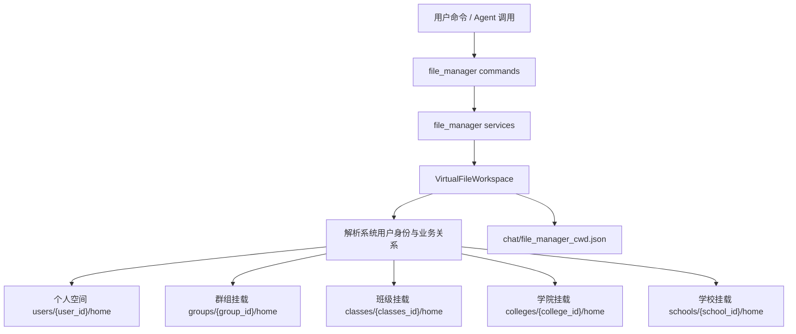

# 文件管理插件

文件管理插件负责把个人、群组、班级、学院、学校文件空间汇总成一个对用户友好的“文件管理”视图。实际存储根目录来自 `utils.config.data_dir`，最终结构固定为 `{data_dir}/storage`。

核心原则：

- `~` 默认永远是当前系统用户自己的个人文件空间。
- 外部空间通过虚拟目录挂载到 `~/群组`、`~/班级`、`~/学院`、`~/学校`。
- 外部空间默认只读，只有具备管理身份的用户才能写入。
- 所有命令和 Agent service handler 都走同一套虚拟工作区，避免权限规则分裂。

## 目录结构

```text
{data_dir}/storage/
├── public/
├── groups/
│   └── {group_id}/
│       ├── chat/
│       └── home/
│           ├── documents/
│           ├── videos/
│           ├── images/
│           └── audio/
├── classes/
│   └── {classes_id}/
│       ├── chat/
│       └── home/
├── colleges/
│   └── {college_id}/
│       ├── chat/
│       └── home/
├── schools/
│   └── {school_id}/
│       ├── chat/
│       └── home/
└── users/
    └── {user_id}/
        ├── chat/
        └── home/
            ├── documents/
            ├── videos/
            ├── images/
            └── audio/
```

## 路径规则

- 私聊和群聊默认都进入 `users/{系统用户ID}/home`。
- 群聊上下文会自动把当前平台群解析或创建为系统 `Group.id`，并挂载到 `~/群组/{group_id}`。
- 这里的 `系统群组ID` 指项目数据库中的 `Group.id`，不是平台原始群号、频道号，也不是 `GroupBind.id`。
- 平台 `channel_id` / `group_id` 只用于先解析或创建系统群组绑定，不能直接作为群文件空间目录名。
- 命令中展示的 `~` 就是当前文件空间的 `home` 目录。
- `chat` 用于存放会话记录和当前工作目录状态，普通文件命令不能访问它。
- 所有路径都会经过安全解析，`../`、绝对路径、Windows 盘符等都不能越过当前 `home`。
- `cd ..` 在 `~` 下会继续停留在 `~`，不会进入其他用户或群组目录。
- `群组`、`班级`、`学院`、`学校` 是个人根目录下的保留虚拟目录名，即使当前没有可访问挂载，也不能作为普通个人目录创建。

## 挂载范围

文件管理会根据当前系统用户身份构建挂载范围：

- 个人空间：始终可见，可读可写。
- 当前群组：用户在群聊里发起命令时挂载到 `~/群组/{group_id}`。
- 用户创建的系统群组：挂载到 `~/群组/{group_id}`。
- 学生所在班级：挂载到 `~/班级/{classes_id}`，并继续挂载班级关联的学院与学校。
- 教师关联班级：挂载到 `~/班级/{classes_id}`，并继续挂载班级关联的学院与学校。
- 教师直接关联学院或学校：挂载到 `~/学院/{college_id}` 或 `~/学校/{school_id}`。

权限规则：

- 个人空间可读可写。
- 群组空间只有群组创建者、班级教师或系统管理员可写，其他可访问者只读。
- 班级空间只有班级教师、班干部、班级创建者或系统管理员可写，普通学生只读。
- 学院和学校空间当前仅系统管理员可写，其他关联用户只读。

示例：

```text
~
├── 群组/
│   └── 12/              # 映射 storage/groups/12/home
├── 班级/
│   └── 8/               # 映射 storage/classes/8/home
├── 学院/
│   └── 3/               # 映射 storage/colleges/3/home
├── 学校/
│   └── 1/               # 映射 storage/schools/1/home
├── documents/
├── videos/
├── images/
└── audio/
```

## 命令

- `pwd`: 查看当前路径。
- `ls [路径]`: 列出文件或目录。
- `cd [路径]`: 切换目录。
- `mkdir <路径>`: 在可写空间创建目录。
- `touch <路径>`: 在可写空间创建空文件；如果文件已存在，不会修改它。
- `rm [-r] [-f] <路径...>`: 删除可写空间内的文件；删除目录必须显式使用 `-r`。
- `cat <路径>`: 查看文本文件内容，最多展示前 4096 字节。
- `find <关键词> [路径]`: 在当前虚拟路径覆盖范围内按文件名或相对路径查找文件和目录。
- `grep <关键词> [路径]`: 在当前虚拟路径覆盖范围内搜索小型文本文件内容。
- `tree [路径] [深度]`: 查看当前虚拟文件树，默认展示 3 层，最多 8 层。
- `上传文件 [目标目录] <附件...>`: 保存消息附件，目标目录默认是当前路径，目标必须可写。

常见用法：

```text
ls
ls 班级/8/documents
cat 学院/3/documents/notice.txt
find 实践报告
grep 调课 班级/8
mkdir 班级/8/documents/作业归档
```

其中 `mkdir 班级/8/...` 只有具备班级管理权限的用户才能成功。普通学生可以 `ls/cat/find/grep/tree`，但不能 `mkdir/touch/rm/上传文件` 到班级、学院、学校等外部空间。

## 维护说明

- `utils.storage` 是核心隔离文件空间层，不依赖 NoneBot，适合被后台管理、Agent service handler 和测试复用。
- `src/plugins/file_manager/virtual.py` 是虚拟挂载层，负责身份挂载、路径解析和写权限判断。
- `src/plugins/file_manager/commands.py` 只放命令声明和统一命令元数据。
- `src/plugins/file_manager/__init__.py` 只放 matcher handler。
- `src/plugins/file_manager/services.py` 放命令层服务、附件提取、Agent service handler 和展示渲染。
- 搜索类命令扫描当前虚拟路径覆盖到的物理 `home`，会跳过隐藏文件和符号链接，并限制扫描数量，避免误读其他空间或产生过大输出。
- Agent 调用 `command_executor.execute("ls" | "find" | "grep" | ...)` 时与用户命令完全共用 `VirtualFileWorkspace`，返回结构化 `data`，便于工作流继续编排。


